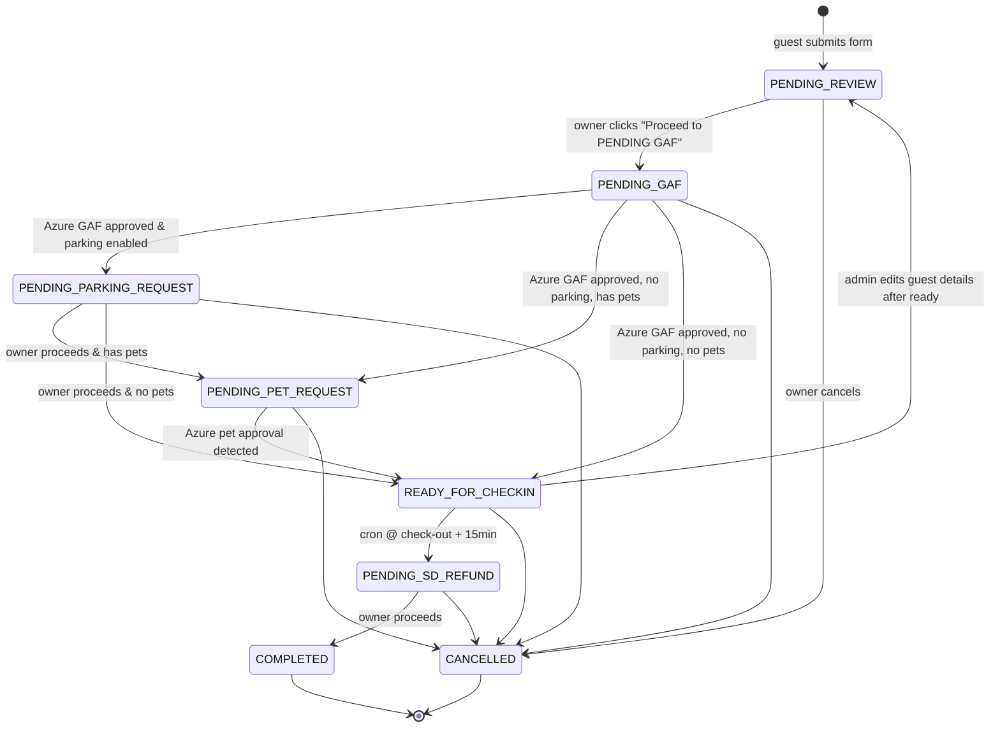

# New Booking Flow — Implementation Plan

> Planning document for the redesign described in `docs/NEW FLOW.md`.
> Status: **PLANNING — decisions locked in §6.1**; **§6.2** is refinement only (**Q7.4**). **No implementation until the user says to start.**
> Companion to `docs/PROJECT.md` (current state) and `docs/TODOS.md` (backlog).

This doc captures:

1. What the new flow changes vs. the current system (`docs/PROJECT.md`).
2. The full file-level change list (what to add, edit, delete).
3. Decisions — **§6.1** (resolved) and **§6.2** (refinement: **Q7.4** only).
4. A phased rollout plan with migration/backup strategy.

---

## 1. Summary of the change

### 1.1 Today (as implemented)

- Guest submits `/form` → edge function runs **all side effects in one pass** (DB save, storage, PDF, GAF email to Azure, optional pet email, Google Calendar event, Google Sheet row).
- Status is a flat enum: `booked` or `canceled`.
- No admin/owner UI. Review happens out-of-band (via email + calendar).
- Dev/test behavior is driven entirely by **query params**: `?dev=true`, `?testing=true`, plus a per-action checkbox panel that flips `saveToDatabase`, `sendEmail`, `updateGoogleCalendar`, etc.

### 1.2 New flow (target)

- Guest submit is **much lighter**: DB save, storage upload, and PDF generation only. No emails, no calendar, no sheet writes at submit time.
- Bookings move through an **explicit state machine** driven by the unit owner from a new `/bookings` admin dashboard.
- Each state transition fans out the right side effects (emails, calendar color changes, sheet updates, attachment persistence).
- A new **Gmail email listener** auto-advances status when Azure’s GAF and Pet approval emails arrive (and pulls approved PDFs into Supabase Storage).
- A scheduled job (cron) auto-transitions `READY FOR CHECK-IN` → `PENDING SD REFUND` 15 minutes after check-out time.
- A new **admin auth gate** (Google login, single allow-listed email) protects `/bookings` and enables dev controls automatically.
- All `?dev=true` / `?testing=true` / per-action query flags in the UI are retired in favor of: (a) admin session = dev mode, (b) a dedicated **Test Submit** button on the guest form for test bookings.

### 1.3 New booking state machine



### 1.4 Google Calendar color mapping

**Calendar event `summary` (title) — no square brackets in production.** The visible status is plain text at the start, then pax/nights/guest:

`{STATUS LABEL} - {pax}pax {nights}night(s) - {guestFacebookName}`

Example: `PENDING REVIEW - 2pax 2nights - Guest Name`

For **test bookings only**, prepend **`[TEST] `** before the status label (this is the lone bracketed token): `[TEST] PENDING REVIEW - 2pax 2nights - Guest Name`.

| Status                    | Example `summary` (non-test)                               | Color (Google `colorId`) |
| ------------------------- | ---------------------------------------------------------- | ------------------------ |
| `PENDING_REVIEW`          | `PENDING REVIEW - 2pax 2nights - Guest Name`               | Red (`11`)               |
| `PENDING_GAF`             | `PENDING GAF - 2pax 2nights - Guest Name`                  | Yellow (`5`)             |
| `PENDING_PARKING_REQUEST` | `PENDING PARKING REQUEST - 2pax 2nights - Guest Name`    | Yellow (`5`)             |
| `PENDING_PET_REQUEST`     | `PENDING PET REQUEST - 2pax 2nights - Guest Name`        | Yellow (`5`)             |
| `READY_FOR_CHECKIN`       | `READY FOR CHECK-IN - 2pax 2nights - Guest Name`         | Green (`10`)             |
| `PENDING_SD_REFUND`       | `PENDING SD REFUND - 2pax 2nights - Guest Name`          | Orange (`6`)             |
| `COMPLETED`               | `COMPLETED - 2pax 2nights - Guest Name`                  | Blue (`9`)               |
| `CANCELLED`               | `CANCELED - 2pax 2nights - Guest Name` (spelling matches today’s cancel UX) | Purple (`3`)             |

> Current calendar code uses `colorId: 2` (green) universally and `11` for canceled — will be replaced by a `STATUS → colorId` map in `_shared/calendarService.ts`.

---

## 2. New/changed database columns

A new migration will add:

| Column                    | Type          | Notes                                                                                                                                                           |
| ------------------------- | ------------- | --------------------------------------------------------------------------------------------------------------------------------------------------------------- |
| `status`                  | `TEXT`        | **Widen** existing column from `booked\|canceled` to the new enum. Existing `booked` rows migrate per **Q1.1** (§6): past check-ins → `COMPLETED`, today+ → `PENDING_REVIEW`. |
| `status_updated_at`       | `TIMESTAMPTZ` | Last transition time, used by cron + sheet sync.                                                                                                                |
| `booking_rate`            | `NUMERIC`     | Entered at `PENDING_REVIEW` review step.                                                                                                                        |
| `down_payment`            | `NUMERIC`     | Entered at `PENDING_REVIEW`.                                                                                                                                    |
| `balance`                 | `NUMERIC`     | Auto-computed: **`booking_rate - down_payment`** (see **Q2.1** in §6). Parking and pet fees are **not** in balance; they appear separately in breakdowns / sheets / emails. |
| `security_deposit`        | `NUMERIC`     | New column; typical default **₱1500** (see **Q2.1** in §6). Tracked separately from balance.                                                                  |
| `parking_rate_guest`      | `NUMERIC`     | Charged to guest. Shown when `need_parking = true`. **UI label (§6.1 Q4.5):** “Guest Parking Rate”.                                                            |
| `parking_rate_paid`       | `NUMERIC`     | Paid to parking owner. Shown at `PENDING_PARKING_REQUEST`. **UI label (§6.1 Q4.5):** “Paid Parking Rate”.                                                       |
| `parking_endorsement_url` | `TEXT`        | Screenshot/image from parking owner, saved to Storage.                                                                                                          |
| `parking_owner_email`     | `TEXT`        | Selected owner from broadcast replies.                                                                                                                          |
| `pet_fee`                 | `NUMERIC`     | Shown when `has_pets = true`.                                                                                                                                   |
| `approved_gaf_pdf_url`    | `TEXT`        | Written by email listener.                                                                                                                                      |
| `approved_pet_pdf_url`    | `TEXT`        | Written by email listener.                                                                                                                                      |
| `sd_additional_expenses`  | `NUMERIC[]`   | `PENDING_SD_REFUND` stage — **array of amounts** (one value per “+ Expense” row in `SdRefundForm`). Default `ARRAY[]::NUMERIC[]` in migrations. Same currency scale as other money columns. |
| `sd_additional_profits`   | `NUMERIC[]`   | `PENDING_SD_REFUND` stage — **array of amounts** (one value per “+ Profit” row in `SdRefundForm`). Default `ARRAY[]::NUMERIC[]` in migrations.                                              |
| `sd_refund_amount`        | `NUMERIC`     | Final SD refund amount computed/settled in `PENDING_SD_REFUND`.                                                                                                  |
| `sd_refund_receipt_url`   | `TEXT`        | URL to uploaded **SD refund receipt** image/PDF in Supabase Storage (`sd-refund-receipts` bucket).                                                             |
| `settled_at`              | `TIMESTAMPTZ` | Stamp when moving to `COMPLETED`.                                                                                                                               |
| `is_test_booking`         | `BOOLEAN`     | **Additive** test flag for filtering/cleanup. **Does not replace** existing test behavior: keep **`[TEST]` prefixes** on primary guest name, storage objects, email subjects, calendar titles, and sheet columns exactly as today. Also set `is_test_booking = true` when using **Test Submit** so DB queries can find test rows without `?testing=true`. |

Plus new buckets or reused ones for: `parking-endorsements`, `approved-gafs`, `approved-pet-forms`, `sd-refund-receipts`.

---

## 3. Architecture deltas

### 3.1 New admin surface

- New feature folder `ui/src/features/admin/` with:
  - `pages/SignInPage.tsx` — Google-only sign-in.
  - `pages/BookingsListPage.tsx` — `/bookings` with search, filter (status, date range, has pets, has parking), sort (check-in, created, status), pagination.
  - `pages/BookingDetailPage.tsx` — `/bookings/:bookingId` renders the existing guest form with dev/admin controls always enabled, plus a right-side **workflow panel** showing the current state, available transitions, and state-specific input sections.
  - `components/StatusBadge`, `components/WorkflowPanel`, `components/ReviewPricingForm`, `components/ParkingRequestForm`, `components/SdRefundForm`, `components/BookingTable`, `components/BookingFilters`.
- `ui/src/features/admin/routes/index.tsx` exports protected routes mounted in `ui/src/routes/index.tsx`.
- Auth guard HOC / `RequireAdmin` wrapper.

### 3.2 Auth

- Supabase Auth Google provider (already available in Supabase) configured in dashboard.
- Single allow-listed email: `kamehome.azurenorth@gmail.com` (env: `ADMIN_ALLOWED_EMAILS` comma-separated, so we can grow later).
- UI: `@supabase/supabase-js` client already in project (for edge calls); add `supabase.auth.signInWithOAuth({ provider: 'google' })`.
- Server: new helper `_shared/auth.ts` that validates the JWT on every admin-only edge function (`verify_jwt` flipped to true for those) and checks the allow list.

### 3.3 New / changed edge functions

| Function                                    | Method | Purpose                                                                                                             |
| ------------------------------------------- | ------ | ------------------------------------------------------------------------------------------------------------------- |
| `submit-form` **(changed)**                 | POST   | Drops email/calendar/sheet side effects. Always saves DB + storage + PDF. Sets initial status `PENDING_REVIEW`.     |
| `get-form` **(unchanged contract)**         | GET    | Still returns booking payload; now also includes workflow fields.                                                   |
| `get-booked-dates` **(changed)**            | GET    | Treats any non-`CANCELLED` status as blocking.                                                                      |
| `list-bookings` **(new, admin)**            | GET    | Paginated list for `/bookings`. Supports search/filter/sort.                                                        |
| `transition-booking` **(new, admin)**       | POST   | Body `{ bookingId, toStatus, payload }`. Validates transition, writes DB, fans out side effects, returns new state. |
| `upload-booking-asset` **(new, admin)**     | POST   | Generic asset upload for parking endorsement, additional docs.                                                      |
| `gmail-listener` **(new, scheduled)**       | POST   | Polled by Supabase scheduled trigger. Incremental Gmail **history** poll (pay-credit-cards pattern) for GAF/Pet approvals; downloads `APPROVED GAF.pdf`; persists PDFs; transitions booking via `workflowOrchestrator`. |
| `sd-refund-cron` **(new, scheduled)**       | POST   | Runs every ~5 min; transitions `READY_FOR_CHECKIN` → `PENDING_SD_REFUND` when `now ≥ check_out + 15min`.            |
| `parking-broadcast-email` **(new, admin)**  | POST   | Sends the “parking availability” broadcast BCC to `PARKING_OWNER_EMAILS`.                                           |
| `cancel-booking` **(changed)**              | POST   | Status becomes `CANCELLED`; color + title adjusted per new map; keeps existing data.                                |
| `cleanup-test-data` **(unchanged surface)** | POST   | Filters test rows by **existing `[TEST]` / `TEST_` markers** (today’s behavior) **and** `is_test_booking = true` once that column exists (belt + suspenders). |

### 3.4 Email listener design (Gmail)

**Reference implementation (read this first):** `/Users/michaelmanlulu/Projects/personal-projects/automated-tasks/pay-credit-cards/`

The pay-credit-cards repo is the **canonical pattern** for how we already solved “watch Gmail → download PDFs → do work” in production:

| Concern | Where it lives in `pay-credit-cards` | What guest-form-management should copy (conceptually) |
| ------- | -------------------------------------- | -------------------------------------------------------- |
| OAuth (Desktop client + refresh token) | `src/gmail-auth.ts`, `docs/SETUP.md` §2 / §2.6 | One-time human auth writes a **refreshable token**; **Supabase stores the same JSON secrets** (`client_id`, `client_secret`, `refresh_token`) — no browser inside Edge Functions. |
| Gmail API client | `src/gmail.ts#getGmailClient` | Exchange refresh token → short-lived access token on each run; detect `invalid_grant` and surface “re-auth needed”. |
| Incremental polling (no full inbox scan) | `src/gmail-history.ts`, `src/gmail-poll-new-soa.ts` | Persist **`historyId`** (mailbox cursor) + handle **HTTP 404 history expired** by resetting cursor (`--init` equivalent). Use `users.history.list` with `historyTypes: ['messageAdded']` to get **only new message IDs** since last run. |
| Message fetch + attachments | `src/gmail-poll-new-soa.ts` (`users.messages.get` with `format: 'full'`), `src/gmail.ts#searchAndDownloadPdfs` | For each candidate `messageId`, fetch **full** payload, walk `payload.parts`, download `users.messages.attachments.get`, base64url-decode bytes → upload to Supabase Storage. |
| Idempotency beyond Gmail history | `src/gmail-poll-new-soa.ts` (`processedSoaRunMessageIds` ring buffer) | Keep a **DB table** `processed_emails` (already planned) as the durable dedupe layer across deploys; optional `gmail_listener_state` row for `historyId` (see §4.1 migrations). |

**Important correction vs older notes:** pay-credit-cards does **not** use a Gmail **service account**. It uses **end-user OAuth** (`gmail.readonly` + optional other scopes). For guest-form-management, **`gmail.readonly` alone is sufficient** unless we later decide the listener also writes Calendar (it should not — calendar writes stay in `workflowOrchestrator`).

**Runtime mapping:** pay-credit-cards runs on **Node + `googleapis`**. `gmail-listener` runs on **Deno** — re-implement the same HTTP calls (or import `googleapis` via `npm:` on Deno if we choose; either way keep the **state machine + side effects** in `_shared/workflowOrchestrator.ts`).

**Matching rules (unchanged intent):** poll every ~5 minutes (Supabase schedule) and only process threads that match **the same subject patterns we already send today** (`supabase/functions/_shared/emailService.ts` — `Monaco 2604 - GAF Request (…)` / `Monaco 2604 - Pet Request (…)`; strip optional test/urgent/update prefixes per **§6.1 Q6.3/Q6.4**) **and** contain attachment **`APPROVED GAF.pdf`**.

**Booking correlation:** parse `(checkIn → checkOut)` from the subject, normalize to the DB’s `MM-DD-YYYY` text dates, then `SELECT` the single active row in `PENDING_GAF` / `PENDING_PET_REQUEST` with those dates.

**Side effects:** download attachment → upload to Storage → set `approved_gaf_pdf_url` / `approved_pet_pdf_url` → call `transition-booking` → `workflowOrchestrator` (never call Calendar/Sheet/Email directly from the poller).

**Idempotency:** `processed_emails.message_id PRIMARY KEY` prevents double-processing if Gmail history replays a message id; store `kind` (`gaf` vs `pet`) + `status` (`applied`/`skipped`/`failed`) + `reason` text for debugging.

### 3.5 Templates / emails to add

- `booking_acknowledgement` (to guest, on `PENDING_GAF` transition).
- `parking_broadcast` (BCC to parking owners, subject e.g. “Parking availability request — Monaco 2604 (MM-DD to MM-DD)”).
- `parking_paid_confirmation` (to selected parking owner — optional, see Q4.2).
- `ready_for_checkin` (to guest) — includes approved GAF PDF, pet GAF (if any), parking endorsement (if any), payment breakdown, house rules.
- Existing `gaf_request` / `pet_request` emails: tweak so guest is never CC’d.

---

## 4. File-by-file change list

### 4.1 New files

```
docs/
  NEW_FLOW_PLAN.md                                # this document
  MIGRATION_RUNBOOK.md                            # step-by-step backup + backfill steps

supabase/migrations/
  20260501000000_backup_guest_submissions.sql     # creates guest_submissions_backup_<timestamp>
  20260501000001_add_booking_status_enum.sql      # widens status + seeds new values
  20260501000002_add_workflow_columns.sql         # booking rate, parking rates, pet fee, SD fields, etc.
  20260501000003_add_approved_pdf_columns.sql     # approved_gaf_pdf_url, approved_pet_pdf_url
  20260501000004_add_is_test_booking.sql
  20260501000005_create_processed_emails_table.sql
  20260501000006_create_parking_endorsements_bucket.sql
  20260501000007_create_approved_gafs_bucket.sql
  20260501000008_create_sd_refund_receipts_bucket.sql
  20260501000009_create_gmail_listener_state.sql     # last Gmail historyId (+ optional metadata) — mirrors pay-credit-cards watch state file

supabase/functions/
  _shared/
    auth.ts                                       # verifyAdminJwt(req) helper
    statusMachine.ts                              # canTransition() + color/prefix maps
    gmailClient.ts                                # OAuth + Gmail API helpers (history poll, message get, attachment download)
    workflowOrchestrator.ts                       # orchestrates side effects per transition
    templates/
      booking-acknowledgement.html
      parking-broadcast.html
      ready-for-checkin.html
  list-bookings/index.ts
  transition-booking/index.ts
  upload-booking-asset/index.ts
  gmail-listener/index.ts
  sd-refund-cron/index.ts
  parking-broadcast-email/index.ts

supabase/config.toml changes:
  - new buckets
  - scheduled functions (gmail-listener @ */5 * * * *, sd-refund-cron @ */5 * * * *)
  - verify_jwt = true for list-bookings, transition-booking, upload-booking-asset, parking-broadcast-email

ui/src/features/admin/
  routes/index.tsx
  pages/SignInPage.tsx
  pages/BookingsListPage.tsx
  pages/BookingDetailPage.tsx
  components/
    RequireAdmin.tsx
    BookingTable.tsx
    BookingFilters.tsx
    StatusBadge.tsx
    WorkflowPanel.tsx
    ReviewPricingForm.tsx
    ParkingRequestForm.tsx
    SdRefundForm.tsx
  hooks/
    useAdminSession.ts
    useBookings.ts
    useTransitionBooking.ts
  lib/
    supabaseClient.ts                             # single shared client (if not already extracted)
    workflow.ts                                   # transition rules mirrored from server
```

### 4.2 Files to edit

```
supabase/functions/submit-form/index.ts
  - Remove email, calendar, sheet side effects.
  - Always DB + storage + PDF (overridable via dev flags, see Q3.2).
  - Set status = 'PENDING_REVIEW', is_test_booking = true **only** when the request is a **Test Submit** (no `?testing=true` from the UI anymore). **All other `[TEST]` / `TEST_` prefixing behavior stays exactly as today** when `is_test_booking` is true (DB name, storage, emails, calendar, sheet). Optionally keep accepting legacy `?testing=true` server-side for a short deprecation window if old bookmarks still hit prod — remove once traffic is gone.

supabase/functions/_shared/calendarService.ts
  - Replace colorId '2' literal with STATUS → colorId map.
  - Replace cancel-specific `[CANCELED]` summary prefix (legacy) with status-driven titles: canceled events use summary `CANCELED - …` (no brackets) + purple `colorId` per §1.4.
  - Update link builder to drop &dev=true / &testing=true (TODO item).

supabase/functions/_shared/sheetsService.ts
  - Widen AK → add columns for new fields (booking rate, down payment, balance,
    parking rate guest, parking rate paid, pet fee, approved GAF URL, approved pet URL,
    SD additional expenses array, SD additional profits array, SD refund amount, SD refund receipt URL, status_updated_at).
  - Add a "status text" column matching the new enum (Booked/Canceled is replaced).

supabase/functions/_shared/emailService.ts
  - Remove guest CC from GAF + pet flows.
  - Add sendBookingAcknowledgement(), sendReadyForCheckin(), sendParkingBroadcast(),
    sendParkingPaidConfirmation().
  - Factor out a shared "subject with status + date range" helper.

supabase/functions/_shared/databaseService.ts
  - Add helpers: getBookingById, listBookings({search,filter,sort,page,limit}),
    updateBookingStatus, setWorkflowFields.
  - processFormData stays but no longer kicks side effects.
  - checkOverlappingBookings: treat any non-CANCELLED status as blocking.

supabase/functions/cancel-booking/index.ts
  - Use status machine + workflow orchestrator.
  - Keep soft-cancel semantics.

supabase/functions/get-booked-dates/index.ts
  - Change filter to status NOT IN ('CANCELLED').

supabase/functions/_shared/types.ts
  - Add BookingStatus enum/union type.
  - Add WorkflowPayloads type map.
  - Extend GuestSubmission with new columns.

supabase/functions/cleanup-test-data/index.ts
  - Add is_test_booking = true filter.

ui/src/features/guest-form/components/GuestForm.tsx
  - Drop ?dev=true / ?testing=true query-driven UI.
  - Admin session auto-enables dev controls.
  - Add dedicated "Test Submit" button that sets is_test_booking=true for the request.
  - Dev checkboxes renamed:
    'Send email notification' → 'Send GAF request email'
    + 'Send Parking broadcast email' (shown if needParking)
    + 'Send Pet request email' (shown if hasPets)
  - Parking help text: "Parking fee is non-refundable and bookings with parking cannot be rescheduled."

ui/src/features/guest-form/pages/CalendarPage.tsx
  - Legacy /?bookingId=... redirect: drop dev/testing appends; admin session handles it.

ui/src/features/guest-form/routes/index.tsx
  - No structural change — admin routes added in sibling feature folder and merged in ui/src/routes/index.tsx.

ui/src/routes/index.tsx
  - Merge guestFormRoutes + adminRoutes; wrap /bookings routes in <RequireAdmin>.

ui/src/App.tsx
  - Wrap with <AuthProvider> (or tanstack-query + supabase session hook).

ui/package.json
  - Add: @supabase/supabase-js, @tanstack/react-query, @tanstack/react-table (for list),
    zustand or jotai (optional for admin UI state), react-hook-form already present.

docs/PROJECT.md
  - Update to reflect new flow once shipped (per .cursor/rules/documentation-maintenance.mdc).

docs/TODOS.md
  - Mark covered items; add follow-ups uncovered during scoping.
```

### 4.3 Files to remove / deprecate

- The `?dev=true` branch in `calendarService.ts#createEventData` (TODO item) is superseded by admin session handling.
- `cleanup-test-data` remains; **test tagging stays the same** (`[TEST]` / `TEST_` prefixes) **plus** the new `is_test_booking` column for easier DB filtering once implemented.

---

## 5. Phased rollout

Each phase is independently deployable and gated by a feature flag (`NEW_FLOW_ENABLED`). Order:

1. **Phase 0 — Backup & schema.** Migration that snapshots `guest_submissions` into `guest_submissions_backup_<ts>`; adds new columns as nullable. No behavior change.
2. **Phase 1 — Admin auth + empty dashboard.** Google sign-in, allow list, `/bookings` reads existing rows, no transitions yet. `RequireAdmin` guard.
3. **Phase 2 — State machine read path.** Add `status` enum widening, migrate legacy `booked` rows: **check-in date before today (Asia/Manila) → `COMPLETED`**, **check-in today or future → `PENDING_REVIEW`** (see **Q1.1** in §6). Update `get-booked-dates`. Update calendar color/title only on explicit sync.
4. **Phase 3 — Transitions (no email listener yet).** Manual `transition-booking` endpoint + UI forms. Guest acknowledgement / ready-for-check-in emails working.
5. **Phase 4 — Email listener + cron.** `gmail-listener` + `sd-refund-cron` wired, idempotent.
6. **Phase 5 — Submit-form cleanup.** Remove side effects from `submit-form`; retire query-param dev flags; add Test Submit button.
7. **Phase 6 — Backfill sync.** One-shot migration script resyncs all non-cancelled bookings into Google Calendar & Sheet with new titles/colors/columns.

See `docs/MIGRATION_RUNBOOK.md` (to create in phase 0) for step-by-step.

---

## 6. Decisions & open questions

### 6.1 Resolved decisions (product + migration)

These are **locked in** from owner answers (2026-04-21). Implementation must follow them.

| ID    | Decision |
| ----- | -------- |
| **Q1.1** | **Legacy migration for `status = 'booked'`** (non-canceled rows): compare **check-in date** to **today** in **`Asia/Manila`**. If check-in is **strictly before** today → set `COMPLETED`. If check-in is **today or in the future** → set `PENDING_REVIEW`. Rows already `canceled` stay `CANCELLED` (normalize casing to the new canonical spelling). *Rationale: past stays are closed; active/upcoming stays need re-review under the new pipeline.* **Calendar blocking** for legacy rows follows **Q7.2** (`COMPLETED` **still** blocks dates; only `CANCELLED` frees). |
| **Q1.3** | **Status column type:** use **`TEXT` + `CHECK (status IN (...))`** (single column, values match the workflow enum). *Rationale:* Postgres `ENUM` is painful to evolve (each new status needs `ALTER TYPE`); `TEXT` + `CHECK` matches a state machine that will keep gaining edge cases. |
| **Q1.4** | **Money in Postgres:** **`NUMERIC(12,2)`** for peso fields (`booking_rate`, `down_payment`, `parking_*`, `pet_fee`, `security_deposit`, etc.). *Rationale:* matches human-readable amounts and existing sheet-style numbers; avoids a large cents migration. (If we ever need sub-cent precision, revisit.) |
| **Q1.6** | **Audit:** ship **`status_updated_at`** (and keep `updated_at` on the row) in v1. **Defer** a dedicated `booking_status_history` table unless we hit a compliance/debug need — manual transitions + `processed_emails` cover a lot of traceability for now. |
| **Q2.3** | **Where numbers appear:** **Google Calendar** event description = **trimmed** (dates, pax/nights, headline amounts: rate, balance, SD line if any — no full fee dump). **Sheet** = **full** numeric columns we already maintain / extend. **Guest emails** = **full payment breakdown** on `ready_for_checkin`; other emails stay focused (only lines relevant to that email). |
| **Q2.4** | **Currency display:** store DB as numeric; **UI + emails** use **`₱` prefix** and **thousands separators** (e.g. `₱12,345.67`) — implement via a small shared formatter (locale `en-PH` is a good default for grouping). |
| **Q3.1** | **PDF:** still **auto-generate on every successful guest submit** (post-redesign). For **admin / update flows**, still respect the existing **“Generate PDF”** dev control (only visible in admin context per **Q3.2**). |
| **Q3.2** | **Dev controls:** the **entire dev-controls block** (checkboxes, generate PDF, etc.) is **admin-only** — **not** shown on public guest `/form`. Public guests use normal submit + **Test Submit** only where we intentionally expose it (see phase notes); authenticated admin session enables the full dev panel. |
| **Q3.3** | **Renamed email checkboxes** gate **every** path that would send that **category** of email (not only the first `PENDING_REVIEW → PENDING_GAF` hop). If a transition or save triggers “GAF request”, “Pet request”, or “Parking broadcast”, the corresponding checkbox must be respected. |
| **Q3.4** | **`is_test_booking` / Test Submit:** in **production**, treat test rows as **dry-run for external blast radius** — **no** calendar writes, **no** sheet writes, **no** real outbound emails to guests or parking owners (same spirit as today’s `[TEST]` / `TEST_` guardrails). Fine-grained toggles remain a **dev/staging** concern if needed later. |
| **Q4.2** | **Parking payment notification:** **no** automated “you won” email to the selected parking owner in v1. After the owner manually completes payment with the chosen contact, it stays a **manual reply / manual record** in operations (same as **Q4.3** manual parking thread handling). |
| **Q4.4** | **Parking endorsement asset:** **manual** — staff takes a **screenshot** and uploads via **`upload-booking-asset`** (or equivalent admin UI). **No** auto-screenshot / browser automation in v1. |
| **Q4.5** | **Display labels** (admin UI + guest-facing copy; DB columns stay `parking_rate_guest` / `parking_rate_paid`): **`parking_rate_guest` → “Guest Parking Rate”**; **`parking_rate_paid` → “Paid Parking Rate”**. Optional short help (tune in UI): guest field = amount the guest pays Kame Home; paid field = amount paid **out** to the selected parking owner. |
| **Q5.1** | **`/bookings` list defaults:** **sort by check-in date** (ascending is a good default so the next stay is on top; admin can change). **Default filter:** **hide `COMPLETED`** bookings whose **check-in date is strictly before today** (`Asia/Manila`) **and** hide **today-and-past** dates when the row is already **completed** — i.e. do **not** clutter the default view with finished past stays. **Still show** past check-in dates when the booking is **not** terminal (e.g. still `PENDING_SD_REFUND` / awaiting money follow-up). (Exact filter SQL / labels can read “Active & upcoming” vs an explicit “Show completed” toggle.) |
| **Q5.2** | **Pagination:** default **25** rows per page; page-size control **25 | 50 | 100**. |
| **Q5.3** | **Bulk actions:** **yes** where low-risk (e.g. bulk export CSV later, bulk tag test rows if ever needed). **Do not** bulk-force arbitrary status jumps without strong confirmation UI — ship incrementally. |
| **Q5.4** | **Activity log / timeline** on booking detail: **not** in v1 (defer). |
| **Q6.2** | **Gmail OAuth** is for inbox **`kamehome.azurenorth@gmail.com`** (the mailbox that receives Azure approval threads today). |
| **Q6.5** | **Multiple DB matches** for one approval email (same parsed date range + more than one row in `PENDING_GAF` / `PENDING_PET_REQUEST`): **do not auto-apply** to a guessed row. **Record** in `processed_emails` as **`skipped`/`failed`** with reason **`ambiguous_multiple_bookings`**, log clearly, and surface a **“needs attention”** indicator on `/bookings` / detail so an admin **manually** attaches the PDF + transitions the correct booking. *This avoids silently approving the wrong guest.* **Owner confirmed:** if this scenario happens, **resolve manually** only — no automation picks a winner. |
| **Q6.6** | **Listener / cron reliability:** Supabase **scheduled** Edge invocations are authoritative (**not** your laptop — sleeping machine does not stop the server). On **transient** Gmail/API errors: **retry with backoff** on the next schedule tick (bounded by Gmail rate limits — not infinite tight loops). On **persistent** failure or **ambiguous** outcomes (**Q6.5**): expose **admin manual triggers** on `/bookings/:id` (or a small admin tools strip): **“Run Gmail poll now”**, **“Run SD refund cron now”** (or generic “re-run scheduled job for this booking”) that call the same Edge endpoints with admin JWT. **Manual overrides** (**§6.1 “Manual overrides”**) remain the escape hatch. |
| **Q7.1** | **SD refund cron timezone:** use **`Asia/Manila`** wall clock consistently with **Q1.1** — `check_out_date` + `check_out_time` + **15 minutes** before auto-transition `READY_FOR_CHECKIN` → `PENDING_SD_REFUND` (existing plan intent). |
| **Q7.2** | **`get-booked-dates` / calendar blocking:** **`COMPLETED` still blocks** the booked date range on the picker (same as today’s non-`CANCELLED` behavior). **Only `CANCELLED`** frees dates. |
| **Q7.3** | **Legacy calendar HTML links** that still contain `dev=true` / old query params: **leave DB/calendar descriptions as-is for now** (no mass rewrite). When such a link is opened, implement a **safe redirect path**: **require admin auth first**, then land on the **new admin booking view** (`/bookings/:bookingId` or the admin edit surface — exact route finalized in UI work). |
| **Q7.4 (partial)** | **Surprise setup** checkbox: **in scope**. **Placement:** directly **above** the “Special Requests” text area. **Copy:** require an **info/helper label** stating guests should **only check after discussing with the owner**. Further product copy / DB column name / whether it affects transitions stays **open for refinement** — see **Q7.4** in §6.2 (kept intentionally). |
| **Q7.5** | **Parking non-refundable + no-reschedule** warning: show on **both** the **guest form** (near parking fields) **and** the relevant **emails** (at minimum anything that confirms parking selection / payment). |
| **Q7.6** | **Automated tests in v1:** **ship first** — **no blocking** requirement for a full Jest/Playwright/CI suite on day one; ship admin + listener + workflow, then **add tests incrementally**. **Do** leave hooks for a **tiny** smoke test later (e.g. `get-booked-dates` filtering) if time permits. *What this question meant:* schedule risk — block launch on full coverage vs ship and backfill tests. **Owner confirmed:** **ship first.** |
| **Q7.7** | **Observability:** **v1 = Supabase-native** — Edge Function logs, Postgres logs, scheduled job history in dashboard. That matches a solo/small project with **no extra vendor** yet. **Optional follow-up:** add **Sentry** (or similar) **for the React UI** if client-side errors in production become opaque; avoid sending guest PII in error breadcrumbs. |
| **Q1.2** | **Superseded by Q1.1** — past bookings land in `COMPLETED` via the check-in rule, not `READY_FOR_CHECKIN`. |
| **Q2.1** | **Balance** = `booking_rate - down_payment`. **Security deposit (SD)** is **separate** from balance; typical amount **₱1500** — store in `security_deposit` (new column) and show in payment breakdowns / ready-for-check-in email, but **do not fold SD into balance**. Parking and pet fees are **not** part of balance either (they are line items elsewhere — see §2 column notes). |
| **Q4.1** | Env var: **`PARKING_OWNER_EMAILS`** (comma-separated, no spaces after commas is fine). Initial seed list: `michaeldmanlulu2@gmail.com,perezarianna0410@gmail.com` — owner will update later in env, not in code. |
| **Q4.3** | **Manual** parking-owner replies for now — **no** Gmail listener for parking threads in v1. |
| **Q6.1** | **Gmail listener reference implementation:** `/Users/michaelmanlulu/Projects/personal-projects/automated-tasks/pay-credit-cards/`. Treat `src/gmail-auth.ts` + `src/gmail.ts` + `src/gmail-history.ts` + `src/gmail-poll-new-soa.ts` + `docs/SETUP.md` as the blueprint: **Desktop OAuth client** (`configs/credentials.json`) → **`npm run gmail-auth`** writes **`configs/token.json`** (refresh token) → poller persists **`historyId`** + dedupes processed message ids → uses **`users.history.list`** for incremental `messageAdded` events → **`users.messages.get(format=full)`** to inspect attachments → **`users.messages.attachments.get`** to download bytes. Port the same *behavior* to Supabase Edge (`gmail-listener`) using secrets instead of local files + add durable dedupe in Postgres (`processed_emails`, §4.1). |
| **Q6.3 / Q6.4** | Match Azure approval messages using **the same subject lines we already generate** in `supabase/functions/_shared/emailService.ts` today — i.e. subjects starting with `Monaco 2604 - GAF Request (`…`)` and `Monaco 2604 - Pet Request (`…`)` (with optional `[TEST]`, `⚠️ TEST -`, `🚨 URGENT -`, `(Updated)` prefixes). Attachment filename to treat as approved: **`APPROVED GAF.pdf`** (per `docs/NEW FLOW.md`). |
| **Q5.5** | **Guest-field edits when `READY_FOR_CHECKIN`:** if an admin changes **any guest-facing booking fields** (dates, guest counts, names, contact, parking/pet flags, uploads, etc.) while status is `READY_FOR_CHECKIN`, **automatically revert `status` → `PENDING_REVIEW`** so the owner re-walks the pipeline. **Dev-control checkboxes still gate every side effect** (DB save, storage, PDF, each email type, calendar, sheet) exactly as today — reverting status does **not** bypass them. |
| **Manual overrides** | On `/bookings/:id`, for **every** status, admin must be able to **manually advance** to the next workflow step (or any valid forward jump the UI exposes) — especially to cover cases where **cron** (`READY_FOR_CHECKIN` → `PENDING_SD_REFUND`) or the **Gmail listener** should have fired but didn’t. Manual transitions call the same `transition-booking` → `workflowOrchestrator` path as automation. |

### 6.2 Still open (refinement — **Q7.4** only)

Former §6.2 items are **resolved in §6.1** except **surprise-setup** details below.

**Reference — edge case + schedule (both locked in §6.1, owner confirmed)**

- **Q6.5** — Rare case: two rows share the same parsed approval dates; automation must **not** choose. **Owner confirmed:** **manual resolution only** (see §6.1 **Q6.5** for `processed_emails` + UI surfacing).

- **Q7.6** — Tests vs launch: **owner confirmed** **ship first**; optional small smoke tests later (see §6.1 **Q7.6**).

#### Still to refine before / during implementation

- **Q7.4** **Surprise setup** checkbox — **in scope** and **placement/copy** per §6.1 **Q7.4 (partial)**. **Still refine:** exact checkbox label, helper/info tooltip wording, DB column name (`surprise_setup` / `surprise_setup_acknowledged` / …), whether it is **required-read** only vs stored boolean, and whether it should **ever** gate a transition or is **informational only**.

---

## 7. Acceptance criteria (rough)

Turn §6.1 + **Q7.4** (§6.2) into concrete test cases before Phase 0 ships.

- Guest submit on `/form` creates a row with `status = PENDING_REVIEW`, **still generates/uploads the PDF** (and images) per **Q3.1**, and does **not** send any email, does **not** write to calendar/sheet (Phase 5 target).
- Admin with allow-listed email can sign in; others are rejected with a clear message.
- `/bookings` lists bookings with search/filter/sort/pagination (**Q5.2**: default **25** rows, sizes **25 | 50 | 100**). Default list behavior matches **Q5.1** (sort by check-in; hide stale **past `COMPLETED`** from the default slice; still show past dates when pipeline not finished, e.g. **`PENDING_SD_REFUND`**).
- Each transition on `/bookings/:id` fans out exactly the side effects described in `NEW FLOW.md` and updates the Calendar color + title + the Sheet row — **including manual "force advance"** when cron/listener is late, **including admin “run Gmail poll” / “run SD cron” triggers** when automation is stuck (**Q6.6**), and **including the `READY_FOR_CHECKIN → PENDING_REVIEW` revert** when guest fields are edited after ready. Dev-control checkboxes still gate side effects on every save (**Q3.3**); dev controls are **admin-only** (**Q3.2**).
- Gmail listener transitions `PENDING_GAF` → next-state on Azure approval and persists the approved PDF; **ambiguous multi-match** does not pick a winner (**Q6.5**).
- Cron transitions `READY_FOR_CHECKIN` → `PENDING_SD_REFUND` 15 min after checkout local time.
- Cancel from any state soft-cancels (keeps data), turns calendar event purple with summary **`CANCELED - …`** (no brackets), frees the dates.
- No route UI relies on `?dev=true` / `?testing=true` anymore.
- Running the backfill script on prod brings all existing bookings in sync with new titles/colors/columns.

---

## 8. Next step

Refine **§6.2 Q7.4** (surprise-setup) when ready. **Do not start implementation** until you explicitly say to begin — then Phase 0 is backup + additive migration per §5.
