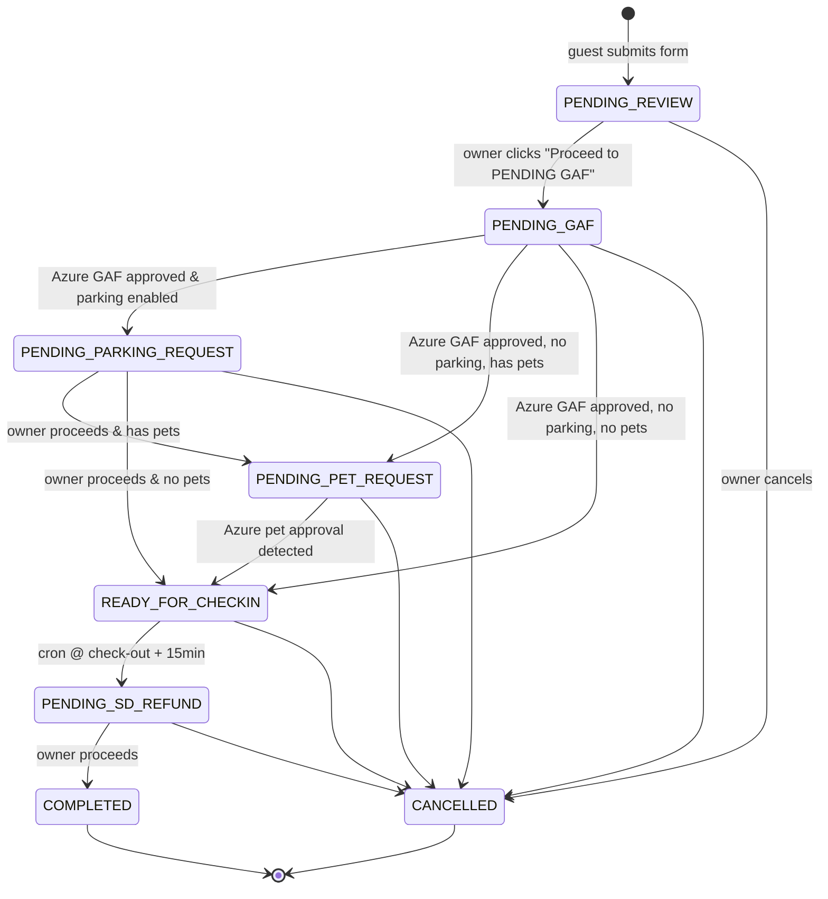

# New Booking Flow — Implementation Plan

> Planning document for the redesign described in `docs/NEW FLOW.md`.
> Status: **DRAFT — awaiting answers to open questions**.
> Companion to `docs/PROJECT.md` (current state) and `docs/TODOS.md` (backlog).

This doc captures:

1. What the new flow changes vs. the current system (`docs/PROJECT.md`).
2. The full file-level change list (what to add, edit, delete).
3. Open questions that block implementation (grouped and numbered).
4. A phased rollout plan with migration/backup strategy.

---

## 1. Summary of the change

### 1.1 Today (as implemented)

- Guest submits `/form` → edge function runs **all side effects in one pass** (DB save, storage, PDF, GAF email to Azure, optional pet email, Google Calendar event, Google Sheet row).
- Status is a flat enum: `booked` or `canceled`.
- No admin/owner UI. Review happens out-of-band (via email + calendar).
- Dev/test behavior is driven entirely by **query params**: `?dev=true`, `?testing=true`, plus a per-action checkbox panel that flips `saveToDatabase`, `sendEmail`, `updateGoogleCalendar`, etc.

### 1.2 New flow (target)

- Guest submit is **much lighter**: DB save, storage upload, and PDF generation only. No emails, no calendar, no sheet writes at submit time.
- Bookings move through an **explicit state machine** driven by the unit owner from a new `/bookings` admin dashboard.
- Each state transition fans out the right side effects (emails, calendar color changes, sheet updates, attachment persistence).
- A new **Gmail email listener** auto-advances status when Azure’s GAF and Pet approval emails arrive (and pulls approved PDFs into Supabase Storage).
- A scheduled job (cron) auto-transitions `READY FOR CHECK-IN` → `PENDING SD REFUND` 15 minutes after check-out time.
- A new **admin auth gate** (Google login, single allow-listed email) protects `/bookings` and enables dev controls automatically.
- All `?dev=true` / `?testing=true` / per-action query flags in the UI are retired in favor of: (a) admin session = dev mode, (b) a dedicated **Test Submit** button on the guest form for test bookings.

### 1.3 New booking state machine



### 1.4 Google Calendar color mapping

| Status                    | Calendar title prefix                                      | Color (Google `colorId`) |
| ------------------------- | ---------------------------------------------------------- | ------------------------ |
| `PENDING_REVIEW`          | `[PENDING REVIEW - 2pax 2nights - Guest Name]`             | Red (`11`)               |
| `PENDING_GAF`             | `[PENDING GAF - 2pax 2nights - Guest Name]`                | Yellow (`5`)             |
| `PENDING_PARKING_REQUEST` | `[PENDING PARKING REQUEST - 2pax 2nights - Guest Name]`    | Yellow (`5`)             |
| `PENDING_PET_REQUEST`     | `[PENDING PET REQUEST - 2pax 2nights - Guest Name]`        | Yellow (`5`)             |
| `READY_FOR_CHECKIN`       | `[READY FOR CHECK-IN - 2pax 2nights - Guest Name]`         | Green (`10`)             |
| `PENDING_SD_REFUND`       | `[PENDING SD REFUND - 2pax 2nights - Guest Name]`          | Orange (`6`)             |
| `COMPLETED`               | `[COMPLETED - 2pax 2nights - Guest Name]`                  | Blue (`9`)               |
| `CANCELLED`               | `[CANCELED - 2pax 2nights - Guest Name]` (existing labels) | Purple (`3`)             |

> Current calendar code uses `colorId: 2` (green) universally and `11` for canceled — will be replaced by a `STATUS → colorId` map in `_shared/calendarService.ts`.

---

## 2. New/changed database columns

A new migration will add:

| Column                    | Type          | Notes                                                                                                                                                           |
| ------------------------- | ------------- | --------------------------------------------------------------------------------------------------------------------------------------------------------------- |
| `status`                  | `TEXT`        | **Widen** existing column from `booked\|canceled` to the new enum. Existing `booked` rows migrate to a chosen target state (see Q1.1).                          |
| `status_updated_at`       | `TIMESTAMPTZ` | Last transition time, used by cron + sheet sync.                                                                                                                |
| `booking_rate`            | `NUMERIC`     | Entered at `PENDING_REVIEW` review step.                                                                                                                        |
| `down_payment`            | `NUMERIC`     | Entered at `PENDING_REVIEW`.                                                                                                                                    |
| `balance`                 | `NUMERIC`     | Auto-computed (`booking_rate - down_payment + parking_rate_guest + pet_fee`, see Q2.3).                                                                         |
| `security_deposit`        | `NUMERIC`     | Existing? if not, new. Default per owner convention.                                                                                                            |
| `parking_rate_guest`      | `NUMERIC`     | Charged to guest. Shown when `need_parking = true`.                                                                                                             |
| `parking_rate_paid`       | `NUMERIC`     | Paid to parking owner. Shown at `PENDING_PARKING_REQUEST`.                                                                                                      |
| `parking_endorsement_url` | `TEXT`        | Screenshot/image from parking owner, saved to Storage.                                                                                                          |
| `parking_owner_email`     | `TEXT`        | Selected owner from broadcast replies.                                                                                                                          |
| `pet_fee`                 | `NUMERIC`     | Shown when `has_pets = true`.                                                                                                                                   |
| `approved_gaf_pdf_url`    | `TEXT`        | Written by email listener.                                                                                                                                      |
| `approved_pet_pdf_url`    | `TEXT`        | Written by email listener.                                                                                                                                      |
| `sd_additional_expenses`  | `NUMERIC`     | `PENDING_SD_REFUND` stage.                                                                                                                                      |
| `sd_additional_profits`   | `NUMERIC`     | `PENDING_SD_REFUND` stage.                                                                                                                                      |
| `sd_no_damages_confirmed` | `BOOLEAN`     | Checkbox on `PENDING_SD_REFUND`.                                                                                                                                |
| `sd_refund_amount`        | `NUMERIC`     | Final refund.                                                                                                                                                   |
| `settled_at`              | `TIMESTAMPTZ` | Stamp when moving to `COMPLETED`.                                                                                                                               |
| `is_test_booking`         | `BOOLEAN`     | Replaces the `[TEST]` primary_guest_name prefix as the canonical flag. Prefixes still applied for calendar/sheet readability but DB filtering uses this column. |

Plus new buckets or reused ones for: `parking-endorsements`, `approved-gafs`, `approved-pet-forms`.

---

## 3. Architecture deltas

### 3.1 New admin surface

- New feature folder `ui/src/features/admin/` with:
  - `pages/SignInPage.tsx` — Google-only sign-in.
  - `pages/BookingsListPage.tsx` — `/bookings` with search, filter (status, date range, has pets, has parking), sort (check-in, created, status), pagination.
  - `pages/BookingDetailPage.tsx` — `/bookings/:bookingId` renders the existing guest form with dev/admin controls always enabled, plus a right-side **workflow panel** showing the current state, available transitions, and state-specific input sections.
  - `components/StatusBadge`, `components/WorkflowPanel`, `components/ReviewPricingForm`, `components/ParkingRequestForm`, `components/SdRefundForm`, `components/BookingTable`, `components/BookingFilters`.
- `ui/src/features/admin/routes/index.tsx` exports protected routes mounted in `ui/src/routes/index.tsx`.
- Auth guard HOC / `RequireAdmin` wrapper.

### 3.2 Auth

- Supabase Auth Google provider (already available in Supabase) configured in dashboard.
- Single allow-listed email: `kamehome.azurenorth@gmail.com` (env: `ADMIN_ALLOWED_EMAILS` comma-separated, so we can grow later).
- UI: `@supabase/supabase-js` client already in project (for edge calls); add `supabase.auth.signInWithOAuth({ provider: 'google' })`.
- Server: new helper `_shared/auth.ts` that validates the JWT on every admin-only edge function (`verify_jwt` flipped to true for those) and checks the allow list.

### 3.3 New / changed edge functions

| Function                                    | Method | Purpose                                                                                                             |
| ------------------------------------------- | ------ | ------------------------------------------------------------------------------------------------------------------- |
| `submit-form` **(changed)**                 | POST   | Drops email/calendar/sheet side effects. Always saves DB + storage + PDF. Sets initial status `PENDING_REVIEW`.     |
| `get-form` **(unchanged contract)**         | GET    | Still returns booking payload; now also includes workflow fields.                                                   |
| `get-booked-dates` **(changed)**            | GET    | Treats any non-`CANCELLED` status as blocking.                                                                      |
| `list-bookings` **(new, admin)**            | GET    | Paginated list for `/bookings`. Supports search/filter/sort.                                                        |
| `transition-booking` **(new, admin)**       | POST   | Body `{ bookingId, toStatus, payload }`. Validates transition, writes DB, fans out side effects, returns new state. |
| `upload-booking-asset` **(new, admin)**     | POST   | Generic asset upload for parking endorsement, additional docs.                                                      |
| `gmail-listener` **(new, scheduled)**       | POST   | Polled by Supabase scheduled trigger. Looks for GAF/Pet approvals, persists PDFs, transitions booking.              |
| `sd-refund-cron` **(new, scheduled)**       | POST   | Runs every ~5 min; transitions `READY_FOR_CHECKIN` → `PENDING_SD_REFUND` when `now ≥ check_out + 15min`.            |
| `parking-broadcast-email` **(new, admin)**  | POST   | Sends the “parking availability” broadcast BCC to `PARKING_OWNER_EMAILS`.                                           |
| `cancel-booking` **(changed)**              | POST   | Status becomes `CANCELLED`; color + title adjusted per new map; keeps existing data.                                |
| `cleanup-test-data` **(unchanged surface)** | POST   | Now filters by `is_test_booking = true` in addition to name prefix.                                                 |

### 3.4 Email listener design (Gmail)

- Approach: **service account + Google Workspace domain-wide delegation** if available, otherwise **OAuth refresh token** for the `kamehome.azurenorth@gmail.com` inbox.
- Reference repo: `pay-credit-card` (to be supplied by user — see Q6.1).
- Poll every 5 minutes for new messages in INBOX matching:
  - GAF: subject contains `GAF Request` + attachment named `APPROVED GAF.pdf`.
  - Pet: subject format `Monaco 2604 - Pet Request (MM-DD-YYYY to MM-DD-YYYY)` + attachment `APPROVED GAF.pdf` (per user note).
- Parse date range → find booking(s) with matching `check_in_date` and `check_out_date` in `PENDING_GAF` / `PENDING_PET_REQUEST`.
- Download attachment → upload to Storage → set `approved_gaf_pdf_url` / `approved_pet_pdf_url` → call `transition-booking`.
- Use a `processed_emails(message_id, processed_at)` table to guarantee idempotency.

### 3.5 Templates / emails to add

- `booking_acknowledgement` (to guest, on `PENDING_GAF` transition).
- `parking_broadcast` (BCC to parking owners, subject e.g. “Parking availability request — Monaco 2604 (MM-DD to MM-DD)”).
- `parking_paid_confirmation` (to selected parking owner — optional, see Q4.2).
- `ready_for_checkin` (to guest) — includes approved GAF PDF, pet GAF (if any), parking endorsement (if any), payment breakdown, house rules.
- Existing `gaf_request` / `pet_request` emails: tweak so guest is never CC’d.

---

## 4. File-by-file change list

### 4.1 New files

```
docs/
  NEW_FLOW_PLAN.md                                # this document
  MIGRATION_RUNBOOK.md                            # step-by-step backup + backfill steps

supabase/migrations/
  20260501000000_backup_guest_submissions.sql     # creates guest_submissions_backup_<timestamp>
  20260501000001_add_booking_status_enum.sql      # widens status + seeds new values
  20260501000002_add_workflow_columns.sql         # booking rate, parking rates, pet fee, SD fields, etc.
  20260501000003_add_approved_pdf_columns.sql     # approved_gaf_pdf_url, approved_pet_pdf_url
  20260501000004_add_is_test_booking.sql
  20260501000005_create_processed_emails_table.sql
  20260501000006_create_parking_endorsements_bucket.sql
  20260501000007_create_approved_gafs_bucket.sql

supabase/functions/
  _shared/
    auth.ts                                       # verifyAdminJwt(req) helper
    statusMachine.ts                              # canTransition() + color/prefix maps
    gmailClient.ts                                # OAuth + message list + attachment fetch
    workflowOrchestrator.ts                       # orchestrates side effects per transition
    templates/
      booking-acknowledgement.html
      parking-broadcast.html
      ready-for-checkin.html
  list-bookings/index.ts
  transition-booking/index.ts
  upload-booking-asset/index.ts
  gmail-listener/index.ts
  sd-refund-cron/index.ts
  parking-broadcast-email/index.ts

supabase/config.toml changes:
  - new buckets
  - scheduled functions (gmail-listener @ */5 * * * *, sd-refund-cron @ */5 * * * *)
  - verify_jwt = true for list-bookings, transition-booking, upload-booking-asset, parking-broadcast-email

ui/src/features/admin/
  routes/index.tsx
  pages/SignInPage.tsx
  pages/BookingsListPage.tsx
  pages/BookingDetailPage.tsx
  components/
    RequireAdmin.tsx
    BookingTable.tsx
    BookingFilters.tsx
    StatusBadge.tsx
    WorkflowPanel.tsx
    ReviewPricingForm.tsx
    ParkingRequestForm.tsx
    SdRefundForm.tsx
  hooks/
    useAdminSession.ts
    useBookings.ts
    useTransitionBooking.ts
  lib/
    supabaseClient.ts                             # single shared client (if not already extracted)
    workflow.ts                                   # transition rules mirrored from server
```

### 4.2 Files to edit

```
supabase/functions/submit-form/index.ts
  - Remove email, calendar, sheet side effects.
  - Always DB + storage + PDF (overridable via dev flags, see Q3.2).
  - Set status = 'PENDING_REVIEW', is_test_booking = (isTestingMode || testSubmit).

supabase/functions/_shared/calendarService.ts
  - Replace colorId '2' literal with STATUS → colorId map.
  - Replace cancel-specific [CANCELED] helper with a generic setStatusOnEvent(status, formData).
  - Update link builder to drop &dev=true / &testing=true (TODO item).

supabase/functions/_shared/sheetsService.ts
  - Widen AK → add columns for new fields (booking rate, down payment, balance,
    parking rate guest, parking rate paid, pet fee, approved GAF URL, approved pet URL,
    SD additional expenses/profits, SD refund, status_updated_at).
  - Add a "status text" column matching the new enum (Booked/Canceled is replaced).

supabase/functions/_shared/emailService.ts
  - Remove guest CC from GAF + pet flows.
  - Add sendBookingAcknowledgement(), sendReadyForCheckin(), sendParkingBroadcast(),
    sendParkingPaidConfirmation().
  - Factor out a shared "subject with status + date range" helper.

supabase/functions/_shared/databaseService.ts
  - Add helpers: getBookingById, listBookings({search,filter,sort,page,limit}),
    updateBookingStatus, setWorkflowFields.
  - processFormData stays but no longer kicks side effects.
  - checkOverlappingBookings: treat any non-CANCELLED status as blocking.

supabase/functions/cancel-booking/index.ts
  - Use status machine + workflow orchestrator.
  - Keep soft-cancel semantics.

supabase/functions/get-booked-dates/index.ts
  - Change filter to status NOT IN ('CANCELLED').

supabase/functions/_shared/types.ts
  - Add BookingStatus enum/union type.
  - Add WorkflowPayloads type map.
  - Extend GuestSubmission with new columns.

supabase/functions/cleanup-test-data/index.ts
  - Add is_test_booking = true filter.

ui/src/features/guest-form/components/GuestForm.tsx
  - Drop ?dev=true / ?testing=true query-driven UI.
  - Admin session auto-enables dev controls.
  - Add dedicated "Test Submit" button that sets is_test_booking=true for the request.
  - Dev checkboxes renamed:
    'Send email notification' → 'Send GAF request email'
    + 'Send Parking broadcast email' (shown if needParking)
    + 'Send Pet request email' (shown if hasPets)
  - Parking help text: "Parking fee is non-refundable and bookings with parking cannot be rescheduled."

ui/src/features/guest-form/pages/CalendarPage.tsx
  - Legacy /?bookingId=... redirect: drop dev/testing appends; admin session handles it.

ui/src/features/guest-form/routes/index.tsx
  - No structural change — admin routes added in sibling feature folder and merged in ui/src/routes/index.tsx.

ui/src/routes/index.tsx
  - Merge guestFormRoutes + adminRoutes; wrap /bookings routes in <RequireAdmin>.

ui/src/App.tsx
  - Wrap with <AuthProvider> (or tanstack-query + supabase session hook).

ui/package.json
  - Add: @supabase/supabase-js, @tanstack/react-query, @tanstack/react-table (for list),
    zustand or jotai (optional for admin UI state), react-hook-form already present.

docs/PROJECT.md
  - Update to reflect new flow once shipped (per .cursor/rules/documentation-maintenance.mdc).

docs/TODOS.md
  - Mark covered items; add follow-ups uncovered during scoping.
```

### 4.3 Files to remove / deprecate

- The `?dev=true` branch in `calendarService.ts#createEventData` (TODO item) is superseded by admin session handling.
- `cleanup-test-data` remains, but the `[TEST]` prefix dependence goes away in favor of `is_test_booking` (prefix kept for human readability in calendar/sheet titles only).

---

## 5. Phased rollout

Each phase is independently deployable and gated by a feature flag (`NEW_FLOW_ENABLED`). Order:

1. **Phase 0 — Backup & schema.** Migration that snapshots `guest_submissions` into `guest_submissions_backup_<ts>`; adds new columns as nullable. No behavior change.
2. **Phase 1 — Admin auth + empty dashboard.** Google sign-in, allow list, `/bookings` reads existing rows, no transitions yet. `RequireAdmin` guard.
3. **Phase 2 — State machine read path.** Add `status` enum widening, map existing `booked` → `PENDING_REVIEW` or `READY_FOR_CHECKIN` (see Q1.1). Update `get-booked-dates`. Update calendar color/title only on explicit sync.
4. **Phase 3 — Transitions (no email listener yet).** Manual `transition-booking` endpoint + UI forms. Guest acknowledgement / ready-for-check-in emails working.
5. **Phase 4 — Email listener + cron.** `gmail-listener` + `sd-refund-cron` wired, idempotent.
6. **Phase 5 — Submit-form cleanup.** Remove side effects from `submit-form`; retire query-param dev flags; add Test Submit button.
7. **Phase 6 — Backfill sync.** One-shot migration script resyncs all non-cancelled bookings into Google Calendar & Sheet with new titles/colors/columns.

See `docs/MIGRATION_RUNBOOK.md` (to create in phase 0) for step-by-step.

---

## 6. Open questions (must answer before coding)

Group 1 = schema & migration. Group 2 = pricing math. Group 3 = submit pipeline. Group 4 = parking flow. Group 5 = admin UX. Group 6 = email listener. Group 7 = misc.

### Group 1 — Data model & migration

- **Q1.1** Existing rows with `status = 'booked'`: should they all become `READY_FOR_CHECKIN` (assume already reviewed & approved), or `PENDING_REVIEW` (force re-review)?
- **Q1.2** Should past `check_out_date` bookings auto-transition to `COMPLETED` during backfill, or stay `READY_FOR_CHECKIN` until manually moved?
- **Q1.3** Do you want a Postgres enum type for status (stricter, migration-heavy) or keep `TEXT` with a `CHECK` constraint (easier to evolve)?
- **Q1.4** Money fields: `NUMERIC(10,2)` OK, or do we need centavo-precise integers (`BIGINT` in cents)?
- **Q1.5** Is `security_deposit` already captured anywhere, or is this a brand-new field?
- **Q1.6** Do you want `status_updated_at` plus a full `booking_status_history` audit table (who/when/why for each transition), or just the latest timestamp?

### Group 2 — Pricing math & display

- **Q2.1** Balance formula — confirm:
  `balance = booking_rate + (parking_rate_guest || 0) + (pet_fee || 0) - (down_payment || 0)` — and **no** security deposit in balance?
- **Q2.2** Do we charge or track security deposit explicitly in the review step, or is it implicit (constant)?
- **Q2.3** Which of these amounts should appear on the Google Calendar description, Google Sheet, and guest-facing acknowledgement email? (The current description dumps everything; we likely want to trim for guest-facing surfaces.)
- **Q2.4** Currency formatting — `₱1,234.00` vs `PHP 1,234.00` vs plain `1234`?

### Group 3 — Submit pipeline / dev controls

- **Q3.1** After the redesign, on a fresh guest submit, should PDF generation still happen automatically? (Spec says yes — confirming.)
- **Q3.2** With admin-session-implies-dev-mode, do dev checkboxes still exist on the public `/form` route, or **only** on `/bookings/:id`?
  - (Current assumption: dev checkboxes only live on the admin detail page + the new **Test Submit** button on the public form.)
- **Q3.3** The new dev checkboxes (`Send GAF request email`, `Send Parking broadcast email`, `Send Pet request email`) — do these only apply when the owner clicks the `PENDING_REVIEW → PENDING_GAF` transition, or are they available on every transition that could send mail?
- **Q3.4** For **Test Submit**, should calendar + sheet + all emails be force-disabled regardless of other settings (hard off), or configurable?

### Group 4 — Parking flow

- **Q4.1** Can you share the list of parking-owner emails? Also confirm the env var name — proposing `PARKING_OWNER_EMAILS` (comma-separated).
- **Q4.2** When the owner selects the winning parking reply and pays, should we auto-send a "Payment confirmation" email to that owner, or only record it internally?
- **Q4.3** Replies from parking owners: do you want us to _listen_ for replies in the Gmail listener and surface them in the admin UI, or keep it manual (owner reads Gmail + enters the winner via UI)?
  - If automated, we need a matching header/subject convention.
- **Q4.4** Screenshot of the reply email as image — do you already have a process, or do you want us to: (a) attempt programmatic (unlikely reliable) vs (b) default to a manual upload field? (Plan assumes **manual upload** with optional auto.)
- **Q4.5** Field names — proposing:
  - `parking_rate_guest` → label **"Parking Rate (charged to guest)"**.
  - `parking_rate_paid` → label **"Parking Rate (paid to owner)"**.
    Better names welcome.

### Group 5 — Admin dashboard UX

- **Q5.1** Default sort and default filter on `/bookings` — upcoming check-ins ascending? Hide `COMPLETED` + `CANCELLED` by default?
- **Q5.2** Page size? (Proposing 25, configurable.)
- **Q5.3** Is a bulk-transition action needed (e.g. multi-select rows → mark completed), or strictly per-row?
- **Q5.4** Do we want a simple activity log per booking (who transitioned, when, notes), visible on the detail page? (Ties back to Q1.6.)
- **Q5.5** Should `/bookings/:bookingId` allow editing all guest fields freely (current `?dev=true` behavior), or freeze some fields once past `PENDING_REVIEW` (e.g. dates, guest counts)?

### Group 6 — Gmail listener

- **Q6.1** Please share the `pay-credit-card` repo link. Key things we need to steal: OAuth + refresh token storage, message polling pattern, de-dupe strategy.
- **Q6.2** Which Gmail account are we monitoring — `kamehome.azurenorth@gmail.com`, or a forwarding address? This affects OAuth scope + consent.
- **Q6.3** Azure’s GAF approval email — exact subject pattern and sender address so we can pin the filter. Example(s) please.
- **Q6.4** Pet approval email — same question. Spec says:
  - Subject: `Monaco 2604 - Pet Request (MM-DD-YYYY to MM-DD-YYYY)`
  - Attachment: `APPROVED GAF.pdf`
    Is that correct? (Seems odd that pet approvals come as `APPROVED GAF.pdf` too — want to confirm.)
- **Q6.5** If an approval email matches multiple bookings (rare but possible with same date range across units/years), what’s the desired behavior — pick latest by `created_at`, require manual review, or skip?
- **Q6.6** When Gmail listener fails for a given email (e.g. PDF won’t download), should it retry indefinitely, or after N failures surface it to the admin UI as a "needs attention" booking?

### Group 7 — Miscellaneous

- **Q7.1** The 15-minute post-checkout transition — local timezone confirmed `Asia/Manila`, and applies to `check_out_date + check_out_time`?
- **Q7.2** `COMPLETED` bookings on Google Calendar — still block dates (no, per current code), confirmed?
- **Q7.3** Removing `?dev=true` in existing calendar event links — safe to do for historical events too, or only new events?
- **Q7.4** Surprise setup / decorations checkbox + reminder (from `TODOS.md` line 43) — include in this redesign or defer?
- **Q7.5** Parking non-refundable / non-reschedulable text — should it be shown (a) only on the guest form, (b) also on the acknowledgement email, (c) both?
- **Q7.6** Do you want tests (unit + E2E) added as part of this redesign, or ship feature-first and follow up? (Strongly recommend at least unit tests for the status machine.)
- **Q7.7** Any requirement for Sentry / logging so we can debug the listener in prod, or are Supabase function logs sufficient?

---

## 7. Acceptance criteria (rough)

Once the questions above are answered we can turn these into real test cases.

- Guest submit on `/form` creates a row with `status = PENDING_REVIEW` and does **not** send any email, does **not** write to calendar/sheet.
- Admin with allow-listed email can sign in; others are rejected with a clear message.
- `/bookings` lists all bookings with search/filter/sort/pagination.
- Each transition on `/bookings/:id` fans out exactly the side effects described in `NEW FLOW.md` and updates the Calendar color + title + the Sheet row.
- Gmail listener transitions `PENDING_GAF` → next-state on Azure approval and persists the approved PDF.
- Cron transitions `READY_FOR_CHECKIN` → `PENDING_SD_REFUND` 15 min after checkout local time.
- Cancel from any state soft-cancels (keeps data), turns calendar event purple with `[CANCELED]` prefix, frees the dates.
- No route UI relies on `?dev=true` / `?testing=true` anymore.
- Running the backfill script on prod brings all existing bookings in sync with new titles/colors/columns.

---

## 8. Next step

Please review the **Open questions** section and answer inline (or reply with answers grouped by ID). Once answered I’ll update this doc and start with **Phase 0** (backup + additive migration).
