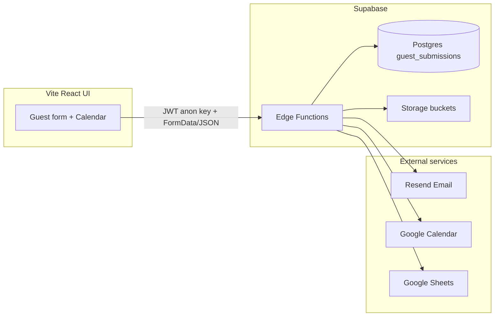

# Guest Form Management — Project Documentation

This document describes the **guest-form-management** codebase as implemented in the repository: purpose, architecture, data model, API surface, UI flows, integrations, environment configuration, and known product notes (including items tracked in `docs/TODOS.md` that are not yet built).

---

## 1. Purpose and product context

The application supports **short-term rental guest onboarding** for a specific unit (**Monaco 2604**, **Kame Home** branding). Guests complete a **Guest Advice / Advise Form (GAF)**-style submission that includes:

- Identity and contact details
- Stay dates and guest counts
- Optional parking and pet information with uploads
- Required uploads: **payment receipt** and **valid ID**

Submissions are persisted in **Supabase Postgres**, files go to **Supabase Storage**, and optional automation sends **emails (Resend)**, creates/updates **Google Calendar** events, and appends/updates rows in **Google Sheets**—all behind **Supabase Edge Functions** (Deno).

---

## 2. High-level architecture

- **UI**: React 18, Vite, React Router, React Hook Form + Zod, Tailwind, Radix/shadcn-style components, Sonner toasts.
- **Backend**: No separate Node API in-repo; `package.json` lists an `api` workspace but **no `api/` directory exists**—the real backend is **Supabase Edge Functions** under `supabase/functions/`.
- **Local dev**: `dev.sh` runs `supabase start` (includes edge functions in Docker), then `cd ui && npm run dev`. Do not also run `supabase functions serve` in parallel (Docker edge-runtime name conflict). For `npm run dev:api` / `functions serve`, set `SUPABASE_URL` and `SUPABASE_SERVICE_ROLE_KEY` in `supabase/.env.local`.
- **CLI env**: `config.toml` references `GOOGLE_CLIENT_*` from the process environment. Prefer **`npm run status:supabase`**, **`npm run stop:supabase`**, **`npm run db:reset`**, **`npm run start:supabase`**: they run **`npx supabase@latest`** via `scripts/run-with-ui-dev-env.sh`, which also loads `ui/.env.development`. A **global** `supabase` on PATH (e.g. v2.40.x) is easy to leave outdated and break Postgres 17 migrations (`storage.buckets` missing).
- **Nuclear local reset**: **`npm run stop:supabase:clean`** stops the stack and **deletes Docker data volumes** (fixes sticky Storage `migrations_name_key` issues when the CLI keeps **restoring from backup**). Then `npm run start:supabase`. All local DB data is lost until you `db reset` / migrations / optional prod sync.

---

## 3. Repository layout

| Path                   | Role                                                |
| ---------------------- | --------------------------------------------------- |
| `ui/`                  | Vite SPA: guest form, calendar picker, success page |
| `supabase/migrations/` | Postgres schema, RLS, storage policies              |
| `supabase/functions/`  | Deno edge functions + `_shared` modules             |
| `supabase/config.toml` | Local Supabase + function JWT settings              |
| `dev.sh`               | Convenience script for local stack                  |
| `docs/TODOS.md`        | Product backlog and completed tasks                 |

**UI entry**: `ui/src/main.tsx` → `App.tsx` → `routes/index.tsx` → merges `features/guest-form/routes`, `features/sd-form/routes`, and `features/admin/routes`.

---

## 4. Routing and pages (current behavior)

Defined in `ui/src/features/guest-form/routes/index.tsx` and `ui/src/features/sd-form/routes/index.tsx` (public), plus `ui/src/features/admin/routes/index.tsx` (admin). All are merged in `ui/src/routes/index.tsx`.

| Route                  | Component              | Guard          | Notes                                                                                                                                                                                                                                                                                                                                                                                                                        |
| ---------------------- | ---------------------- | -------------- | ---------------------------------------------------------------------------------------------------------------------------------------------------------------------------------------------------------------------------------------------------------------------------------------------------------------------------------------------------------------------------------------------------------------------------- |
| `/`                    | `CalendarPage`         | public         | Default landing; **Proceed** → `/form?checkInDate=&checkOutDate=`                                                                                                                                                                                                                                                                                                                                                            |
| `/form`                | `GuestFormPage`        | public         | Guest form (dates from URL and/or `?bookingId=`). With **no** `bookingId` and **no** `checkInDate` + `checkOutDate`, redirects to `/`                                                                                                                                                                                                                                                                                        |
| `/calendar`            | `CalendarPage`         | public         | Same as `/`                                                                                                                                                                                                                                                                                                                                                                                                                  |
| `/success`             | `GuestFormSuccessPage` | public         | Post-submit summary; requires `?bookingId=`                                                                                                                                                                                                                                                                                                                                                                                  |
| `/sd-form`             | `SdFormPage`           | public         | Two-step guest flow (feedback → refund method) after checkout; requires `?bookingId=`. `get-sd-form` returns **404** unless status is `PENDING_SD_REFUND_DETAILS`.                                                                                                                                                                                                                                                           |
| `/sign-in`             | `SignInPage`           | public         | Google OAuth entry for admins. Redirects signed-in admins to `?redirect=` target (default `/bookings`).                                                                                                                                                                                                                                                                                                                      |
| `/bookings`            | `BookingsListPage`     | `RequireAdmin` | Phase 3 — admin dashboard with **table / card / calendar** views (`?view=table\|card\|calendar`), search, status/sort/pet/parking + **date-range** filters (`?from`/`?to`, presets `week\|month\|year\|custom`), and 25/50/100 pagination. URL search params are the source of truth for all filters. Free-text search spans guest names (primary + additional), email, phone, plate, pet info, special requests, and notes. |
| `/bookings/:bookingId` | `BookingDetailPage`    | `RequireAdmin` | Phase 3 — booking detail with `WorkflowPanel`. The panel renders a vertical **pipeline stepper** that hides parking/pet stages when those flags are off, plus a single guest-aware "Proceed to {next}" CTA, a "← Back to {previous}" recovery button, and "Cancel Booking". Sub-forms (pricing/parking/SD refund) and dev-control checkboxes (DB/Storage/PDF/each email/Calendar/Sheet) gate every transition.               |

**`/bookings` data:** `useBookings` calls the **`list-bookings`** admin edge function (JWT required). It supports server-side check-in sort (converting MM-DD-YYYY to YYYY-MM-DD for correct ordering), stale-COMPLETED filtering per Q5.1, and accurate server-side pagination. Falls back to direct PostgREST on auth failure (e.g. hydration race). Stale `COMPLETED` rows (check-in before today) are hidden by default via `hide_stale_completed=true`.

**`/bookings` views:** the page renders one of three layouts driven by the `?view=` query param:

| View       | When to use                              | Notes                                                                                                                                                                                                                 |
| ---------- | ---------------------------------------- | --------------------------------------------------------------------------------------------------------------------------------------------------------------------------------------------------------------------- |
| `table`    | Default — dense, sortable list           | Whole row is a clickable link to `/bookings/:bookingId` (Enter/Space focus support). Renders the guest's `valid_id_url` thumbnail (single-color green initial fallback). Flag icons (Car/Dog) are large pill buttons. |
| `card`     | Browsing recent bookings on wide screens | Responsive grid (1/2/3/4 cols at sm/lg/xl). Cards show large avatar, status, stay range, flags, amount. Whole card is clickable.                                                                                      |
| `calendar` | "What's happening this month" overview   | Two-column on desktop: month grid spans every booking from check-in → check-out, plus a selected-day detail panel. Hides pagination because the date filter scopes results to the active range.                       |

The view is preserved in the URL alongside filters, so deep-linking and refreshes keep state. Switching views resets to page 1 but **does not** alter date or status filters.

**`/bookings` date filter:** the date-range filter mirrors the `property-management-app` calendar dashboard UX:

- Presets: `week` (Mon-Sun), `month` (calendar month), `year` (calendar year).
- Custom range: 2-month picker (1-month on mobile) using `react-day-picker` with project-token theming.
- Prev/next chevrons step the active preset by one period (`addWeeks` / `addMonths` / `addYears` from `date-fns`); a "Today" shortcut appears when the user is off-period.
- The component is `BookingDateRangeFilter`; state is owned by `useDateNavigation` (in `ui/src/features/admin/hooks/`) and synced to URL via `useSyncDateRangeWithQuery` which writes `from`/`to` as `YYYY-MM-DD`.
- The edge function applies the range to `check_in_date` only (storage format MM-DD-YYYY is normalized to ISO before comparison).

**`/bookings/:bookingId` data:** `useBooking` fetches a single row directly from `guest_submissions` via `supabase.from('guest_submissions').select('*').eq('id', id).single()`. Transitions are submitted via `useTransitionBooking` → `transition-booking` edge function → `WorkflowOrchestrator`.

**Legacy links:** URLs like `/?bookingId=<uuid>` (e.g. older Google Calendar descriptions) are handled on `CalendarPage`: the app **`replace`** navigates to **`/form?bookingId=...`** (other query params are preserved).

---

## 5. User flows

### 5.1 New booking (typical production)

1. User opens **`/`** or **`/calendar`**, selects check-in and check-out (respecting booked ranges and past dates), then **Proceed** → navigates to **`/form?checkInDate=YYYY-MM-DD&checkOutDate=YYYY-MM-DD`**.
2. On `GuestForm`, a **new `bookingId`** is generated client-side (`crypto.randomUUID()`) when `bookingId` is absent from the URL.
3. User fills the form; files are appended to `FormData` with deterministic names via `handleFileUpload` in `ui/src/utils/helpers.ts`.
4. Submit calls **`POST {VITE_API_URL}/submit-form`** with Supabase anon key headers. `submit-form` persists booking data/files and optional PDFs, but **does not send workflow emails**. The workflow emails (booking acknowledgement, GAF request, pet request, parking broadcast) are sent only by `WorkflowOrchestrator` when an admin transitions **`PENDING_REVIEW → PENDING_GAF`**.
5. Edge function checks **date overlap** against active (non-canceled) rows, then processes.
6. On success, UI navigates to **`/success?bookingId=...`** with `location.state.bookingData` for the summary card.

### 5.2 View / update existing booking

1. URL is **`/form?bookingId=<uuid>`** (or legacy **`/?bookingId=<uuid>`**, which redirects to `/form` as above). The id is sanitized on client and server if query junk is appended.
2. `GuestForm` loads data via **`GET {VITE_API_URL}/get-form/{bookingId}`** and hydrates the form; image fields use URLs from the API for previews.
3. On submit, server loads raw row, runs **`compareFormData`**; if **no changes**, returns `{ success: true, skipped: true }` and UI still redirects to success (no DB/email/calendar/sheet work).
4. If changes exist, row is updated; calendar event is found by `privateExtendedProperty` `bookingId`, deleted, recreated; sheet row is located by booking ID in column A and updated. **No workflow emails are sent from `submit-form` updates.**

### 5.3 Calendar and availability

- **`get-booked-dates`** returns `{ id, checkInDate, checkOutDate }` for rows where **`status` is not `CANCELLED`** (and not legacy `'canceled'` in JS), and **check-out date ≥ start of today** (past stays are omitted for picker performance — see `docs/TODOS.md`). Dates are normalized to `YYYY-MM-DD` in the JSON payload.
- **Overlap rule** (submit + DB check): **`DatabaseService.checkOverlappingBookings`** treats only **`CANCELLED`** / legacy **`canceled`** as non-blocking; all other statuses (including **`COMPLETED`**) block overlaps. Same-day turnover: overlap is false if new check-in equals existing check-out or new check-out equals existing check-in.
- **`NEW_FLOW_PLAN.md` §6.1 Q7.2:** only **`CANCELLED`** frees dates for overlap; **`COMPLETED`** still blocks when the row is in scope of the query (future check-out in `get-booked-dates`; overlap check uses full non-cancelled set).

### 5.4 Dev / testing UX

- **`VITE_NODE_ENV === 'production'`** is treated as production build; otherwise non-production.
- **Dev controls** show when `!isProduction` **or** `?testing=true` **or** `?dev=true`.
- Checkbox panel toggles query params on submit: `saveToDatabase`, `saveImagesToStorage`, `generatePdf`, `updateGoogleCalendar`, `updateGoogleSheets` (each `true`/`false`). `submit-form` no longer accepts a meaningful `sendEmail` toggle because workflow emails are not sent there. Defaults: in dev/testing panel, **all start unchecked** except when `isProduction && isDevMode` (then they default true—a niche case for prod+`dev=true`).
- **`?testing=true`**: prefixes `[TEST]` on primary guest name in DB, `TEST_` on storage object names, test banners/prefixes in email subjects, `[TEST]` on calendar titles and sheet name columns, etc.
- **Production + `testing=true` + send email**: server **forces** `sendEmail` off when `DENO_DEPLOYMENT_ID` is set (deployed edge).
- **Cleanup**: `POST /cleanup-test-data` with `{ confirm: true }` removes test-tagged data across DB/storage/calendar/sheets (see function implementation).
- **Cancel booking**: `POST /cancel-booking` with `{ bookingId, confirm: true }` (admin JWT required). Routes through `WorkflowOrchestrator` which sets DB `status` to `CANCELLED`, updates Calendar (purple `colorId 3`, summary `CANCELED - {pax}pax {nights}nights - {name}` — no brackets per §1.4), and updates Sheet status column — **does not delete** assets or DB row.

### 5.5 Error recovery (guest-friendly)

On submit error, Sonner toast can include **copy booking info** (text format from `formatBookingInfoForClipboard`). Dev controls include **paste from clipboard** to repopulate fields using `parseBookingInfoFromClipboard` (files still required).

---

## 6. Data model (`guest_submissions`)

Created in migrations; key points:

- **`id`**: UUID; client may supply on insert (form sends predetermined id).
- **Dates**: Stored as **TEXT** (`MM-DD-YYYY` in DB via `transformFormToSubmission`); API and overlap logic accept normalization between `MM-DD-YYYY` and `YYYY-MM-DD`.
- **Times**: Stored as human-readable strings (DB defaults `02:00 PM` / `11:00 AM` in original migration; UI uses 24h in schema defaults then displays).
- **`status`**: Added in `20250113000000_add_booking_status.sql` — values used in code: **`booked`** (active), **`canceled`**. Comments mention “booked \| canceled”; sheet uses **Booked** / **Canceled** labels.
- **Pets**: `pet_type` added in later migration; URLs for vaccination and pet image in storage.
- **Constraints**: Check constraints on email pattern, guest counts, parking conditional fields, pet conditional fields, date ordering, time regex (see migration).
- **New-flow columns (Phase 0+, additive).** Migrations `20260501000002`–`20260501000005` + `20260501000009` add nullable columns for pricing (`booking_rate`, `down_payment`, `balance`, `security_deposit`), parking (`parking_rate_guest`, `parking_rate_paid`, `parking_endorsement_url`, `parking_owner_email`), pets (`pet_fee`), SD settlement (`sd_additional_expenses NUMERIC[]`, `sd_additional_profits NUMERIC[]`, `sd_refund_amount`, `sd_refund_receipt_url`), approval PDFs (`approved_gaf_pdf_url`, `approved_pet_pdf_url`), audit (`status_updated_at`, `settled_at`), and `is_test_booking`. Migration **`20260503000000_add_sd_refund_details_status.sql`** widens `status` for **`PENDING_SD_REFUND_DETAILS`** and adds guest SD form columns (`sd_refund_guest_feedback`, `sd_refund_method`, `sd_refund_phone_confirmed`, `sd_refund_bank`, `sd_refund_account_name`, `sd_refund_account_number`, `sd_refund_cash_pickup_note`, `sd_refund_form_submitted_at`, `sd_refund_form_emailed_at`). New tables: `processed_emails`, `gmail_listener_state`. Backup snapshot: `guest_submissions_backup_20260501`. See `docs/NEW_FLOW_PLAN.md` §2 and `docs/MIGRATION_RUNBOOK.md`.

---

## 7. Storage

Buckets and MIME types are declared in `supabase/config.toml` (e.g. `payment-receipts`, `pet-vaccinations`); additional buckets appear in SQL migrations (`pet-images`, etc.). `UploadService` maps files to buckets and public URLs.

**New-flow buckets (Phase 0, provisioned but not yet written):** `parking-endorsements` (public), `approved-gafs` (private), `approved-pet-forms` (private), `sd-refund-receipts` (private). Defined in `20260501000006`–`20260501000008`. See `docs/NEW_FLOW_PLAN.md` §2.

---

## 8. Edge functions (API surface)

| Function                       | Method | Auth          | Purpose                                                                                                                                           |
| ------------------------------ | ------ | ------------- | ------------------------------------------------------------------------------------------------------------------------------------------------- |
| `submit-form`                  | POST   | anon (public) | Multipart form processing, overlap check, change detection, DB/storage/PDF (+ optional calendar/sheets), **no workflow emails**                   |
| `get-form`                     | GET    | anon (public) | Path: `/get-form/{bookingId}` — returns JSON form payload                                                                                         |
| `get-booked-dates`             | GET    | anon (public) | Future, non-`CANCELLED` booking ranges                                                                                                            |
| `cancel-booking`               | POST   | admin JWT     | Soft-cancel via `WorkflowOrchestrator`; updates Calendar (purple, `CANCELED - …`) + Sheet + DB                                                    |
| `cleanup-test-data`            | POST   | admin JWT     | JSON `{ confirm: true }`; scrub test artifacts from DB/storage/calendar/sheets                                                                    |
| `list-bookings` _(new)_        | GET    | admin JWT     | Paginated admin list; server-side check-in sort; search/status/date/pet/parking/test filters; Q5.1 defaults                                       |
| `transition-booking` _(new)_   | POST   | admin JWT     | `{ bookingId, toStatus, payload, devControls, manual }` → validates via status machine → `WorkflowOrchestrator`                                   |
| `upload-booking-asset` _(new)_ | POST   | admin JWT     | Multipart upload; `assetType` routes to correct Storage bucket and DB column                                                                      |
| `gmail-listener` _(Phase 4)_   | POST   | cron/internal | Scheduled every 5 min; Gmail history poll → `APPROVED GAF.pdf` download → Storage upload → `WorkflowOrchestrator`                                 |
| `sd-refund-cron` _(Phase 4)_   | POST   | cron/internal | Scheduled every 5 min; transitions `READY_FOR_CHECKIN → PENDING_SD_REFUND_DETAILS` ≥15 min after checkout (Manila TZ), with SD form email enabled |
| `get-sd-form`                  | GET    | anon (public) | Query `?bookingId=` — minimal payload for `/sd-form` when status is `PENDING_SD_REFUND_DETAILS`                                                   |
| `submit-sd-form`               | POST   | anon (public) | Guest submits feedback + refund preference → `PENDING_SD_REFUND` via orchestrator                                                                 |
| `send-sd-refund-form-email`    | POST   | admin JWT     | Re-send SD form link; status must be `PENDING_SD_REFUND_DETAILS`; updates `sd_refund_form_emailed_at`                                             |

**Scheduled jobs (deep dive + testing):** see **`docs/SCHEDULED_JOBS_AND_TESTING.md`** — how `pg_cron` + `pg_net` invoke these URLs on Supabase Cloud, why `schedule` is not in `config.toml` locally, env vars, curl/admin UI test steps, and idempotency.

**Auth**: `verify_jwt = false` for `submit-form`, `get-booked-dates`, `get-form`, `get-sd-form`, `submit-sd-form`. Admin functions (`list-bookings`, `transition-booking`, `upload-booking-asset`, `send-sd-refund-form-email`, `cancel-booking`, `cleanup-test-data`, etc.) have `verify_jwt = false` in `config.toml` (Kong's HS256 gate rejects ES256 tokens) and call `verifyAdminJwt(req)` from `_shared/auth.ts` as the sole security boundary. Scheduled functions (`gmail-listener`, `sd-refund-cron`) also use `verify_jwt = false`; hosted recurrence is configured with **`pg_cron` + `net.http_post`** (often with secrets in Vault) per [Supabase scheduling guide](https://supabase.com/docs/guides/functions/schedule-functions). Admin “Run … now” buttons call the same HTTP endpoints with a session JWT (see scheduling doc above for operational detail).

**CORS**: `_shared/cors.ts` builds headers per request origin.

**Email HTML at runtime**: Functions that call `loadEmailTemplate()` (through `_shared/emailService.ts` or `_shared/workflowOrchestrator.ts`) must declare **`static_files`** in `supabase/config.toml` (paths relative to `supabase/`, e.g. `./functions/_shared/email-templates/*.html` and `./functions/_shared/email-templates/fragments/*.html`). The hosted Edge bundle otherwise omits those `.html` assets and `Deno.readTextFile` fails at runtime. Requires **Supabase CLI ≥ 2.7** for `static_files`; add the same globs when introducing a new function that sends email.

---

## 9. Integrations detail

### 9.1 Email (Resend)

- **GAF** mail: HTML body, optional PDF attachment, subject includes date range, **urgent** styling for same-day check-in (Philippines timezone), **update** copy when `isUpdate`. Guest-facing dates in templates/subjects are formatted as **`MMM D, YYYY`** (e.g. `Jun 13, 2026`). Sent only on transition **`PENDING_REVIEW → PENDING_GAF`**.
- **Pet** mail: separate flow when pet fields complete; attachments/links for pet PDF and images. Sent only on transition **`PENDING_REVIEW → PENDING_GAF`** when `has_pets = true`.
- **Booking acknowledgement** (guest) and **Parking broadcast** (owners) are also sent only on **`PENDING_REVIEW → PENDING_GAF`**.
- From address uses **kamehomes.space** domain (see `emailService.ts`).
- **HTML bodies** live under `supabase/functions/_shared/email-templates/` as full-document `.html` files with `{{placeholder}}` tokens. Layout follows transactional-email conventions (~600px wide, nested `role="presentation"` tables). Shared visual theme (warm outer `#f2e3c6`, sage surfaces `#b9d99f`, teal accents `#5a9a9a` / `#88b6b6`, rounded cards) and most typography live in a single `` into every `*.html` that embeds it (or run the same sync step the team uses) so styles stay in sync. Prefer **classes** over inline `style=`; `prefers-color-scheme: dark` overrides are in that stylesheet. MSO conditional lives in `<head>` where needed. `renderEmailHtml.ts` loads them (`Deno.readTextFile`, cached) and `replacePlaceholders` merges in values — use `escapeHtml()` in `emailService.ts` for guest-supplied text. **Header logo:** each full template includes `{{emailHeaderLogo}}` (built from `fragments/email-header-logo.html`); the image `src` is **`EMAIL_LOGO_URL`** or defaults to **`https://kamehomes.space/images/logo.png`** (same file as `ui/public/images/logo.png` after UI deploy). **Local preview**
- **Placeholder HTML** (layout only; `{{placeholders}}` stay literal): `npm run preview:emails:serve` then open **`http://localhost:3334/`** or e.g. **`http://localhost:3334/gaf-request.html`**. The **`.html`** suffix is required (`…/gaf-request` without it returns **404**). The server root is `email-templates/`, so paths like `/email-templates/…` also **404**.
- **Filled HTML** (real copy + one `guest_submissions` row): `npm run preview:emails:db` reads `SUPABASE_URL` and **`SUPABASE_SERVICE_ROLE_KEY`** from `supabase/.env.local` (or the environment), prefers a **non-test, non-cancelled** row with **`has_pets` and `need_parking`**, then writes `email-templates/_preview/*.html` plus `_preview/preview-meta.json` (source row id + query label). If the DB is empty or credentials are wrong, a **built-in demo** row is used. **`npm run preview:emails`** runs the DB step then starts the static server; use **`preview:emails:serve`** to serve only without regenerating.

### 9.2 Google Calendar

- Service account JWT → access token.
- Events store **`bookingId`** in `extendedProperties.private` for idempotent find/update/delete.
- **`dateTime` + `timeZone`:** `_shared/utils.ts` builds wall times with `buildGoogleCalendarDateTime` — dates are normalized from **YYYY-MM-DD** (guest form) or **MM-DD-YYYY** (DB), and times go through **`formatTime`** so strings like **`2:00 PM`** become **14:00** (naive `HH` splitting had been treating that as 2:00).
- Description includes link to **`https://kamehomes.space/form?bookingId=...`** with `&testing=true` or `&dev=true` for non-testing mode (see `createEventData` in `_shared/calendarService.ts`).
- **Cancel**: search by `privateExtendedProperty`, patch summary **`[CANCELED] …`** today (`colorId: 11`); new flow uses **`CANCELED - …`** summaries + purple `colorId` per `docs/NEW_FLOW_PLAN.md` §1.4.

### 9.3 Google Sheets

- Column **A** = `bookingId`; wide row up through **AK** (`Status`: Booked/Canceled).
- Append new row or **PUT** update row `A{row}:AK{row}` when booking exists.
- **`GOOGLE_SPREADSHEET_ID`**: use a dev spreadsheet in local `.env` if desired (`docs/TODOS.md` mentions sprmkedev—**not hardcoded** in repo).

### 9.4 PDF

- `_shared/pdfService.ts` generates main guest PDF and optional pet PDF (called from `submit-form` when `generatePdf=true`).

---

## 10. Form validation (UI)

`ui/src/features/guest-form/schemas/guestFormSchema.ts` (Zod):

- **Phone**: Philippines `09` + 9 digits (11 total).
- **Address**: `City, Province` pattern.
- **Guests**: dynamic requirement for `guest2Name`…`guest4Name` based on adults + children.
- **Parking / pets**: conditional required fields.
- **Same-day stay**: check-out time must be after check-in time when dates equal.
- **Files**: `paymentReceipt` and `validId` required as `File`; pet files required when `hasPets`.

---

## 11. Environment variables

### UI (`ui/.env` / Vite)

- `VITE_API_URL` — Supabase functions base URL (local: `http://127.0.0.1:54321/functions/v1` pattern; production: project functions URL).
- `VITE_SUPABASE_URL` — same functions base URL used by the Supabase JS client; project URL is derived by stripping `/functions/v1`.
- `VITE_SUPABASE_ANON_KEY` — public anon key (sent with function requests and used by the Supabase JS client).
- `VITE_NODE_ENV` — `production` toggles production-only behavior in the form.
- `VITE_ADMIN_ALLOWED_EMAILS` _(Phase 1)_ — comma-separated Google emails allowed to open `/bookings`. **UX gate only** — the server-side allow list (Phase 3) is authoritative. If unset, the UI denies every account.
- `VITE_SUPABASE_PROJECT_URL` _(optional, Phase 1)_ — override for the Supabase project URL when the auto-derivation from `VITE_SUPABASE_URL` is unwanted.
- `GOOGLE_CLIENT_ID`, `GOOGLE_CLIENT_SECRET` _(local Supabase Auth only)_ — **not** `VITE_*`; not exposed to the browser. Used when `supabase/config.toml` enables `[auth.external.google]`: `dev.sh` and `npm run start:supabase` load `ui/.env.development` before starting the stack so the CLI can substitute `env(...)`. Do **not** use the `SUPABASE_` prefix (CLI may ignore those names). In Google Cloud, add redirect URIs `http://127.0.0.1:54321/auth/v1/callback` and `http://localhost:54321/auth/v1/callback`.

### Edge (`supabase/.env.local` / hosted secrets)

- `SUPABASE_URL`, `SUPABASE_SERVICE_ROLE_KEY`
- `RESEND_API_KEY`, `EMAIL_TO`, `EMAIL_REPLY_TO`
- `EMAIL_LOGO_URL` _(optional)_ — absolute HTTPS URL for the Kame Home logo in outbound HTML emails; default `https://kamehomes.space/images/logo.png` (see `renderEmailHtml.ts` `DEFAULT_EMAIL_LOGO_URL` and `emailService.ts`)
- `GOOGLE_SERVICE_ACCOUNT` (JSON string), `GOOGLE_CALENDAR_ID`, `GOOGLE_SPREADSHEET_ID`
- `ADMIN_ALLOWED_EMAILS` — comma-separated allow list, server-enforced (e.g. `kamehome.azurenorth@gmail.com`)
- `PARKING_OWNER_EMAILS` — comma-separated BCC list for parking broadcast emails
- `GMAIL_OAUTH_CLIENT_JSON` — Full OAuth client credentials JSON (for `gmail-listener`); set by `npm run gmail-auth` from `scripts/gmail-credentials.json`
- `GMAIL_OAUTH_TOKEN_JSON` — Token JSON containing `refresh_token` (for `gmail-listener`); set by `npm run gmail-auth` after browser sign-in
- `SD_REFUND_CRON_GRACE_MINUTES` — Grace period in minutes before auto-`PENDING_SD_REFUND_DETAILS` after checkout (default: `15`)
- `PUBLIC_GUEST_APP_ORIGIN` _(optional)_ — absolute origin for guest links in emails (e.g. `https://kamehomes.space`); SD form URL defaults here — see `emailService.ts` `guestAppOrigin()`
- `FACEBOOK_REVIEWS_URL` _(optional)_ — URL returned by `get-sd-form` for the “review us on Facebook” step (default `https://www.facebook.com`)
- Optional: `ENVIRONMENT` / `DENO_ENV` for `isDevelopment()` in shared utils

---

## 12. Deployment

- `ui/vercel.json`: SPA rewrites to `index.html`, Vite build output `dist`.
- Supabase: deploy functions + run migrations; configure secrets in dashboard.

---

## 13. Roadmap / gaps (from `docs/TODOS.md` vs code)

Examples **not** fully reflected in code or only partially done:

- **`admin=true`**: mentioned for owner review workflow; **no `admin` handling in UI** at time of writing.
- Multi-step stepper + preview; image optimization before upload; AI validation of uploads; carousel hero; query-param persistence across routes; richer **booking status** workflow (PENDING REVIEW, etc.).
- Calendar event still appends `dev=true` in some branches when not testing—`docs/TODOS.md` flags removing `dev=true` from links.

Use **`docs/TODOS.md`** as the live product backlog; this doc describes **current** implementation unless a section explicitly calls out planned work.

---

## 14. Known implementation notes

- **`compareFormData`** (server) compares many scalar fields and file re-uploads; **`petType` is not currently in the compared field list**, so changing only pet type might not trigger an update pipeline—extend the list in `_shared/utils.ts` if that becomes a product requirement.

---

## 15. Key files quick reference

| Concern                            | Location                                                  |
| ---------------------------------- | --------------------------------------------------------- |
| Submit pipeline                    | `supabase/functions/submit-form/index.ts`                 |
| DB + overlap + FormData processing | `supabase/functions/_shared/databaseService.ts`           |
| Field-level diff for updates       | `supabase/functions/_shared/utils.ts` (`compareFormData`) |
| Form UI                            | `ui/src/features/guest-form/components/GuestForm.tsx`     |
| Validation schema                  | `ui/src/features/guest-form/schemas/guestFormSchema.ts`   |
| Clipboard backup                   | `ui/src/utils/bookingFormatter.ts`                        |
| Calendar page                      | `ui/src/features/guest-form/pages/CalendarPage.tsx`       |
| Date helpers / overlap helpers     | `ui/src/utils/dates.ts`                                   |

---

_Last updated from repository analysis (internal documentation)._
