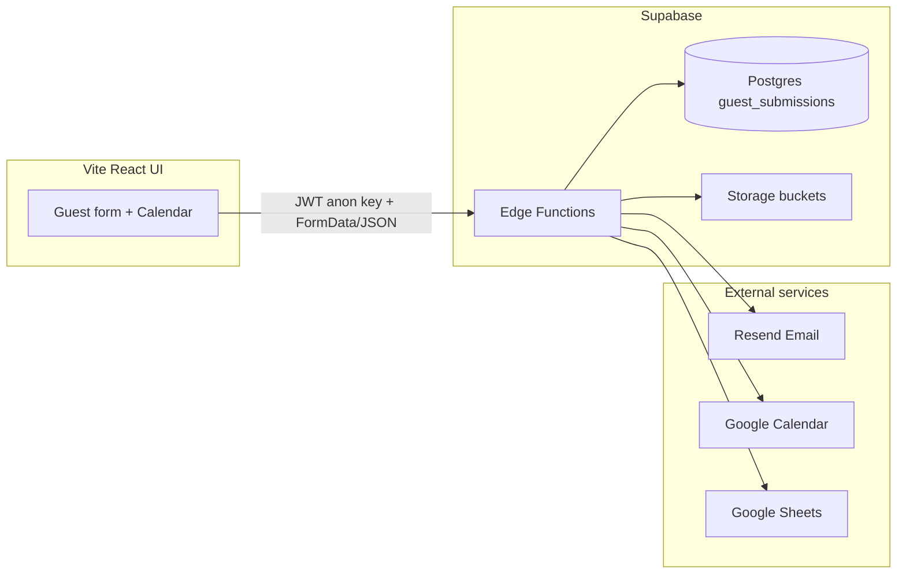

# Guest Form Management — Project Documentation

This document describes the **guest-form-management** codebase as implemented in the repository: purpose, architecture, data model, API surface, UI flows, integrations, environment configuration, and known product notes (including items tracked in `docs/TODOS.md` that are not yet built).

> **Looking for a non-technical walkthrough?** See [`docs/reference/booking-flow-guide-for-admin.md`](reference/booking-flow-guide-for-admin.md) (also available as [PDF](reference/booking-flow-guide-for-admin.pdf)) — a plain-English guide to every booking status, what the admin does at each step, what the cron jobs / Gmail listener do automatically, and the calendar color cheat sheet. Forward this to ops / Airbnb admin.

---

## 1. Purpose and product context

The application supports **short-term rental guest onboarding** for a specific unit (**Monaco 2604**, **Kame Home** branding). Guests complete a **Guest Advice / Advise Form (GAF)**-style submission that includes:

- Identity and contact details
- Stay dates and guest counts
- Optional parking and pet information with uploads
- Required uploads: **downpayment receipt** and **valid ID**

Submissions are persisted in **Supabase Postgres**, files go to **Supabase Storage**, and optional automation sends **emails (Resend)**, creates/updates **Google Calendar** events, and appends/updates rows in **Google Sheets**—all behind **Supabase Edge Functions** (Deno).

---

## 2. High-level architecture



- **UI**: React 18, Vite, React Router, React Hook Form + Zod, Tailwind, Radix/shadcn-style components, Sonner toasts.
- **Backend**: No separate Node API in-repo; `package.json` lists an `api` workspace but **no `api/` directory exists**—the real backend is **Supabase Edge Functions** under `supabase/functions/`.
- **Local dev**: `dev.sh` runs **`scripts/run-with-ui-dev-env.sh`** before **`supabase start`** and before **`supabase functions serve`**, so `GOOGLE_CLIENT_ID` / `GOOGLE_CLIENT_SECRET` from **`ui/.env.development`** are in the shell when the CLI resolves `config.toml` `env(...)` (otherwise you see `WARN: environment variable is unset: GOOGLE_CLIENT_*` when Kong reloads). Edge function secrets still come from **`supabase/.env.local`** (`--env-file`). Then `cd ui && npm run dev`. Do not start a second `supabase functions serve` in parallel (Docker edge-runtime name conflict). For `npm run dev:api`, set `SUPABASE_URL` and `SUPABASE_SERVICE_ROLE_KEY` in `supabase/.env.local`.
- **502 on `/functions/v1/*` (Kong “Bad Gateway”)**: Usually Kong is still targeting an old **Docker edge-runtime** IP after **`npm run db:reset`** or a partial restart while `./dev.sh` is running. **`npm run stop:supabase`** then **`./dev.sh`** resyncs Kong with the host `functions serve` process. Confirm with `docker logs supabase_kong_<project> 2>&1 | tail -20` — look for `Host is unreachable` toward `172.x.x.x:8081`.
- **CLI env**: `config.toml` references `GOOGLE_CLIENT_*` from the process environment. Prefer **`npm run status:supabase`**, **`npm run stop:supabase`**, **`npm run db:reset`**, **`npm run start:supabase`**: they run **`npx supabase@latest`** via `scripts/run-with-ui-dev-env.sh`, which also loads `ui/.env.development`. A **global** `supabase` on PATH (e.g. v2.40.x) is easy to leave outdated and break Postgres 17 migrations (`storage.buckets` missing).
- **Nuclear local reset**: **`npm run stop:supabase:clean`** stops the stack and **deletes Docker data volumes** (fixes sticky Storage `migrations_name_key` issues when the CLI keeps **restoring from backup**). Then `npm run start:supabase`. All local DB data is lost until you `db reset` / migrations / optional prod sync.

---

## 3. Repository layout

| Path                   | Role                                                |
| ---------------------- | --------------------------------------------------- |
| `ui/`                  | Vite SPA: guest form, calendar picker, success page |
| `supabase/migrations/` | Postgres schema, RLS, storage policies              |
| `supabase/functions/`  | Deno edge functions + `_shared` modules             |
| `supabase/config.toml` | Local Supabase + function JWT settings              |
| `dev.sh`               | Convenience script for local stack                  |
| `docs/TODOS.md`        | Product backlog and completed tasks                 |

**UI entry**: `ui/src/main.tsx` → `App.tsx` → `routes/index.tsx` → merges `features/guest-form/routes`, `features/sd-form/routes`, `features/pay-parking/routes`, and `features/admin/routes`.

---

## 4. Routing and pages (current behavior)

Defined in `ui/src/features/guest-form/routes/index.tsx`, `ui/src/features/sd-form/routes/index.tsx`, and `ui/src/features/pay-parking/routes/index.tsx` (public), plus `ui/src/features/admin/routes/index.tsx` (admin). All are merged in `ui/src/routes/index.tsx`.

| Route                          | Component              | Guard          | Notes                                                                                                                                                                                                                                                                                                                                                                                                                                                                                                                                                                                                                                                                                                                                                                                                                                                                                                                                                                                                                                                                                                                                                                                                                                                                                                                                                                                                                                                                                                                                                                                                                                                                                        |
| ------------------------------ | ---------------------- | -------------- | -------------------------------------------------------------------------------------------------------------------------------------------------------------------------------------------------------------------------------------------------------------------------------------------------------------------------------------------------------------------------------------------------------------------------------------------------------------------------------------------------------------------------------------------------------------------------------------------------------------------------------------------------------------------------------------------------------------------------------------------------------------------------------------------------------------------------------------------------------------------------------------------------------------------------------------------------------------------------------------------------------------------------------------------------------------------------------------------------------------------------------------------------------------------------------------------------------------------------------------------------------------------------------------------------------------------------------------------------------------------------------------------------------------------------------------------------------------------------------------------------------------------------------------------------------------------------------------------------------------------------------------------------------------------------------------------- |
| `/`                            | `CalendarPage`         | public         | Default landing; **Proceed** → `/form?checkInDate=&checkOutDate=`                                                                                                                                                                                                                                                                                                                                                                                                                                                                                                                                                                                                                                                                                                                                                                                                                                                                                                                                                                                                                                                                                                                                                                                                                                                                                                                                                                                                                                                                                                                                                                                                                            |
| `/form`                        | `GuestFormPage`        | public         | Guest form; **no redirect** when the URL has only optional params (e.g. `?source=airbnb`, `?dev=true`). `checkInDate` / `checkOutDate` and/or `bookingId` seed defaults / load existing row. From **`/`** or **`/calendar`**, **Proceed** merges the current query string into `/form` (so `source`, `dev`, etc. persist) and sets dates; **`bookingId`** is dropped on that handoff for a new stay.                                                                                                                                                                                                                                                                                                                                                                                                                                                                                                                                                                                                                                                                                                                                                                                                                                                                                                                                                                                                                                                                                                                                                                                                                                                                                         |
| `/calendar`                    | `CalendarPage`         | public         | Same as `/`                                                                                                                                                                                                                                                                                                                                                                                                                                                                                                                                                                                                                                                                                                                                                                                                                                                                                                                                                                                                                                                                                                                                                                                                                                                                                                                                                                                                                                                                                                                                                                                                                                                                                  |
| `/success`                     | `GuestFormSuccessPage` | public         | Post-submit summary; requires `?bookingId=`                                                                                                                                                                                                                                                                                                                                                                                                                                                                                                                                                                                                                                                                                                                                                                                                                                                                                                                                                                                                                                                                                                                                                                                                                                                                                                                                                                                                                                                                                                                                                                                                                                                  |
| `/sd-form`                     | `SdFormPage`           | public         | Same logo shell as `/form` — **`KameFormBrandHeader`** with title **Security Deposit Refund** (`title` prop). Two-step flow: **Step 1** opens with the "Review us on Facebook" CTA, then swaps to a **slot-machine voucher reveal** (`VoucherReveal`) that calls `claim-sd-voucher` and animates a vertical reel before showing the won code (always within the win pool in `_shared/voucher.ts#VOUCHER_WIN_WEIGHTS` — e.g. `KAME-100`/`150`/`200` **5%** each; `KAME-250`/`300`/`350` **~25%** each; `KAME-400`/`450` **3%** each; `KAME-500` **2%**; `KAME-1000` **1%**; **`KAME-STAY`** **0.5%**; legacy `FREE-STAY` rows normalize to the same prize). The voucher persists on `guest_submissions.next_stay_voucher_*`, so a returning guest skips the reel. After the voucher is shown, **Review us on Facebook** appears again above **Continue to refund process** so guests can open or re-open the review page. **Step 2** captures refund method; for **Another GCash or bank account**, account name uses the same `validateName` rules as the guest form, account number is digits-only (5–20), and **Submit security deposit refund** stays disabled until those fields validate; inline error styling appears only after the guest interacts with each field (change or blur), not when the section first opens. Requires `?bookingId=`; `get-sd-form` returns **404** unless status is `READY_FOR_CHECKOUT`. After submit, the **done** screen adds a short Ka-Homies thank-you line and a primary CTA **Check next available dates** linking to `/` (calendar).                                                                                                              |
| `/bookings/:bookingId/parking` | `PayParkingPage`       | public         | **Pay Parking** guest form (same **`KameFormBrandHeader`** shell as `/sd-form`). Read-only **Booking Info** + **Parking Details** (rate, parking check-in/out dates, total from **`number_of_parking_nights`**) + vehicle fields. Admin **View pay parking** opens with **`?admin=true`**; on **Update parking details** a modal chooses broadcast email, single parking-owner email, or save-only. Guest copy links omit **`admin`**. Admin saves rate + parking check-in/out **`DatePicker`** fields (same component as guest form stay dates, constrained to the booking stay) in **`PayParkingModal`** before copy/link; guests cannot change rate or dates. **`get-pay-parking`** / **`submit-pay-parking`**; submit uses DB rate only, optional **`sendParkingBroadcast`** / **`parkingOwnerEmail`**, calendar/sheet refresh (no workflow status change).                                                                                                                                                                                                                                                                                                                                                                                                                                                                                                                                                                                                                                                                                                                                                                                                                              |
| `/sign-in`                     | `SignInPage`           | public         | Google OAuth entry for admins. Redirects signed-in admins to `?redirect=` target (default `/dashboard`).                                                                                                                                                                                                                                                                                                                                                                                                                                                                                                                                                                                                                                                                                                                                                                                                                                                                                                                                                                                                                                                                                                                                                                                                                                                                                                                                                                                                                                                                                                                                                                                     |
| `/dashboard`                   | `DashboardPage`        | `RequireAdmin` | **Admin home** — **BookingDateRangeFilter** in the page header drives sections via `?from`/`?to`: attention chips, KPI cards (net profit, total bookings as count/days, occupancy, avg nightly rate, total guests — with period-over-period trends from **`dashboard-stats`**), then **FinanceTransactionsChart** (cash flow + category breakdown from `finance-line-items` + stay net via `finance-bookings`; stay net split evenly across occupied nights on the chart). Below the chart, a two-column row shows **Transactions** (same `occurred_on` scope as Finance → Transactions; due badge counts unpaid Telegram-reminder rows only) and **BookingCalendarView** (mini occupancy grid synced to the dashboard date preset; tap a booking → `/bookings/:id`). Links to `/finance` and `/bookings?view=calendar`. Auto-refreshes every 60s. Default range: current calendar month (Asia/Manila).                                                                                                                                                                                                                                                                                                                                                                                                                                                                                                                                                                                                                                                                                                                                                                                                                                                 |
| `/finance`                     | `FinancePage`          | `RequireAdmin` | **Finance dashboard** — tabbed **Overview**, **Stays**, **Transactions** CRUD (`finance_line_items`; transaction search), and **Settings** (Finance Telegram due-date reminders). **Overview** includes **Recharts** cash-flow (dual income/expense area) + category breakdown (donut with income/expense toggle), built client-side from `finance-line-items` for the selected period; **stay net** on the cash-flow chart is split evenly across **occupied nights** (check-in through the night before check-out). Property transactions may enable per-row Telegram reminders (due date, days-before window, interval, custom template). **Host net** (completed) = booking rate + other fees (= Breakdown net). Breakdown groups **Income**, security deposit + additional SD expense/profit lines (no separate SD header), then **Expenses** (parking owner rate, SD refund). **Export report** (PDF via `exportPdf.ts`) and **`finance-export`** CSV include the same ledger columns plus a **Definitions** section (formulas). Stay finance modal shows **Breakdown** only. Booking detail **Pricing** card: in-progress stays show **Rates &amp; fees** + guest settlement; **COMPLETED** stays show guest settlement + **Breakdown** + SD refund workflow metadata (timeline, refund destination, voucher). `finance-bookings` returns a **`pricing`** snapshot per row. Period basis **check-in \| check-out \| completed**. **Stays** tab: **table / card / calendar** views (`?view=table\|card\|calendar` on the Stays tab); calendar reuses the bookings occupancy grid with **host net** on day pills and the shared day-detail panel (click opens stay finance modal). URL tab **`transactions`** (legacy **`?tab=operating`** still resolves).                                                           |
| `/maintenance`                 | `MaintenancePage`      | `RequireAdmin` | **Maintenance dashboard** — tabbed **Overview**, **Reminders** CRUD (`maintenance_items`; search), and **Settings** (Maintenance Telegram reminders to **Kame Home - Maintenance** group). Items: **label**, **category**, **date** (`scheduled_on`), **repeat**, **notes**, optional per-row Telegram reminders (due date, days-before window, interval, custom template). **Mark as done** sets `completed_at` and stops reminders. **Export report** (PDF via `maintenance/lib/exportPdf.ts`). No income/expense/stays — reminders-only scope.                                                                 |
| `/marketing`                   | `AdminMarketingPage`   | `RequireAdmin` | **Telegram** templates; **daily reminder times** (**Asia/Manila**, persisted to **`pg_cron`** on Save); notify toggles; test sends (`TelegramMarketingSettingsCard`). Secrets + cron infra: **`docs/reference/telegram-marketing-reminders.md`**.                                                                                                                                                                                                                                                                                                                                                                                                                                                                                                                                                                                                                                                                                                                                                                                                                                                                                                                                                                                                                                                                                                                                                                                                                                                                                                                                                                                                                                            |
| `/staff`                       | `AdminStaffPage`       | `RequireAdmin` | **Staff / cleaner Telegram** — daily booking summary cron (default **8:00 AM Manila**) plus **instant same-day check-in alert** when a guest submits a booking checking in today at or after the **configured daily summary time** (one-time per booking). Separate templates/toggles; test sends on `/staff` (`TelegramStaffSettingsCard`). Uses `TELEGRAM_STAFF_BOT_TOKEN` (fallback `TELEGRAM_BOT_TOKEN`) + `TELEGRAM_STAFF_CHAT_ID`.                                                                                                                                                                                                                                                                                                                                                                                                                                                                                                                                                                                                                                                                                                                                                                                                                                                                                                                                                                                                                                                                                                                                                                                                                                                     |
| `/operations`                  | `AdminOperationsPage`  | `RequireAdmin` | **Admin workflow Telegram** — instant + hourly alerts to a dedicated admin ops group: **new booking** (instant on guest submit, then hourly while **Pending Review** until admin proceeds to Pending Documents), pending docs on check-in day, balance receipt needed **during the stay** (hourly until uploaded), **balance receipt uploaded** (instant on admin upload), SD form submitted, SD refund awaiting processing. Per-scenario toggles + templates (`TelegramAdminSettingsCard`). Uses `TELEGRAM_ADMIN_BOT_TOKEN` (fallback `TELEGRAM_BOT_TOKEN`) + `TELEGRAM_ADMIN_CHAT_ID`. Hourly cron `0 * * * *` UTC via **`sync_telegram_admin_hourly_cron_job`**. Cron logs **`matched*`** counts + **`detail`** when nothing sends (e.g. `no_bookings_matched_any_scenario`). Requires migration **`20260705120000_telegram_admin_new_booking_hourly.sql`** for hourly new-booking dedupe; **`20260721120000_telegram_admin_balance_receipt_uploaded_template.sql`** splits balance receipt needed vs uploaded templates.                                                                                                                                                                                                                                                                                                                                                                                                                                                                                                                                                                                                                                                                                                                                                                                                                                        |
| `/settings`                    | `AdminSettingsPage`    | `RequireAdmin` | Admin **Settings** — workspace integrations. **Gmail (listener):** nested under **Integrations → Google** in `AppSettingsCard` (`GmailMailIntegrationCard` embedded). Connects the mailbox **`gmail-listener`** polls for Azure approval PDFs. After OAuth, Google redirects to the SPA with `?gmail_connected=1` or `?gmail_error=`; this page shows a toast and strips those query params.                                                                                                                                                                                                                                                                                                                                                                                                                                                                                                                                                                                                                                                                                                                                                                                                                                                                                                                                                                                                                                                                                                                                                                                                                                                                                                 |
| `/bookings`                    | `BookingsListPage`     | `RequireAdmin` | Phase 3 — admin dashboard with **table / card / calendar** views (`?view=table\|card\|calendar`), search, status/sort/pet/parking + **date-range** filters (`?from`/`?to`, presets `week\|month\|year\|custom`), and 31/50/100 pagination. URL search params are the source of truth for all filters. Free-text search spans guest names (primary + additional), email, phone, plate, pet info, special requests, and notes.                                                                                                                                                                                                                                                                                                                                                                                                                                                                                                                                                                                                                                                                                                                                                                                                                                                                                                                                                                                                                                                                                                                                                                                                                                                                 |
| `/bookings/:bookingId`         | `BookingDetailPage`    | `RequireAdmin` | Phase 3 — booking detail with `WorkflowPanel`. Header **Add pay parking** / **View pay parking** opens **`PayParkingModal`** (rate + parking check-in/out range + copy link / enter details) or navigates to **`/bookings/:bookingId/parking`** when vehicle details already exist. The panel renders a vertical **pipeline stepper** that hides parking/pet stages when those flags are off, plus a single guest-aware "Proceed to {next}" CTA, a "← Back to {previous}" recovery button, and "Cancel Booking". Sub-forms share the **`WorkflowSubFormCard`** shell (`ReviewPricingForm`, `ParkingRequestForm`, `GuestBalanceSettlementForm`, `SdRefundForm` settlement, and **Guest SD refund form** at checkout) and dev-control checkboxes (DB/Storage/PDF/each email/Calendar/Sheet) gate every transition. While **`READY_FOR_CHECKOUT`**, the same sub-form strip shows a **Guest SD refund form** card: short wait copy, a linked **SD Refund Link** label (opens **`/sd-form?bookingId=`** on the same SPA origin in a new tab), the same **18×18 inline copy** control as **`SdRefundForm`** guest refund rows (copies the full URL), and **Check for guest submission** (refetches the booking query so **`PENDING_SD_REFUND`** appears without a full page reload). A **Pricing** card below Stay Details is hidden while `status = PENDING_REVIEW`; after review it shows workflow rates, **balance after down (recorded)** vs line items, a **total guest balance** summary with **balance amount paid**, **total unpaid** or **Paid in full**, **downpayment** and **payment balance** receipts when present, and (when `COMPLETED`) SD refund settlement fields and receipt. |

**`/bookings/:bookingId` status pill:** The guest header card shows **Edit** only. **`StatusBadge`** lives on the **Progress** card header row in `WorkflowPanel` (next to the **Progress** label); for **`CANCELLED`** (no stepper), a **Status** strip shows the same badge.

**`/bookings/:bookingId` mobile layout (status ≠ `PENDING_REVIEW`):** Below `lg`, a compact **booking summary** (guest, status, stay line, flags, **Edit**, **View full booking details**) appears first; **Progress** (`WorkflowPanel`) is second so status actions stay above the fold. Guest/stay/pricing/documents/**Booking Meta** cards sit in a collapsible block (hidden until expanded; **Edit** auto-expands). **`PENDING_REVIEW`** keeps the original stacked layout (gate + full header/cards). Desktop `lg+` unchanged (details left, workflow + meta right).

**Pending review gate:** while **`status === PENDING_REVIEW`**, `PendingReviewWorkflowGate` wraps `WorkflowPanel` and shows a short confirmation + checkbox first; the full progress rail and workflow actions appear only after the admin confirms the guest form was reviewed. Session `sessionStorage` remembers the ack per booking for the browser session; it is keyed to **`status_updated_at`** (fallback **`created_at`**) so a new visit to **Pending Review** after a status-changing update (including revert from a later stage) requires confirming again.

**`SdRefundForm` (`PENDING_SD_REFUND` → `COMPLETED`):** **Pay now with GCash** uses `gcash://send?mobile=…&amount=…` when the net refund amount is positive: mobile is the on-file guest phone for `sd_refund_method = same_phone`, or **digits from `sd_refund_account_number`** when the guest chose **other bank** with **`sd_refund_bank = GCash`** (still requires ≥10 digits so the app link is usable). The guest-refund summary includes icon-only **copy-to-clipboard** controls beside phone (same-phone flow) and beside **Account name** / **Account number** (other-bank flow).

**`/bookings` data:** `useBookings` calls the **`list-bookings`** admin edge function (JWT required). Default sort is **`status_priority:asc`** (workflow order: SD refund → review → documents → checkout → check-in → completed → cancelled; **Pending Review** / **Pending Documents** tie-break by check-in nearest to today, Asia/Manila). Also supports **`check_in_date`** / **`created_at`** via `?sort=` and the **Stay** column (table) or **Stay** control (card). By default, **cancelled** and **completed** bookings are hidden; active stays (e.g. pending check-out, SD refund) remain visible even when check-in was yesterday or earlier. The filter bar **Show completed bookings** toggle (URL `showCompletedBookings=true` → `show_completed_bookings=true`) includes completed rows. When a **month / date range** is active (`from` / `to`), **`PENDING_REVIEW`** rows (and legacy **`booked`**) are **always included** even if check-in falls outside that range, so new submissions for future months stay visible at the top while browsing the current month. Server-side pagination; PostgREST fallback mirrors the same filter/sort logic.

**Admin Gmail reconnect UX:** `AdminLayout` wraps admin routes in **`GmailReconnectProvider`**, which polls **`google-mail-oauth-status`** (probes the stored refresh token via `getGmailAccessTokenUnified`). When **`needsReconnect`** is true (expired/revoked token) or Gmail is **not connected** (once per browser session, except on **`/settings`**), a **`GmailReconnectModal`** opens with **Connect Gmail** / **Reconnect Gmail** (OAuth via `google-mail-oauth-start`). Gmail poll, approval backfill, and transition errors that return **`needsReAuth`** or match reconnect copy also open the modal instead of toast-only. **`GmailMailIntegrationCard`** on **`/settings`** shows an amber warning when **`needsReconnect`**.

**`/bookings` views:** the page renders one of three layouts driven by the `?view=` query param:

| View       | When to use                            | Notes                                                                                                                                                                                                                                                                  |
| ---------- | -------------------------------------- | ---------------------------------------------------------------------------------------------------------------------------------------------------------------------------------------------------------------------------------------------------------------------- |
| `table`    | Desktop default (`lg+`) — dense list   | Hidden below `lg` (1024px); viewport resize switches to card without refresh. Whole row opens `/bookings/:bookingId`. **Stay** header toggles `check_in_date` asc/desc. **Flags**: Car, Dog, **PartyPopper** (surprise decor). No **Added** column.                    |
| `card`     | Default on mobile; optional on desktop | Responsive grid (1/2/3/4 cols at sm/lg/xl). **Stay** sort control above the grid. Cards show avatar, status, stay, flags, amount. Whole card is clickable.                                                                                                             |
| `calendar` | "What's happening this month" overview | Two-column on desktop: month grid shows one pill per **occupied night** (check-in through the night before check-out; checkout morning is not counted), plus a selected-day detail panel. Hides pagination because the date filter scopes results to the active range. |

The view is preserved in the URL alongside filters, so deep-linking and refreshes keep state. Switching views resets to page 1 but **does not** alter date or status filters.

**`/bookings` date filter:** the date-range filter mirrors the `property-management-app` calendar dashboard UX:

- Presets: `week` (Mon-Sun), `month` (calendar month), `year` (calendar year).
- Custom range: 2-month picker (1-month on mobile) using `react-day-picker` with project-token theming.
- Prev/next chevrons step the active preset by one period (`addWeeks` / `addMonths` / `addYears` from `date-fns`); a "Today" shortcut appears when the user is off-period.
- The component is `BookingDateRangeFilter`; state is owned by `useDateNavigation` (in `ui/src/features/admin/hooks/`) and synced to URL via `useSyncDateRangeWithQuery` which writes `from`/`to` as `YYYY-MM-DD`.
- The edge function applies the range to `check_in_date` only (storage format MM-DD-YYYY is normalized to ISO before comparison).

**`/bookings/:bookingId` data:** `useBooking` fetches a single row directly from `guest_submissions` via `supabase.from('guest_submissions').select('*').eq('id', id).single()` and auto-refetches every ~15 seconds while the tab is active (so cron/listener-driven status changes appear without manual refresh). Transitions are submitted via `useTransitionBooking` → `transition-booking` edge function → `WorkflowOrchestrator`. After **Edit booking** saves (`useUpdateBooking` → direct `guest_submissions` patch), the client calls **`sync-booking-integrations`** so Google Calendar (summary, color, description, stay window) and the Google Sheet row (A–BA) are refreshed from the saved row.

**Proceed with past stay dates:** when **`status`** is **`PENDING_REVIEW`**, **`PENDING_DOCUMENTS`**, or **`READY_FOR_CHECKIN`** and the stored check-in or check-out calendar date is **strictly before today (Asia/Manila)**, each click on **Proceed to …** (including **Proceed to Ready for Check-in** from Pending Documents) opens the usual transition confirm modal with an extra amber **Stay dates are in the past** banner. **Cancel** closes without transitioning; **Confirm** runs the transition. Logic lives in `ui/src/features/admin/lib/bookingPastPipelineManila.ts`.

**Gmail poll on load (`PENDING_DOCUMENTS`):** when `WorkflowPanel` loads with **`status === PENDING_DOCUMENTS`** and **`bookingNeedsGmailListenerPoll`** is true (GAF and/or pet sub-step still incomplete per `workflow.ts`), the UI POSTs **`gmail-listener`** once (same as **Run Gmail poll now**). Skipped on refresh when GAF (and pet, if applicable) are already approved — parking-only work does not use Gmail. React Strict Mode double-mount is deduped per booking; leaving **Pending Documents** clears the dedupe so a later return to that status can poll again. **Run Gmail poll now** always remains available in Automation Triggers.

**Pending parking (nested under `PENDING_DOCUMENTS`):** uploading a parking endorsement (`upload-booking-asset` → `parking_endorsement_url`) does **not** mark the parking pipeline step complete. Completion is **`parking_completed_at`**, written when the admin uses **Mark as Complete — Pending Parking Request** (`document_completion_target: 'PENDING_PARKING_REQUEST'`). In **`WorkflowPanel`**, that button stays disabled until **`ParkingRequestForm`** validates (non-empty **parking owner**, a **filled paid rate** — empty inputs must not coerce to `0` — endorsement URL, and when **Included from downpayment receipt** is unchecked, a **parking payment receipt** upload that passes **Gemini receipt AI** when `GEMINI_API_KEY` is set). **`ParkingRequestForm`** also records **`parking_fee_included_in_downpayment`** (default true) and optional **`parking_payment_receipt_url`** (`parking_receipt_ai_verdict` / `parking_receipt_ai_summary` on the row). **Total guest balance** (pricing card + **`GuestBalanceSettlementForm`**) **excludes** **`parking_rate_guest`** — parking is settled on this sub-step, not at RFCI balance settlement. **Late pay parking** at **`READY_FOR_CHECKIN`+** (`PayParkingModal` / **`submit-pay-parking`**) sets **`need_parking`**, clears **`parking_completed_at`** when applicable, and re-opens the parking sub-step for completion. Calendar dynamic titles under `PENDING_DOCUMENTS` use the same rule (`statusMachine.ts#getPendingDocumentsNestedCompletion`).

**Mark nested docs incomplete (admin):** on **`PENDING_DOCUMENTS` → `PENDING_DOCUMENTS`**, optional payload **`document_completion_clear_target`** (`PENDING_GAF` | `PENDING_PARKING_REQUEST` | `PENDING_PET_REQUEST`) clears **`parking_completed_at`** for parking, or for GAF/pet sets **`gaf_manual_incomplete` / `pet_manual_incomplete`** to true and clears **`gaf_completed_at` / `pet_completed_at`** so the step shows incomplete while **approved PDF URLs stay in the row**. **`gmail-listener`** (and admin mark-complete) clear those flags again when an approval is applied so the sub-step can return to complete. After each poll, **`gmail-listener`** also **reconciles** rows where those manual-incomplete flags are set but **`approved_*_pdf_url` is already present** (re-runs `WorkflowOrchestrator` from DB so a new Gmail message is not required).

**Manual back from ready-for-check-in:** admins may move **`READY_FOR_CHECKIN` → `PENDING_DOCUMENTS`** (same as the simplified pipeline “Back to Pending Documents” step) to reopen the nested docs workflow without going through legacy `PENDING_PET_REQUEST` / `PENDING_PARKING_REQUEST` / `PENDING_GAF` only; deeper recovery edges remain on `statusMachine.ts#MANUAL_OVERRIDE_GRAPH`.

**Ready-for-check-in email:** `WorkflowOrchestrator` sends it when moving **forward** to `READY_FOR_CHECKIN` from **`PENDING_DOCUMENTS`** (after all required nested doc steps are complete) or from legacy **`PENDING_GAF` / `PENDING_PARKING_REQUEST` / `PENDING_PET_REQUEST`** — not from backward recovery edges such as **`PENDING_SD_REFUND` → `READY_FOR_CHECKIN`**.

**Booking edit form parity:** `BookingEditForm` reuses the guest-form date/time UX for `check_in_date`, `check_out_date`, `check_in_time`, and `check_out_time` (calendar popovers + `type="time"` inputs). It also calls `get-booked-dates` so admins see disabled booked ranges while editing dates. **`useUpdateBooking`** converts those fields to DB storage (**`MM-DD-YYYY`** dates, **24-hour `HH:mm`** times via `toGuestSubmissionTime`) before `guest_submissions` PATCH. While **Edit Booking** is open and the row is revert-eligible, **`ReadyForCheckinSensitiveFieldsNotice`** shows a **short** amber alert only when the draft differs from the server on a workflow-sensitive field (saving then sets **`PENDING_REVIEW`**); there is no always-on banner in view mode.

**Legacy links:** URLs like `/?bookingId=<uuid>` (e.g. older Google Calendar descriptions) are handled on `CalendarPage`: the app **`replace`** navigates to **`/form?bookingId=...`** (other query params are preserved).

---

## 5. User flows

### 5.1 New booking (typical production)

1. User opens **`/`** or **`/calendar`** (optionally with query params such as **`?source=airbnb`**), selects check-in and check-out (respecting booked ranges and past dates), then **Proceed** → navigates to **`/form`** with the **same** non-date query params preserved plus **`checkInDate`** / **`checkOutDate`** (e.g. `/form?source=airbnb&checkInDate=YYYY-MM-DD&checkOutDate=YYYY-MM-DD`).
2. On `GuestForm`, those query params seed React Hook Form defaults via **`getGuestFormDefaultValuesFromSearchParams`** (`guestFormData.ts`); in non-prod, **`handleGenerateNewData`** still runs **`generateRandomData`** on load (dummy names/files), then reapplies normalized **`checkInDate` / `checkOutDate`** and **`numberOfNights`** from the URL when both params are present so the calendar range is preserved. The dev **Generate New Data** control calls the same helper without preservation so dates randomize too.
3. On `GuestForm`, a **new `bookingId`** is generated client-side (`crypto.randomUUID()`) when `bookingId` is absent from the URL.
4. User fills the form; files are appended to `FormData` with deterministic names via `handleFileUpload` in `ui/src/utils/helpers.ts`.
5. Submit calls **`POST {VITE_API_URL}/submit-form`** with Supabase anon key headers. `submit-form` persists booking data/files (**no PDF** on submit). It **does not send workflow emails** (booking acknowledgement, GAF request, pet request, parking broadcast — those are only from `WorkflowOrchestrator` when an admin transitions **`PENDING_REVIEW → PENDING_DOCUMENTS`**). When **`sendEmail` is not `false`** (default: send; guest **Developer Controls** pass explicit `sendEmail=true|false`), after a successful **database** save it sends **`sendNewBookingRequestNotify`**: **New Booking Request** HTML to **`EMAIL_REPLY_TO`** only (`emailService.ts` + `new-booking-request.html`), with **`reply_to`** set to the guest’s email; failures are logged and do **not** fail the guest submit. The early **`🎛️ API Action Flags`** line only means `sendEmail` is allowed — it is **not** proof the email was sent; look for **`[submit-form] New booking request notify ok`** (includes Resend id), **`... skipped`**, or **`... failed`** later in the same request logs.
6. Edge function checks **date overlap** against active (non-canceled) rows, then processes.
7. On success, UI navigates to **`/success?bookingId=...`** with `location.state.bookingData` for the summary card.

### 5.1.1 Airbnb source differences

When the guest form URL includes **`?source=airbnb`** (case-insensitive), the booking is treated as an Airbnb booking (`booking_source = 'Airbnb'`). Key differences from Facebook (default) bookings:

- **Guest form** is **4 steps** (Payment step hidden) — submit fires after Pets step. `paymentReceipt` is optional in the schema; `findUs` defaults to "Airbnb".
- **Server (`submit-form`)** allows missing `paymentReceipt` file and skips the downpayment receipt AI validation for Airbnb submissions.
- **Admin `ReviewPricingForm`** defaults down payment and security deposit to **₱0** (editable by admin if needed).
- **Admin `BookingEditForm`** hides the Downpayment receipt row in the Documents section for Airbnb bookings.
- **Ready-for-check-in email** hides the Payment breakdown table and GCash QR section when total balance due is ₱0 (source-agnostic — applies to any booking with zero total balance).
- **SD refund flow** is skipped when `security_deposit = 0`: booking goes directly from `READY_FOR_CHECKOUT` to `COMPLETED` (no SD form email, no guest `/sd-form` step). The `sd-refund-cron` also suppresses the check-out email for SD=0 bookings.

### 5.2 View / update existing booking

1. URL is **`/form?bookingId=<uuid>`** (or legacy **`/?bookingId=<uuid>`**, which redirects to `/form` as above). The id is sanitized on client and server if query junk is appended.
2. `GuestForm` loads data via **`GET {VITE_API_URL}/get-form/{bookingId}`** and hydrates the form; image fields use URLs from the API for previews.
3. On submit, server loads raw row, runs **`compareFormData`**; if **no changes**, returns `{ success: true, skipped: true }` and UI still redirects to success (no DB/email/calendar/sheet work — **no New Booking Request notify**).
4. If changes exist, row is updated; calendar event is found by `privateExtendedProperty` `bookingId`, deleted, recreated; sheet row is located by booking ID in column A and updated. **No workflow emails** are sent from `submit-form` updates; the **New Booking Request** notify to **`EMAIL_REPLY_TO`** follows the same **`sendEmail`** rule as new submits (default on when the query param is omitted).
5. Status revert rule for updates: revert to `PENDING_REVIEW` only when the row is in **`PENDING_DOCUMENTS`**, **`PENDING_GAF`**, **`PENDING_PARKING_REQUEST`**, **`PENDING_PET_REQUEST`**, or **`READY_FOR_CHECKIN`** (not when already `PENDING_REVIEW`, in SD refund stages, `COMPLETED`, or `CANCELLED`), the update is from public `/form` or admin `/bookings/:bookingId`, **and** at least one workflow-sensitive field changed. The **same row update** applies **`pendingDocumentsClearPatchForGuestEditRevert`** (`statusMachine.ts`; UI mirror `bookingStatus.ts`): nested Pending Documents completion timestamps, manual-incomplete flags, approved and request PDF URLs, **admin parking settlement** (`parking_rate_paid`, `parking_owner`, `parking_owner_email`, `parking_endorsement_url`), and **guest balance settlement** (`guest_balance_paid_amount`, `guest_balance_payment_receipt_url`). **Pricing snapshot fields** (`booking_rate`, `down_payment`, `balance`, `security_deposit`, `pet_fee`, `parking_rate_guest`, `guest_additional_fee`) are **left unchanged** on revert so the Pending Review pricing card keeps the last submitted values. **`WorkflowOrchestrator`** merges the **same patch** at the start of **`PENDING_REVIEW → PENDING_DOCUMENTS`** or **`PENDING_GAF`** before **`TransitionPayload`**, clearing stale document pipeline columns without wiping pricing (payload may still overwrite pricing on that transition). Independently, **`isSubStatusCompletedInStepper`** (`workflow.ts`) forces nested rows to **Incomplete** whenever `status === PENDING_REVIEW` so the progress UI never shows stale green checks after a revert.
   - Facebook/Airbnb name, primary guest name, email, phone number
   - Additional guest names
   - Check-in/check-out dates or times
   - Parking details
   - Pet details
   - Downpayment receipt, valid ID, pet vaccination, or pet photo uploads
   - If only other fields changed, keep the current status.
6. Admin replacement of guest documents (`upload-booking-asset` with `payment_receipt`, `valid_id`, `pet_vaccination`, or `pet_image`) while the booking is in the same revert-eligible statuses as (5) also sets status back to `PENDING_REVIEW` and applies the same **`pendingDocumentsClearPatchForGuestEditRevert`** merge in one update (same rationale as receipt/ID changes on the public form).

### 5.3 Calendar and availability

- **Google Calendar events** (`CalendarService` + `statusMachine.ts#buildCalendarSummary`): the event **title** may start with **space-separated** **`🎉`** (surprise decor), **`🐶`** (`has_pets`), and **`🚗`** (`need_parking`) before the status / pax / guest segment—each flag is independent; order is decor → pet → parking. The HTML **description** includes **Surprise decor setup: Yes/No** under **Additional Information** (alongside booking source, how found us, special requests). Workflow transitions **PATCH** `summary`, `colorId`, and **`description`** when the full booking row is available so that block stays aligned with the database.
- **`get-booked-dates`** returns `{ id, checkInDate, checkOutDate }` for rows where **`status` is not `CANCELLED`** (and not legacy `'canceled'` in JS), and **check-out date ≥ start of today** (past stays are omitted for picker performance — see `docs/TODOS.md`). Dates are normalized to `YYYY-MM-DD` in the JSON payload.
- **Overlap rule** (submit + DB check): **`DatabaseService.checkOverlappingBookings`** treats only **`CANCELLED`** / legacy **`canceled`** as non-blocking; all other statuses (including **`COMPLETED`**) block overlaps. Same-day turnover: overlap is false if new check-in equals existing check-out or new check-out equals existing check-in.
- **`NEW_FLOW_PLAN.md` §6.1 Q7.2:** only **`CANCELLED`** frees dates for overlap; **`COMPLETED`** still blocks when the row is in scope of the query (future check-out in `get-booked-dates`; overlap check uses full non-cancelled set).

### 5.4 Dev UX (guest form)

- **`VITE_NODE_ENV === 'production'`** is treated as production build; otherwise non-production.
- **Dev controls** (save to DB, storage, optional calendar/sheet, **Send email** on submit) show when **`!isProduction`** or **`?dev=true`** on `/form`; **every checkbox defaults to checked** (uncheck to skip). They do not gate workflow emails or PDFs on the public form; those run from the admin booking detail → `transition-booking` / `workflowOrchestrator`.
- Checkbox panel appends query params on submit: `saveToDatabase`, `saveImagesToStorage`, `updateGoogleCalendar`, `updateGoogleSheets`, `sendEmail` (each `true`/`false`). **`sendEmail`** gates only the **New Booking Request** owner notify (`EMAIL_REPLY_TO`). **Filled GAF / pet request PDFs** are not produced on `submit-form`. **Defaults:** every dev toggle starts **checked** (full happy path); operators uncheck to skip. On **production**, the panel only appears with **`?dev=true`**.
- **No test-booking mode**: there is no `?testing=true`, no `is_test_booking` column, and no `[TEST]` / `TEST_` prefixes in storage, email subjects, calendar, or sheets. Use a **local or staging** Supabase project for safe end-to-end trials.
- **Cancel booking**: `POST /cancel-booking` with `{ bookingId, confirm: true }` (admin JWT required). Routes through `WorkflowOrchestrator` which sets DB `status` to `CANCELLED`, updates Calendar (purple `colorId 3`, summary `CANCELED - {pax}pax {nights}nights - {name}` — no brackets per §1.4), and updates Sheet status column — **does not delete** assets or DB row.

### 5.5 Error recovery (guest-friendly)

On submit error, Sonner toast can include **copy booking info** (text format from `formatBookingInfoForClipboard`). Dev controls include **paste from clipboard** to repopulate fields using `parseBookingInfoFromClipboard` (files still required).

---

## 6. Data model (`guest_submissions`)

Created in migrations; key points:

- **`id`**: UUID; client may supply on insert (form sends predetermined id).
- **Telegram marketing settings:** table **`telegram_marketing_settings`** (single row `id = 1`) holds templates, **`daily_reminder_times_manila`** (JSONB Manila clock slots synced to **`pg_cron`**), toggles — see **`docs/reference/telegram-marketing-reminders.md`**.
- **Dates**: Stored as **TEXT** (`MM-DD-YYYY` in DB via `transformFormToSubmission`); API and overlap logic accept normalization between `MM-DD-YYYY` and `YYYY-MM-DD`.
- **Times**: Stored as human-readable strings (DB defaults `02:00 PM` / `11:00 AM` in original migration; UI uses 24h in schema defaults then displays).
- **`status`**: Added in `20250113000000_add_booking_status.sql` — values used in code: **`booked`** (active), **`canceled`**. Comments mention “booked \| canceled”; sheet uses **Booked** / **Canceled** labels.
- **Pets**: `pet_type` added in later migration; URLs for vaccination and pet image in storage.
- **Constraints**: Check constraints on email pattern, guest counts, parking conditional fields, pet conditional fields, date ordering, time regex (see migration).
- **New-flow columns (Phase 0+, additive).** Phase 0 batch: **`20260501000000`** (backup **`guest_submissions_backup_20260501`**), **`20260501000002`–`20260501000005`**, **`20260501000009`–`20260501000010`** — see **`docs/MIGRATION_RUNBOOK.md` §1.1** for execute order vs **`20260428120000_*`**. Covers pricing (`booking_rate`, `down_payment`, `balance`, `security_deposit`), parking (`parking_rate_guest`, `parking_rate_paid`, `parking_endorsement_url`, `parking_owner_email`), pets (`pet_fee`), SD settlement arrays + receipt URL, approved + request PDF URLs, audit timestamps. **`guest_additional_fee`** is **`20260530120000_guest_additional_fee.sql`**. The **`is_test_booking`** column was added in `20260501000004_add_is_test_booking.sql` and **removed** in **`20260608120000_drop_is_test_booking.sql`**. Migration **`20260603120000_guest_balance_settlement.sql`** adds **`guest_balance_paid_amount`** and **`guest_balance_payment_receipt_url`** (required on **`READY_FOR_CHECKIN` → `READY_FOR_CHECKOUT`**; sheet columns **AY–AZ**). Migration **`20260604140000_parking_owner.sql`** adds **`parking_owner`** (TEXT; owner/agent name at **`PENDING_PARKING_REQUEST`**). Migration **`20260504000000_sd_settlement_line_items.sql`** adds **`sd_additional_expense_items`** and **`sd_additional_profit_items`** (`JSONB` arrays of `{ label, amount }`), backfilled from the legacy numeric arrays; `transition-booking` keeps the `NUMERIC[]` columns in sync from those items. Migration **`20260503000000_add_sd_refund_details_status.sql`** widens `status` for **`READY_FOR_CHECKOUT`** and adds guest SD form columns (`sd_refund_guest_feedback`, `sd_refund_method`, `sd_refund_phone_confirmed`, `sd_refund_bank`, `sd_refund_account_name`, `sd_refund_account_number`, `sd_refund_cash_pickup_note`, `sd_refund_form_submitted_at`, `sd_refund_form_emailed_at`). New tables: `processed_emails`, `gmail_listener_state`. **`parking_owner_email`** is legacy/unused in the admin UI; parking at **`PENDING_PARKING_REQUEST`** uses **`parking_owner`** (name), paid rate, and endorsement upload. Migration **`20260625120000_parking_stay_dates.sql`** adds **`parking_check_in_date`** and **`parking_check_out_date`** (TEXT, MM-DD-YYYY; admin **`PayParkingModal`**; subset of stay for partial-night parking). Migration **`20260606120000_next_stay_voucher.sql`** adds **`next_stay_voucher_code`** (`TEXT`), **`next_stay_voucher_amount`** (`NUMERIC(12,2)`), and **`next_stay_voucher_awarded_at`** (`TIMESTAMPTZ`) for the Facebook-review voucher awarded by `claim-sd-voucher` and surfaced on the admin Pricing card once `status = COMPLETED`. Migration **`20260716120000_parking_payment_receipt.sql`** adds **`parking_fee_included_in_downpayment`** (BOOLEAN, default true) and **`parking_payment_receipt_url`** (bucket **`payment-receipts`** via **`upload-booking-asset`** asset type **`parking_payment_receipt`**). Backup snapshot: `guest_submissions_backup_20260501`. See `docs/NEW_FLOW_PLAN.md` §2 and **`docs/MIGRATION_RUNBOOK.md`** (§1 Phase 0, §1.3 follow-on files). **`20260609120000_add_booking_source.sql`** adds **`booking_source`**. **`20260610120000_surprise_decor.sql`** adds **`guest_requests_surprise_decor`** (guest form) and **`surprise_decor_staff_acknowledged`** (required admin confirmation on **Pending Review → Pending Documents** when decor is requested).

**`finance_line_items`** (migration **`20260527120000_finance_line_items.sql`**, recurrence **`20260601120000_finance_line_items_recurrence.sql`**, **`every_2_months`** interval **`20260819120000_recurrence_every_2_months.sql`**, Telegram **`20260710120000_finance_telegram_reminders.sql`**, paid **`20260710130000_finance_line_items_paid_at.sql`**, intervals **`20260710140000_finance_reminder_intervals_v2.sql`**, remove **`until_paid`** **`20260710160000_finance_remove_until_paid_interval.sql`**, recurring due-date fix **`20260720120000_finance_recurring_reminder_due_date.sql`**): property-wide **expense** / **income** transaction lines (`kind`, **`label`** (required), **`amount`** (required, &gt; 0), **`category`** (required), `occurred_on` DATE, `notes`, optional `receipt_path`, `created_by`, optional **`recurrence_series_id`** + **`recurrence_interval`** (`daily` \| `weekly` \| `monthly` \| `every_2_months` \| `quarterly` \| `yearly`), optional Telegram reminder columns (**`telegram_reminder_enabled`**, **`telegram_due_date`**, **`telegram_days_before`**, **`telegram_reminder_interval`** `hourly` \| `every_2_hours` \| `every_4_hours` \| `every_12_hours` \| `daily_noon`, **`telegram_message_template`**), optional **`paid_at`** (stops reminders for every interval when set). Recurring creates are **materialized** — one row per occurrence through **`recurrence_until`**; **`telegram_due_date`** on each row is that occurrence's **`occurred_on`** (bulk series PATCH does not overwrite per-row due dates). **`telegram-finance-cron`** sends at most **one** reminder per **`recurrence_series_id`** per tick. PATCH/DELETE accept **`scope`**: `this` \| `this_and_future` \| `all` for series edits; PATCH with a new **`occurred_on`** shifts dates in scope (`all` = same day offset for every row; `this_and_future` = regenerate from the new date through the series end). PATCH body may include **`marked_paid`** (`true` sets **`paid_at`**, `false` clears it). RLS enabled with **no policies** — admin edge functions only (`finance-line-items`). Used by **`/finance`** **Transactions** tab and included in **`finance-summary`** `grandNet`.

**`maintenance_items`** (migration **`20260818120000_maintenance_module.sql`**, **`every_2_months`** interval **`20260819120000_recurrence_every_2_months.sql`**): property upkeep reminder lines — **`label`** (required), **`category`**, **`scheduled_on`** DATE, `notes`, optional **`recurrence_series_id`** + **`recurrence_interval`** (`daily` \| `weekly` \| `monthly` \| `every_2_months` \| `quarterly` \| `yearly`), same Telegram reminder columns as finance, optional **`completed_at`** (stops reminders; UI **Mark as done**). Companion tables: **`telegram_maintenance_settings`**, **`maintenance_telegram_reminder_log`**. Hourly cron via **`sync_telegram_maintenance_hourly_cron_job`**. RLS enabled with **no policies** — admin edge functions only (`maintenance-items`). Used by **`/maintenance`**.

---

## 7. Storage

Buckets and MIME types are declared in `supabase/config.toml` (e.g. `payment-receipts`, `pet-vaccinations`); additional buckets appear in SQL migrations (`pet-images`, etc.). `UploadService` maps files to buckets and public URLs.

**New-flow buckets (Phase 0):** `parking-endorsements` (public), `approved-gafs` (private), `approved-pet-forms` (private), `sd-refund-receipts` (private). Defined in `20260501000006`–`20260501000008`. See `docs/NEW_FLOW_PLAN.md` §2 and **`docs/MIGRATION_RUNBOOK.md` §1.1**.

---

## 8. Edge functions (API surface)

| Function                        | Method                   | Auth                           | Purpose                                                                                                                                                                                                                                                                                                                                                                                                                                                                                                                                                                                                                                                                                                                                                              |
| ------------------------------- | ------------------------ | ------------------------------ | -------------------------------------------------------------------------------------------------------------------------------------------------------------------------------------------------------------------------------------------------------------------------------------------------------------------------------------------------------------------------------------------------------------------------------------------------------------------------------------------------------------------------------------------------------------------------------------------------------------------------------------------------------------------------------------------------------------------------------------------------------------------- |
| `submit-form`                   | POST                     | anon (public)                  | Multipart form processing, overlap check, change detection, DB + storage (optional calendar/sheet via dev query flags), **no PDF**; **no workflow emails**; optional **`sendEmail`** (default on unless `sendEmail=false`) gates **New Booking Request** notify **to `EMAIL_REPLY_TO` only** (`sendNewBookingRequestNotify`), including **downpayment receipt AI check** when `GEMINI_API_KEY` is set. **Telegram** new-booking marketing line (non-fatal) when DB row is first inserted and `telegram_marketing_settings` + bot env allow — see **`docs/reference/telegram-marketing-reminders.md`**. Updates from `/form` while status is revert-eligible (pending-docs stages or `READY_FOR_CHECKIN`) set `PENDING_REVIEW` only when `compareFormData` changed fields are workflow-sensitive (see §5.2)                                    |
| `get-form`                      | GET                      | anon (public)                  | Path: `/get-form/{bookingId}` — returns JSON form payload                                                                                                                                                                                                                                                                                                                                                                                                                                                                                                                                                                                                                                                                                                            |
| `get-guest-payment-info`        | GET                      | anon (public)                  | Returns **`gcashName`**, **`gcashNumber`**, **`gcashQrImageUrl`**, and **GAF owner/unit defaults** (`gafUnitOwner`, `gafTowerAndUnitNumber`, `gafGuestsOnsiteContactPerson`, `gafOwnerContactNumber`) from **`app_settings`** (DB → built-in defaults). Guest form uses these on submit; **`submit-form`** re-applies the same resolved values server-side. Custom QR uploads live in Storage bucket **`app-settings-assets`**.                                                                                                                                                                                                                                                                                                                                                                                                                                                                 |
| `get-booked-dates`              | GET                      | anon (public)                  | Future, non-`CANCELLED` booking ranges                                                                                                                                                                                                                                                                                                                                                                                                                                                                                                                                                                                                                                                                                                                               |
| `cancel-booking`                | POST                     | admin JWT                      | Soft-cancel via `WorkflowOrchestrator`; updates Calendar (purple, `CANCELED - …`) + Sheet + DB. **Telegram** cancellation marketing line (non-fatal) when configured — see **`docs/reference/telegram-marketing-reminders.md`**                                                                                                                                                                                                                                                                                                                                                                                                                                                                                                                                      |
| `list-bookings` _(new)_         | GET                      | admin JWT                      | Paginated admin list; default `sort=status_priority:asc` (+ `check_in_date` / `created_at`); search/status/date/pet/parking filters; Q5.1 defaults                                                                                                                                                                                                                                                                                                                                                                                                                                                                                                                                                                                                                   |
| `transition-booking` _(new)_    | POST                     | admin JWT                      | `{ bookingId, toStatus, payload, devControls, manual }` → validates via status machine → `WorkflowOrchestrator`                                                                                                                                                                                                                                                                                                                                                                                                                                                                                                                                                                                                                                                      |
| `sync-booking-integrations`     | POST                     | admin JWT                      | `{ bookingId }` — loads row → `CalendarService.updateCalendarEventStatus` + `SheetsService.syncFullRowFromDbBooking` (no DB writes). Called after admin **Edit booking** save so Calendar/Sheets match Postgres without a workflow transition                                                                                                                                                                                                                                                                                                                                                                                                                                                                                                                        |
| `upload-booking-asset` _(new)_  | POST                     | admin JWT                      | Multipart upload; `assetType` → Storage bucket + DB column (includes `guest_balance_payment_receipt`, `parking_payment_receipt`); **payment receipt types** run Gemini Flash AI validation when `GEMINI_API_KEY` is set (`payment_receipt`, `guest_balance_payment_receipt`, `parking_payment_receipt`); balance upload fires instant admin Telegram notify; guest doc types `payment_receipt` / `valid_id` / `pet_vaccination` / `pet_image` also revert revert-eligible statuses → `PENDING_REVIEW` (see §5.2)                                                                                                                                                                                                                                                                                                                                                                                                                                              |
| `validate-booking-receipts` _(new)_ | POST                 | admin JWT                      | `{ bookingId }` — one-shot AI backfill for document URLs missing AI verdict columns (downpayment, balance, parking receipts; guest valid ID); skips `COMPLETED` / `CANCELLED`. Invoked automatically when opening `/bookings/:id` via `useReceiptAiBackfill`. See **`docs/reference/ai-payment-receipt-validation.md`** §4.4.                                                                                                                                                                                                                                                                                                                                                                                                                                                                                                                          |
| `get-booking-asset-url` _(new)_ | POST                     | admin JWT                      | Resolves browser-viewable links for storage assets; public buckets return normalized URL, private buckets return short-lived signed URL                                                                                                                                                                                                                                                                                                                                                                                                                                                                                                                                                                                                                              |
| `gmail-listener` _(Phase 4)_    | POST                     | cron/internal                  | Gmail history poll → new approval messages → Storage upload → `WorkflowOrchestrator`; JSON includes **`reconciled`** / **`reconciledGaf`** / **`reconciledPet`** when rows were fixed from DB (manual incomplete + existing `approved_*_pdf_url`, no new Gmail message).                                                                                                                                                                                                                                                                                                                                                                                                                                                                                             |
| `gmail-backfill-approvals`      | POST                     | admin JWT                      | **One-time / batched** Gmail search for historical Azure approvals for rows missing **`approved_*_pdf_url`** in **`PENDING_DOCUMENTS` / `PENDING_GAF` / `PENDING_PET_REQUEST` / `READY_FOR_CHECKIN`**; Gmail subject search uses the same **`formatDateForEmail`** date copy as outbound mail (e.g. `Jun 18, 2026`), with a broader fallback query. **`READY_FOR_CHECKIN`** matches persist the PDF + sheet row only (no status regression). Reuses Storage + **`WorkflowOrchestrator`** (or direct DB for RFCI) + **`processed_emails`** (retries **`skipped`/`failed`**, not **`applied`**). Defaults **`dryRun: true`**; set **`dryRun: false`** to apply. Optional body: **`lookbackDays`**, **`limitBookings`**, **`maxMessagesPerKind`**, **`bookingId`** (optional single-booking scope). Run from **Admin → Settings → Gmail → Import older approvals** after Gmail OAuth; see **`docs/SCHEDULED_JOBS_AND_TESTING.md` §1.1**. |
| `backfill-calendar-event-dates` | POST                     | admin JWT                      | **One-time** re-sync of Google Calendar **start/end** for all **multi-night** (2+ nights) non-cancelled stays, **including completed**. PATCHes events in place. Defaults **`dryRun: true`**; optional **`limit`**, **`bookingId`**, **`futureStaysOnly`** (set true to skip past check-outs). |
| `google-mail-oauth-start`       | POST                     | admin JWT                      | Returns Google authorize URL; stores short-lived CSRF `state` in `gmail_mail_oauth_state`                                                                                                                                                                                                                                                                                                                                                                                                                                                                                                                                                                                                                                                                            |
| `google-mail-oauth-callback`    | GET                      | public                         | Google redirect; exchanges `code` → refresh token → encrypted row in `gmail_mail_integration`; redirects SPA with `?gmail_connected=1` or `?gmail_error=`                                                                                                                                                                                                                                                                                                                                                                                                                                                                                                                                                                                                            |
| `google-mail-oauth-status`      | GET                      | admin JWT                      | `{ connected, googleAccountEmail, connectedAt }` — no token material                                                                                                                                                                                                                                                                                                                                                                                                                                                                                                                                                                                                                                                                                                 |
| `google-mail-oauth-disconnect`  | POST                     | admin JWT                      | Clears DB-stored Gmail refresh token (listener falls back to legacy env if configured)                                                                                                                                                                                                                                                                                                                                                                                                                                                                                                                                                                                                                                                                               |
| `sd-refund-cron` _(Phase 4)_    | POST                     | cron/internal **or** admin JWT | **Global:** empty/`{}` body — every `READY_FOR_CHECKIN` row inside the pre-check-out **lead** window (Manila, `SD_REFUND_CRON_EMAIL_LEAD_MINUTES`, default 120): sends **Check-out & SD Refund** guest email when not already sent (not gated on balance settlement). **Transition** to `READY_FOR_CHECKOUT` only when guest balance settlement is complete (same rules as admin). **Scoped:** JSON `{ "bookingId" }` + admin JWT — one id. **Stale check-outs:** automated guest email suppressed when check-out is older than `SD_REFUND_CRON_MAX_CHECKOUT_AGE_DAYS` (default 21; `0` = never suppress); transition + calendar + sheet still run when settlement is met                                                                                            |
| `telegram-marketing-cron`       | POST                     | cron/internal                  | **Daily** at times stored as **`telegram_marketing_settings.daily_reminder_times_manila`**: Postgres RPC **`sync_telegram_marketing_daily_cron_jobs`** creates one **`telegram-marketing-daily-slot-*`** `pg_cron` job per unique slot (converted Manila +08 → UTC `minute hour * * *`; legacy **`telegram-marketing-daily-manila`** is dropped on reschedule). Sends default or urgency Telegram copy + calendar availability. Optional header **`X-Telegram-Cron-Secret`** when **`TELEGRAM_CRON_SECRET`** is set. **`verify_jwt = false`** — see **`docs/reference/telegram-marketing-reminders.md`**                                                                                                                                                             |
| `telegram-marketing-settings`   | GET, PATCH, POST         | admin JWT                      | **GET** templates + toggles + **`dailyReminderTimesManila`** + UTC cron preview strings. **PATCH** camelCase (`dailyReminderTimesManila` optional array of **`{hour,minute}`** Manila → persists row + invokes **`sync_telegram_marketing_daily_cron_jobs`**; response may include **`cronSync`**). **POST** `action`: `verify_telegram_env` \| **`send_draft_preview`** \| **`render_draft_preview`** + **`text`** (optional **`checkInYmd` / `checkOutYmd`** for `{{cancellation_dates}}`; live calendar placeholders; **400** if missing data; **`render_draft_preview`** returns **`{ renderedText, placeholders? }`** without sending). **`verify_jwt = false`**; **`verifyAdminJwt`**                                                                                               |
| `telegram-staff-cron`           | POST                     | cron/internal                  | **Daily** at time stored as **`telegram_staff_settings.daily_summary_time_manila`** (default 8:00 AM Manila): sends **active** today's booking summary (new check-ins and in-house multi-night stays — **not** checkout-only days) + next 3 days' **upcoming check-ins** to staff Telegram group. If no active bookings today, sends "No bookings" + next 3 days. Uses `TELEGRAM_STAFF_BOT_TOKEN` (fallback `TELEGRAM_BOT_TOKEN`) + `TELEGRAM_STAFF_CHAT_ID`. Optional `X-Telegram-Cron-Secret` via `TELEGRAM_STAFF_CRON_SECRET`                                                                                                                                                                                                                                                                                                                                                           |
| `telegram-staff-settings`       | GET, PATCH, POST         | admin JWT                      | **GET** template + toggle + time. **PATCH** camelCase (`dailySummaryTimeManila` `{hour,minute}` Manila → persists + invokes `sync_telegram_staff_daily_cron_job`). **POST** `action`: `verify_staff_telegram_env` \| `send_draft_preview` \| **`render_draft_preview`** + `text` + `scenario`. **`verify_jwt = false`**; **`verifyAdminJwt`**                                                                                                                                                                                                                                                                                                                                                                                                                                      |
| `telegram-finance-settings`     | GET, PATCH, POST         | admin JWT                      | **GET/PATCH** global finance reminder config (`enabled`, `defaultReminderTemplate`, `dailyCheckTimeManila` → `sync_telegram_finance_daily_cron_job`). **POST** `action`: `verify_finance_telegram_env` \| `send_test_due_reminders` \| `send_draft_preview` \| **`render_draft_preview`** + `text`. **`verify_jwt = false`**; **`verifyAdminJwt`**                                                                                                                                                                                                                                                                                                                                                                                                                                                 |
| `telegram-finance-cron`         | POST                     | cron/internal                  | **Hourly** (`0 * * * *`): scans `finance_line_items` with `telegram_reminder_enabled`, no `paid_at`, inside each row's days-before window through due date. Cadence per row: `hourly`, `every_2_hours`, `every_4_hours`, `every_12_hours`, `daily_noon` (12:00 PM Manila). At most **one** reminder per **`recurrence_series_id`** per run (earliest in-window occurrence). Mark as paid stops reminders for all intervals. Dedupes via last `finance_telegram_reminder_log.sent_at`. Uses `TELEGRAM_FINANCE_BOT_TOKEN` (fallback `TELEGRAM_BOT_TOKEN`) + `TELEGRAM_FINANCE_CHAT_ID`. Optional `X-Telegram-Cron-Secret` via `TELEGRAM_FINANCE_CRON_SECRET`                                                                                                                                                                                                            |
| `telegram-admin-cron`           | POST                     | cron/internal                  | **Hourly** (`0 * * * *` UTC): scans bookings for **Pending Review** new-booking reminders, pending docs on check-in day, missing balance receipt **during the stay** (after check-in time through check-out), and SD refund awaiting admin processing. Dedupes via **`telegram_admin_notification_log`** (send-then-record; includes **`new_booking`** type per migration **`20260705120000`**). Response includes **`matchedNewBooking`**, **`matchedPendingDocs`**, etc., and **`detail`** when **`mode`** is `nothing_due`. Uses `TELEGRAM_ADMIN_BOT_TOKEN` (fallback `TELEGRAM_BOT_TOKEN`) + `TELEGRAM_ADMIN_CHAT_ID`. Optional `X-Telegram-Cron-Secret` via `TELEGRAM_ADMIN_CRON_SECRET`                                                                        |
| `telegram-admin-settings`       | GET, PATCH, POST         | admin JWT                      | **GET** six scenario templates + toggles + placeholder reference. **PATCH** camelCase fields → persists; optional **`resyncHourlyCron`** invokes **`sync_telegram_admin_hourly_cron_job`**. **POST** `action`: `verify_admin_telegram_env` \| `send_draft_preview` \| **`render_draft_preview`** + `text` + `scenario`. **`verify_jwt = false`**; **`verifyAdminJwt`**                                                                                                                                                                                                                                                                                                                                                                                                   |
| `app-settings`                  | GET, PATCH, POST         | admin JWT                      | **GET** resolved operator config from **`app_settings`** (email routing, automation knobs, guest URLs, default parking rate, GCash payment details, **GAF PDF owner/unit fields + signature image URL**, team logo + GCash QR URLs) + **`secretsStatus`** (env configured / not — no values; includes **`geminiApiKeyConfigured`**). **PATCH** camelCase text/number fields → DB; **`emailLogoUrl`** / **`gcashQrImageUrl`** / **`gafUnitOwnerSignatureUrl`** accept **empty string only** (reset to default) — set images via **`upload-app-settings-asset`**. **POST** `action`: **`verify_gemini`** — pings Gemini Flash with **`GEMINI_API_KEY`** (Settings → Integrations → AI). Edge functions read DB first, then env fallback. **`verify_jwt = false`**; **`verifyAdminJwt`**                                                                                                                                                                                                                                   |
| `upload-app-settings-asset`     | POST                     | admin JWT                      | Multipart upload for operator assets (**`gcash_qr`** → **`gcash_qr_image_url`**, **`team_logo`** → **`email_logo_url`**, **`gaf_unit_owner_signature`** → **`gaf_unit_owner_signature_url`** in Storage **`app-settings-assets`**). JPEG/PNG/WebP, max 5 MB (signature: PNG/JPEG only). **`verify_jwt = false`**; **`verifyAdminJwt`**.                                                                                                                                                                                                                                                                                                                                                                                                                                                              |
| `get-sd-form`                   | GET                      | anon (public)                  | Query `?bookingId=` — minimal payload for `/sd-form` when status is `READY_FOR_CHECKOUT`, **or** `READY_FOR_CHECKIN` with `sd_refund_form_emailed_at` set (early cron email). Returns `awaiting_balance_settlement: true` until status advances. Includes `primary_guest_name`, check-in/out dates, voucher fields for replay. After reveal, **`VoucherReveal`** shows guest + stay on the voucher card.                                                                                                                                                                                                                                                                                                                                                             |
| `claim-sd-voucher`              | POST                     | anon (public)                  | Body `{ bookingId }`. Idempotently rolls a code from `_shared/voucher.ts#VOUCHER_WIN_WEIGHTS` (`KAME-100`/`150`/`200` **5%**; `KAME-250`/`300`/`350` **~25%**; `KAME-400`/`450` **3%**; `KAME-500` **2%**; `KAME-1000` **1%**; `KAME-STAY` **0.5%**) and persists `next_stay_voucher_code` / `_amount` / `_awarded_at`. Re-calls return the existing voucher with `alreadyAwarded: true`. Status guard: only available while `READY_FOR_CHECKOUT`.                                                                                                                                                                                                                                                                                                                   |
| `submit-sd-form`                | POST                     | anon (public)                  | Guest submits refund preference (`refund` body); optional `guestFeedback` (stored when sent). → `PENDING_SD_REFUND` via orchestrator. For `refund.method = other_bank`, **`refund.bank`** must be **`GCash`**, **`GoTyme`**, or **`Maribank`** (see migration **`20260607130000_sd_refund_bank_gotyme.sql`**).                                                                                                                                                                                                                                                                                                                                                                                                                                                       |
| `get-pay-parking`               | GET                      | anon (public)                  | Query `?bookingId=` — booking summary + **`parking_check_in_date`**, **`parking_check_out_date`**, **`number_of_parking_nights`** (falls back to stay dates when unset) + existing vehicle fields for **`/bookings/:bookingId/parking`**. **404** when missing id or **`CANCELLED`**. Default **`parking_rate_guest`** from **`app_settings`** (fallback env/default ₱400) when unset on the booking.                                                                                                                                                                                                                                                                                                                                                                |
| `submit-pay-parking`            | POST                     | anon (public)                  | Body `{ bookingId, carPlateNumber, carBrandModel, carColor, sendParkingBroadcast?, parkingOwnerEmail? }`. **`sendParkingBroadcast`** defaults **`true`**; **`false`** saves vehicle fields without owner email (admin update-only). **`parkingOwnerEmail`** — when set, sends the parking broadcast template to that address only (no **`PARKING_OWNER_EMAILS`** BCC). Sets **`need_parking`**, uses **`parking_rate_guest`** from DB only, clears **`parking_completed_at`** when the booking is **`READY_FOR_CHECKIN`+** or parking was previously marked complete, calendar/sheet refresh. Does **not** change workflow **`status`**. Response **`data.broadcastSent`**, **`data.sentToOwnerEmail`**.                                                                                                                                                                                       |
| `send-sd-refund-form-email`     | POST                     | admin JWT                      | Re-send check-out / SD details email; status must be `READY_FOR_CHECKIN` or `READY_FOR_CHECKOUT`; updates `sd_refund_form_emailed_at`                                                                                                                                                                                                                                                                                                                                                                                                                                                                                                                                                                                                                                |
| `dashboard-stats` _(new)_       | GET                      | admin JWT                      | Admin home aggregates. Query **`from`** / **`to`** (YYYY-MM-DD) filters **all** sections. Attention chips, pipeline counts, period KPIs (net profit, occupancy, avg nightly rate, guests, bookings/day), finance snapshot (completed host net, outstanding balance), and upcoming stays list — all scoped by **check-in date** in range where applicable.                                                                                                                                                                                                                                                                                                                                                                                                            |
| `finance-summary` _(new)_       | GET                      | admin JWT                      | KPI aggregates for finance dashboard: `?basis=check_in\|check_out\|completed`, `?from`/`?to`, `include_cancelled`, `completed_only`, optional `q`                                                                                                                                                                                                                                                                                                                                                                                                                                                                                                                                                                                                                    |
| `finance-bookings` _(new)_      | GET                      | admin JWT                      | Paginated stays ledger with computed `financials` per row; same query params + `page`, `limit`, `sort` (`check_in_date:*`, `host_net:*`)                                                                                                                                                                                                                                                                                                                                                                                                                                                                                                                                                                                                                             |
| `finance-line-items` _(new)_    | GET, POST, PATCH, DELETE | admin JWT                      | CRUD for **`finance_line_items`**. GET filtered by `occurred_on` range; optional **`q`**; **`?include_due_in_range=true`** also merges rows whose **`telegram_due_date`** falls in range (optional; not used by dashboard). **`?recurrence_series_id=`** returns all rows in a series (ignores period). POST creates one-off or materialized recurring series (`recurrence_interval` + `recurrence_until`); optional Telegram reminder fields on create. POST **`action: extend_series`** with **`recurrence_series_id`**, **`direction`** (`before` \| `after`), **`extend_until`** adds missing occurrences. PATCH body **`scope`** (`this` \| `this_and_future` \| `all`); reminder fields follow scope. DELETE `?scope=` same.                                   |
| `finance-export` _(new)_        | GET                      | admin JWT                      | CSV download: `?type=overview\|stays\|operating\|transactions\|combined` + same period filters as summary (`transactions` alias for `operating`); **booking_rate** / **other_fees** metrics; **Definitions** block with formulas; stays export includes **TOTALS** row                                                                                                                                                                                                                                                                                                                                                                                                                                                                                               |
| `maintenance-summary` _(new)_   | GET                      | admin JWT                      | KPI aggregates for maintenance dashboard: `?from`/`?to` — total, telegram-enabled, completed, pending, category counts                                                                                                                                                                                                                                                                                                                                                                                                                                                                                                                                                                                                                                                 |
| `maintenance-items` _(new)_     | GET, POST, PATCH, DELETE | admin JWT                      | CRUD for **`maintenance_items`**. Same recurrence + Telegram reminder contract as `finance-line-items` (uses `scheduled_on`, `completed_at` instead of `occurred_on`/`paid_at`; no `kind`/`amount`). GET filtered by `scheduled_on` range; optional **`q`**; **`?include_due_in_range=true`** merges rows whose **`telegram_due_date`** falls in range. **`?recurrence_series_id=`** returns series rows. POST **`action: extend_series`** same as finance. PATCH/DELETE **`scope`** same as finance.                                                                                                                                                                                                                                                            |
| `telegram-maintenance-settings` | GET, PATCH, POST         | admin JWT                      | **GET/PATCH** global maintenance reminder config (`enabled`, `defaultReminderTemplate`; PATCH triggers **`sync_telegram_maintenance_hourly_cron_job`**). **POST** `action`: `verify_maintenance_telegram_env` \| `send_test_due_reminders` \| `send_draft_preview` \| **`render_draft_preview`** + `text`. **`verify_jwt = false`**; **`verifyAdminJwt`**                                                                                                                                                                                                                                                                                                                                                                                                            |
| `telegram-maintenance-cron`     | POST                     | cron/internal                  | **Hourly** (`0 * * * *`): scans `maintenance_items` with `telegram_reminder_enabled`, no `completed_at`, inside each row's days-before window through due date. Same interval cadence + series dedupe as finance cron. Uses `TELEGRAM_MAINTENANCE_BOT_TOKEN` (fallback `TELEGRAM_BOT_TOKEN`) + `TELEGRAM_MAINTENANCE_CHAT_ID`. Optional `X-Telegram-Cron-Secret` via `TELEGRAM_MAINTENANCE_CRON_SECRET`                                                                                                                                                                                                                                                                                                                                                                |

**`/sd-form` cash pickup:** No guest-entered note — the stepper shows fixed policy copy (cash balance/SD paid in cash, staff on Azure premises, contact Facebook/Airbnb before leaving). The legacy **`sd_refund_cash_pickup_note`** column was removed in migration **`20260607120000_drop_sd_refund_cash_pickup_note.sql`**. **`sd_refund_bank`** allow-list and UI options are **GCash / GoTyme / Maribank** (legacy **BDO** / **BPI** removed in **`20260607130000_sd_refund_bank_gotyme.sql`**).

**Reset next-stay voucher (local / QA only):** while `status = 'READY_FOR_CHECKOUT'`, clear the three columns so `/sd-form` and `claim-sd-voucher` behave like a first visit again:

```sql
UPDATE guest_submissions
SET
  next_stay_voucher_code = NULL,
  next_stay_voucher_amount = NULL,
  next_stay_voucher_awarded_at = NULL
WHERE id = '<booking-uuid>';
```

Run in the Supabase Dashboard SQL editor (or `psql`). After the guest submits the SD refund form, status is no longer `READY_FOR_CHECKOUT` and the public SD flow is closed—avoid clearing production voucher data on real completed stays unless ops explicitly requires it.

**Scheduled jobs (deep dive + testing):** see **`docs/SCHEDULED_JOBS_AND_TESTING.md`** — how `pg_cron` + `pg_net` invoke these URLs on Supabase Cloud, why `schedule` is not in `config.toml` locally, env vars, curl/admin UI test steps, and idempotency.

**Auth**: `verify_jwt = false` for `submit-form`, `get-booked-dates`, `get-form`, `get-guest-payment-info`, `get-sd-form`, `submit-sd-form`, `claim-sd-voucher`, `get-pay-parking`, `submit-pay-parking`. Admin functions (`dashboard-stats`, `list-bookings`, `transition-booking`, `sync-booking-integrations`, `upload-booking-asset`, `validate-booking-receipts`, `send-sd-refund-form-email`, `cancel-booking`, `gmail-backfill-approvals`, `backfill-calendar-event-dates`, `google-mail-oauth-start`, `google-mail-oauth-status`, `google-mail-oauth-disconnect`, `app-settings`, `upload-app-settings-asset`, `finance-summary`, `finance-bookings`, `finance-line-items`, `finance-export`, `maintenance-summary`, `maintenance-items`, `telegram-maintenance-settings`, `telegram-marketing-settings`, `telegram-staff-settings`, `telegram-admin-settings`, etc.) have `verify_jwt = false` in `config.toml` (Kong's HS256 gate rejects ES256 tokens) and call `verifyAdminJwt(req)` from `_shared/auth.ts` as the sole security boundary. `google-mail-oauth-callback` is public (Google redirect) and does not use `verifyAdminJwt`; it validates OAuth `state` server-side. Scheduled functions (`gmail-listener`, `sd-refund-cron`, `telegram-marketing-cron`, `telegram-staff-cron`, `telegram-admin-cron`) also use `verify_jwt = false`; hosted recurrence is configured with **`pg_cron` + `net.http_post`** (often with secrets in Vault) per [Supabase scheduling guide](https://supabase.com/docs/guides/functions/schedule-functions). Admin “Run … now” buttons call the same HTTP endpoints with a session JWT (see scheduling doc above for operational detail). Telegram crons optionally require header **`X-Telegram-Cron-Secret`** when the matching `TELEGRAM_*_CRON_SECRET` is set.

**CORS**: `_shared/cors.ts` builds headers per request origin.

**Email HTML at runtime**: Functions that call `loadEmailTemplate()` (through `_shared/emailService.ts` or `_shared/workflowOrchestrator.ts`) must declare **`static_files`** in `supabase/config.toml` (paths relative to `supabase/`, e.g. `./functions/_shared/email-templates/*.html` and `./functions/_shared/email-templates/fragments/*.html`). The hosted Edge bundle otherwise omits those `.html` assets and `Deno.readTextFile` fails at runtime. Requires **Supabase CLI ≥ 2.7** for `static_files`; add the same globs when introducing a new function that sends email.

---

## 9. Integrations detail

### 9.1 Email (Resend)

- **New Booking Request** (`new-booking-request.html`, `sendNewBookingRequestNotify`): **internal** mail on successful **`submit-form`** DB save when **`sendEmail` ≠ `false`** (guest dev panel **Send email** checkbox). **To:** **`EMAIL_REPLY_TO`** only (unit owners / ops inbox). **Reply-To:** guest’s **`guest_email`**. Body sections: **Stay details** (check-in, check-out, nights, pax), **Guest details** (Facebook name, primary name, address, phone, email, **Facebook \| Airbnb** source), **Notable information** (pay parking, pet approval, surprise decor), **Downpayment receipt AI check** (verdict + summary when Gemini validation ran). Includes **View booking details** CTA to **`/bookings/{id}`**. Same-day check-in uses the same **urgent** subject prefix and body callout as other ops-facing templates. Requires **`RESEND_API_KEY`** + **`EMAIL_REPLY_TO`** (does not require **`EMAIL_TO`**).
- **GAF** mail: HTML body, optional PDF attachment, subject includes date range, **urgent** styling for same-day check-in (Philippines timezone), **update** copy when `isUpdate`. Guest-facing dates in templates/subjects are formatted as **`MMM D, YYYY`** (e.g. `Jun 13, 2026`). Sent only on transition **`PENDING_REVIEW → PENDING_DOCUMENTS`**; the orchestrator generates a fresh GAF PDF (`pdfService.generatePDF`) during that transition and attaches it to the outgoing Azure request email.
- **Pet** mail: separate flow when pet fields complete; attachments/links for pet PDF and images. Sent only on transition **`PENDING_REVIEW → PENDING_DOCUMENTS`** when `has_pets = true`.
- **Booking acknowledgement** (guest) and **Parking broadcast** (owners) are also sent only on **`PENDING_REVIEW → PENDING_DOCUMENTS`**.
- **SD refund / check-out email** (`sd-refund-form-request.html`, `sendSdRefundFormRequest`): sent from **`sd-refund-cron`** when the pre-check-out lead window opens (independent of balance settlement, idempotent via `sd_refund_form_emailed_at`), and on **`READY_FOR_CHECKIN` → `READY_FOR_CHECKOUT`** when `sendSdRefundFormEmail` is on and the guest was not already emailed. Subject is **`{tower_and_unit_number} - Check-out & SD Refund Details ({dates})`** (fallback label **`Monaco 2604`** if the column is empty). Body matches the booking-ack-style shell: **Kame Home** + unit line, **check-out checklist** table (house-rules-style two-column rows), then **Refund details** copy and CTA to **`/sd-form`**. No Facebook review / voucher messaging.
- **Same-day check-in (Asia/Manila):** when check-in equals “today”, `emailService.ts` prepends **`🚨 URGENT - `** to **subject lines** for **GAF Request**, **Pet Request**, **Parking Request** (Azure / owners), and **New Booking Request** (notify to **`EMAIL_REPLY_TO`**; `<title>` / main `<h1>` use the same prefix via `{{newBookingTitlePrefix}}`). **Booking acknowledgement** and **SD refund form request** keep normal subjects but still inject the urgent body callout (`{{urgentBlock}}`) where the template supports it. **Check-in Details** (ready-for-check-in) never uses the urgent callout — the guest is already approved. Legacy `sendEmail` / `sendPetEmail` paths use the same helpers. **`buildUrgentSameDayCallout`** outputs the lines **Urgent! Same-day check-in!** / **This request requires immediate attention and approval.** with **inlined** table cell styles (not only `<head>` classes) so the red callout stays visible in clients that strip stylesheets (e.g. Gmail). **`new-booking-request.html`** renders `{{urgentBlock}}` **under the main heading** and **again after** the Stay / Guest / Notable tables (`{{emailBodyMain}}`).
- From address uses **kamehomes.space** domain (see `emailService.ts`).
- **HTML bodies** live under `supabase/functions/_shared/email-templates/` as full-document `.html` files with `{{placeholder}}` tokens. For Gmail reliability, critical shell/table/callout typography and spacing are inlined (`style=""`) via `withEmailShellStyleVars(...)` plus template-level inline styles on `td` cells, not class-only styling. `renderEmailHtml.ts` loads templates (`Deno.readTextFile`, cached) and `replacePlaceholders` merges values; use `escapeHtml()` in `emailService.ts` for guest-supplied text. **Header logo:** each full template includes `{{emailHeaderLogo}}` (from `fragments/email-header-logo.html`) and uses `EMAIL_LOGO_URL` or the default `https://kamehomes.space/images/logo.png`. **Ready-for-check-in** (`ready-for-checkin.html`): uses an `800px` wrapper (others remain `600px`) for long payment tables; below the **Payment breakdown** table the **Total balance payment** block shows the GCash / InstaPay QR beside **`{{gcashName}}`** / **`{{gcashNumber}}`** from **`app_settings`** (Settings → Payment), with **`{{paymentQrImageUrl}}`** — normally **`cid:kame-home-gcash-qr`** via a Resend **inline** attachment (bytes from `_shared/email-assets/kame-home-gcash-qr-payment.jpg`, listed in `config.toml` `static_files` beside email templates). If that asset is missing at runtime, the code falls back to **`{PUBLIC_GUEST_APP_ORIGIN}/images/kame-home-gcash-qr-payment.jpg`** (keep `ui/public/images/` in sync for the SPA and fallback). The **Important reminders** block from **`ready-for-checkin-house-rules.html`** is **temporarily not** merged into this email (Gmail HTML size); re-enable per comments in `emailService.ts` `sendReadyForCheckin` and `ready-for-checkin.html`.
- **Parking broadcast** (`parking-broadcast.html`): a **selectable copy block** (unit, guest name, check-in/out dates, vehicle, plate) built by `buildParkingBroadcastCopyText()` in `renderEmailHtml.ts`. Check-in/out use **`parking_check_in_date` / `parking_check_out_date`** when set, else booking stay dates (dates only, no times in the copy block). Recipients select the text and copy manually — webmail clients strip JavaScript, so one-click copy buttons do not work in email.
- **Placeholder HTML** (layout only; `{{placeholders}}` stay literal): `npm run preview:emails:serve` then open **`http://localhost:3334/`** or e.g. **`http://localhost:3334/gaf-request.html`**. The **`.html`** suffix is required (`…/gaf-request` without it returns **404**). The server root is `email-templates/`, so paths like `/email-templates/…` also **404**.
- **Filled HTML** (real copy + one `guest_submissions` row): `npm run preview:emails:db` reads `SUPABASE_URL` and **`SUPABASE_SERVICE_ROLE_KEY`** from `supabase/.env.local` (or the environment), prefers a **non-test, non-cancelled** row with **`has_pets` and `need_parking`**, then writes `email-templates/_preview/*.html` plus `_preview/preview-meta.json` (source row id + query label). If the DB is empty or credentials are wrong, a **built-in demo** row is used. **`npm run preview:emails`** runs the DB step then starts the static server; use **`preview:emails:serve`** to serve only without regenerating.

### 9.2 Google Calendar

- Service account JWT → access token.
- Events store **`bookingId`** in `extendedProperties.private` for idempotent find/update/delete.
- **Workflow `summary`:** built in `statusMachine.ts#buildCalendarSummary`. When DB `status` is **`PENDING_DOCUMENTS`**, the first segment lists outstanding document sub-steps (e.g. `PENDING_GAF_PARKING_PET_DOCS`, `PENDING_PARKING_DOCS`); see `booking-workflow.mdc` §4.
- **`dateTime` + `timeZone`:** `_shared/utils.ts` builds wall times with `buildGoogleCalendarDateTime` — dates are normalized from **YYYY-MM-DD** (guest form) or **MM-DD-YYYY** (DB), and times go through **`formatTime`** so legacy **`2:00 PM`** strings become **14:00** (naive `HH` splitting had been treating that as 2:00). DB columns default **`14:00` / `11:00`** after migration `20260623120000_normalize_time_columns_to_24h.sql`.
- **Event window:** occupied nights only — event **starts** at check-in date/time and **ends** at **23:59 on the day before check-out** (`buildGoogleCalendarOccupiedEndDateTime` in `_shared/utils.ts`), so a 2-night stay spans **two** calendar columns (not three). Check-out date/time remain in the event **description** only. Legacy events: **Settings → Integrations → Google → Fix calendar dates** (or admin POST **`backfill-calendar-event-dates`**; defaults `dryRun: true`).
- **Find + patch:** `updateCalendarEventStatus` locates events by `extendedProperties.private.bookingId`, admin link in description, or guest-name + check-in heuristic, then **PATCHes all matches** (summary, color, start/end, `bookingId` tag).
- Description includes **View Booking in Admin** linking to **`https://kamehomes.space/bookings/{bookingId}`** (see `buildEventDataFromDbRow` in `_shared/calendarService.ts`).
- **Cancel**: search by `privateExtendedProperty`, patch summary **`[CANCELED] …`** today (`colorId: 11`); new flow uses **`CANCELED - …`** summaries + purple `colorId` per `docs/NEW_FLOW_PLAN.md` §1.4.

### 9.3 Google Sheets

- Column **A** = `bookingId`; wide row up through **AK** (`Status`: Booked/Canceled).
- Append new row or **PUT** update row `A{row}:AK{row}` when booking exists.
- **`GOOGLE_SPREADSHEET_ID`**: use a dev spreadsheet in local `.env` if desired (`docs/TODOS.md` mentions sprmkedev—**not hardcoded** in repo).

### 9.4 PDF

- `_shared/pdfService.ts` generates the filled main guest GAF PDF and optional pet request PDF; invoked from **`workflowOrchestrator`** when admins transition **`PENDING_REVIEW` → initial documents** (dev control `generatePdf`), then attached to GAF/pet request emails and optionally uploaded to Storage (`gaf_request_pdf_url`, `pet_request_pdf_url` on `guest_submissions`). **`generatePDF` / `generatePetPDF`** re-apply **`applyGafDefaultsToFormData`** at generation time so owner/unit fields and the uploaded signature always reflect current **Settings → GAF Details** / **Pet Details** (shared `app_settings` keys — not a stale booking-row snapshot). The GAF template is **`guest-form-template.pdf`**; the pet template is **`pet-form-template.pdf`** — both in Storage bucket **`templates`** (service role read at runtime). **Admin PDF previews** load **`ui/public/templates/guest-form-template.pdf`** and **`ui/public/templates/pet-form-template.pdf`** — after editing a template in Acrobat, copy/upload the same file to Storage so workflow-generated PDFs match. GAF AcroForm fields filled by code include **`unitOwnerSignatureName`**, **`unitOwnerSignature_es_:signer:signature`** (uploaded signature image drawn into the widget), and **`carparkSlotNumber`** (optional on `GuestFormData`; empty until a slot is assigned). Pet form fields include **`unitOwner`**, **`unitTower`**, **`unitNumber`**, **`unitOwnerSignatureName`**, **`unitOwnerSignature`** (signature image), plus guest booking fields **`petName`**, **`petType`**, **`petAge`**, **`petBreed`**, **`petVaccinationDate`**, **`checkInDate`**.

---

## 10. Form validation (UI)

`ui/src/features/guest-form/schemas/guestFormSchema.ts` (Zod):

- **Phone**: Philippines `09` + 9 digits (11 total).
- **Address**: `City, Province` pattern.
- **Guests**: dynamic requirement for `guest2Name`…`guest4Name` based on adults + children.
- **Parking / pets**: conditional required fields.
- **Same-day stay**: check-out time must be after check-in time when dates equal.
- **Files**: `paymentReceipt` and `validId` required as `File`; pet files required when `hasPets`.

---

## 11. Environment variables

**Production:** Hosted secrets (Supabase Dashboard), dual Google OAuth clients (GoTrue vs Gmail API), service-account Calendar/Sheets sharing, UI host **`VITE_*`**, and **`pg_cron`** setup are stepped in **`docs/MIGRATION_RUNBOOK.md` §11**.

### UI (`ui/.env` / Vite)

- `VITE_API_URL` — Supabase functions base URL (local: `http://127.0.0.1:54321/functions/v1` pattern; production: project functions URL).
- `VITE_SUPABASE_URL` — same functions base URL used by the Supabase JS client; project URL is derived by stripping `/functions/v1`.
- `VITE_SUPABASE_ANON_KEY` — public anon key (sent with function requests and used by the Supabase JS client).
- `VITE_NODE_ENV` — `production` toggles production-only behavior in the form.
- `VITE_ADMIN_ALLOWED_EMAILS` _(Phase 1)_ — comma-separated Google emails allowed to open admin routes (`/bookings`, `/bookings/:id`, `/marketing`, `/settings`, …). **UX gate only** — the server-side allow list (Phase 3) is authoritative. If unset, the UI denies every account.
- `VITE_SUPABASE_PROJECT_URL` _(optional, Phase 1)_ — override for the Supabase project URL when the auto-derivation from `VITE_SUPABASE_URL` is unwanted.
- `GOOGLE_CLIENT_ID`, `GOOGLE_CLIENT_SECRET` _(local Supabase Auth only)_ — **not** `VITE_*`; not exposed to the browser. Used when `supabase/config.toml` enables `[auth.external.google]`: `dev.sh` (both `supabase start` and `supabase functions serve`) and `npm run start:supabase` load `ui/.env.development` before the CLI runs so it can substitute `env(...)`. Do **not** use the `SUPABASE_` prefix (CLI may ignore those names). In Google Cloud, add redirect URIs `http://127.0.0.1:54321/auth/v1/callback` and `http://localhost:54321/auth/v1/callback`. Keep `redirect_uri` under `[auth.external.google]` in `supabase/config.toml` (see comment there); after changing that block or these env vars, run **`npm run stop:supabase`** then **`npm run start:supabase`** so the auth container is recreated with `GOTRUE_EXTERNAL_GOOGLE_REDIRECT_URI` — otherwise GoTrue can return `validation_failed` / “missing redirect URI” on `/auth/v1/authorize`. If the SPA shows `Unable to exchange external code`, check **`docker logs supabase_auth_<project>`**: Google often returns `invalid_client` / “The provided client secret is invalid” when the secret does not belong to the same Web client as `GOOGLE_CLIENT_ID`, the value has stray whitespace or quotes, or the stack was not restarted after updating `ui/.env.development`.

### Edge (`supabase/.env.local` / hosted secrets)

**Operator config (non-secrets):** **`app_settings`** single-row table — editable on **Admin → Settings** (`app-settings` edge function). Edge code resolves **DB first**, then the env vars below as fallback (`_shared/appSettings.ts`). Secrets **never** go in this table.

| Settings UI (`app_settings`)                                         | Env fallback (same keys)                                                                                                                                        |
| -------------------------------------------------------------------- | --------------------------------------------------------------------------------------------------------------------------------------------------------------- |
| GAF/pet **To** (Azure)                                               | `EMAIL_TO`                                                                                                                                                      |
| **Reply-To** + new booking notify target | `EMAIL_REPLY_TO`                                                                                                                                                |
| Gmail GAF/pet approval **From** allow-list | `EMAIL_TO` (Documents Approver in Settings; blank = permissive)                                                                                              |
| Parking broadcast BCC                                                | `PARKING_OWNER_EMAILS`                                                                                                                                          |
| SD cron email lead (hours in Settings UI; stored as minutes)         | `SD_REFUND_CRON_EMAIL_LEAD_MINUTES`                                                                                                                             |
| SD cron max checkout age (days)                                      | `SD_REFUND_CRON_MAX_CHECKOUT_AGE_DAYS`                                                                                                                          |
| Guest app origin (email links)                                       | `PUBLIC_GUEST_APP_ORIGIN`                                                                                                                                       |
| Facebook reviews URL (`/sd-form`)                                    | `FACEBOOK_REVIEWS_URL`                                                                                                                                          |
| Email logo (emails + admin sidebar)                                  | `EMAIL_LOGO_URL` _(default `https://kamehomes.space/images/logo.png`; operator upload via **Settings → Links & Branding → Team Logo**)_                         |
| Default guest parking rate                                           | _(hardcoded ₱400 if both unset)_                                                                                                                                |
| GCash account name (guest Payment step)                              | `GCASH_NAME` _(default Arianna Perez)_                                                                                                                          |
| GCash mobile number (guest Payment step)                             | `GCASH_NUMBER` _(default 0962 564 7541)_                                                                                                                        |
| GCash QR image (guest form + ready-for-check-in email)               | `GCASH_QR_IMAGE_URL` _(default `{PUBLIC_GUEST_APP_ORIGIN}/images/kame-home-gcash-qr-payment.jpg`; operator upload via **Settings → Payment → GCash QR Image**)_ |
| GAF unit owner                                                       | _(built-in default Arianna Perez if unset)_                                                                                                                     |
| GAF tower & unit number                                              | _(built-in default Monaco 2604 if unset)_                                                                                                                       |
| GAF guests' on-site contact person                                   | _(built-in default Arianna Perez if unset)_                                                                                                                     |
| GAF contact number (Contact No.)                                     | _(built-in default 0962 541 2941 if unset)_                                                                                                                     |
| GAF Unit Owner/SPA signature image                                   | _(upload via **Settings → GAF Details**; NULL keeps template default)_                                                                                          |

**Secrets / infra — env only (Supabase Dashboard secrets; Vercel for `VITE_*`):**

- `SUPABASE_URL`, `SUPABASE_SERVICE_ROLE_KEY`
- `SUPABASE_PUBLIC_URL` _(optional, local Gmail OAuth)_ — Public Supabase API origin (e.g. `http://127.0.0.1:54321`) used only to build **`google-mail-oauth-callback`** `redirect_uri` for Google. When local Edge exposes internal `http://kong:8000` as `SUPABASE_URL`, set this **or** rely on the automatic `kong` → `127.0.0.1:54321` fallback in `gmailMailOAuthAccess.ts`. Add matching **Authorized redirect URI** in Google Cloud: `{that origin}/functions/v1/google-mail-oauth-callback`.
- `RESEND_API_KEY`
- `GOOGLE_SERVICE_ACCOUNT` (JSON string), `GOOGLE_CALENDAR_ID`, `GOOGLE_SPREADSHEET_ID`
- `ADMIN_ALLOWED_EMAILS` — comma-separated allow list, server-enforced (e.g. `kamehome.azurenorth@gmail.com`)
- `GMAIL_API_WEB_CLIENT_JSON` _(optional)_ — OAuth **Web application** client JSON for in-app Gmail connect (**Admin → Settings** → **Connect Gmail**). Redirect URI in Google Cloud must be `{SUPABASE_URL}/functions/v1/google-mail-oauth-callback`. Pair with `GMAIL_OAUTH_TOKEN_ENCRYPTION_KEY` and `GMAIL_OAUTH_ALLOWED_RETURN_ORIGINS` (comma-separated SPA origins, e.g. `http://127.0.0.1:5173`).
- `GMAIL_OAUTH_TOKEN_ENCRYPTION_KEY` _(optional)_ — 32-byte key as **64 hex** chars or base64; encrypts Gmail refresh token at rest in `gmail_mail_integration`.
- `GMAIL_OAUTH_ALLOWED_RETURN_ORIGINS` _(optional)_ — Comma-separated allowed `Origin` values for `google-mail-oauth-start` (defaults include local Vite origins).
- `GMAIL_OAUTH_CLIENT_JSON` — Legacy: full OAuth client JSON for `gmail-listener`; set by `npm run gmail-auth` from `scripts/gmail-credentials.json`
- `GMAIL_OAUTH_TOKEN_JSON` — Legacy: token JSON containing `refresh_token`; set by `npm run gmail-auth` after browser sign-in
- **`TELEGRAM_BOT_TOKEN`**, **`TELEGRAM_CHAT_ID`** _(optional)_ — Telegram Bot API: group or channel id for marketing sends (`telegram-marketing-cron`, `submit-form` new row, `cancel-booking`). When either is unset, sends are skipped (logged).
- **`TELEGRAM_CRON_SECRET`** _(optional)_ — When set, `telegram-marketing-cron` requires request header **`X-Telegram-Cron-Secret`** with the same value (use in `pg_net` from Vault; see **`docs/reference/telegram-marketing-reminders.md`**).
- **`TELEGRAM_STAFF_BOT_TOKEN`** _(optional)_ — Bot token for the staff/cleaner Telegram group. Falls back to `TELEGRAM_BOT_TOKEN` if unset (same bot, different group).
- **`TELEGRAM_STAFF_CHAT_ID`** — Numeric Telegram chat id for the staff/cleaner group (often negative for supergroups). Required for staff notifications.
- **`TELEGRAM_STAFF_CRON_SECRET`** _(optional)_ — When set, `telegram-staff-cron` requires header `X-Telegram-Cron-Secret` with the same value.
- **`TELEGRAM_FINANCE_BOT_TOKEN`** _(optional)_ — Bot token for finance due-date reminders. Falls back to `TELEGRAM_BOT_TOKEN` if unset.
- **`TELEGRAM_FINANCE_CHAT_ID`** — Numeric Telegram chat id for finance reminder alerts (often negative for supergroups).
- **`TELEGRAM_FINANCE_CRON_SECRET`** _(optional)_ — When set, `telegram-finance-cron` requires header `X-Telegram-Cron-Secret` with the same value.
- **`TELEGRAM_MAINTENANCE_BOT_TOKEN`** _(optional)_ — Bot token for maintenance due-date reminders. Falls back to `TELEGRAM_BOT_TOKEN` if unset.
- **`TELEGRAM_MAINTENANCE_CHAT_ID`** — Numeric Telegram chat id for the **Kame Home - Maintenance** group.
- **`TELEGRAM_MAINTENANCE_CRON_SECRET`** _(optional)_ — When set, `telegram-maintenance-cron` requires header `X-Telegram-Cron-Secret` with the same value.
- **`TELEGRAM_ADMIN_BOT_TOKEN`** _(optional)_ — Bot token for the admin operations Telegram group. Falls back to `TELEGRAM_BOT_TOKEN` if unset.
- **`TELEGRAM_ADMIN_CHAT_ID`** — Numeric Telegram chat id for the admin ops group (often negative for supergroups). Required for operations alerts.
- **`TELEGRAM_ADMIN_CRON_SECRET`** _(optional)_ — When set, `telegram-admin-cron` requires header `X-Telegram-Cron-Secret` with the same value.
- **`GEMINI_API_KEYS`** _(optional)_ — Comma-separated Google AI Studio API keys for Gemini Flash vision document validation. Keys must come from **different Google Cloud projects** (same-project keys share quota). The service round-robins across keys and skips exhausted ones (429). When unset, falls back to single `GEMINI_API_KEY`. See **`docs/reference/ai-payment-receipt-validation.md`**.
- **`GEMINI_API_KEY`** _(optional, legacy)_ — Single Gemini key fallback. Used only when `GEMINI_API_KEYS` is not set.
- **`GROQ_API_KEY`** _(optional)_ — Groq free-tier API key (Llama 4 Scout vision model). Acts as **fallback** when all Gemini keys are rate-limited or unavailable. Sign up free at `https://console.groq.com`. When unset and all Gemini keys fail, validation returns `aiModelError`.
- Optional: `ENVIRONMENT` / `DENO_ENV` for `isDevelopment()` in shared utils

**UI (`ui/.env` / Vercel):** `VITE_SUPABASE_URL`, `VITE_API_URL`, `VITE_SUPABASE_ANON_KEY`, `VITE_NODE_ENV`, `VITE_ADMIN_ALLOWED_EMAILS` (UX gate only). Local only: `GOOGLE_CLIENT_ID`, `GOOGLE_CLIENT_SECRET` for GoTrue sign-in.

---

## 12. Deployment

- **Production checklist (backups, `supabase db push`, `supabase functions deploy`, Dashboard secrets, Google OAuth clients + service account, Vercel `VITE_*`, `pg_cron`):** **`docs/production-deployment.md`**.
- `ui/vercel.json`: SPA rewrites to `index.html`, Vite build output `dist`.
- Supabase: deploy functions + run migrations; configure secrets in dashboard (details in **`docs/MIGRATION_RUNBOOK.md` §11**).

---

## 13. Roadmap / gaps (from `docs/TODOS.md` vs code)

Examples **not** fully reflected in code or only partially done:

- Multi-step stepper + preview; image optimization before upload; AI validation of IDs and other guest uploads; carousel hero; optional query-param persistence across routes for non-admin flows.

Use **`docs/TODOS.md`** as the live product backlog; this doc describes **current** implementation unless a section explicitly calls out planned work.

---

## 14. Known implementation notes

- **`compareFormData`** (server) compares many scalar fields and file re-uploads; **`petType` is not currently in the compared field list**, so changing only pet type might not trigger an update pipeline—extend the list in `_shared/utils.ts` if that becomes a product requirement.

---

## 15. Key files quick reference

| Concern                                  | Location                                                                                                                                                                                                                                                                                |
| ---------------------------------------- | --------------------------------------------------------------------------------------------------------------------------------------------------------------------------------------------------------------------------------------------------------------------------------------- |
| Submit pipeline                          | `supabase/functions/submit-form/index.ts`                                                                                                                                                                                                                                               |
| DB + overlap + FormData processing       | `supabase/functions/_shared/databaseService.ts`                                                                                                                                                                                                                                         |
| Field-level diff for updates             | `supabase/functions/_shared/utils.ts` (`compareFormData`)                                                                                                                                                                                                                               |
| Form UI                                  | `ui/src/features/guest-form/components/GuestForm.tsx`                                                                                                                                                                                                                                   |
| Validation schema                        | `ui/src/features/guest-form/schemas/guestFormSchema.ts`                                                                                                                                                                                                                                 |
| Telegram marketing (Edge + Marketing UI) | `docs/reference/telegram-marketing-reminders.md`, `supabase/functions/_shared/telegramMarketing.ts`, `supabase/functions/_shared/telegramMarketingCronSync.ts`, `supabase/migrations/20260615105000_telegram_marketing_cron_slots.sql`, `supabase/snippets/telegram-marketing-cron.sql` |
| AI payment receipt validation | `docs/reference/ai-payment-receipt-validation.md`, `supabase/functions/_shared/receiptValidationService.ts`, `supabase/migrations/20260717120000_receipt_ai_validation_columns.sql`, `supabase/migrations/20260718120000_parking_receipt_ai_validation.sql` |
| Calendar page                            | `ui/src/features/guest-form/pages/CalendarPage.tsx`                                                                                                                                                                                                                                     |
| Date helpers / overlap helpers           | `ui/src/utils/dates.ts`                                                                                                                                                                                                                                                                 |

---

_Last updated from repository analysis (internal documentation)._
