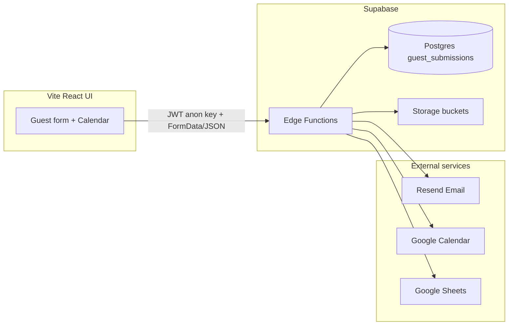

# Guest Form Management — Project Documentation

This document describes the **guest-form-management** codebase as implemented in the repository: purpose, architecture, data model, API surface, UI flows, integrations, environment configuration, and known product notes (including items tracked in `docs/TODOS.md` that are not yet built).

---

## 1. Purpose and product context

The application supports **short-term rental guest onboarding** for a specific unit (**Monaco 2604**, **Kame Home** branding). Guests complete a **Guest Advice / Authorization Form (GAF)**-style submission that includes:

- Identity and contact details
- Stay dates and guest counts
- Optional parking and pet information with uploads
- Required uploads: **payment receipt** and **valid ID**

Submissions are persisted in **Supabase Postgres**, files go to **Supabase Storage**, and optional automation sends **emails (Resend)**, creates/updates **Google Calendar** events, and appends/updates rows in **Google Sheets**—all behind **Supabase Edge Functions** (Deno).

---

## 2. High-level architecture

- **UI**: React 18, Vite, React Router, React Hook Form + Zod, Tailwind, Radix/shadcn-style components, Sonner toasts.
- **Backend**: No separate Node API in-repo; `package.json` lists an `api` workspace but **no `api/` directory exists**—the real backend is **Supabase Edge Functions** under `supabase/functions/`.
- **Local dev**: `dev.sh` runs `supabase start`, `supabase functions serve` with `supabase/.env.local`, then `cd ui && npm run dev`.

---

## 3. Repository layout

| Path                   | Role                                                |
| ---------------------- | --------------------------------------------------- |
| `ui/`                  | Vite SPA: guest form, calendar picker, success page |
| `supabase/migrations/` | Postgres schema, RLS, storage policies              |
| `supabase/functions/`  | Deno edge functions + `_shared` modules             |
| `supabase/config.toml` | Local Supabase + function JWT settings              |
| `dev.sh`               | Convenience script for local stack                  |
| `docs/TODOS.md`        | Product backlog and completed tasks                 |

**UI entry**: `ui/src/main.tsx` → `App.tsx` → `routes/index.tsx` → `features/guest-form/routes/index.tsx`.

---

## 4. Routing and pages (current behavior)

Defined in `ui/src/features/guest-form/routes/index.tsx` (public) and `ui/src/features/admin/routes/index.tsx` (admin). Both are merged in `ui/src/routes/index.tsx`.

| Route        | Component               | Guard          | Notes                                                                                                                                 |
| ------------ | ----------------------- | -------------- | ------------------------------------------------------------------------------------------------------------------------------------- |
| `/`          | `CalendarPage`          | public         | Default landing; **Proceed** → `/form?checkInDate=&checkOutDate=`                                                                     |
| `/form`      | `GuestFormPage`         | public         | Guest form (dates from URL and/or `?bookingId=`). With **no** `bookingId` and **no** `checkInDate` + `checkOutDate`, redirects to `/` |
| `/calendar`  | `CalendarPage`          | public         | Same as `/`                                                                                                                           |
| `/success`   | `GuestFormSuccessPage`  | public         | Post-submit summary; requires `?bookingId=`                                                                                           |
| `/sign-in`   | `SignInPage`            | public         | Google OAuth entry for admins. Redirects signed-in admins to `?redirect=` target (default `/bookings`).                               |
| `/bookings`  | `BookingsListPage`      | `RequireAdmin` | Phase 1 — read-only list (search, status chips, flags, 25/50/100 pagination). URL search params are the source of truth for filters.  |

**Legacy links:** URLs like `/?bookingId=<uuid>` (e.g. older Google Calendar descriptions) are handled on `CalendarPage`: the app **`replace`** navigates to **`/form?bookingId=...`** (other query params are preserved).

---

## 5. User flows

### 5.1 New booking (typical production)

1. User opens **`/`** or **`/calendar`**, selects check-in and check-out (respecting booked ranges and past dates), then **Proceed** → navigates to **`/form?checkInDate=YYYY-MM-DD&checkOutDate=YYYY-MM-DD`**.
2. On `GuestForm`, a **new `bookingId`** is generated client-side (`crypto.randomUUID()`) when `bookingId` is absent from the URL.
3. User fills the form; files are appended to `FormData` with deterministic names via `handleFileUpload` in `ui/src/utils/helpers.ts`.
4. Submit calls **`POST {VITE_API_URL}/submit-form`** with Supabase anon key headers. In production (no dev controls), query flags default to **all side effects enabled** (save DB, storage, PDF, email, calendar, sheets) and `testing` follows `?testing=true` if present.
5. Edge function checks **date overlap** against active (non-canceled) rows, then processes.
6. On success, UI navigates to **`/success?bookingId=...`** with `location.state.bookingData` for the summary card.

### 5.2 View / update existing booking

1. URL is **`/form?bookingId=<uuid>`** (or legacy **`/?bookingId=<uuid>`**, which redirects to `/form` as above). The id is sanitized on client and server if query junk is appended.
2. `GuestForm` loads data via **`GET {VITE_API_URL}/get-form/{bookingId}`** and hydrates the form; image fields use URLs from the API for previews.
3. On submit, server loads raw row, runs **`compareFormData`**; if **no changes**, returns `{ success: true, skipped: true }` and UI still redirects to success (no DB/email/calendar/sheet work).
4. If changes exist, row is updated; emails distinguish **update** vs new; calendar event is found by `privateExtendedProperty` `bookingId`, deleted, recreated; sheet row is located by booking ID in column A and updated.

### 5.3 Calendar and availability

- **`get-booked-dates`** returns `{ id, checkInDate, checkOutDate }` for rows where `status !== 'canceled'` and **check-out date ≥ start of today** (server-side filter). Dates are normalized to `YYYY-MM-DD` in the JSON payload.
- **Overlap rule** (submit + DB check): ranges overlap unless **same-day turnover** is allowed: overlap is false if new check-in equals existing check-out or new check-out equals existing check-in (see `DatabaseService.checkOverlappingBookings`).
- **Canceled** bookings (`status === 'canceled'`) do not block dates and do not appear in booked-date lists.

### 5.4 Dev / testing UX

- **`VITE_NODE_ENV === 'production'`** is treated as production build; otherwise non-production.
- **Dev controls** show when `!isProduction` **or** `?testing=true` **or** `?dev=true`.
- Checkbox panel toggles query params on submit: `saveToDatabase`, `saveImagesToStorage`, `generatePdf`, `sendEmail`, `updateGoogleCalendar`, `updateGoogleSheets` (each `true`/`false`). Defaults: in dev/testing panel, **all start unchecked** except when `isProduction && isDevMode` (then they default true—a niche case for prod+`dev=true`).
- **`?testing=true`**: prefixes `[TEST]` on primary guest name in DB, `TEST_` on storage object names, test banners/prefixes in email subjects, `[TEST]` on calendar titles and sheet name columns, etc.
- **Production + `testing=true` + send email**: server **forces** `sendEmail` off when `DENO_DEPLOYMENT_ID` is set (deployed edge).
- **Cleanup**: `POST /cleanup-test-data` with `{ confirm: true }` removes test-tagged data across DB/storage/calendar/sheets (see function implementation).
- **Cancel booking (dev tools)**: `POST /cancel-booking` with `{ bookingId, confirm: true }` sets DB `status` to `canceled`, prefixes calendar summary with **`[CANCELED]`** (legacy bracketed prefix) and sets red color, sets sheet column **AK** to `Canceled`—**does not delete** assets or DB row. **New booking flow** (see `docs/NEW_FLOW_PLAN.md` §1.4) switches canceled calendar titles to **`CANCELED - …` with no brackets** (except optional `[TEST] ` for test bookings).

### 5.5 Error recovery (guest-friendly)

On submit error, Sonner toast can include **copy booking info** (text format from `formatBookingInfoForClipboard`). Dev controls include **paste from clipboard** to repopulate fields using `parseBookingInfoFromClipboard` (files still required).

---

## 6. Data model (`guest_submissions`)

Created in migrations; key points:

- **`id`**: UUID; client may supply on insert (form sends predetermined id).
- **Dates**: Stored as **TEXT** (`MM-DD-YYYY` in DB via `transformFormToSubmission`); API and overlap logic accept normalization between `MM-DD-YYYY` and `YYYY-MM-DD`.
- **Times**: Stored as human-readable strings (DB defaults `02:00 PM` / `11:00 AM` in original migration; UI uses 24h in schema defaults then displays).
- **`status`**: Added in `20250113000000_add_booking_status.sql` — values used in code: **`booked`** (active), **`canceled`**. Comments mention “booked \| canceled”; sheet uses **Booked** / **Canceled** labels.
- **Pets**: `pet_type` added in later migration; URLs for vaccination and pet image in storage.
- **Constraints**: Check constraints on email pattern, guest counts, parking conditional fields, pet conditional fields, date ordering, time regex (see migration).
- **New-flow columns (Phase 0, additive — not yet consumed by Edge Functions).** Migrations `20260501000002`–`20260501000005` + `20260501000009` add nullable columns for pricing (`booking_rate`, `down_payment`, `balance`, `security_deposit`), parking (`parking_rate_guest`, `parking_rate_paid`, `parking_endorsement_url`, `parking_owner_email`), pets (`pet_fee`), SD refund stage (`sd_additional_expenses NUMERIC[]`, `sd_additional_profits NUMERIC[]`, `sd_refund_amount`, `sd_refund_receipt_url`), approval PDFs (`approved_gaf_pdf_url`, `approved_pet_pdf_url`), audit (`status_updated_at`, `settled_at`), and `is_test_booking`. New tables: `processed_emails`, `gmail_listener_state`. Backup snapshot: `guest_submissions_backup_20260501`. See `docs/NEW_FLOW_PLAN.md` §2 and `docs/MIGRATION_RUNBOOK.md`.

---

## 7. Storage

Buckets and MIME types are declared in `supabase/config.toml` (e.g. `payment-receipts`, `pet-vaccinations`); additional buckets appear in SQL migrations (`pet-images`, etc.). `UploadService` maps files to buckets and public URLs.

**New-flow buckets (Phase 0, provisioned but not yet written):** `parking-endorsements` (public), `approved-gafs` (private), `approved-pet-forms` (private), `sd-refund-receipts` (private). Defined in `20260501000006`–`20260501000008`. See `docs/NEW_FLOW_PLAN.md` §2.

---

## 8. Edge functions (API surface)

| Function            | Method | Purpose                                                                                          |
| ------------------- | ------ | ------------------------------------------------------------------------------------------------ |
| `submit-form`       | POST   | Multipart form processing, overlap check, change detection, DB/storage/PDF/email/calendar/sheets |
| `get-form`          | GET    | Path: `/get-form/{bookingId}` — returns JSON form payload                                        |
| `get-booked-dates`  | GET    | Future, non-canceled booking ranges                                                              |
| `cancel-booking`    | POST   | JSON body; soft-cancel + calendar/sheet markers                                                  |
| `cleanup-test-data` | POST   | JSON `{ confirm: true }`; scrub test artifacts                                                   |

`supabase/config.toml` explicitly sets **`verify_jwt = false`** for `submit-form`, `get-booked-dates`, and `get-form`**. Other functions rely on defaults—callers still pass **anon key\*\* from the UI as `apikey` and `Authorization: Bearer`.

**CORS**: `_shared/cors.ts` builds headers per request origin.

---

## 9. Integrations detail

### 9.1 Email (Resend)

- **GAF** mail: HTML body, optional PDF attachment, subject includes date range, **urgent** styling for same-day check-in (Philippines timezone), **update** copy when `isUpdate`.
- **Pet** mail: separate flow when pet fields complete; attachments/links for pet PDF and images.
- From address uses **kamehomes.space** domain (see `emailService.ts`).

### 9.2 Google Calendar

- Service account JWT → access token.
- Events store **`bookingId`** in `extendedProperties.private` for idempotent find/update/delete.
- Description includes link to **`https://kamehomes.space/form?bookingId=...`** with `&testing=true` or `&dev=true` for non-testing mode (see `createEventData` in `_shared/calendarService.ts`).
- **Cancel**: search by `privateExtendedProperty`, patch summary **`[CANCELED] …`** today (`colorId: 11`); new flow uses **`CANCELED - …`** summaries + purple `colorId` per `docs/NEW_FLOW_PLAN.md` §1.4.

### 9.3 Google Sheets

- Column **A** = `bookingId`; wide row up through **AK** (`Status`: Booked/Canceled).
- Append new row or **PUT** update row `A{row}:AK{row}` when booking exists.
- **`GOOGLE_SPREADSHEET_ID`**: use a dev spreadsheet in local `.env` if desired (`docs/TODOS.md` mentions sprmkedev—**not hardcoded** in repo).

### 9.4 PDF

- `_shared/pdfService.ts` generates main guest PDF and optional pet PDF (called from `submit-form` when `generatePdf=true`).

---

## 10. Form validation (UI)

`ui/src/features/guest-form/schemas/guestFormSchema.ts` (Zod):

- **Phone**: Philippines `09` + 9 digits (11 total).
- **Address**: `City, Province` pattern.
- **Guests**: dynamic requirement for `guest2Name`…`guest4Name` based on adults + children.
- **Parking / pets**: conditional required fields.
- **Same-day stay**: check-out time must be after check-in time when dates equal.
- **Files**: `paymentReceipt` and `validId` required as `File`; pet files required when `hasPets`.

---

## 11. Environment variables

### UI (`ui/.env` / Vite)

- `VITE_API_URL` — Supabase functions base URL (local: `http://127.0.0.1:54321/functions/v1` pattern; production: project functions URL).
- `VITE_SUPABASE_URL` — same functions base URL used by the Supabase JS client; project URL is derived by stripping `/functions/v1`.
- `VITE_SUPABASE_ANON_KEY` — public anon key (sent with function requests and used by the Supabase JS client).
- `VITE_NODE_ENV` — `production` toggles production-only behavior in the form.
- `VITE_ADMIN_ALLOWED_EMAILS` *(Phase 1)* — comma-separated Google emails allowed to open `/bookings`. **UX gate only** — the server-side allow list (Phase 3) is authoritative. If unset, the UI denies every account.
- `VITE_SUPABASE_PROJECT_URL` *(optional, Phase 1)* — override for the Supabase project URL when the auto-derivation from `VITE_SUPABASE_URL` is unwanted.

### Edge (`supabase/.env.local` / hosted secrets)

- `SUPABASE_URL`, `SUPABASE_SERVICE_ROLE_KEY`
- `RESEND_API_KEY`, `EMAIL_TO`, `EMAIL_REPLY_TO`
- `GOOGLE_SERVICE_ACCOUNT` (JSON string), `GOOGLE_CALENDAR_ID`, `GOOGLE_SPREADSHEET_ID`
- Optional: `ENVIRONMENT` / `DENO_ENV` for `isDevelopment()` in shared utils

---

## 12. Deployment

- `ui/vercel.json`: SPA rewrites to `index.html`, Vite build output `dist`.
- Supabase: deploy functions + run migrations; configure secrets in dashboard.

---

## 13. Roadmap / gaps (from `docs/TODOS.md` vs code)

Examples **not** fully reflected in code or only partially done:

- **`admin=true`**: mentioned for owner review workflow; **no `admin` handling in UI** at time of writing.
- Multi-step stepper + preview; image optimization before upload; AI validation of uploads; carousel hero; query-param persistence across routes; richer **booking status** workflow (PENDING REVIEW, etc.).
- Calendar event still appends `dev=true` in some branches when not testing—`docs/TODOS.md` flags removing `dev=true` from links.

Use **`docs/TODOS.md`** as the live product backlog; this doc describes **current** implementation unless a section explicitly calls out planned work.

---

## 14. Known implementation notes

- **`compareFormData`** (server) compares many scalar fields and file re-uploads; **`petType` is not currently in the compared field list**, so changing only pet type might not trigger an update pipeline—extend the list in `_shared/utils.ts` if that becomes a product requirement.

---

## 15. Key files quick reference

| Concern                            | Location                                                  |
| ---------------------------------- | --------------------------------------------------------- |
| Submit pipeline                    | `supabase/functions/submit-form/index.ts`                 |
| DB + overlap + FormData processing | `supabase/functions/_shared/databaseService.ts`           |
| Field-level diff for updates       | `supabase/functions/_shared/utils.ts` (`compareFormData`) |
| Form UI                            | `ui/src/features/guest-form/components/GuestForm.tsx`     |
| Validation schema                  | `ui/src/features/guest-form/schemas/guestFormSchema.ts`   |
| Clipboard backup                   | `ui/src/utils/bookingFormatter.ts`                        |
| Calendar page                      | `ui/src/features/guest-form/pages/CalendarPage.tsx`       |
| Date helpers / overlap helpers     | `ui/src/utils/dates.ts`                                   |

---

_Last updated from repository analysis (internal documentation)._
