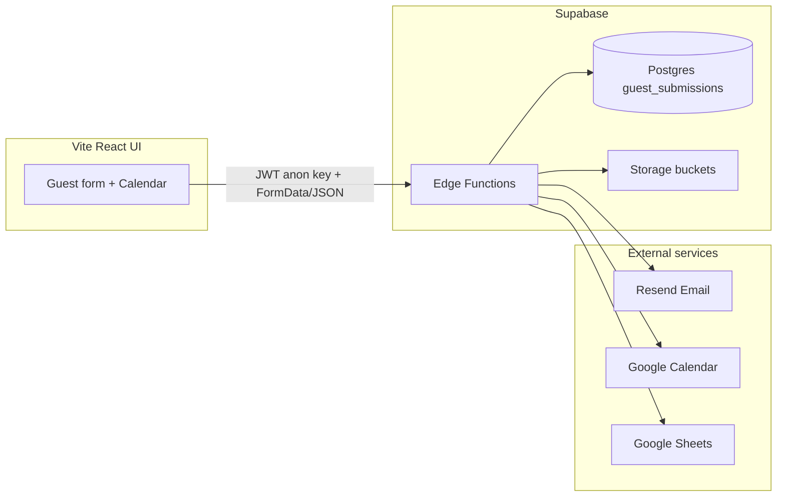

# Guest Form Management — Project Documentation

This document describes the **guest-form-management** codebase as implemented in the repository: purpose, architecture, data model, API surface, UI flows, integrations, environment configuration, and known product notes (including items tracked in [`docs/todos/`](./todos/README.md) that are not yet built).

> **Looking for a non-technical walkthrough?** See [`docs/reference/booking-flow-guide-for-admin.md`](reference/booking-flow-guide-for-admin.md) (also available as [PDF](reference/booking-flow-guide-for-admin.pdf)) — a plain-English guide to every booking status, what the admin does at each step, what the cron jobs / Gmail listener do automatically, and the calendar color cheat sheet. Forward this to ops / Airbnb admin.

---

## 1. Purpose and product context

The application supports **short-term rental guest onboarding** for a specific unit (**Monaco 2604**, **Kame Home** branding). Guests complete a **Guest Advice / Advise Form (GAF)**-style submission that includes:

- Identity and contact details
- Stay dates and guest counts
- Optional parking and pet information with uploads
- Required uploads: **downpayment receipt** (Facebook bookings); **valid government ID per guest aged 18+** (up to 5 guests; ages collected per guest; adults/children derived from ages ≤3 = child; fifth guest capped at age 3; Azure allows 4 adults + 1 child — UI shows Azure reminder when the 5th guest slot is added or when more than 4 adults)

Submissions are persisted in **Supabase Postgres**, files go to **Supabase Storage**, and optional automation sends **emails (Resend)**, creates/updates **Google Calendar** events, and appends/updates rows in **Google Sheets**—all behind **Supabase Edge Functions** (Deno).

---

## 2. High-level architecture


```mermaid
flowchart LR
  subgraph client [Vite React UI]
    UI[Guest form + Calendar]
  end
  subgraph supabase [Supabase]
    EF[Edge Functions]
    DB[(Postgres guest_submissions)]
    ST[Storage buckets]
  end
  subgraph external [External services]
    R[Resend Email]
    GC[Google Calendar]
    GS[Google Sheets]
  end
  UI -->|JWT anon key + FormData/JSON| EF
  EF --> DB
  EF --> ST
  EF --> R
  EF --> GC
  EF --> GS
```

- **UI**: React 18, Vite, React Router, React Hook Form + Zod, Tailwind, Radix/shadcn-style components, Sonner toasts.
- **Backend**: Supabase Edge Functions under `supabase/functions/` (no separate Node API package).
- **Local dev**: `dev.sh` runs **`scripts/dev/run-with-ui-dev-env.sh`** before **`supabase start`**, then **`scripts/dev/build-local-functions-env.sh`** + **`supabase functions serve`** so `GOOGLE_CLIENT_ID` / `GOOGLE_CLIENT_SECRET` from **`ui/.env.development`** are in the shell when the CLI resolves `config.toml` `env(...)`. Edge secrets come from a merged **`supabase/.temp/functions-serve.env`**. Then `cd ui && bun run dev`. **Package manager:** **Bun** (`bun install`, `bun run …`). **UI-only (no Docker):** `./dev.sh --ui-only` or `SKIP_SUPABASE=1 ./dev.sh` — point `ui/.env.development` at a hosted Supabase project. Do not start a second `supabase functions serve` in parallel (Docker edge-runtime name conflict). **`bun run dev:api`** uses the same merged env file.
- **502 on `/functions/v1/*` (Kong “Bad Gateway”)**: Usually Kong is still targeting an old **Docker edge-runtime** IP after **`bun run db:reset`** or a partial restart while `./dev.sh` is running. **`bun run stop:supabase`** then **`./dev.sh`** resyncs Kong with the host `functions serve` process. Confirm with `docker logs supabase_kong_<project> 2>&1 | tail -20` — look for `Host is unreachable` toward `172.x.x.x:8081`.
- **CLI env**: `config.toml` references `GOOGLE_CLIENT_*` from the process environment. Prefer **`bun run status:supabase`**, **`bun run stop:supabase`**, **`bun run db:reset`**, **`bun run start:supabase`**: they run **`bunx supabase@latest`** via `scripts/dev/run-with-ui-dev-env.sh`, which also loads `ui/.env.development`. A **global** `supabase` on PATH (e.g. v2.40.x) is easy to leave outdated and break Postgres 17 migrations (`storage.buckets` missing).
- **Nuclear local reset**: **`bun run stop:supabase:clean`** stops the stack and **deletes Docker data volumes** (fixes sticky Storage `migrations_name_key` issues when the CLI keeps **restoring from backup**). Then `bun run start:supabase`. All local DB data is lost until you `db reset` / migrations / optional prod sync.
- **Cursor agents:** See **`.cursor/rules/README.md`** (rules, skills, subagents index).
- **Docker RAM (local Supabase):** Full stack needs Docker Desktop. To reduce memory: (1) **`./dev.sh --ui-only`** when only editing UI against a hosted project; (2) **`bun run stop:supabase`** when done for the day; (3) Docker Desktop → **Settings → Resources** — lower CPU/RAM if you only need the UI most of the time; (4) avoid leaving `./dev.sh` + ngrok + second IDE running when not testing webhooks. Supabase local typically uses **~2–4 GB** depending on images running.
- **CI:** GitHub Actions **`.github/workflows/ci.yml`** — `bun install`, `type-check`, `lint`, `build` on push/PR.

---

## 3. Repository layout

| Path                             | Role                                                           |
| -------------------------------- | -------------------------------------------------------------- |
| `ui/`                            | Vite SPA: guest form, calendar picker, success page            |
| `supabase/migrations/`           | Postgres schema, RLS, storage policies                         |
| `supabase/functions/`            | Deno edge functions + `_shared` modules                        |
| `supabase/config.toml`           | Local Supabase + function JWT settings                         |
| `scripts/`                       | Dev, deploy, data sync, integrations — see `scripts/README.md` |
| `docs/`                          | Doc index (`docs/README.md`), guides, operations runbooks      |
| `dev.sh`                         | Local stack (Docker + Supabase + UI) or `--ui-only`            |
| `.cursor/rules/architecture.mdc` | Feature folders, shared utils, import conventions              |
| `.fallow/baseline.json`          | Fallow dead-code regression baseline (optional CI gate)        |

**Dev tooling** (root): `bun run lint`, `lint:fix`, `type-check`, `check:filenames`, `format`, `format:check`. **Husky** runs lint-staged on commit and **commitlint** on commit messages. ESLint + Prettier configs live at repo root (Prettier) and `ui/eslint.config.js`. **VS Code:** `.vscode/tasks.json` (dev, Supabase, quality, deploy), `.vscode/launch.json` (Chrome debug), `.vscode/settings.json` (Bun UI + Deno edge functions). See **`.cursor/rules/architecture.mdc`** for folder conventions; **`docs/reference/project-structure.md`** for `features/guest/` vs `features/dashboard/`. Backlog: **[`docs/todos/README.md`](./todos/README.md)** (GitHub Issues; shipped archive in `docs/todos/shipped/`).

**UI entry**: `ui/src/main.tsx` → `App.tsx` → `routes/index.tsx` → merges `features/guest/routes`, `features/sd-form/routes`, `features/pay-parking/routes`, and `features/dashboard/routes`.

---

## 4. Routing and pages (current behavior)

Defined in `ui/src/features/guest/marketing/routes/index.tsx`, `ui/src/features/guest/property/routes/index.tsx` (operational guest flows under `/properties/:propertySlug/...`), and `ui/src/features/dashboard/**` (admin + tenancy). All are merged in `ui/src/routes/index.tsx`.

**Per-route operator guides:** **`docs/guides/routes/`** mirrors these URLs (index: **`docs/guides/routes/README.md`**). Update the matching guide when changing page behavior, save flows, or validation (see **`.cursor/rules/route-guides.mdc`**).

**Multi-tenancy (Phase 1):** Admin routes are nested under **`/org/:orgSlug/property/:propertySlug/...`** and **`/org/:orgSlug/parking/:parkingSlug/...`**. Each **organization** has exactly one **owner** (`organizations.owner_id` → `auth.users.id`); a user may **own at most one** org, and may be assigned to additional orgs as an invited **org admin** (`organization_members`) or **property member** (`property_members`). **`/org`** is a redirect hub (no picker): last-used org dashboard, else first org, else **`/onboarding`**. **`organizations.host_modes`** (`property` \| `parking`) and org-level **`/parkings`** list support parking inventory as a peer to properties. **Property-only members** have no org-scoped permissions (`ORG_PROPERTY_MEMBER_PERMISSIONS` is empty); org routes redirect to their assigned property and the sidebar org name is read-only. Parking v1: org owner + **`org:parkings:*`** only (no `parking_members`). Legacy flat paths redirect to the last-used or first org/property/parking. New users with no org land on **`/onboarding`** (host type: property, parking, both, or add later). Property-scoped admin edge functions use **`verifyPropertyAccess`**; parking-scoped use **`resolveScopedParkingAccess`**. **`list-organizations`** returns owned orgs plus orgs where the user is an org admin or has active property membership (each row includes **`accessKind`**); **`list-properties`** / **`list-parkings`** return org assets for owners/org admins.

**Property settings UI:** **`/org/:orgSlug/property/:propertySlug/settings`** — `PropertySettingsCard` (`AdminSectionNavLayout`): **Basic information**, **Photos & Videos** (drag-reorder gallery, primary image, upload/delete via **`upload-property-media`** → Storage bucket **`property-media`** + **`properties.settings.media`**; max **9 images** / **1 video**, 5 MB images / 25 MB video), **Property details**, **Amenities**, **Location & Access** (Google Places search + interactive map pin; persists **`properties.address`** plus **`properties.settings`** `latitude`, `longitude`, `mapsUrl`, `placeId`, and parsed city/province/country/zip), **Payment**, **Building Forms**, **Integrations** (Google OAuth + nested Gmail/Calendar/Sheet status, per-property **AI services** test, Telegram configure links), **Danger zone** (archive → `INACTIVE`; delete via **`delete-property`** when no bookings). **Saves today:** profile DB columns via **`update-property`** + **`properties.settings`** JSONB merge + operational fields via **`app-settings`**. Property **name** is unique per organization (case-insensitive; migration **`20260703160000_properties_org_name_unique.sql`**). Condominium tower options are driven by selected residence (`propertyResidences.ts`). Operator guide: **`docs/guides/routes/org/property/settings.md`** (index: **`docs/guides/routes/README.md`**).

**Team (shipped):** Property team at **`/org/:orgSlug/property/:propertySlug/team`** — **`property-team-*`** + **`usePropertyTeam`** ([property team guide](./guides/routes/org/property/team.md)). Org team at **`/org/:orgSlug/team`** — **`org-team-*`** + **`useOrgTeam`** ([org team guide](./guides/routes/org/team.md)). Roles: property **Manager / Staff / Viewer** (+ custom); org **Owner** (virtual) + **Admin**. Invite emails + **`/accept-invite`** (property or `scope=org`).

**Staff access:** **Org owner**, **org ADMIN**, and **platform admin** retain implicit full property access; **active `property_members`** rows grant scoped permissions via JSONB.

**Property scoping (Phase 1c–1d):** Admin list/dashboard/finance/maintenance/**property settings** endpoints accept **`?property_id=<uuid>`** (UI sends it from route context via `usePropertyIdParam` / `scopedFunctionsUrl`). **Org settings** (`org-settings`, `upload-org-settings-asset`) accept **`?org_id=`** or **`?org_slug=`** (`scopedOrgFunctionsUrl`). Server resolves with `resolveAdminPropertyId` / `resolveAdminOrgId` — validates ownership when explicit, otherwise first owned property/org. Booking-scoped admin actions verify the booking row belongs to the resolved property. **`upload-app-settings-asset`** and **`google-mail-oauth-*`** persist per-property assets/tokens. **`upload-org-settings-asset`** persists team logo per org. Public **`get-booked-dates`** and **`submit-form`** accept **`?property=<slug>`** or **`?property_id=`** (`resolvePublicPropertyId`; defaults to Monaco 2604 when omitted). Guest calendar/form forward **`?property=`** from the URL when present. Org **Properties** page and **`guestPublicPaths.ts`** build shareable calendar links as **`/calendar?property=<slug>`** (legacy **`/?property=`** redirects from the marketing landing).

**Phase 1e (shipped):** Scheduled jobs are property-aware. **`gmail-listener`** polls each Gmail-connected property (migration **`20260629220000_gmail_listener_state_per_property.sql`**). **`sd-refund-cron`** resolves **`app_settings` per booking**. All five **telegram crons** iterate **`properties`** and scope settings, bookings, or line items by **`property_id`**. Event-driven Telegram notifies (submit, cancel, admin uploads) load settings for the booking’s property. New booking asset uploads use **`{propertyId}/{bookingId}/{fileName}`** via **`bookingStoragePaths.ts`** (legacy URLs without the prefix still work).

**Phase 1f (shipped):** Per-property integration credentials (pattern aligned with **kame-ops** `integrations` table). Migration **`20260629160000_property_scoped_integration_credentials.sql`**: drops singleton `id = 1` CHECK on settings tables; adds **`bot_token_encrypted`** / **`chat_id_encrypted`** on each **`telegram_*_settings`** row (AES-256-GCM via **`GMAIL_OAUTH_TOKEN_ENCRYPTION_KEY`**); **`google_calendar_id`** / **`google_spreadsheet_id`** on **`app_settings`**. Runtime resolution is **DB-only** for operator settings: **`propertyTelegramCredentials.ts`**, **`propertyGoogleConfig.ts`**, **`appSettings.ts`**, **`propertyIntegrationStatus.ts`**, and **`emailService.ts`** (all workflow + notify emails resolve `app_settings` from `booking.property_id`). **`create-property`** calls **`seedPropertySettings`**. Marketing/staff scheduled sends match each property’s Manila schedule inside a shared **5-min pg_cron** dispatcher (`ensure_telegram_multi_property_cron_dispatch`). Admin UI: all five Telegram settings pages expose bot token + chat id; Settings → Integrations shows **`propertyIntegrations`** (Property / Missing) + **`platformSecrets`** (shared Edge env only).

**Phase 2g (shipped):** Settings → **Connect Google** runs one OAuth consent for **`gmail.readonly`**, **`calendar`**, and **`spreadsheets`** (stored refresh token per property in **`gmail_mail_integration`**). On first connect, **`google-mail-oauth-callback`** auto-creates a property calendar and spreadsheet when IDs are empty (`propertyGoogleOAuthProvision.ts`), then saves IDs on **`app_settings`**. **`propertyGoogleApiAuth.ts`** prefers the property’s user OAuth access token for Calendar/Sheets API calls; **`GOOGLE_SERVICE_ACCOUNT`** remains a legacy fallback when OAuth is absent. No manual Calendar/Sheet ID inputs in admin UI — Connect Google is the only operator path. **`propertyGoogleIntegrationSeed.ts`**: **`create-property`** copies an existing org property’s encrypted Gmail token and provisions calendar/sheet for the new property when a sibling is already connected. Property **dashboard** **Needs attention** strip includes a **Connect Google** chip until Google + calendar + sheet are ready; onboarding / add-property flows land on **Settings**.

**Org dashboard (shipped):** **`/org/:orgSlug/dashboard`** — org-wide KPIs, revenue/bookings area chart (working toggle), booking status donut (canonical workflow statuses), recent bookings, pending actions, and properties performance. **`BookingDateRangeFilter`** in the header (same as property dashboard). Data from **`dashboard-stats?org_slug=…&from=&to=`**.

**Phase 2 — optional hardening (backlog):** Postgres RLS tightening on bookings/settings (admin scoping today is edge-function + ownership checks); drop Monaco default when **`property`** cannot be resolved on public guest APIs. Google Cloud OAuth consent must include Calendar + Sheets scopes for the Web client.

| Route                                                                     | Component                    | Guard                       | Notes                                                                                                                                                                                                                                                                                                                                                                                                                                                                                                                                                                                                                                                                                                                                                                                                                                                                                                                                                                                                                                                                                                                                                                                                                                                                                                                                                                                                                                                                                                                                                                                                                                                                                        |
| ------------------------------------------------------------------------- | ---------------------------- | --------------------------- | -------------------------------------------------------------------------------------------------------------------------------------------------------------------------------------------------------------------------------------------------------------------------------------------------------------------------------------------------------------------------------------------------------------------------------------------------------------------------------------------------------------------------------------------------------------------------------------------------------------------------------------------------------------------------------------------------------------------------------------------------------------------------------------------------------------------------------------------------------------------------------------------------------------------------------------------------------------------------------------------------------------------------------------------------------------------------------------------------------------------------------------------------------------------------------------------------------------------------------------------------------------------------------------------------------------------------------------------------------------------------------------------------------------------------------------------------------------------------------------------------------------------------------------------------------------------------------------------------------------------------------------------------------------------------------------------- |
| `/about`, `/contact`                                                      | _(nav only)_                 | public                      | **`/contact`** — footer link only (no page). **`/about`** removed from main nav; replaced by **`/parkings`**.                                                                                                                                                                                                                                                                                                                                                                                                                                                                                                                                                                                                                                                                                                                                                                                                                                                                                                                                                                                                                                                                                                                                                                                                                                                                                                                                                                                                                                                                                                                                                                                |
| `/`                                                                       | `GuestLandingPage`           | public                      | **Marketing home** (PMA port). **`/?property=`** redirects to **`/properties/:slug/calendar`**. Guide: **`docs/guides/routes/index-landing.md`**.                                                                                                                                                                                                                                                                                                                                                                                                                                                                                                                                                                                                                                                                                                                                                                                                                                                                                                                                                                                                                                                                                                                                                                                                                                                                                                                                                                                                                                                                                                                                            |
| `/for-hosts`                                                              | `ForHostsPage`               | public                      | Host marketing with a 54-second, nine-chapter interactive Remotion dashboard tour (Edge TTS narration, muted by default + unmute), onboarding steps, host reviews, and CTAs → **`/for-hosts/login`**. Host-mode header links anchor to Features / How It Works / Reviews. Guide: **`for-hosts.md`**.                                                                                                                                                                                                                                                                                                                                                                                                                                                                                                                                                                                                                                                                                                                                                                                                                                                                                                                                                                                                                                                                                                                                                                                                                                                                                                                                                                                         |
| `/services`                                                               | `ServicesPage`               | public                      | **Services coming soon** — UI-only preview; listing search morph, decorative service chips, no API or persistence. Guide: **`services.md`**.                                                                                                                                                                                                                                                                                                                                                                                                                                                                                                                                                                                                                                                                                                                                                                                                                                                                                                                                                                                                                                                                                                                                                                                                                                                                                                                                                                                                                                                                                                                                                 |
| `/properties`                                                             | `PropertiesListPage`         | public                      | Property browse — location-grouped carousels (mock). Guide: **`properties.md`**.                                                                                                                                                                                                                                                                                                                                                                                                                                                                                                                                                                                                                                                                                                                                                                                                                                                                                                                                                                                                                                                                                                                                                                                                                                                                                                                                                                                                                                                                                                                                                                                                             |
| `/properties/in/:location`                                                | `PropertiesLocationPage`     | public                      | Flat list for one place (`tagaytay`, `makati`, …). Unknown slug → `/properties`.                                                                                                                                                                                                                                                                                                                                                                                                                                                                                                                                                                                                                                                                                                                                                                                                                                                                                                                                                                                                                                                                                                                                                                                                                                                                                                                                                                                                                                                                                                                                                                                                             |
| `/parkings`                                                               | `ParkingsListPage`           | public                      | Parking browse — location-grouped carousels (mock). Guide: **`parkings.md`**.                                                                                                                                                                                                                                                                                                                                                                                                                                                                                                                                                                                                                                                                                                                                                                                                                                                                                                                                                                                                                                                                                                                                                                                                                                                                                                                                                                                                                                                                                                                                                                                                                |
| `/parkings/in/:location`                                                  | `ParkingsLocationPage`       | public                      | Flat grid for one city (`san-fernando-city`, `tagaytay`, …). Unknown slug → `/parkings`.                                                                                                                                                                                                                                                                                                                                                                                                                                                                                                                                                                                                                                                                                                                                                                                                                                                                                                                                                                                                                                                                                                                                                                                                                                                                                                                                                                                                                                                                                                                                                                                                     |
| `/properties/:propertySlug`                                               | `PropertyDetailPage`         | public                      | Listing detail + **`BookingCard`**.                                                                                                                                                                                                                                                                                                                                                                                                                                                                                                                                                                                                                                                                                                                                                                                                                                                                                                                                                                                                                                                                                                                                                                                                                                                                                                                                                                                                                                                                                                                                                                                                                                                          |
| `/properties/:propertySlug/calendar`                                      | `CalendarPage`               | public                      | **Operational** booking date picker; **Proceed** → **`/properties/:slug/form`**. Guide: **`calendar.md`**.                                                                                                                                                                                                                                                                                                                                                                                                                                                                                                                                                                                                                                                                                                                                                                                                                                                                                                                                                                                                                                                                                                                                                                                                                                                                                                                                                                                                                                                                                                                                                                                   |
| `/properties/:propertySlug/form`                                          | `GuestForm`                  | public                      | Guest booking form; optional params (`source`, `dev`, dates, `bookingId`). Guide: **`form.md`**.                                                                                                                                                                                                                                                                                                                                                                                                                                                                                                                                                                                                                                                                                                                                                                                                                                                                                                                                                                                                                                                                                                                                                                                                                                                                                                                                                                                                                                                                                                                                                                                             |
| `/properties/:propertySlug/success`                                       | `GuestFormSuccess`           | public                      | Post-submit summary; requires `?bookingId=`                                                                                                                                                                                                                                                                                                                                                                                                                                                                                                                                                                                                                                                                                                                                                                                                                                                                                                                                                                                                                                                                                                                                                                                                                                                                                                                                                                                                                                                                                                                                                                                                                                                  |
| `/properties/:propertySlug/sd-form`                                       | `SdFormPage`                 | public                      | Security deposit refund stepper (`KameFormBrandHeader`). Requires `?bookingId=`; same gates as before. Workflow emails link to **`/properties/:slug/sd-form?bookingId=`**.                                                                                                                                                                                                                                                                                                                                                                                                                                                                                                                                                                                                                                                                                                                                                                                                                                                                                                                                                                                                                                                                                                                                                                                                                                                                                                                                                                                                                                                                                                                   |
| `/properties/:propertySlug/parking/:bookingId`                            | `PayParkingPage`             | public                      | **Pay Parking** guest form. Admin opens with **`?admin=true`**. Guide: **`bookings/parking.md`**.                                                                                                                                                                                                                                                                                                                                                                                                                                                                                                                                                                                                                                                                                                                                                                                                                                                                                                                                                                                                                                                                                                                                                                                                                                                                                                                                                                                                                                                                                                                                                                                            |
| `/properties/:propertySlug/forms/:formId`                                 | `PropertyFormPage`           | public                      | Form builder preview — mock submit.                                                                                                                                                                                                                                                                                                                                                                                                                                                                                                                                                                                                                                                                                                                                                                                                                                                                                                                                                                                                                                                                                                                                                                                                                                                                                                                                                                                                                                                                                                                                                                                                                                                          |
| `/developments`                                                           | `DevelopmentsListPage`       | public                      | Developments browse — location-grouped carousels (mock). Guide: **`developments.md`**.                                                                                                                                                                                                                                                                                                                                                                                                                                                                                                                                                                                                                                                                                                                                                                                                                                                                                                                                                                                                                                                                                                                                                                                                                                                                                                                                                                                                                                                                                                                                                                                                       |
| `/developments/in/:location`                                              | `DevelopmentsLocationPage`   | public                      | Properties in one city/place grouped by development (`tagaytay`, …). Unknown slug → `/developments`.                                                                                                                                                                                                                                                                                                                                                                                                                                                                                                                                                                                                                                                                                                                                                                                                                                                                                                                                                                                                                                                                                                                                                                                                                                                                                                                                                                                                                                                                                                                                                                                         |
| `/developments/:slug`                                                     | `DevelopmentDetailPage`      | public                      | Development detail — hero, amenities, home + parking previews.                                                                                                                                                                                                                                                                                                                                                                                                                                                                                                                                                                                                                                                                                                                                                                                                                                                                                                                                                                                                                                                                                                                                                                                                                                                                                                                                                                                                                                                                                                                                                                                                                               |
| `/developments/:slug/properties`                                          | `DevelopmentPropertiesPage`  | public                      | All homes in development (location-browse layout).                                                                                                                                                                                                                                                                                                                                                                                                                                                                                                                                                                                                                                                                                                                                                                                                                                                                                                                                                                                                                                                                                                                                                                                                                                                                                                                                                                                                                                                                                                                                                                                                                                           |
| `/developments/:slug/parking` · `…/parking/category` · `…/parking/list`   | `DevelopmentParkingListPage` | public                      | Parking slot list (mock) — same layout as `…/properties` (hero search, collapsible parking filters, toolbar, **View Homes**); legacy `/category` and `/list` redirect to `/parking`.                                                                                                                                                                                                                                                                                                                                                                                                                                                                                                                                                                                                                                                                                                                                                                                                                                                                                                                                                                                                                                                                                                                                                                                                                                                                                                                                                                                                                                                                                                         |
| `/developments/:slug/forms/:formId`                                       | `DevelopmentFormPage`        | public                      | Development form preview (mock).                                                                                                                                                                                                                                                                                                                                                                                                                                                                                                                                                                                                                                                                                                                                                                                                                                                                                                                                                                                                                                                                                                                                                                                                                                                                                                                                                                                                                                                                                                                                                                                                                                                             |
| `/terms` · `/privacy`                                                     | `TermsPage` · `PrivacyPage`  | public                      | Static legal copy. Guide: **`legal.md`**.                                                                                                                                                                                                                                                                                                                                                                                                                                                                                                                                                                                                                                                                                                                                                                                                                                                                                                                                                                                                                                                                                                                                                                                                                                                                                                                                                                                                                                                                                                                                                                                                                                                    |
| `/calendar` · `/form` · `/success` · `/sd-form` · `/bookings/:id/parking` | redirects                    | public                      | **Legacy** — redirect to **`/properties/:slug/...`** when `?property=` is set; else **`/properties`**. See **`docs/guides/routes/README.md`**.                                                                                                                                                                                                                                                                                                                                                                                                                                                                                                                                                                                                                                                                                                                                                                                                                                                                                                                                                                                                                                                                                                                                                                                                                                                                                                                                                                                                                                                                                                                                               |
| `/for-hosts/login`                                                        | `HostLoginPage`              | public                      | Google OAuth + post-sign-in routing (onboarding or org dashboard). Guide: **`auth.md`**.                                                                                                                                                                                                                                                                                                                                                                                                                                                                                                                                                                                                                                                                                                                                                                                                                                                                                                                                                                                                                                                                                                                                                                                                                                                                                                                                                                                                                                                                                                                                                                                                     |
| `/sign-in`                                                                | redirect                     | public                      | → **`/for-hosts/login`** (preserves `?redirect=`). Guide: **`sign-in.md`**.                                                                                                                                                                                                                                                                                                                                                                                                                                                                                                                                                                                                                                                                                                                                                                                                                                                                                                                                                                                                                                                                                                                                                                                                                                                                                                                                                                                                                                                                                                                                                                                                                  |
| `/accept-invite`                                                          | `AcceptInvitePage`           | public                      | Query **`?token=`** (+ optional **`scope=org`**). GET **`get-team-invite-preview`** for org/property name + logo; Google sign-in if needed; POST **`accept-property-invite`** or **`accept-org-invite`**.                                                                                                                                                                                                                                                                                                                                                                                                                                                                                                                                                                                                                                                                                                                                                                                                                                                                                                                                                                                                                                                                                                                                                                                                                                                                                                                                                                                                                                                                                    |
| `/dashboard`                                                              | `DashboardPage`              | `RequireAdmin`              | **Admin home** — **BookingDateRangeFilter** in the page header drives sections via `?from`/`?to`: attention chips, KPI cards (net profit, total bookings as **occupied nights / period days**, occupancy, avg nightly rate — with period-over-period trends from **`dashboard-stats`**), then **FinanceTransactionsChart** (cash flow + category breakdown from `finance-line-items` + stay net via `finance-bookings`; stay net split evenly across occupied nights on the chart). **Net profit** (check-in in range): **operating host net** — booking rate + fees − parking owner rate + SD settlement adjustments; **security deposit collection and SD refund payout are never counted**. **Avg nightly rate** = Σ (`booking_rate` ÷ stay nights) over **occupied nights in period** (same as calendar **Price** pills). Below the chart, a two-column row shows **Transactions** (same `occurred_on` scope as Finance → Transactions; due badge counts unpaid Telegram-reminder rows only) and **BookingCalendarView** (mini occupancy grid synced to the dashboard date preset; tap a booking → `/bookings/:id`). Links to `/finance` and `/bookings?view=calendar`. Auto-refreshes every 60s. Default range: current calendar month (Asia/Manila).                                                                                                                                                                                                                                                                                                                                                                                                                                   |
| `/finance`                                                                | `FinancePage`                | `RequireAdmin`              | **Finance dashboard** — single page (no tabs): header **date range** + **Export report** (PDF); **summary cards** (total income, expenses, net profit, pending payments with period deltas); **Recharts** cash-flow + category breakdown (same as dashboard); unified **stays + `finance_line_items` transactions** ledger with table/card/calendar views, type/status/category filters, search, sort, pagination. Ledger columns: date, description, category, status (`completed` \| `pending` \| `canceled`), net amount. Stays attributed by **check-in date** (fixed; no period-basis dropdown). **Add Transaction** CRUD + recurrence + optional Telegram reminders (**Notifications → Finance**). Legacy **`?tab=*`** URLs still parse; **`?tab=settings`** → **`/notifications?module=finance`**.                                                                                                                                                                                                                                                                                                                                                                                                                                                                                                                                                                                                                                                                                                                                                                                                                                                                                    |
| `/pricing`                                                                | `PropertyPricingPage`        | `RequirePropertyPermission` | **Pricing** — calendar nightly rates + fee defaults (E2E). Weekday/weekend base rates in **`app_settings`**, per-date overrides in **`property_pricing_date_overrides`**, booked nights from live bookings. **`ReviewPricingForm`** loads saved defaults for new pricing review. Permissions: **`pricing:view`**, **`pricing:edit`**. API: **`property-pricing`**. Guide: **`docs/guides/routes/org/property/pricing.md`**.                                                                                                                                                                                                                                                                                                                                                                                                                                                                                                                                                                                                                                                                                                                                                                                                                                                                                                                                                                                                                                                                                                                                                                                                                                                                  |
| `/maintenance`                                                            | `MaintenancePage`            | `RequireAdmin`              | **Maintenance dashboard** — single-page layout (aligned with Finance): **BookingDateRangeFilter** in the page header (top right, beside **Export report** and **Add reminder**), **AdminMetricCard** summary KPIs (total, Telegram enabled, completed, pending), **by category** list, then reminders **toolbar** (search + per-page + table/card/calendar view) and CRUD list (`maintenance_items`). Maintenance Telegram defaults: **Notifications → Maintenance**. Items: **label**, **category**, **date** (`scheduled_on`), **repeat**, **notes**, optional per-row Telegram reminders. **Mark as done** sets `completed_at`. Calendar maps rows by **`scheduled_on`**. **Export report** (PDF). Legacy **`?tab=settings`** redirects to **`/notifications?module=maintenance`**.                                                                                                                                                                                                                                                                                                                                                                                                                                                                                                                                                                                                                                                                                                                                                                                                                                                                                                       |
| `/notifications`                                                          | `NotificationsPage`          | `RequireAdmin`              | **Unified Telegram settings** — Marketing, Staff, Operations, Finance, and Maintenance bots on one page (`AdminSectionNavLayout` module nav). Each module has independent Save/Reset. Deep link: **`?module=marketing\|staff\|operations\|finance\|maintenance`**. Guide: **`docs/guides/routes/org/property/notifications.md`**.                                                                                                                                                                                                                                                                                                                                                                                                                                                                                                                                                                                                                                                                                                                                                                                                                                                                                                                                                                                                                                                                                                                                                                                                                                                                                                                                                            |
| `/marketing`                                                              | redirect                     | `RequireAdmin`              | → **`/notifications?module=marketing`**                                                                                                                                                                                                                                                                                                                                                                                                                                                                                                                                                                                                                                                                                                                                                                                                                                                                                                                                                                                                                                                                                                                                                                                                                                                                                                                                                                                                                                                                                                                                                                                                                                                      |
| `/staff`                                                                  | redirect                     | `RequireAdmin`              | → **`/notifications?module=staff`**                                                                                                                                                                                                                                                                                                                                                                                                                                                                                                                                                                                                                                                                                                                                                                                                                                                                                                                                                                                                                                                                                                                                                                                                                                                                                                                                                                                                                                                                                                                                                                                                                                                          |
| `/operations`                                                             | redirect                     | `RequireAdmin`              | → **`/notifications?module=operations`**                                                                                                                                                                                                                                                                                                                                                                                                                                                                                                                                                                                                                                                                                                                                                                                                                                                                                                                                                                                                                                                                                                                                                                                                                                                                                                                                                                                                                                                                                                                                                                                                                                                     |
| `/settings`                                                               | `AdminSettingsPage`          | `RequireAdmin`              | Admin **Settings** — workspace integrations. **Gmail (listener):** nested under **Integrations → Google** in `AppSettingsCard` (`GmailMailIntegrationCard` embedded). Connects the mailbox **`gmail-listener`** polls for Azure approval PDFs. After OAuth, Google redirects to the SPA with `?gmail_connected=1` or `?gmail_error=`; this page shows a toast and strips those query params.                                                                                                                                                                                                                                                                                                                                                                                                                                                                                                                                                                                                                                                                                                                                                                                                                                                                                                                                                                                                                                                                                                                                                                                                                                                                                                 |
| `/bookings`                                                               | `BookingsListPage`           | `RequireAdmin`              | Phase 3 — PMA-style **stage summary cards** (Action Required, **Pending Docs**, Confirmed Stays, History; `?stage=`) + **status legend** + **table / card / kanban / calendar** views (`?view=table\|card\|kanban\|calendar`). Kanban workflow modal reuses **`WorkflowPanel`**. Search, status/sort/pet/parking + **date-range** filters, 31/50/100 pagination (kanban/calendar cap at 100). Guide: **`docs/guides/routes/org/property/bookings.md`**.                                                                                                                                                                                                                                                                                                                                                                                                                                                                                                                                                                                                                                                                                                                                                                                                                                                                                                                                                                                                                                                                                                                                                                                                                                      |
| `/bookings/:bookingId`                                                    | `BookingDetailPage`          | `RequireAdmin`              | Phase 3 — booking detail with `WorkflowPanel`. Header **Add pay parking** / **View pay parking** opens **`PayParkingModal`** (rate + parking check-in/out range + copy link / enter details) or navigates to **`/bookings/:bookingId/parking`** when vehicle details already exist. The panel renders a vertical **pipeline stepper** that hides parking/pet stages when those flags are off, plus a single guest-aware "Proceed to {next}" CTA, a "← Back to {previous}" recovery button, and "Cancel Booking". Sub-forms share the **`WorkflowSubFormCard`** shell (`ReviewPricingForm`, `ParkingRequestForm`, `GuestBalanceSettlementForm`, `SdRefundForm` settlement, and **Guest SD refund form** at checkout) and dev-control checkboxes (DB/Storage/PDF/each email/Calendar/Sheet) gate every transition. While **`READY_FOR_CHECKOUT`**, the same sub-form strip shows a **Guest SD refund form** card: short wait copy, a linked **SD Refund Link** label (opens **`/sd-form?bookingId=`** on the same SPA origin in a new tab), the same **18×18 inline copy** control as **`SdRefundForm`** guest refund rows (copies the full URL), and **Check for guest submission** (refetches the booking query so **`PENDING_SD_REFUND`** appears without a full page reload). A **Pricing** card below Stay Details is hidden while `status = PENDING_REVIEW`; after review it shows workflow rates, **balance after down (recorded)** vs line items, a **total guest balance** summary with **balance amount paid**, **total unpaid** or **Paid in full**, **downpayment** and **payment balance** receipts when present, and (when `COMPLETED`) SD refund settlement fields and receipt. |

**`/bookings/:bookingId` status pill:** The guest header card shows **Edit** only. **`StatusBadge`** lives on the **Progress** card header row in `WorkflowPanel` (next to the **Progress** label); for **`CANCELLED`** (no stepper), a **Status** strip shows the same badge.

**`/bookings/:bookingId` mobile layout (status ≠ `PENDING_REVIEW`):** Below `lg`, a compact **booking summary** (guest, status, stay line, flags, **Edit**, **View full booking details**) appears first; **Progress** (`WorkflowPanel`) is second so status actions stay above the fold. Guest/stay/pricing/documents/**Booking Meta** cards sit in a collapsible block (hidden until expanded; **Edit** auto-expands). **`PENDING_REVIEW`** keeps the original stacked layout (gate + full header/cards). Desktop `lg+` unchanged (details left, workflow + meta right).

**Pending review gate:** while **`status === PENDING_REVIEW`**, `PendingReviewWorkflowGate` wraps `WorkflowPanel` and shows a short confirmation + checkbox first; the full progress rail and workflow actions appear only after the admin confirms the guest form was reviewed. Session `sessionStorage` remembers the ack per booking for the browser session; it is keyed to **`status_updated_at`** (fallback **`created_at`**) so a new visit to **Pending Review** after a status-changing update (including revert from a later stage) requires confirming again.

**`SdRefundForm` (`PENDING_SD_REFUND` → `COMPLETED`):** **Pay now with GCash** uses `gcash://send?mobile=…&amount=…` when the net refund amount is positive: mobile is the on-file guest phone for `sd_refund_method = same_phone`, or **digits from `sd_refund_account_number`** when the guest chose **other bank** with **`sd_refund_bank = GCash`** (still requires ≥10 digits so the app link is usable). The guest-refund summary includes icon-only **copy-to-clipboard** controls beside phone (same-phone flow) and beside **Account name** / **Account number** (other-bank flow).

**`/bookings` data:** `useBookings` calls the **`list-bookings`** admin edge function (JWT required). Default sort is **`status_priority:asc`** (workflow order: SD refund → review → documents → checkout → check-in → completed → cancelled; **Pending Review** / **Pending Documents** tie-break by check-in nearest to today, Asia/Manila). Also supports **`check_in_date`** / **`created_at`** via `?sort=` (toolbar **More filters** → Sort by, or **Stay** column in table view). By default, **cancelled** and **completed** bookings are hidden; active stays (e.g. pending check-out, SD refund) remain visible even when check-in was yesterday or earlier. Completed rows can be surfaced via the **History** stage card or status filter; calendar/kanban auto-set `showCompletedBookings=true`. **Date range** lives in the page header (beside **New booking**), not the filter toolbar. When a **month / date range** is active (`from` / `to`), **`PENDING_REVIEW`** rows (and legacy **`booked`**) are **always included** even if check-in falls outside that range, so new submissions for future months stay visible at the top while browsing the current month. Server-side pagination; PostgREST fallback mirrors the same filter/sort logic.

**Admin Gmail reconnect UX:** `AdminLayout` wraps admin routes in **`GmailReconnectProvider`**, which polls **`google-mail-oauth-status`** (probes the stored refresh token via `getGmailAccessTokenUnified`). When **`needsReconnect`** is true (expired/revoked token) or Gmail is **not connected** (once per browser session, except on **`/settings`**), a **`GmailReconnectModal`** opens with **Connect Gmail** / **Reconnect Gmail** (OAuth via `google-mail-oauth-start`). Gmail poll, approval backfill, and transition errors that return **`needsReAuth`** or match reconnect copy also open the modal instead of toast-only. **`GmailMailIntegrationCard`** on **`/settings`** shows an amber warning when **`needsReconnect`**.

**`/bookings` views:** the page renders one of four layouts driven by the `?view=` query param:

| View       | When to use                            | Notes                                                                                                                                                                                                                                                                  |
| ---------- | -------------------------------------- | ---------------------------------------------------------------------------------------------------------------------------------------------------------------------------------------------------------------------------------------------------------------------- |
| `table`    | Desktop default (`lg+`) — dense list   | Hidden below `lg` (1024px); viewport resize switches to card without refresh. Whole row opens `/bookings/:bookingId`. **Stay** header toggles `check_in_date` asc/desc. **Flags**: Car, Dog, **PartyPopper** (surprise decor). No **Added** column.                    |
| `card`     | Default on mobile; optional on desktop | Responsive grid (1/2/3/4 cols at sm/lg/xl). **Stay** sort control above the grid. Cards show avatar, status, stay, flags, amount. Whole card is clickable.                                                                                                             |
| `kanban`   | Workflow board by status               | Horizontal columns per canonical status; click or valid drag-drop opens **`BookingKanbanWorkflowModal`** with **`WorkflowPanel`** (same transitions as detail page). Cancelled rows omitted. `limit=100`, includes completed.                                          |
| `calendar` | "What's happening this month" overview | Two-column on desktop: month grid shows one pill per **occupied night** (check-in through the night before check-out; checkout morning is not counted), plus a selected-day detail panel. Hides pagination because the date filter scopes results to the active range. |

The view is preserved in the URL alongside filters, so deep-linking and refreshes keep state. Switching views resets to page 1 but **does not** alter date or status filters.

**`/bookings` date filter:** the date-range filter mirrors the `property-management-app` calendar dashboard UX:

- Presets: `week` (Mon-Sun), `month` (calendar month), `year` (calendar year).
- Custom range: 2-month picker (1-month on mobile) using `react-day-picker` with project-token theming.
- Prev/next chevrons step the active preset by one period (`addWeeks` / `addMonths` / `addYears` from `date-fns`); a "Today" shortcut appears when the user is off-period.
- The component is `BookingDateRangeFilter`; state is owned by `useDateNavigation` (in `ui/src/features/dashboard/bookings/hooks/`) and synced to URL via `useSyncDateRangeWithQuery` which writes `from`/`to` as `YYYY-MM-DD`.
- The edge function applies the range to `check_in_date` only (storage format MM-DD-YYYY is normalized to ISO before comparison).

**`/bookings/:bookingId` data:** `useBooking` fetches a single row directly from `guest_submissions` via `supabase.from('guest_submissions').select('*').eq('id', id).single()` and auto-refetches every ~15 seconds while the tab is active (so cron/listener-driven status changes appear without manual refresh). Transitions are submitted via `useTransitionBooking` → `transition-booking` edge function → `WorkflowOrchestrator`. After **Edit booking** saves (`useUpdateBooking` → direct `guest_submissions` patch), the client calls **`sync-booking-integrations`** so Google Calendar (summary, color, description, stay window) and the Google Sheet row (A–BA) are refreshed from the saved row.

**Proceed with past stay dates:** when **`status`** is **`PENDING_REVIEW`**, **`PENDING_DOCUMENTS`**, or **`READY_FOR_CHECKIN`** and the stored check-in or check-out calendar date is **strictly before today (Asia/Manila)**, each click on **Proceed to …** (including **Proceed to Ready for Check-in** from Pending Documents) opens the usual transition confirm modal with an extra amber **Stay dates are in the past** banner. **Cancel** closes without transitioning; **Confirm** runs the transition. Logic lives in `ui/src/features/dashboard/bookings/lib/bookingPastPipelineManila.ts`.

**Gmail poll on load (`PENDING_DOCUMENTS`):** when `WorkflowPanel` loads with **`status === PENDING_DOCUMENTS`** and **`bookingNeedsGmailListenerPoll`** is true (GAF and/or pet sub-step still incomplete per `workflow.ts`), the UI POSTs **`gmail-listener`** once (same as **Run Gmail poll now**). Skipped on refresh when GAF (and pet, if applicable) are already approved — parking-only work does not use Gmail. React Strict Mode double-mount is deduped per booking; leaving **Pending Documents** clears the dedupe so a later return to that status can poll again. **Run Gmail poll now** always remains available in Automation Triggers.

**Pending parking (nested under `PENDING_DOCUMENTS`):** uploading a parking endorsement (`upload-booking-asset` → `parking_endorsement_url`) does **not** mark the parking pipeline step complete. Completion is **`parking_completed_at`**, written when the admin uses **Mark as Complete — Pending Parking Request** (`document_completion_target: 'PENDING_PARKING_REQUEST'`). In **`WorkflowPanel`**, that button stays disabled until **`ParkingRequestForm`** validates (non-empty **parking owner**, a **filled paid rate** — empty inputs must not coerce to `0` — endorsement URL, and when **Included from downpayment receipt** is unchecked, a **parking payment receipt** upload that passes **Gemini receipt AI** when `GEMINI_API_KEY` is set). **`ParkingRequestForm`** also records **`parking_fee_included_in_downpayment`** (default true) and optional **`parking_payment_receipt_url`** (`parking_receipt_ai_verdict` / `parking_receipt_ai_summary` on the row). **Total guest balance** (pricing card + **`GuestBalanceSettlementForm`**) **excludes** **`parking_rate_guest`** — parking is settled on this sub-step, not at RFCI balance settlement. **Late pay parking** at **`READY_FOR_CHECKIN`+** (`PayParkingModal` / **`submit-pay-parking`**) sets **`need_parking`**, clears **`parking_completed_at`** when applicable, and re-opens the parking sub-step for completion. Calendar dynamic titles under `PENDING_DOCUMENTS` use the same rule (`statusMachine.ts#getPendingDocumentsNestedCompletion`).

**Mark nested docs incomplete (admin):** on **`PENDING_DOCUMENTS` → `PENDING_DOCUMENTS`**, optional payload **`document_completion_clear_target`** (`PENDING_GAF` | `PENDING_PARKING_REQUEST` | `PENDING_PET_REQUEST`) clears **`parking_completed_at`** for parking, or for GAF/pet sets **`gaf_manual_incomplete` / `pet_manual_incomplete`** to true and clears **`gaf_completed_at` / `pet_completed_at`** so the step shows incomplete while **approved PDF URLs stay in the row**. **`gmail-listener`** (and admin mark-complete) clear those flags again when an approval is applied so the sub-step can return to complete. After each poll, **`gmail-listener`** also **reconciles** rows where those manual-incomplete flags are set but **`approved_*_pdf_url` is already present** (re-runs `WorkflowOrchestrator` from DB so a new Gmail message is not required).

**Manual back from ready-for-check-in:** admins may move **`READY_FOR_CHECKIN` → `PENDING_DOCUMENTS`** (same as the simplified pipeline “Back to Pending Documents” step) to reopen the nested docs workflow without going through legacy `PENDING_PET_REQUEST` / `PENDING_PARKING_REQUEST` / `PENDING_GAF` only; deeper recovery edges remain on `statusMachine.ts#MANUAL_OVERRIDE_GRAPH`.

**Ready-for-check-in email:** `WorkflowOrchestrator` sends it when moving **forward** to `READY_FOR_CHECKIN` from **`PENDING_DOCUMENTS`** (after all required nested doc steps are complete) or from legacy **`PENDING_GAF` / `PENDING_PARKING_REQUEST` / `PENDING_PET_REQUEST`** — not from backward recovery edges such as **`PENDING_SD_REFUND` → `READY_FOR_CHECKIN`**.

**Booking edit form parity:** `BookingEditForm` reuses the guest-form date/time UX for `check_in_date`, `check_out_date`, `check_in_time`, and `check_out_time` (calendar popovers + `type="time"` inputs). It also calls `get-booked-dates` so admins see disabled booked ranges while editing dates. **`useUpdateBooking`** converts those fields to DB storage (**`MM-DD-YYYY`** dates, **24-hour `HH:mm`** times via `toGuestSubmissionTime`) before `guest_submissions` PATCH. While **Edit Booking** is open and the row is revert-eligible, **`ReadyForCheckinSensitiveFieldsNotice`** shows a **short** amber alert only when the draft differs from the server on a workflow-sensitive field (saving then sets **`PENDING_REVIEW`**); there is no always-on banner in view mode. **Guests:** view mode **`Guests`** card lists primary + guests 2–4 with name, age, and valid-ID preview (18+); edit mode **`Guest Identity`** + **`Additional Guests`** expose the same fields with **`BookingGuestDocReplacer`** upload/replace per guest (`valid_id`, `guest2_valid_id`, …) — uploads save immediately via **`upload-booking-asset`** and may revert pipeline status when replacing guest docs.

**Legacy links:** URLs like `/?bookingId=<uuid>` (e.g. older Google Calendar descriptions) are handled on `CalendarPage`: the app **`replace`** navigates to **`/form?bookingId=...`** (other query params are preserved).

---

## 5. User flows

### 5.1 New booking (typical production)

1. User opens **`/calendar`** (optionally **`?property=<slug>`**, **`?source=airbnb`**, etc.), selects check-in and check-out (respecting booked ranges and past dates), then **Proceed** → navigates to **`/form`** with the **same** non-date query params preserved plus **`checkInDate`** / **`checkOutDate`** (e.g. `/form?source=airbnb&checkInDate=YYYY-MM-DD&checkOutDate=YYYY-MM-DD`). Marketing home **`/`** does not host the picker; **`/?property=`** redirects to **`/calendar?property=`**.
2. On `GuestForm`, those query params seed React Hook Form defaults via **`getGuestFormDefaultValuesFromSearchParams`** (`guestFormData.ts`); in non-prod, **`handleGenerateNewData`** still runs **`generateRandomData`** on load (dummy names/files), then reapplies normalized **`checkInDate` / `checkOutDate`** and **`numberOfNights`** from the URL when both params are present so the calendar range is preserved. The dev **Generate New Data** control calls the same helper without preservation so dates randomize too.
3. On `GuestForm`, a **new `bookingId`** is generated client-side (`crypto.randomUUID()`) when `bookingId` is absent from the URL.
4. User fills the form; files are appended to `FormData` with deterministic names via `handleFileUpload` in `ui/src/utils/text/helpers.ts`.
5. Submit calls **`POST {VITE_API_URL}/submit-form`** with Supabase anon key headers. `submit-form` persists booking data/files (**no PDF** on submit). It **does not send workflow emails** (booking acknowledgement, GAF request, pet request, parking broadcast — those are only from `WorkflowOrchestrator` when an admin transitions **`PENDING_REVIEW → PENDING_DOCUMENTS`**). When **`sendEmail` is not `false`** (default: send; guest **Developer Controls** pass explicit `sendEmail=true|false`), after a successful **database** save it sends **`sendNewBookingRequestNotify`**: **New Booking Request** HTML to **`EMAIL_REPLY_TO`** only (`emailService.ts` + `new-booking-request.html`), with **`reply_to`** set to the guest’s email; failures are logged and do **not** fail the guest submit. The early **`🎛️ API Action Flags`** line only means `sendEmail` is allowed — it is **not** proof the email was sent; look for **`[submit-form] New booking request notify ok`** (includes Resend id), **`... skipped`**, or **`... failed`** later in the same request logs.
6. Edge function checks **date overlap** against active (non-canceled) rows, then processes.
7. On success, UI navigates to **`/success?bookingId=...`** with `location.state.bookingData` for the summary card.

### 5.1.1 Airbnb source differences

When the guest form URL includes **`?source=airbnb`** (case-insensitive), the booking is treated as an Airbnb booking (`booking_source = 'Airbnb'`). Key differences from Facebook (default) bookings:

- **Guest form** is **4 steps** (Payment step hidden) — submit fires after Pets step. `paymentReceipt` is optional in the schema; `findUs` defaults to "Airbnb".
- **Server (`submit-form`)** allows missing `paymentReceipt` file and skips the downpayment receipt AI validation for Airbnb submissions.
- **Admin `ReviewPricingForm`** defaults down payment and security deposit to **₱0** (editable by admin if needed).
- **Admin `BookingEditForm`** hides the Downpayment receipt row in the Documents section for Airbnb bookings.
- **Ready-for-check-in email** hides the Payment breakdown table and payment QR section when total balance due is ₱0 (source-agnostic — applies to any booking with zero total balance).
- **Guest balance settlement** (`READY_FOR_CHECKIN` → `READY_FOR_CHECKOUT`): for Airbnb, **booking rate / down payment / security deposit are excluded** from total guest balance — only **pet fee** and **additional guest fee** count. When that total is ₱0, **paid = 0** and **no payment balance receipt** is required. Additional fees still require a GCash/Maya/bank/cash receipt with AI validation.
- **SD refund flow** is skipped when `security_deposit = 0`: booking goes directly from `READY_FOR_CHECKOUT` to `COMPLETED` (no SD form email, no guest `/sd-form` step). The `sd-refund-cron` also suppresses the check-out email for SD=0 bookings.

### 5.2 View / update existing booking

1. URL is **`/form?bookingId=<uuid>`** (or legacy **`/?bookingId=<uuid>`**, which redirects to `/form` as above). The id is sanitized on client and server if query junk is appended.
2. `GuestForm` loads data via **`GET {VITE_API_URL}/get-form/{bookingId}`** and hydrates the form; image fields use URLs from the API for previews. Response includes **`guestCanUpdate`** — **`false`** when `status !== PENDING_REVIEW` (form is read-only; **`submit-form`** rejects updates server-side).
3. On submit, server loads raw row, runs **`compareFormData`**; if **no changes**, returns `{ success: true, skipped: true }` and UI still redirects to success (no DB/email/calendar/sheet work — **no New Booking Request notify**).
4. If changes exist, row is updated; calendar event is found by `privateExtendedProperty` `bookingId`, deleted, recreated; sheet row is located by booking ID in column A and updated. **No workflow emails** are sent from `submit-form` updates; the **New Booking Request** notify to **`EMAIL_REPLY_TO`** follows the same **`sendEmail`** rule as new submits (default on when the query param is omitted).
5. Status revert rule for updates: revert to `PENDING_REVIEW` only when the row is in **`PENDING_DOCUMENTS`**, **`PENDING_GAF`**, **`PENDING_PARKING_REQUEST`**, **`PENDING_PET_REQUEST`**, or **`READY_FOR_CHECKIN`** (not when already `PENDING_REVIEW`, in SD refund stages, `COMPLETED`, or `CANCELLED`), the update is from public `/form` or admin `/bookings/:bookingId`, **and** at least one workflow-sensitive field changed. The **same row update** applies **`pendingDocumentsClearPatchForGuestEditRevert`** (`statusMachine.ts`; UI mirror `bookingStatus.ts`): nested Pending Documents completion timestamps, manual-incomplete flags, approved and request PDF URLs, **admin parking settlement** (`parking_rate_paid`, `parking_owner`, `parking_owner_email`, `parking_endorsement_url`), and **guest balance settlement** (`guest_balance_paid_amount`, `guest_balance_payment_receipt_url`). **Pricing snapshot fields** (`booking_rate`, `down_payment`, `balance`, `security_deposit`, `pet_fee`, `parking_rate_guest`, `guest_additional_fee`) are **left unchanged** on revert so the Pending Review pricing card keeps the last submitted values. **`WorkflowOrchestrator`** merges the **same patch** at the start of **`PENDING_REVIEW → PENDING_DOCUMENTS`** or **`PENDING_GAF`** before **`TransitionPayload`**, clearing stale document pipeline columns without wiping pricing (payload may still overwrite pricing on that transition). Independently, **`isSubStatusCompletedInStepper`** (`workflow.ts`) forces nested rows to **Incomplete** whenever `status === PENDING_REVIEW` so the progress UI never shows stale green checks after a revert.
   - Facebook/Airbnb name, primary guest name, email, phone number
   - Additional guest names
   - Check-in/check-out dates or times
   - Parking details
   - Pet details
   - Downpayment receipt, valid ID, pet vaccination, or pet photo uploads
   - If only other fields changed, keep the current status.
6. Admin replacement of guest documents (`upload-booking-asset` with `payment_receipt`, `valid_id`, `pet_vaccination`, or `pet_image`) while the booking is in the same revert-eligible statuses as (5) also sets status back to `PENDING_REVIEW` and applies the same **`pendingDocumentsClearPatchForGuestEditRevert`** merge in one update (same rationale as receipt/ID changes on the public form).

### 5.3 Calendar and availability

- **Google Calendar events** (`CalendarService` + `statusMachine.ts#buildCalendarSummary`): the event **title** may start with **space-separated** **`🎉`** (surprise decor), **`🐶`** (`has_pets`), and **`🚗`** (`need_parking`) before the status / pax / guest segment—each flag is independent; order is decor → pet → parking. The HTML **description** includes **Surprise decor setup: Yes/No** under **Additional Information** (alongside booking source, how found us, special requests). Workflow transitions **PATCH** `summary`, `colorId`, and **`description`** when the full booking row is available so that block stays aligned with the database.
- **`get-booked-dates`** returns `{ id, checkInDate, checkOutDate }` for rows where **`status` is not `CANCELLED`** (and not legacy `'canceled'` in JS), and **check-out date ≥ start of today** (past stays are omitted for picker performance). Dates are normalized to `YYYY-MM-DD` in the JSON payload.
- **Overlap rule** (submit + DB check): **`DatabaseService.checkOverlappingBookings`** treats only **`CANCELLED`** / legacy **`canceled`** as non-blocking; all other statuses (including **`COMPLETED`**) block overlaps. Same-day turnover: overlap is false if new check-in equals existing check-out or new check-out equals existing check-in.
- **`NEW_FLOW_PLAN.md` §6.1 Q7.2:** only **`CANCELLED`** frees dates for overlap; **`COMPLETED`** still blocks when the row is in scope of the query (future check-out in `get-booked-dates`; overlap check uses full non-cancelled set).

### 5.4 Dev UX (guest form)

- **`VITE_NODE_ENV === 'production'`** is treated as production build; otherwise non-production.
- **Dev controls** (save to DB, storage, optional calendar/sheet, **Send email** on submit) show when **`!isProduction`** on `/form` (never via `?dev=true`); **every checkbox defaults to checked** (uncheck to skip). Flags are sent as **FormData** fields on `submit-form` — not browser or API URL query params. Hosted production (`DENO_DEPLOYMENT_ID`) always forces the full happy path server-side. They do not gate workflow emails or PDFs on the public form; those run from the admin booking detail → `transition-booking` / `workflowOrchestrator`.
- Checkbox FormData fields: `saveToDatabase`, `saveImagesToStorage`, `updateGoogleCalendar`, `updateGoogleSheets`, `sendEmail` (each `true`/`false`). **`sendEmail`** gates only the **New Booking Request** owner notify (`EMAIL_REPLY_TO`). **Filled GAF / pet request PDFs** are not produced on `submit-form`. **Defaults:** every dev toggle starts **checked** (full happy path); operators uncheck to skip. Deprecated URL keys (`dev`, `testing`, and those flag names) are stripped from guest/calendar URLs on load.
- **No test-booking mode**: there is no `?testing=true`, no `is_test_booking` column, and no `[TEST]` / `TEST_` prefixes in storage, email subjects, calendar, or sheets. Use a **local or staging** Supabase project for safe end-to-end trials.
- **Cancel booking**: `POST /cancel-booking` with `{ bookingId, confirm: true }` (admin JWT required). Routes through `WorkflowOrchestrator` which sets DB `status` to `CANCELLED`, updates Calendar (purple `colorId 3`, summary `CANCELED - {pax}pax {nights}nights - {name}` — no brackets per §1.4), and updates Sheet status column — **does not delete** assets or DB row.

### 5.5 Error recovery (guest-friendly)

On submit error, Sonner toast can include **copy booking info** (text format from `formatBookingInfoForClipboard`). Dev controls include **paste from clipboard** to repopulate fields using `parseBookingInfoFromClipboard` (files still required).

---

## 6. Data model (`guest_submissions`)

**`organizations`** / **`properties`** (migration **`20260629180000_multi_tenancy_foundation.sql`**; **`tower`** + **`unit_number`** + global unique pair in **`20260821140000_properties_tower_unit_columns.sql`**; **`properties.slug`** globally unique in **`20260821150000_properties_slug_globally_unique.sql`** — required because guest **`?property=`** resolves by slug alone): single-owner orgs (`owner_id` → `auth.users`), properties per org (`organization_id`), slug-based URLs. **`tower`** is one of `Monaco` \| `Bali` \| `Barbados`; **`unit_number`** is exactly four digits; **`tower_and_unit`** remains the display string (`Monaco 2604`). **Today:** duplicate tower+unit pairs are rejected on **`create-organization`**, **`create-property`**, and **`update-property`** regardless of status. **Planned ([#120](https://github.com/sprmke/kame-homes/issues/120)):** uniqueness only among **`ACTIVE`** properties so successive sublessees / hosts can reuse the same unit after prior listings are **`INACTIVE`**. Display **name** uniqueness is **per organization** (not a cross-host lock). **`guest_submissions`**, **`finance_line_items`**, **`maintenance_items`**, and singleton settings tables gain optional-then-required **`property_id`**; default backfill assigns **Kame Home** / **Monaco 2604**.

**`parkings`** / **`parking_settings`** (migration **`20260918120000_parkings.sql`**): one row = one parking slot per org (`organization_id`). **`slug`** globally unique; physical slot uniqueness on **`(residence_name, tower, level, slot_label)`**. **`parking_type`**: `inside_tower` \| `outside_tower` \| `motorcycle`. **`organizations.host_modes`** (`TEXT[]`, values `property` \| `parking`) tracks which asset types the org hosts. Standalone parking reservations: **`guest_submissions.parking_id`** (migration **`20260731120000_guest_submissions_parking_id.sql`**) — mutually exclusive with **`property_id`**; org **`list-bookings`** unions both. Guest-stay **`need_parking`** on property rows is unchanged.

**Property team RBAC (migration **`20260908120000_property_team_rbac.sql`**):** **`property_custom_roles`** (UUID id, name, `permissions` JSONB per property), **`property_members`** (`user_id`, `role_id` = built-in literal or custom UUID, `permissions`, `status` active\|inactive, `saved_permissions`), **`property_invitations`** (email, token, 7-day expiry, status). Server contract: **`supabase/functions/_shared/propertyTeamPermissions.ts`**; access helper: **`orgAuth.ts#verifyPropertyAccess`**. Org owner has implicit full access without a member row.

Created in migrations; key points:

- **`id`**: UUID; client may supply on insert (form sends predetermined id).
- **Telegram marketing settings:** table **`telegram_marketing_settings`** (single row `id = 1`) holds templates, **`daily_reminder_times_manila`** (JSONB Manila clock slots synced to **`pg_cron`**), toggles — see **`docs/reference/telegram-marketing-reminders.md`**.
- **Dates**: Stored as **TEXT** (`MM-DD-YYYY` in DB via `transformFormToSubmission`); API and overlap logic accept normalization between `MM-DD-YYYY` and `YYYY-MM-DD`.
- **Times**: Stored as human-readable strings (DB defaults `02:00 PM` / `11:00 AM` in original migration; UI uses 24h in schema defaults then displays).
- **`status`**: Added in `20250113000000_add_booking_status.sql` — values used in code: **`booked`** (active), **`canceled`**. Comments mention “booked \| canceled”; sheet uses **Booked** / **Canceled** labels.
- **Pets**: `pet_type` added in later migration; URLs for vaccination and pet image in storage.
- **Constraints**: Check constraints on email pattern, guest counts, parking conditional fields, pet conditional fields, date ordering, time regex (see migration).
- **New-flow columns (Phase 0+, additive).** Phase 0 batch: **`20260501000000`** (backup **`guest_submissions_backup_20260501`**), **`20260501000002`–`20260501000005`**, **`20260501000009`–`20260501000010`** — see **`docs/operations/migration-runbook.md` §1.1** for execute order vs **`20260428120000_*`**. Covers pricing (`booking_rate`, `down_payment`, `balance`, `security_deposit`), parking (`parking_rate_guest`, `parking_rate_paid`, `parking_endorsement_url`, `parking_owner_email`), pets (`pet_fee`), SD settlement arrays + receipt URL, approved + request PDF URLs, audit timestamps. **`guest_additional_fee`** is **`20260530120000_guest_additional_fee.sql`**. The **`is_test_booking`** column was added in `20260501000004_add_is_test_booking.sql` and **removed** in **`20260608120000_drop_is_test_booking.sql`**. Migration **`20260603120000_guest_balance_settlement.sql`** adds **`guest_balance_paid_amount`** and **`guest_balance_payment_receipt_url`** (required on **`READY_FOR_CHECKIN` → `READY_FOR_CHECKOUT`**; sheet columns **AY–AZ**). Migration **`20260604140000_parking_owner.sql`** adds **`parking_owner`** (TEXT; owner/agent name at **`PENDING_PARKING_REQUEST`**). Migration **`20260504000000_sd_settlement_line_items.sql`** adds **`sd_additional_expense_items`** and **`sd_additional_profit_items`** (`JSONB` arrays of `{ label, amount }`), backfilled from the legacy numeric arrays; `transition-booking` keeps the `NUMERIC[]` columns in sync from those items. Migration **`20260503000000_add_sd_refund_details_status.sql`** widens `status` for **`READY_FOR_CHECKOUT`** and adds guest SD form columns (`sd_refund_guest_feedback`, `sd_refund_method`, `sd_refund_phone_confirmed`, `sd_refund_bank`, `sd_refund_account_name`, `sd_refund_account_number`, `sd_refund_cash_pickup_note`, `sd_refund_form_submitted_at`, `sd_refund_form_emailed_at`). New tables: `processed_emails`, `gmail_listener_state`. **`parking_owner_email`** is legacy/unused in the admin UI; parking at **`PENDING_PARKING_REQUEST`** uses **`parking_owner`** (name), paid rate, and endorsement upload. Migration **`20260625120000_parking_stay_dates.sql`** adds **`parking_check_in_date`** and **`parking_check_out_date`** (TEXT, MM-DD-YYYY; admin **`PayParkingModal`**; subset of stay for partial-night parking). Migration **`20260606120000_next_stay_voucher.sql`** adds **`next_stay_voucher_code`** (`TEXT`), **`next_stay_voucher_amount`** (`NUMERIC(12,2)`), and **`next_stay_voucher_awarded_at`** (`TIMESTAMPTZ`) for the Facebook-review voucher awarded by `claim-sd-voucher` and surfaced on the admin Pricing card once `status = COMPLETED`. Migration **`20260716120000_parking_payment_receipt.sql`** adds **`parking_fee_included_in_downpayment`** (BOOLEAN, default true) and **`parking_payment_receipt_url`** (bucket **`payment-receipts`** via **`upload-booking-asset`** asset type **`parking_payment_receipt`**). Backup snapshot: `guest_submissions_backup_20260501`. See `docs/planning/NEW_FLOW_PLAN.md` §2 and **`docs/operations/migration-runbook.md`** (§1 Phase 0, §1.3 follow-on files). **`20260609120000_add_booking_source.sql`** adds **`booking_source`**. **`20260610120000_surprise_decor.sql`** adds **`guest_requests_surprise_decor`** (guest form) and **`surprise_decor_staff_acknowledged`** (required admin confirmation on **Pending Review → Pending Documents** when decor is requested).

**`finance_line_items`** (migration **`20260527120000_finance_line_items.sql`**, …, parking scope **`20260919120000_finance_line_items_parking_id.sql`**): property- or parking-scoped **expense** / **income** transaction lines — exactly one of **`property_id`** or **`parking_id`** per row (`kind`, **`label`** (required), **`amount`** (required, &gt; 0), **`category`** (required), `occurred_on` DATE, `notes`, optional `receipt_path`, `created_by`, optional **`recurrence_series_id`** + **`recurrence_interval`** … (`daily` \| `weekly` \| `monthly` \| `twice_monthly` \| `every_2_months` \| `quarterly` \| `every_6_months` \| `yearly`), optional Telegram reminder columns (**`telegram_reminder_enabled`**, **`telegram_due_date`**, **`telegram_days_before`**, **`telegram_reminder_interval`** `hourly` \| `every_2_hours` \| `every_4_hours` \| `every_12_hours` \| `daily_noon`, **`telegram_message_template`**), optional **`paid_at`** (stops reminders for every interval when set). Recurring creates are **materialized** — one row per occurrence through **`recurrence_until`**; **`telegram_due_date`** on each row is that occurrence's **`occurred_on`** (bulk series PATCH does not overwrite per-row due dates). **`telegram-finance-cron`** sends at most **one** reminder per **`recurrence_series_id`** per tick. PATCH/DELETE accept **`scope`**: `this` \| `this_and_future` \| `all` for series edits; PATCH with a new **`occurred_on`** shifts dates in scope (`all` = same day offset for every row; `this_and_future` = regenerate from the new date through the series end). PATCH body may include **`marked_paid`** (`true` sets **`paid_at`**, `false` clears it). RLS enabled with **no policies** — admin edge functions only (`finance-line-items`). Used by **`/finance`** **Transactions** tab and included in **`finance-summary`** `grandNet`.

**`maintenance_items`** (migration **`20260818120000_maintenance_module.sql`**, **`every_2_months`** interval **`20260819120000_recurrence_every_2_months.sql`**, **`twice_monthly`** **`20260724140000_recurrence_twice_monthly.sql`**, **`every_6_months`** **`20260724150000_recurrence_every_6_months.sql`**): property upkeep reminder lines — **`label`** (required), **`category`**, **`scheduled_on`** DATE, `notes`, optional **`recurrence_series_id`** + **`recurrence_interval`** (`daily` \| `weekly` \| `monthly` \| `twice_monthly` \| `every_2_months` \| `quarterly` \| `every_6_months` \| `yearly`), same Telegram reminder columns as finance, optional **`completed_at`** (stops reminders; UI **Mark as done**). Companion tables: **`telegram_maintenance_settings`**, **`maintenance_telegram_reminder_log`**. Hourly cron via **`sync_telegram_maintenance_hourly_cron_job`**. RLS enabled with **no policies** — admin edge functions only (`maintenance-items`). Used by **`/maintenance`**.

---

## 7. Storage

Buckets and MIME types are declared in `supabase/config.toml` (e.g. `payment-receipts`, `pet-vaccinations`); additional buckets appear in SQL migrations (`pet-images`, etc.). `UploadService` maps files to buckets and public URLs.

**New-flow buckets (Phase 0):** `parking-endorsements` (public), `approved-gafs` (private), `approved-pet-forms` (private), `sd-refund-receipts` (private). Defined in `20260501000006`–`20260501000008`. See `docs/planning/NEW_FLOW_PLAN.md` §2 and **`docs/operations/migration-runbook.md` §1.1**.

---

## 8. Edge functions (API surface)

| Function                                                                                                                                                                                                                                                                                                                                                                                                                                                                                              | Method                   | Auth                                              | Purpose                                                                                                                                                                                                                                                                                                                                                                                                                                                                                                                                                                                                                                                                                                                                                                                                                                                                                                             |
| ----------------------------------------------------------------------------------------------------------------------------------------------------------------------------------------------------------------------------------------------------------------------------------------------------------------------------------------------------------------------------------------------------------------------------------------------------------------------------------------------------- | ------------------------ | ------------------------------------------------- | ------------------------------------------------------------------------------------------------------------------------------------------------------------------------------------------------------------------------------------------------------------------------------------------------------------------------------------------------------------------------------------------------------------------------------------------------------------------------------------------------------------------------------------------------------------------------------------------------------------------------------------------------------------------------------------------------------------------------------------------------------------------------------------------------------------------------------------------------------------------------------------------------------------------- |
| `submit-form`                                                                                                                                                                                                                                                                                                                                                                                                                                                                                         | POST                     | anon (public)                                     | Multipart form processing, overlap check, change detection, DB + storage (optional calendar/sheet via FormData flags in non-prod; production forces all on), **no PDF**; **no workflow emails**; optional **`sendEmail`** FormData (default on unless `sendEmail=false`) gates **New Booking Request** notify **to `EMAIL_REPLY_TO` only** (`sendNewBookingRequestNotify`), including **downpayment receipt AI check** when `GEMINI_API_KEY` is set. **Telegram** new-booking marketing line (non-fatal) when DB row is first inserted and `telegram_marketing_settings` + bot env allow — see **`docs/reference/telegram-marketing-reminders.md`**. Updates from `/form` while status is revert-eligible (pending-docs stages or `READY_FOR_CHECKIN`) set `PENDING_REVIEW` only when `compareFormData` changed fields are workflow-sensitive (see §5.2)                                                            |
| `get-form`                                                                                                                                                                                                                                                                                                                                                                                                                                                                                            | GET                      | anon (public)                                     | Path: `/get-form/{bookingId}` — returns JSON form payload + **`guestCanUpdate`** (only **`true`** when `status === PENDING_REVIEW`)                                                                                                                                                                                                                                                                                                                                                                                                                                                                                                                                                                                                                                                                                                                                                                                 |
| `get-guest-payment-info`                                                                                                                                                                                                                                                                                                                                                                                                                                                                              | GET                      | anon (public)                                     | Returns **`paymentProvider`**, **`gcashName`**, **`gcashNumber`**, **`gcashQrImageUrl`**, **`emailLogoUrl`** (org team logo via merged settings), **`brandColor`** (org `organizations.settings.brandColor`, default `#24a88e`), and **GAF owner/unit defaults** (`gafUnitOwner`, `gafTowerAndUnitNumber`, `gafGuestsOnsiteContactPerson`, `gafOwnerContactNumber`) from **`app_settings`** + **`org_settings`** + org profile (DB → built-in defaults). Guest form uses these on submit; **`submit-form`** re-applies the same resolved values server-side. Custom QR uploads live in Storage bucket **`app-settings-assets`**. **`gcash_*` API fields** remain the account name, number, and QR URL regardless of selected bank/e-wallet.                                                                                                                                                                         |
| `get-public-property`                                                                                                                                                                                                                                                                                                                                                                                                                                                                                 | GET                      | anon (public)                                     | **`?property=<slug>`** or **`?property_id=`**. Returns **ACTIVE** property marketing profile: media, amenities, location, check-in/out, host (owner + org + slug), pricing defaults, house rules (`enabledHouseRules` / `customHouseRules` in settings). **404** when missing or **INACTIVE**. Guide: **`docs/reference/public-property-catalog.md`**, **`docs/guides/routes/properties.md`**.                                                                                                                                                                                                                                                                                                                                                                                                                                                                                                                      |
| `get-public-host`                                                                                                                                                                                                                                                                                                                                                                                                                                                                                     | GET                      | anon (public)                                     | **`?org=<org_slug>`**. Public org/host profile for **`/hosts/:orgSlug`**: **`brandColor`**, org name/logo, tagline, description, owner name + avatar, **`verifiedBadge`** (enhanced verification approved), **`socialLinks`**, **ACTIVE** **`properties`** + **`parkings`**. **404** when org slug missing.                                                                                                                                                                                                                                                                                                                                                                                                                                                                                                                                                                                                         |
| `get-booked-dates`                                                                                                                                                                                                                                                                                                                                                                                                                                                                                    | GET                      | anon (public)                                     | Future, non-`CANCELLED` booking ranges                                                                                                                                                                                                                                                                                                                                                                                                                                                                                                                                                                                                                                                                                                                                                                                                                                                                              |
| `cancel-booking`                                                                                                                                                                                                                                                                                                                                                                                                                                                                                      | POST                     | admin JWT                                         | Soft-cancel via `WorkflowOrchestrator`; updates Calendar (purple, `CANCELED - …`) + Sheet + DB. **Telegram** cancellation marketing line (non-fatal) when configured — see **`docs/reference/telegram-marketing-reminders.md`**                                                                                                                                                                                                                                                                                                                                                                                                                                                                                                                                                                                                                                                                                     |
| `create-organization`                                                                                                                                                                                                                                                                                                                                                                                                                                                                                 | POST                     | authenticated JWT                                 | Creates org (caller = owner) + optional first property and/or parking slot. **409** if caller already owns a non–hard-rejected org. Hard-rejected orgs (`baseRejectionKind: 'rejected'`) do not block a **new application**. Requires **`contactName`**, **`contactPhone`**; **`contactRole`** from verification rights on finish. **`hostModes`** (`property` \| `parking`). Guide: **`docs/guides/routes/onboarding.md`**.                                                                                                                                                                                                                                                                                                                                                                                                                                                                                        |
| `upload-org-verification-asset`                                                                                                                                                                                                                                                                                                                                                                                                                                                                       | POST                     | org owner JWT                                     | FormData **`orgId`**, **`assetType`** (`valid_id` \| `social_proof` \| `property_ownership_proof` \| `parking_social_proof` \| `selfie_with_id` \| `ownership_proof` \| `pmo_email_1` \| `pmo_email_2`), **`file`**. Private bucket **`org-verification-assets`**. Updates **`organizations.settings.verification`**. **Blocked** when Tier 1 is hard-rejected (`baseRejectionKind: 'rejected'`).                                                                                                                                                                                                                                                                                                                                                                                                                                                                                                                   |
| `submit-org-verification`                                                                                                                                                                                                                                                                                                                                                                                                                                                                             | POST                     | org owner JWT                                     | **`orgId`**, **`tier`**: `base` (valid ID + per **`host_modes`**: property **`propertyRelationship`**, **`propertyContractEndDate`**, **`property_ownership_proof`**, **`socialPlatform`**, **`social_proof`**; parking **`parkingRelationship`**, **`parkingContractEndDate`**, **`parking_social_proof`**; contract end required for `authorized_representative` or `sublessee`) or `enhanced` (selfie + ownership + ≥1 PMO screenshot). Guide: **`docs/guides/routes/onboarding.md`**.                                                                                                                                                                                                                                                                                                                                                                                                                           |
| `list-organizations`                                                                                                                                                                                                                                                                                                                                                                                                                                                                                  | GET                      | authenticated JWT                                 | Orgs owned by caller **or** with active **`property_members`** row. **Super admin** (`SUPER_ADMIN_EMAILS`): all orgs.                                                                                                                                                                                                                                                                                                                                                                                                                                                                                                                                                                                                                                                                                                                                                                                               |
| `list-developments`                                                                                                                                                                                                                                                                                                                                                                                                                                                                                   | GET                      | super admin JWT (`SUPER_ADMIN_EMAILS`)            | All platform **`developments`** rows + linked property/parking counts by **`residence_name`**. Admin UI: **`/admin/developments`**.                                                                                                                                                                                                                                                                                                                                                                                                                                                                                                                                                                                                                                                                                                                                                                                 |
| `get-development`                                                                                                                                                                                                                                                                                                                                                                                                                                                                                     | GET                      | super admin JWT                                   | Query **`?slug=`**. Single development + stats. Admin UI: **`/admin/developments/:slug`**.                                                                                                                                                                                                                                                                                                                                                                                                                                                                                                                                                                                                                                                                                                                                                                                                                          |
| `create-development`                                                                                                                                                                                                                                                                                                                                                                                                                                                                                  | POST                     | super admin JWT                                   | Body **`{ name, type?, slug?, developerName?, location?, city?, description? }`**. Seeds **`developments`** row.                                                                                                                                                                                                                                                                                                                                                                                                                                                                                                                                                                                                                                                                                                                                                                                                    |
| `update-development`                                                                                                                                                                                                                                                                                                                                                                                                                                                                                  | PATCH                    | super admin JWT                                   | Body **`{ developmentId, …profile fields, settings arrays }`**. Merges **`settings`** JSONB (images, amenities, towers, location extras, marketing fields).                                                                                                                                                                                                                                                                                                                                                                                                                                                                                                                                                                                                                                                                                                                                                         |
| `delete-development`                                                                                                                                                                                                                                                                                                                                                                                                                                                                                  | POST                     | super admin JWT                                   | Body **`{ developmentId }`**. **409** when properties/parkings still reference **`developments.name`** as **`residence_name`**.                                                                                                                                                                                                                                                                                                                                                                                                                                                                                                                                                                                                                                                                                                                                                                                     |
| `list-org-verifications`                                                                                                                                                                                                                                                                                                                                                                                                                                                                              | GET                      | super admin JWT                                   | Orgs with Tier 1 verification submitted (`baseStatus ≠ none`). Owner name/email + `baseStatus` / `baseSubmittedAt` / `baseRejectionReason`. Admin UI: **`/admin/approvals`**. Guide: **`docs/guides/routes/admin/approvals.md`**.                                                                                                                                                                                                                                                                                                                                                                                                                                                                                                                                                                                                                                                                                   |
| `get-org-verification-assets`                                                                                                                                                                                                                                                                                                                                                                                                                                                                         | GET                      | super admin JWT                                   | **`?orgId=`**. Org + verification state + 1h signed URLs for stored **`org-verification-assets`** paths (review previews).                                                                                                                                                                                                                                                                                                                                                                                                                                                                                                                                                                                                                                                                                                                                                                                          |
| `approve-org-verification`                                                                                                                                                                                                                                                                                                                                                                                                                                                                            | POST                     | super admin JWT                                   | **`{ orgId, tier: 'base'                                                                                                                                                                                                                                                                                                                                                                                                                                                                                                                                                                                                                                                                                                                                                                                                                                                                                            | 'enhanced' }`**. Only when that tier is **`pending`**. Sets status **`approved`**, clears rejection reason/kind and **`baseChangesRequestedDocs`**. |
| `reject-org-verification`                                                                                                                                                                                                                                                                                                                                                                                                                                                                             | POST                     | super admin JWT                                   | **`{ orgId, tier: 'base'                                                                                                                                                                                                                                                                                                                                                                                                                                                                                                                                                                                                                                                                                                                                                                                                                                                                                            | 'enhanced', kind: 'changes'                                                                                                                         | 'rejected', reason, changesRequestedDocs? }`**. Reason required. Only when pending. **`changes`**: soft reject — host keeps shell access; forced non-dismissible resubmit modal on login; optional **`changesRequestedDocs`** (`validId`/`socialProof`/`propertyOwnership`/`parkingProof`) stored as **`baseChangesRequestedDocs`** (empty = show all uploads). **`rejected`**: hard decline — emails owner (`org-verification-rejected.html`), blocks dashboard (`/verification-rejected`), no in-app resubmit (new application). Legacy `compliance`→`changes`. |
| `list-hosts`                                                                                                                                                                                                                                                                                                                                                                                                                                                                                          | GET                      | super admin JWT                                   | Distinct **`organizations.owner_id`** users with profile + org/property/parking counts. Admin UI: **`/admin/hosts`**.                                                                                                                                                                                                                                                                                                                                                                                                                                                                                                                                                                                                                                                                                                                                                                                               |
| `get-host`                                                                                                                                                                                                                                                                                                                                                                                                                                                                                            | GET                      | super admin JWT                                   | Query **`?hostId=`** (auth user UUID). Profile + aggregate stats.                                                                                                                                                                                                                                                                                                                                                                                                                                                                                                                                                                                                                                                                                                                                                                                                                                                   |
| `list-host-organizations`                                                                                                                                                                                                                                                                                                                                                                                                                                                                             | GET                      | super admin JWT                                   | Query **`?hostId=`**. Orgs owned by host + per-org property/parking counts. UI: **`/admin/hosts/:hostId/orgs`**.                                                                                                                                                                                                                                                                                                                                                                                                                                                                                                                                                                                                                                                                                                                                                                                                    |
| `list-host-properties`                                                                                                                                                                                                                                                                                                                                                                                                                                                                                | GET                      | super admin JWT                                   | Query **`?hostId=`**. All properties across host orgs + booking stats + **`organizationSlug`** / **`organizationName`**. UI: **`/admin/hosts/:hostId/orgs/properties`**.                                                                                                                                                                                                                                                                                                                                                                                                                                                                                                                                                                                                                                                                                                                                            |
| `list-platform-properties`                                                                                                                                                                                                                                                                                                                                                                                                                                                                            | GET                      | super admin JWT                                   | All properties across every org + org labels + **`developmentSlug`** / **`developmentName`** (matched from **`residence_name`** → **`developments.name`**). **No booking/revenue/occupancy stats** (privacy). UI: **`/admin/properties`**.                                                                                                                                                                                                                                                                                                                                                                                                                                                                                                                                                                                                                                                                          |
| `update-organization`                                                                                                                                                                                                                                                                                                                                                                                                                                                                                 | PATCH                    | authenticated JWT + owner                         | **`name`** (globally unique display name), **`description`** (max 500), **`tagline`** / **`brandColor`** (stored in **`organizations.settings`** JSONB). When **`name`** changes, **`slug`** is re-derived (globally unique; client cannot set slug).                                                                                                                                                                                                                                                                                                                                                                                                                                                                                                                                                                                                                                                               |
| `check-organization-name`                                                                                                                                                                                                                                                                                                                                                                                                                                                                             | GET                      | authenticated JWT                                 | Query **`name`**, optional **`excludeOrgId`**. Returns **`{ available, message? }`** for debounced global org display-name validation (org settings + onboarding).                                                                                                                                                                                                                                                                                                                                                                                                                                                                                                                                                                                                                                                                                                                                                  |
| `check-property-name`                                                                                                                                                                                                                                                                                                                                                                                                                                                                                 | GET                      | authenticated JWT                                 | Query **`name`**, optional **`excludePropertyId`**. Returns **`{ available, message? }`** for debounced global property display-name validation (property settings + onboarding).                                                                                                                                                                                                                                                                                                                                                                                                                                                                                                                                                                                                                                                                                                                                   |
| `check-tower-unit`                                                                                                                                                                                                                                                                                                                                                                                                                                                                                    | GET                      | authenticated JWT                                 | Query **`tower`**, **`unitNumber`**, optional **`excludePropertyId`**. Returns **`{ available, message?, conflict? }`** for debounced tower+unit validation (property settings + onboarding). **Today:** any existing row with that pair conflicts. **Planned ([#120](https://github.com/sprmke/kame-homes/issues/120)):** only **`ACTIVE`** rows conflict.                                                                                                                                                                                                                                                                                                                                                                                                                                                                                                                                                         |
| `delete-organization`                                                                                                                                                                                                                                                                                                                                                                                                                                                                                 | DELETE                   | authenticated JWT + owner                         | Body **`{ orgId }`**. Hard-deletes org when **no** `guest_submissions` on any property; best-effort **`property-media`** cleanup from `properties.settings.media`. Cascades org + properties + `org_settings` + per-property settings/integrations. **409** when bookings exist or **RESTRICT** FKs remain (`finance_line_items`, `maintenance_items`). Does **not** remove org logo / app-settings storage or Google Calendar/Sheet data. Full matrix: **`docs/guides/routes/org/settings.md`** § Danger zone.                                                                                                                                                                                                                                                                                                                                                                                                     |
| `create-property`                                                                                                                                                                                                                                                                                                                                                                                                                                                                                     | POST                     | authenticated JWT + **`org:properties:create`**   | Property within org (org **Owner** / platform admin). **`slug`** auto-generated from **`name`** (globally unique; numeric suffix when taken).                                                                                                                                                                                                                                                                                                                                                                                                                                                                                                                                                                                                                                                                                                                                                                       |
| `list-properties`                                                                                                                                                                                                                                                                                                                                                                                                                                                                                     | GET                      | authenticated JWT                                 | `?orgId=` or `?orgSlug=`. Owner/platform admin: all org properties. Members: assigned properties only. Each property includes **`stats`**. Guide: **`docs/guides/routes/org/properties.md`**.                                                                                                                                                                                                                                                                                                                                                                                                                                                                                                                                                                                                                                                                                                                       |
| `update-property`                                                                                                                                                                                                                                                                                                                                                                                                                                                                                     | PATCH                    | authenticated JWT + owner                         | **`name`** (globally unique display name, case-insensitive), tower/unit (tower validated against selected **residence**), residence, address, maxGuests, status, **`settings`** JSONB merge (contact, description, amenities, **`media`** array with server validation, capacity fields validated per residence defaults, etc.). When **`name`** changes, **`slug`** is re-derived (globally unique; client cannot set slug).                                                                                                                                                                                                                                                                                                                                                                                                                                                                                       |
| `delete-property`                                                                                                                                                                                                                                                                                                                                                                                                                                                                                     | DELETE                   | authenticated JWT + owner                         | Body **`{ propertyId }`**. Hard-deletes property when **no** `guest_submissions` rows exist; cleans gallery storage; cascades per-property settings/integrations. **409** when booking history exists (use archive/`INACTIVE` instead).                                                                                                                                                                                                                                                                                                                                                                                                                                                                                                                                                                                                                                                                             |
| `create-parking`                                                                                                                                                                                                                                                                                                                                                                                                                                                                                      | POST                     | authenticated JWT + **`org:parkings:create`**     | Parking slot within org. Validates global slot uniqueness; seeds **`parking_settings`**. **`slug`** auto-generated (globally unique). Guide: **`docs/guides/routes/org/parkings.md`**.                                                                                                                                                                                                                                                                                                                                                                                                                                                                                                                                                                                                                                                                                                                              |
| `list-parkings`                                                                                                                                                                                                                                                                                                                                                                                                                                                                                       | GET                      | authenticated JWT                                 | `?orgId=` or `?orgSlug=`. Org owner/admin with **`org:parkings:view`**. Returns parkings + stub stats (zeros).                                                                                                                                                                                                                                                                                                                                                                                                                                                                                                                                                                                                                                                                                                                                                                                                      |
| `update-parking`                                                                                                                                                                                                                                                                                                                                                                                                                                                                                      | PATCH                    | authenticated JWT + **`org:parkings:manage`**     | Profile fields + **`settings`** JSONB merge. Slot uniqueness re-checked when location fields change.                                                                                                                                                                                                                                                                                                                                                                                                                                                                                                                                                                                                                                                                                                                                                                                                                |
| `delete-parking`                                                                                                                                                                                                                                                                                                                                                                                                                                                                                      | DELETE                   | authenticated JWT + **`org:parkings:manage`**     | Body **`{ parkingId }`**. Cascades **`parking_settings`**.                                                                                                                                                                                                                                                                                                                                                                                                                                                                                                                                                                                                                                                                                                                                                                                                                                                          |
| `parking-settings`                                                                                                                                                                                                                                                                                                                                                                                                                                                                                    | GET, PATCH               | authenticated JWT + parking scope                 | Query **`?parking_id=`**. Payment, integrations, notification templates. Guide: **`docs/guides/routes/org/parking/settings.md`**.                                                                                                                                                                                                                                                                                                                                                                                                                                                                                                                                                                                                                                                                                                                                                                                   |
| `upload-parking-media`                                                                                                                                                                                                                                                                                                                                                                                                                                                                                | POST, DELETE             | authenticated JWT + parking scope                 | Single cover photo for **`parkings.settings.coverImage`** (max 1). **`property-media`** bucket under **`parking/{id}/`**.                                                                                                                                                                                                                                                                                                                                                                                                                                                                                                                                                                                                                                                                                                                                                                                           |
| `upload-parking-settings-asset`                                                                                                                                                                                                                                                                                                                                                                                                                                                                       | POST                     | authenticated JWT + parking scope                 | **`assetType=gcash_qr`** → **`parking_settings.gcash_qr_image_url`**.                                                                                                                                                                                                                                                                                                                                                                                                                                                                                                                                                                                                                                                                                                                                                                                                                                               |
| `parking-pricing`                                                                                                                                                                                                                                                                                                                                                                                                                                                                                     | GET, PATCH               | authenticated JWT + parking scope                 | **GET** weekday/weekend nightly defaults (`weekdayNightlyRate`, `weekendNightlyRate`), `dateOverrides` map, `bookedDateKeys` (empty until reservation inventory). **PATCH** saves defaults + full replace of date overrides. Permission **`org:parkings:view`** / **`org:parkings:manage`**. Guide: **`docs/guides/routes/org/parking/pricing.md`**.                                                                                                                                                                                                                                                                                                                                                                                                                                                                                                                                                                |
| `get-public-parking`                                                                                                                                                                                                                                                                                                                                                                                                                                                                                  | GET                      | anon (public)                                     | **`?parking=<slug>`**. Returns **ACTIVE** parking marketing profile. **404** when missing or **INACTIVE**. Guide: **`docs/guides/routes/parkings.md`**.                                                                                                                                                                                                                                                                                                                                                                                                                                                                                                                                                                                                                                                                                                                                                             |
| `property-team-members`                                                                                                                                                                                                                                                                                                                                                                                                                                                                               | GET, PATCH, DELETE       | authenticated JWT + property RBAC                 | **`?property_id=`** or body **`propertyId`**. GET → members (+ virtual org owner). PATCH **`{ memberId, roleId?, permissions?, status? }`**. DELETE **`memberId`**. **`team:view`** / **`team:manage`**. See team route guide.                                                                                                                                                                                                                                                                                                                                                                                                                                                                                                                                                                                                                                                                                      |
| `property-team-invitations`                                                                                                                                                                                                                                                                                                                                                                                                                                                                           | GET, POST, DELETE        | authenticated JWT + property RBAC                 | Pending invites. POST invite **`{ email, roleId, permissions? }`** (sends Resend email); POST **`action: resend`** + **`invitationId`** (new token + email). **`team:view`** / **`team:invite`**.                                                                                                                                                                                                                                                                                                                                                                                                                                                                                                                                                                                                                                                                                                                   |
| `property-team-custom-roles`                                                                                                                                                                                                                                                                                                                                                                                                                                                                          | GET, POST, PATCH, DELETE | authenticated JWT + property RBAC                 | CRUD **`property_custom_roles`**; PATCH syncs active members + pending invites. **`team:view`** / **`team:manage`**.                                                                                                                                                                                                                                                                                                                                                                                                                                                                                                                                                                                                                                                                                                                                                                                                |
| `property-access`                                                                                                                                                                                                                                                                                                                                                                                                                                                                                     | GET                      | authenticated JWT                                 | Query **`property_id`**. Returns caller **`accessKind`**, **`permissions[]`**, slugs for UI guards.                                                                                                                                                                                                                                                                                                                                                                                                                                                                                                                                                                                                                                                                                                                                                                                                                 |
| `parking-team-members`                                                                                                                                                                                                                                                                                                                                                                                                                                                                                | GET, PATCH, DELETE       | authenticated JWT + parking RBAC                  | **`?parking_id=`** or body **`parkingId`**. GET → members (+ virtual org owner/admins). PATCH **`{ memberId, roleId?, permissions?, status? }`**. DELETE **`memberId`**. Built-in roles **MANAGER** / **STAFF** / **VIEWER** or custom role UUID. **`team:view`** / **`team:manage`**.                                                                                                                                                                                                                                                                                                                                                                                                                                                                                                                                                                                                                              |
| `parking-team-invitations`                                                                                                                                                                                                                                                                                                                                                                                                                                                                            | GET, POST, DELETE        | authenticated JWT + parking RBAC                  | Pending invites. POST **`{ email, roleId, permissions? }`** (Resend email, **`scope=parking`** accept link); POST **`action: resend`**. **`team:view`** / **`team:invite`**.                                                                                                                                                                                                                                                                                                                                                                                                                                                                                                                                                                                                                                                                                                                                        |
| `parking-team-custom-roles`                                                                                                                                                                                                                                                                                                                                                                                                                                                                           | GET, POST, PATCH, DELETE | authenticated JWT + parking RBAC                  | CRUD **`parking_custom_roles`**; PATCH syncs active members + pending invites. **`team:view`** / **`team:manage`**.                                                                                                                                                                                                                                                                                                                                                                                                                                                                                                                                                                                                                                                                                                                                                                                                 |
| `parking-access`                                                                                                                                                                                                                                                                                                                                                                                                                                                                                      | GET                      | authenticated JWT                                 | Query **`parking_id`**. Returns caller **`accessKind`**, **`permissions[]`**, org/parking slugs for UI guards.                                                                                                                                                                                                                                                                                                                                                                                                                                                                                                                                                                                                                                                                                                                                                                                                      |
| `accept-parking-invite`                                                                                                                                                                                                                                                                                                                                                                                                                                                                               | POST                     | authenticated JWT                                 | Body **`{ token }`**. Upserts **`parking_members`**. Returns **`orgSlug`**, **`parkingSlug`**, **`parkingName`**.                                                                                                                                                                                                                                                                                                                                                                                                                                                                                                                                                                                                                                                                                                                                                                                                   |
| `org-access`                                                                                                                                                                                                                                                                                                                                                                                                                                                                                          | GET                      | authenticated JWT                                 | Query **`org_id`** or **`org_slug`**. Returns **`accessKind`**, **`permissions[]`**, org slugs, team/properties/settings flags for UI guards.                                                                                                                                                                                                                                                                                                                                                                                                                                                                                                                                                                                                                                                                                                                                                                       |
| `get-team-invite-preview`                                                                                                                                                                                                                                                                                                                                                                                                                                                                             | GET                      | public (`verify_jwt = false`)                     | Query **`?token=`** (+ optional **`scope=org                                                                                                                                                                                                                                                                                                                                                                                                                                                                                                                                                                                                                                                                                                                                                                                                                                                                        | property                                                                                                                                            | parking`**). Pending invite only. Returns org name, logo URL, invite email, role; property invites also **`propertyName`**, **`unitLabel`**, **`propertyLocation`**; parking invites also **`parkingName`**, **`parkingLocation`**.                                                                                                                                                                                                                                                                                                                               |
| `accept-property-invite`                                                                                                                                                                                                                                                                                                                                                                                                                                                                              | POST                     | authenticated JWT                                 | Body **`{ token }`**. Invitee email must match invitation; upserts **`property_members`**. Returns **`orgSlug`**, **`propertySlug`**, **`propertyName`** for SPA redirect.                                                                                                                                                                                                                                                                                                                                                                                                                                                                                                                                                                                                                                                                                                                                          |
| `org-team-members`                                                                                                                                                                                                                                                                                                                                                                                                                                                                                    | GET, PATCH, DELETE       | authenticated JWT + org team                      | **`?org_id=`** / **`?org_slug=`** or body **`orgId`**. GET → members (+ virtual owner). PATCH **`{ memberId, status? }`**. DELETE **`memberId`**. Owner / org ADMIN / platform admin.                                                                                                                                                                                                                                                                                                                                                                                                                                                                                                                                                                                                                                                                                                                               |
| `org-team-invitations`                                                                                                                                                                                                                                                                                                                                                                                                                                                                                | GET, POST, DELETE        | authenticated JWT + org team                      | Pending org invites. POST **`{ email, roleId: 'ADMIN' }`** (Resend email); POST **`action: resend`**.                                                                                                                                                                                                                                                                                                                                                                                                                                                                                                                                                                                                                                                                                                                                                                                                               |
| `accept-org-invite`                                                                                                                                                                                                                                                                                                                                                                                                                                                                                   | POST                     | authenticated JWT                                 | Body **`{ token }`**. Upserts **`organization_members`**. Returns **`orgSlug`**, **`orgName`**.                                                                                                                                                                                                                                                                                                                                                                                                                                                                                                                                                                                                                                                                                                                                                                                                                     |
| `meta-inbox-oauth-start`                                                                                                                                                                                                                                                                                                                                                                                                                                                                              | POST                     | authenticated JWT + org                           | Returns Meta OAuth URL; CSRF state in **`meta_inbox_oauth_state`**. Requires **`org:inbox:manage`**.                                                                                                                                                                                                                                                                                                                                                                                                                                                                                                                                                                                                                                                                                                                                                                                                                |
| `meta-inbox-oauth-callback`                                                                                                                                                                                                                                                                                                                                                                                                                                                                           | GET                      | public redirect                                   | Meta redirect; persists Page token + triggers async backfill; single Page auto-connects; multiple Pages → picker session + redirect **`meta_inbox=select_page`**.                                                                                                                                                                                                                                                                                                                                                                                                                                                                                                                                                                                                                                                                                                                                                   |
| `meta-inbox-oauth-pages`                                                                                                                                                                                                                                                                                                                                                                                                                                                                              | GET                      | authenticated JWT + org                           | List pending Facebook Pages for picker (`?picker=` state). **`org:inbox:manage`**.                                                                                                                                                                                                                                                                                                                                                                                                                                                                                                                                                                                                                                                                                                                                                                                                                                  |
| `meta-inbox-oauth-complete`                                                                                                                                                                                                                                                                                                                                                                                                                                                                           | POST                     | authenticated JWT + org                           | Connect selected Page; triggers async backfill. **`org:inbox:manage`**.                                                                                                                                                                                                                                                                                                                                                                                                                                                                                                                                                                                                                                                                                                                                                                                                                                             |
| `meta-inbox-backfill`                                                                                                                                                                                                                                                                                                                                                                                                                                                                                 | POST                     | service role or JWT + org                         | Chunked Graph sync (`phase`, `nextUrl`, `light`); one conversations page per call. JWT: **`org:inbox:manage`** (full) or **`org:inbox:view`** when `light: true` (scroll sync).                                                                                                                                                                                                                                                                                                                                                                                                                                                                                                                                                                                                                                                                                                                                     |
| `meta-inbox-status`                                                                                                                                                                                                                                                                                                                                                                                                                                                                                   | GET                      | authenticated JWT + org                           | Connection cards + coming-soon platforms; **`metaHasMore`**. **`org:inbox:view`**.                                                                                                                                                                                                                                                                                                                                                                                                                                                                                                                                                                                                                                                                                                                                                                                                                                  |
| `meta-inbox-disconnect`                                                                                                                                                                                                                                                                                                                                                                                                                                                                               | POST                     | authenticated JWT + org                           | Disconnect Meta (Facebook + linked Instagram). **`org:inbox:manage`**.                                                                                                                                                                                                                                                                                                                                                                                                                                                                                                                                                                                                                                                                                                                                                                                                                                              |
| `meta-inbox-webhook`                                                                                                                                                                                                                                                                                                                                                                                                                                                                                  | GET, POST                | public (signed POST)                              | Meta webhook verify + ingest (DMs, comments, read receipts). Dedupe **`social_webhook_events`**.                                                                                                                                                                                                                                                                                                                                                                                                                                                                                                                                                                                                                                                                                                                                                                                                                    |
| `social-inbox-threads`                                                                                                                                                                                                                                                                                                                                                                                                                                                                                | GET                      | authenticated JWT + org                           | **DB-only** filter/paginate **`social_conversations`**; returns **`metaHasMore`**. Query **`type`**, **`status`**, **`platform`**, **`search`**, **`cursor`**. Route guide + v2 roadmap: **`docs/guides/routes/org/inbox.md`**.                                                                                                                                                                                                                                                                                                                                                                                                                                                                                                                                                                                                                                                                                     |
| `social-inbox-messages`                                                                                                                                                                                                                                                                                                                                                                                                                                                                               | GET, POST, PATCH         | authenticated JWT + org                           | GET messages; POST `mark_read` or `{ action: 'unsend', messageId }`; PATCH edit host outbound until guest read. **`org:inbox:view`** / **`org:inbox:reply`**.                                                                                                                                                                                                                                                                                                                                                                                                                                                                                                                                                                                                                                                                                                                                                       |
| `social-inbox-send`                                                                                                                                                                                                                                                                                                                                                                                                                                                                                   | POST                     | authenticated JWT + org                           | Reply to DM or comment; optional **`replyToMessageId`** (Meta DMs pass **`reply_to.mid`**). Web branch accepts **`attachments`**; sends offline guest email via **`guestChatEmail.ts`** when guest has not read. Enforces Meta 24h window (**skipped for `platform=web`**). **`org:inbox:reply`**.                                                                                                                                                                                                                                                                                                                                                                                                                                                                                                                                                                                                                  |
| `social-inbox-templates`                                                                                                                                                                                                                                                                                                                                                                                                                                                                              | GET, POST, PATCH, DELETE | authenticated JWT + org                           | Quick reply CRUD on **`social_reply_templates`**. **`org:inbox:manage`**.                                                                                                                                                                                                                                                                                                                                                                                                                                                                                                                                                                                                                                                                                                                                                                                                                                           |
| `social-inbox-ai-suggest`                                                                                                                                                                                                                                                                                                                                                                                                                                                                             | POST                     | authenticated JWT + org                           | AI draft reply (Gemini/Groq) with guest-safe property/org grounding + output guard. Returns `{ suggestion, flagged }`. **`org:inbox:reply`**.                                                                                                                                                                                                                                                                                                                                                                                                                                                                                                                                                                                                                                                                                                                                                                       |
| `social-inbox-settings`                                                                                                                                                                                                                                                                                                                                                                                                                                                                               | GET, PATCH               | authenticated JWT + org                           | Automation toggles on **`social_inbox_settings`**. **`org:inbox:manage`**.                                                                                                                                                                                                                                                                                                                                                                                                                                                                                                                                                                                                                                                                                                                                                                                                                                          |
| `guest-web-chat-start`                                                                                                                                                                                                                                                                                                                                                                                                                                                                                | POST                     | authenticated JWT (guest)                         | Create **`platform=web`** thread for **`propertySlug`** + inquiry dates (first inquiry). Upserts **`social_conversations`**. Not admin allow-list. Response includes **`voiceReceptionistEnabled`** (global kill switch AND property opt-in) so the UI can show the voice receptionist entry point.                                                                                                                                                                                                                                                                                                                                                                                                                                                                                                                                                                                                                 |
| `guest-web-chat-resume`                                                                                                                                                                                                                                                                                                                                                                                                                                                                               | GET                      | authenticated JWT (guest)                         | `?property_slug=` — returns existing web thread when guest already has messages on that property (`hasMessages`, `conversationId`, inquiry dates, **`voiceReceptionistEnabled`**).                                                                                                                                                                                                                                                                                                                                                                                                                                                                                                                                                                                                                                                                                                                                  |
| `guest-web-chat-messages`                                                                                                                                                                                                                                                                                                                                                                                                                                                                             | GET, POST, PATCH         | authenticated JWT (guest)                         | GET paginated messages; POST send (text and/or **`attachments`**), **`mark_read`**, or **`unsend`**; PATCH edit own inbound until read/host reply. Auto-reply via **`webInboxAutoReply`** when automation enabled.                                                                                                                                                                                                                                                                                                                                                                                                                                                                                                                                                                                                                                                                                                  |
| `upload-guest-chat-asset`                                                                                                                                                                                                                                                                                                                                                                                                                                                                             | POST                     | authenticated JWT (guest)                         | Multipart upload → Storage **`guest-chat-attachments`** (JPEG/PNG/WebP/PDF, 10 MB); returns attachment object for **`guest-web-chat-messages`** send.                                                                                                                                                                                                                                                                                                                                                                                                                                                                                                                                                                                                                                                                                                                                                               |
| `voice-receptionist-start`                                                                                                                                                                                                                                                                                                                                                                                                                                                                            | POST                     | authenticated JWT (guest)                         | AI voice receptionist. Checks **`voice_receptionist_global_settings`** kill switch + property **`voice_receptionist_settings.enabled`**, enforces per-guest daily + property concurrent session caps (**`voice_receptionist_sessions`**), attaches to the guest's existing **`platform=web`** thread, builds guest-safe grounding via **`inboxAiGuestContext.ts`**, and mints a locked Gemini Live ephemeral token (**`geminiLiveEphemeral.ts`**). Returns `{ ephemeralToken, sessionId, model, voiceId, maxSessionSeconds }`.                                                                                                                                                                                                                                                                                                                                                                                      |
| `voice-receptionist-tool`                                                                                                                                                                                                                                                                                                                                                                                                                                                                             | POST                     | authenticated JWT (guest)                         | Serves the `getPropertyFact(topic)` tool call relayed from the browser during an active voice session — the hard security boundary. Topic allowlist mirrors the guest-safe fields from **`inboxAiGuestContext.ts`**; unmatched topics (finance, other guests, staff/internal ops) are rejected with 400.                                                                                                                                                                                                                                                                                                                                                                                                                                                                                                                                                                                                            |
| `voice-receptionist-end`                                                                                                                                                                                                                                                                                                                                                                                                                                                                              | POST                     | authenticated JWT (guest)                         | Ends a voice session (`{ sessionId, endReason?, transcript? }`) — sets `ended_at`/`duration_seconds`/`end_reason` on **`voice_receptionist_sessions`**, runs **one** batch Gemini Flash polish of the transcript (**`polishVoiceUtterance.ts`**), then batch-writes into the guest's `social_messages` thread with **`source_mode='voice'`** (idempotent per session).                                                                                                                                                                                                                                                                                                                                                                                                                                                                                                                                              |
| `voice-receptionist-settings`                                                                                                                                                                                                                                                                                                                                                                                                                                                                         | GET, PATCH               | authenticated JWT + property                      | Per-property voice receptionist config (**`voice_receptionist_settings`**) — enable, voice, persona prompt, session caps (**60–3600** s / **1–999** daily / **1–50** concurrent). **`settings:view`** / **`settings:edit`**.                                                                                                                                                                                                                                                                                                                                                                                                                                                                                                                                                                                                                                                                                        |
| `voice-receptionist-voice-preview`                                                                                                                                                                                                                                                                                                                                                                                                                                                                    | POST                     | authenticated JWT + property                      | Short Gemini TTS sample for the selected Live prebuilt voice (`{ voiceId }` → PCM base64). Fixed headline for fair comparison. **`settings:edit`**.                                                                                                                                                                                                                                                                                                                                                                                                                                                                                                                                                                                                                                                                                                                                                                 |
| `voice-receptionist-usage`                                                                                                                                                                                                                                                                                                                                                                                                                                                                            | GET                      | authenticated JWT + property                      | Read-only usage/cost summary (last 30 days) from **`voice_receptionist_sessions`** — session counts, avg duration, rough estimated cost. **`settings:view`**.                                                                                                                                                                                                                                                                                                                                                                                                                                                                                                                                                                                                                                                                                                                                                       |
| `voice-receptionist-global-settings`                                                                                                                                                                                                                                                                                                                                                                                                                                                                  | GET, PATCH               | authenticated JWT (super-admin)                   | Platform-wide kill switch (**`voice_receptionist_global_settings`** singleton). **`SUPER_ADMIN_EMAILS`** only, via **`serveSuperAdmin`**.                                                                                                                                                                                                                                                                                                                                                                                                                                                                                                                                                                                                                                                                                                                                                                           |
| `guest-profile`                                                                                                                                                                                                                                                                                                                                                                                                                                                                                       | GET, PATCH               | authenticated JWT (guest)                         | Read/update **`guest_profiles`** for **`auth.uid()`**; links legacy bookings by email on GET.                                                                                                                                                                                                                                                                                                                                                                                                                                                                                                                                                                                                                                                                                                                                                                                                                       |
| `upload-guest-profile-asset`                                                                                                                                                                                                                                                                                                                                                                                                                                                                          | POST                     | authenticated JWT (guest)                         | Multipart avatar → **`guest-profile-assets`** bucket; updates profile row.                                                                                                                                                                                                                                                                                                                                                                                                                                                                                                                                                                                                                                                                                                                                                                                                                                          |
| `guest-trips`                                                                                                                                                                                                                                                                                                                                                                                                                                                                                         | GET                      | authenticated JWT (guest)                         | Paginated guest bookings from **`guest_submissions`** (`guest_user_id` or email fallback).                                                                                                                                                                                                                                                                                                                                                                                                                                                                                                                                                                                                                                                                                                                                                                                                                          |
| `guest-messages`                                                                                                                                                                                                                                                                                                                                                                                                                                                                                      | GET                      | authenticated JWT (guest)                         | Web chat thread list for **`social_conversations.guest_user_id`**.                                                                                                                                                                                                                                                                                                                                                                                                                                                                                                                                                                                                                                                                                                                                                                                                                                                  |
| `marketing-templates`                                                                                                                                                                                                                                                                                                                                                                                                                                                                                 | GET, POST, PATCH, DELETE | admin JWT                                         | **CRUD** property-scoped marketing design templates on **`marketing_templates`** (`contentType`: `calendar` \| `design` \| `video`; `designJson`, `platform`, `aspectPreset`). **`?property_id=`**. **`verify_jwt = false`**; **`serveAdmin`** + **`resolveAdminPropertyId`**.                                                                                                                                                                                                                                                                                                                                                                                                                                                                                                                                                                                                                                      |
| `publish-to-meta`                                                                                                                                                                                                                                                                                                                                                                                                                                                                                     | GET, POST                | admin JWT                                         | **GET** lists **`marketing_publications`**. **POST** publish to Meta: **`{ connectionId, publishType \| platform+postType, imageUrl/mediaUrl, mediaType?, caption?, scheduledAt? }`** — **data URLs** uploaded to **`property-media`** first. FB photo post; IG feed/story/reel (video). Logs **`marketing_publications`**. **`?property_id=`**. **`serveAdmin`**.                                                                                                                                                                                                                                                                                                                                                                                                                                                                                                                                                  |
| `generate-marketing-caption`                                                                                                                                                                                                                                                                                                                                                                                                                                                                          | POST                     | admin JWT                                         | AI caption: **`{ platform, postType, contentHint?, nightlyRate?, availabilityText? }`** → **`{ caption }`** (Gemini/Groq). **`?property_id=`**. **`serveAdmin`**.                                                                                                                                                                                                                                                                                                                                                                                                                                                                                                                                                                                                                                                                                                                                                   |
| `marketing-music`                                                                                                                                                                                                                                                                                                                                                                                                                                                                                     | GET, POST                | admin JWT                                         | **GET** Jamendo browse/search (`?q=`, `?order=popularity_week` \| `popularity_total` \| `relevance`) — requires **`JAMENDO_CLIENT_ID`**; returns `{ tracks, jamendoConfigured }`. **POST** JSON **`import-jamendo`** \| **`import-url`** or multipart **`file`** — caches audio to **`property-media`** at `{propertyId}/marketing-audio/` (not gallery `settings.media`). **`?property_id=`**. **`serveAdmin`**.                                                                                                                                                                                                                                                                                                                                                                                                                                                                                                   |
| `list-bookings` _(new)_                                                                                                                                                                                                                                                                                                                                                                                                                                                                               | GET                      | admin JWT                                         | Paginated admin list. **Org:** `?org_slug=` / `?org_id=` → property stays **union** parking reservations; optional `?booking_kind=property\|parking`, `?property_id=`. **Parking:** `?parking_id=`. **Property:** `?property_id=` (stays only). Default `sort=status_priority:asc`; search/status/date/pet/parking filters. Rows include `booking_kind`, `property_*`, `parking_*` meta when applicable.                                                                                                                                                                                                                                                                                                                                                                                                                                                                                                            |
| `create-parking-booking`                                                                                                                                                                                                                                                                                                                                                                                                                                                                              | POST                     | admin JWT + parking `bookings:edit`               | `{ parkingId, primaryGuestName, guestEmail, guestPhoneNumber, checkInDate, checkOutDate, carPlateNumber, … }` → `guest_submissions` row with `parking_id` (no stay orchestrator). `?parking_id=`                                                                                                                                                                                                                                                                                                                                                                                                                                                                                                                                                                                                                                                                                                                    |
| `transition-parking-booking`                                                                                                                                                                                                                                                                                                                                                                                                                                                                          | POST                     | admin JWT + parking `bookings:edit`               | `{ bookingId, toStatus }` — parking-only status path (`PENDING_REVIEW` → `READY_FOR_CHECKIN` → `COMPLETED` \| `CANCELLED`); no calendar/sheet/email side effects. `?parking_id=`                                                                                                                                                                                                                                                                                                                                                                                                                                                                                                                                                                                                                                                                                                                                    |
| `transition-booking` _(new)_                                                                                                                                                                                                                                                                                                                                                                                                                                                                          | POST                     | admin JWT                                         | `{ bookingId, toStatus, payload, devControls, manual }` → validates via status machine → `WorkflowOrchestrator`                                                                                                                                                                                                                                                                                                                                                                                                                                                                                                                                                                                                                                                                                                                                                                                                     |
| `sync-booking-integrations`                                                                                                                                                                                                                                                                                                                                                                                                                                                                           | POST                     | admin JWT                                         | `{ bookingId }` — loads row → `CalendarService.updateCalendarEventStatus` + `SheetsService.syncFullRowFromDbBooking` (no DB writes). Called after admin **Edit booking** save so Calendar/Sheets match Postgres without a workflow transition                                                                                                                                                                                                                                                                                                                                                                                                                                                                                                                                                                                                                                                                       |
| `upload-booking-asset` _(new)_                                                                                                                                                                                                                                                                                                                                                                                                                                                                        | POST                     | admin JWT                                         | Multipart upload; `assetType` → Storage bucket + DB column (includes `guest_balance_payment_receipt`, `parking_payment_receipt`); **payment receipt types** run Gemini Flash AI validation when `GEMINI_API_KEY` is set (`payment_receipt`, `guest_balance_payment_receipt`, `parking_payment_receipt`); balance upload fires instant admin Telegram notify; guest doc types `payment_receipt` / `valid_id` / `pet_vaccination` / `pet_image` also revert revert-eligible statuses → `PENDING_REVIEW` (see §5.2)                                                                                                                                                                                                                                                                                                                                                                                                    |
| `validate-booking-receipts` _(new)_                                                                                                                                                                                                                                                                                                                                                                                                                                                                   | POST                     | admin JWT                                         | `{ bookingId }` — one-shot AI backfill for document URLs missing AI verdict columns (downpayment, balance, parking receipts; guest valid ID); skips `COMPLETED` / `CANCELLED`. Invoked automatically when opening `/bookings/:id` via `useReceiptAiBackfill`. See **`docs/reference/ai-payment-receipt-validation.md`** §4.4.                                                                                                                                                                                                                                                                                                                                                                                                                                                                                                                                                                                       |
| `get-booking-asset-url` _(new)_                                                                                                                                                                                                                                                                                                                                                                                                                                                                       | POST                     | admin JWT                                         | Resolves browser-viewable links for storage assets; public buckets return normalized URL, private buckets return short-lived signed URL                                                                                                                                                                                                                                                                                                                                                                                                                                                                                                                                                                                                                                                                                                                                                                             |
| `gmail-listener` _(Phase 4)_                                                                                                                                                                                                                                                                                                                                                                                                                                                                          | POST                     | cron/internal                                     | Gmail history poll → new approval messages → Storage upload → `WorkflowOrchestrator`; JSON includes **`reconciled`** / **`reconciledGaf`** / **`reconciledPet`** when rows were fixed from DB (manual incomplete + existing `approved_*_pdf_url`, no new Gmail message).                                                                                                                                                                                                                                                                                                                                                                                                                                                                                                                                                                                                                                            |
| `gmail-backfill-approvals`                                                                                                                                                                                                                                                                                                                                                                                                                                                                            | POST                     | admin JWT                                         | **One-time / batched** Gmail search for historical Azure approvals (admin curl / scripts — no Settings UI). Defaults **`dryRun: true`**. See **`docs/operations/scheduled-jobs-and-testing.md` §1.1**.                                                                                                                                                                                                                                                                                                                                                                                                                                                                                                                                                                                                                                                                                                              |
| `backfill-calendar-event-dates`                                                                                                                                                                                                                                                                                                                                                                                                                                                                       | POST                     | admin JWT                                         | **One-time** Google Calendar start/end re-sync for multi-night stays (admin curl / scripts — no Settings UI). Defaults **`dryRun: true`**.                                                                                                                                                                                                                                                                                                                                                                                                                                                                                                                                                                                                                                                                                                                                                                          |
| `google-mail-oauth-start`                                                                                                                                                                                                                                                                                                                                                                                                                                                                             | POST                     | admin JWT                                         | Returns Google authorize URL; stores short-lived CSRF `state` in `gmail_mail_oauth_state`                                                                                                                                                                                                                                                                                                                                                                                                                                                                                                                                                                                                                                                                                                                                                                                                                           |
| `google-mail-oauth-callback`                                                                                                                                                                                                                                                                                                                                                                                                                                                                          | GET                      | public                                            | Google redirect; exchanges `code` → refresh token → encrypted row in `gmail_mail_integration`; redirects SPA with `?gmail_connected=1` or `?gmail_error=`                                                                                                                                                                                                                                                                                                                                                                                                                                                                                                                                                                                                                                                                                                                                                           |
| `google-mail-oauth-status`                                                                                                                                                                                                                                                                                                                                                                                                                                                                            | GET                      | admin JWT                                         | `{ connected, googleAccountEmail, connectedAt }` — no token material                                                                                                                                                                                                                                                                                                                                                                                                                                                                                                                                                                                                                                                                                                                                                                                                                                                |
| `google-mail-oauth-disconnect`                                                                                                                                                                                                                                                                                                                                                                                                                                                                        | POST                     | admin JWT                                         | Clears DB-stored Gmail refresh token (listener falls back to legacy env if configured)                                                                                                                                                                                                                                                                                                                                                                                                                                                                                                                                                                                                                                                                                                                                                                                                                              |
| `sd-refund-cron` _(Phase 4)_                                                                                                                                                                                                                                                                                                                                                                                                                                                                          | POST                     | cron/internal **or** admin JWT                    | **Global:** empty/`{}` body — every `READY_FOR_CHECKIN` row inside the pre-check-out **lead** window (Manila, `SD_REFUND_CRON_EMAIL_LEAD_MINUTES`, default 120): sends **Check-out & SD Refund** guest email when not already sent (not gated on balance settlement). **Transition** to `READY_FOR_CHECKOUT` only when guest balance settlement is complete (same rules as admin). **Scoped:** JSON `{ "bookingId" }` + admin JWT — one id. **Stale check-outs:** automated guest email suppressed when check-out is older than `SD_REFUND_CRON_MAX_CHECKOUT_AGE_DAYS` (default 30; `0` = never suppress); transition + calendar + sheet still run when settlement is met                                                                                                                                                                                                                                           |
| `telegram-marketing-cron`                                                                                                                                                                                                                                                                                                                                                                                                                                                                             | POST                     | cron/internal                                     | **Daily** at times stored as **`telegram_marketing_settings.daily_reminder_times_manila`**: Postgres RPC **`sync_telegram_marketing_daily_cron_jobs`** creates one **`telegram-marketing-daily-slot-*`** `pg_cron` job per unique slot (converted Manila +08 → UTC `minute hour * * *`; legacy **`telegram-marketing-daily-manila`** is dropped on reschedule). Sends default or urgency Telegram copy + calendar availability. Optional header **`X-Telegram-Cron-Secret`** when **`TELEGRAM_CRON_SECRET`** is set. **`verify_jwt = false`** — see **`docs/reference/telegram-marketing-reminders.md`**                                                                                                                                                                                                                                                                                                            |
| `telegram-marketing-settings`                                                                                                                                                                                                                                                                                                                                                                                                                                                                         | GET, PATCH, POST         | admin JWT                                         | **GET** templates + toggles + **`dailyReminderTimesManila`** + UTC cron preview strings. **PATCH** camelCase (`dailyReminderTimesManila` optional array of **`{hour,minute}`** Manila → persists row + invokes **`sync_telegram_marketing_daily_cron_jobs`**; response may include **`cronSync`**). **POST** `action`: `verify_telegram_env` \| **`send_draft_preview`** \| **`render_draft_preview`** + **`text`** (optional **`checkInYmd` / `checkOutYmd`** for `{{cancellation_dates}}`; live calendar placeholders; **400** if missing data; **`render_draft_preview`** returns **`{ renderedText, placeholders? }`** without sending). **`verify_jwt = false`**; **`verifyAdminJwt`**                                                                                                                                                                                                                         |
| `telegram-staff-cron`                                                                                                                                                                                                                                                                                                                                                                                                                                                                                 | POST                     | cron/internal                                     | **Daily** at time stored as **`telegram_staff_settings.daily_summary_time_manila`** (default 8:00 AM Manila): sends **active** today's booking summary (new check-ins and in-house multi-night stays — **not** checkout-only days) + next 3 days' **upcoming check-ins** to staff Telegram group. If no active bookings today, sends **`daily_summary_no_bookings_template`** (default general cleaning checklist + `{{next_bookings}}`). Uses `TELEGRAM_STAFF_BOT_TOKEN` (fallback `TELEGRAM_BOT_TOKEN`) + `TELEGRAM_STAFF_CHAT_ID`. Optional `X-Telegram-Cron-Secret` via `TELEGRAM_STAFF_CRON_SECRET`                                                                                                                                                                                                                                                                                                            |
| `telegram-staff-settings`                                                                                                                                                                                                                                                                                                                                                                                                                                                                             | GET, PATCH, POST         | admin JWT                                         | **GET** templates + toggles + time. **PATCH** camelCase (`dailySummaryTemplate`, `dailySummaryNoBookingsTemplate`, `sameDayCheckinTemplate`; `dailySummaryTimeManila` `{hour,minute}` Manila → persists + invokes **`ensure_telegram_multi_property_cron_dispatch`** when time changes; response may include **`cronSync`**). **POST** `action`: `verify_staff_telegram_env` \| `send_draft_preview` \| **`render_draft_preview`** + `text` + `scenario` (`daily_summary` \| `daily_summary_no_bookings` \| `same_day_checkin`). **`verify_jwt = false`**; **`verifyAdminJwt`**                                                                                                                                                                                                                                                                                                                                     |
| `telegram-finance-settings`                                                                                                                                                                                                                                                                                                                                                                                                                                                                           | GET, PATCH, POST         | admin JWT                                         | **GET/PATCH** global finance reminder config (`enabled`, `defaultReminderTemplate`, `dailyCheckTimeManila` → `sync_telegram_finance_daily_cron_job`). **POST** `action`: `verify_finance_telegram_env` \| `send_test_due_reminders` \| `send_draft_preview` \| **`render_draft_preview`** + `text`. **`verify_jwt = false`**; **`verifyAdminJwt`**                                                                                                                                                                                                                                                                                                                                                                                                                                                                                                                                                                  |
| `telegram-chat-settings`                                                                                                                                                                                                                                                                                                                                                                                                                                                                              | GET, PATCH, POST         | admin JWT                                         | **GET/PATCH** per-property guest chat Telegram alerts (`enabled`, `newMessageTemplate`, credentials). Fires on inbound **web** + Meta DM guest messages when enabled. Placeholders: `guest_name`, `property_name`, **`chat_source`**, `chat_content`, `attachment_summary`, `attachment_line`, `conversation_link`, inquiry dates, `sent_at`. **POST** `action`: `verify_chat_telegram_env` \| `send_draft_preview` \| **`render_draft_preview`**. **`verify_jwt = false`**; **`verifyAdminJwt`** + property scope.                                                                                                                                                                                                                                                                                                                                                                                                 |
| `telegram-global-settings`                                                                                                                                                                                                                                                                                                                                                                                                                                                                            | GET, PATCH, POST         | admin JWT                                         | **GET/PATCH** shared Telegram bot token for Notifications modules (`telegram_global_bot_token_encrypted` on **`app_settings`** or **`parking_settings`**). Pre-fills module bot token fields when unset. **POST** `action`: **`verify_global_telegram_bot`** (+ optional draft **`botToken`**) — Telegram **`getMe`** only. **`?property_id=`** or **`?parking_id=`**. **`verify_jwt = false`**; **`verifyAdminJwt`** + **`notifications:edit`** (property) or parking manage.                                                                                                                                                                                                                                                                                                                                                                                                                                      |
| `telegram-parking-settings`                                                                                                                                                                                                                                                                                                                                                                                                                                                                           | GET, PATCH, POST         | admin JWT                                         | **GET/PATCH** per-parking Telegram bot + three templates (`reservationRequestTemplate`, `checkInReminderTemplate`, `paymentReceivedTemplate`) + notify toggles. **`?parking_id=`** required. **POST** `action`: `verify_parking_telegram_env` \| `send_draft_preview` \| **`render_draft_preview`** + `text`. **`verify_jwt = false`**; **`verifyAdminJwt`** + parking access                                                                                                                                                                                                                                                                                                                                                                                                                                                                                                                                       |
| `telegram-finance-cron`                                                                                                                                                                                                                                                                                                                                                                                                                                                                               | POST                     | cron/internal                                     | **Hourly** (`0 * * * *`): scans `finance_line_items` with `telegram_reminder_enabled`, no `paid_at`, inside each row's days-before window through due date. Cadence per row: `hourly`, `every_2_hours`, `every_4_hours`, `every_12_hours`, `daily_noon` (12:00 PM Manila). At most **one** reminder per **`recurrence_series_id`** per run (earliest in-window occurrence). Mark as paid stops reminders for all intervals. Dedupes via last `finance_telegram_reminder_log.sent_at`. Uses `TELEGRAM_FINANCE_BOT_TOKEN` (fallback `TELEGRAM_BOT_TOKEN`) + `TELEGRAM_FINANCE_CHAT_ID`. Optional `X-Telegram-Cron-Secret` via `TELEGRAM_FINANCE_CRON_SECRET`                                                                                                                                                                                                                                                          |
| `telegram-admin-cron`                                                                                                                                                                                                                                                                                                                                                                                                                                                                                 | POST                     | cron/internal                                     | **Hourly** (`0 * * * *` UTC): scans bookings for **Pending Review** new-booking reminders, pending docs on check-in day, missing balance receipt **during the stay** (after check-in time through check-out), and SD refund awaiting admin processing. Dedupes via **`telegram_admin_notification_log`** (send-then-record; includes **`new_booking`** type per migration **`20260705120000`**). Response includes **`matchedNewBooking`**, **`matchedPendingDocs`**, etc., and **`detail`** when **`mode`** is `nothing_due`. Uses `TELEGRAM_ADMIN_BOT_TOKEN` (fallback `TELEGRAM_BOT_TOKEN`) + `TELEGRAM_ADMIN_CHAT_ID`. Optional `X-Telegram-Cron-Secret` via `TELEGRAM_ADMIN_CRON_SECRET`                                                                                                                                                                                                                       |
| `telegram-admin-settings`                                                                                                                                                                                                                                                                                                                                                                                                                                                                             | GET, PATCH, POST         | admin JWT                                         | **GET** six scenario templates + toggles + placeholder reference. **PATCH** camelCase fields → persists; optional **`resyncHourlyCron`** invokes **`sync_telegram_admin_hourly_cron_job`**. **POST** `action`: `verify_admin_telegram_env` \| `send_draft_preview` \| **`render_draft_preview`** + `text` + `scenario`. **`verify_jwt = false`**; **`verifyAdminJwt`**                                                                                                                                                                                                                                                                                                                                                                                                                                                                                                                                              |
| `app-settings`                                                                                                                                                                                                                                                                                                                                                                                                                                                                                        | GET, PATCH, POST         | admin JWT                                         | **GET** resolved **property** operator config from **`app_settings`** (payment, GAF fields, **email routing**, SD cron tuning, parking default, **`automationToggles`**) merged with org **branding/social/logo** from **`org_settings`** + **`propertyIntegrations`** + **`platformSecrets`**. **PATCH** property-scoped camelCase fields (payment, GAF, email recipients/timing, toggles); image resets via empty string for **`gcashQrImageUrl`** / **`gafUnitOwnerSignatureUrl`**. **POST** `action`: **`verify_ai`** (alias **`verify_gemini`**). **`?property_id=`** required (or first owned property). **`verify_jwt = false`**; **`verifyAdminJwt`**                                                                                                                                                                                                                                                       |
| `property-pricing`                                                                                                                                                                                                                                                                                                                                                                                                                                                                                    | GET, PATCH               | admin JWT                                         | **GET** property nightly rate defaults (`weekdayNightlyRate`, `weekendNightlyRate`), fee defaults (`downPayment`, `securityDeposit`, `petFee`, `parkingRateGuest`, `guestAdditionalFee`), `dateOverrides` map, and `bookedDateKeys` (optional `?month=YYYY-MM` scopes booked nights). **PATCH** saves defaults + full replace of date overrides. Permission **`pricing:view`** / **`pricing:edit`**. **`?property_id=`**. **`verify_jwt = false`**; **`verifyAdminJwt`** + property team permission.                                                                                                                                                                                                                                                                                                                                                                                                                |
| `property-templates-settings`                                                                                                                                                                                                                                                                                                                                                                                                                                                                         | GET, PATCH               | admin JWT                                         | **GET** built-in + custom template content from **`property_template_contents`** merged with shipped defaults (`propertyTemplates.ts`). **PATCH** `{ templateKey, content, sectionImageUrl? }` save; `{ action: "create", name, content }` custom template; `{ action: "delete", templateKey }` custom only. **`?property_id=`**. **`verify_jwt = false`**; **`verifyAdminJwt`**. Live workflow email bodies for the seven **email** keys are read at send time via **`propertyTemplateEmail.ts#renderPropertyTemplateSendEmail`**.                                                                                                                                                                                                                                                                                                                                                                                 |
| `upload-property-template-asset`                                                                                                                                                                                                                                                                                                                                                                                                                                                                      | POST                     | admin JWT                                         | Multipart: **`section_image`** (standard template key → persists **`section_image_url`**) or **`inline_image`** (WYSIWYG embed URL only). **`?property_id=`**.                                                                                                                                                                                                                                                                                                                                                                                                                                                                                                                                                                                                                                                                                                                                                      |
| `property-templates-preview`                                                                                                                                                                                                                                                                                                                                                                                                                                                                          | POST                     | admin JWT                                         | Body `{ templateKey, category, content, name? }` → `{ html, mode }` email-shell or standard preview HTML with sample placeholders + property branding. **`?property_id=`**. **`static_files`** for email template fragments. Does not affect live sends.                                                                                                                                                                                                                                                                                                                                                                                                                                                                                                                                                                                                                                                            |
| `org-settings`                                                                                                                                                                                                                                                                                                                                                                                                                                                                                        | GET, PATCH               | admin JWT                                         | **GET/PATCH** organization-scoped operator config in **`org_settings`**: **social links** (`facebookPageUrl` → `facebook_reviews_url`, `instagramUrl`, `tiktokUrl`), team logo reset. Email automations are **per property** (`app_settings`). **Not** editable: guest app origin (env **`PUBLIC_GUEST_APP_ORIGIN`**). Query **`?org_id=`** or **`?org_slug=`**.                                                                                                                                                                                                                                                                                                                                                                                                                                                                                                                                                    |
| `upload-app-settings-asset`                                                                                                                                                                                                                                                                                                                                                                                                                                                                           | POST                     | admin JWT                                         | Multipart upload for **property** assets (**`gcash_qr`** → **`gcash_qr_image_url`**, **`gaf_unit_owner_signature`** → **`gaf_unit_owner_signature_url`** in Storage **`app-settings-assets`**). JPEG/PNG/WebP, max 5 MB (signature: PNG/JPEG only). **`?property_id=`**. **`verify_jwt = false`**; **`verifyAdminJwt`**.                                                                                                                                                                                                                                                                                                                                                                                                                                                                                                                                                                                            |
| `upload-property-media`                                                                                                                                                                                                                                                                                                                                                                                                                                                                               | POST, DELETE             | admin JWT                                         | **POST** multipart gallery upload → public URL in Storage **`property-media`** (`{propertyId}/{mediaId}.{ext}`) and append to **`properties.settings.media`**. **DELETE** JSON `{ mediaId, storagePath? }` removes DB row + storage object. Supported image/video MIME types; max **9** images (5 MB each) and **1** video (25 MB). Reorder/primary via **`update-property`** **`settings.media`**. **`?property_id=`**. **`verify_jwt = false`**; **`verifyAdminJwt`**.                                                                                                                                                                                                                                                                                                                                                                                                                                            |
| `upload-org-settings-asset`                                                                                                                                                                                                                                                                                                                                                                                                                                                                           | POST                     | admin JWT                                         | Multipart upload for **org** team logo (**`team_logo`** → **`org_settings.email_logo_url`**, path `team-logo/org/{orgId}/…`). JPEG/PNG/WebP, max 5 MB. Query **`?org_id=`** or **`?org_slug=`**. **`verify_jwt = false`**; **`verifyAdminJwt`** + org ownership                                                                                                                                                                                                                                                                                                                                                                                                                                                                                                                                                                                                                                                     |
| `get-sd-form`                                                                                                                                                                                                                                                                                                                                                                                                                                                                                         | GET                      | anon (public)                                     | Query `?bookingId=` — minimal payload for `/sd-form` when status is `READY_FOR_CHECKOUT`, **or** `READY_FOR_CHECKIN` with `sd_refund_form_emailed_at` set (early cron email). Returns `awaiting_balance_settlement: true` until status advances. Includes `primary_guest_name`, check-in/out dates, voucher fields for replay. After reveal, **`VoucherReveal`** shows guest + stay on the voucher card.                                                                                                                                                                                                                                                                                                                                                                                                                                                                                                            |
| `get-guest-review`                                                                                                                                                                                                                                                                                                                                                                                                                                                                                    | GET                      | anon (public)                                     | Query `?bookingId=` — Airbnb + `security_deposit = 0` post-stay review bootstrap for **`/properties/:slug/guest-review`**. Available from check-out date (Manila) through **`COMPLETED`**. Same review + voucher UI as SD step 1 (no refund step).                                                                                                                                                                                                                                                                                                                                                                                                                                                                                                                                                                                                                                                                  |
| `get-guest-stay-guide`                                                                                                                                                                                                                                                                                                                                                                                                                                                                                | GET                      | anon (public)                                     | Query `?token=` (required), optional `?property=<slug>`. Token-gated brochure payload for **`/properties/:slug/stay-guide`** — standard property templates + media + contact. Valid only during booking access window on `guest_submissions` (`stay_guide_*` columns). Guide: **`docs/guides/routes/stay-guide.md`**.                                                                                                                                                                                                                                                                                                                                                                                                                                                                                                                                                                                               |
| `preview-guest-stay-guide`                                                                                                                                                                                                                                                                                                                                                                                                                                                                            | GET                      | authenticated JWT + property RBAC                 | Query `?property_id=` (required), optional `?property=<slug>`. Admin stay-guide preview with **mock booking placeholders** for **`/properties/:slug/stay-guide?preview=1`**. **`templates:view`**. Guide: **`docs/guides/routes/stay-guide.md`**.                                                                                                                                                                                                                                                                                                                                                                                                                                                                                                                                                                                                                                                                   |
| `issue-guest-stay-guide-token`                                                                                                                                                                                                                                                                                                                                                                                                                                                                        | POST                     | authenticated JWT + property RBAC                 | Body **`{ bookingId }`**. Issues or refreshes stay-guide token; returns **`stayGuideUrl`**. RFCI+ only. **`bookings:workflow`**.                                                                                                                                                                                                                                                                                                                                                                                                                                                                                                                                                                                                                                                                                                                                                                                    |
| `claim-sd-voucher`                                                                                                                                                                                                                                                                                                                                                                                                                                                                                    | POST                     | anon (public)                                     | Body `{ bookingId }`. Idempotently rolls a code from `_shared/voucher.ts#VOUCHER_WIN_WEIGHTS` (`KAME-100`/`150`/`200` **2%**; `KAME-250`/`300`/`350` **~28%**; `KAME-400`/`450` **3%**; `KAME-500` **2%**; `KAME-1000` **1%**; `KAME-STAY` **0.5%`) and persists `next_stay_voucher_code`/`_amount`/`_awarded_at`. Re-calls return the existing voucher with `alreadyAwarded: true`. Status guard: **`READY_FOR_CHECKOUT`** (SD path), or **`READY_FOR_CHECKOUT`/`COMPLETED`** for Airbnb zero-SD bookings.                                                                                                                                                                                                                                                                                                                                                                                                         |
| `submit-sd-form`                                                                                                                                                                                                                                                                                                                                                                                                                                                                                      | POST                     | anon (public)                                     | Guest submits refund preference (`refund` body); optional `guestFeedback` (stored when sent). → `PENDING_SD_REFUND` via orchestrator. For `refund.method = other_bank`, **`refund.bank`** must be **`GCash`**, **`GoTyme`**, or **`Maribank`** (see migration **`20260607130000_sd_refund_bank_gotyme.sql`**).                                                                                                                                                                                                                                                                                                                                                                                                                                                                                                                                                                                                      |
| `get-pay-parking`                                                                                                                                                                                                                                                                                                                                                                                                                                                                                     | GET                      | anon (public)                                     | Query `?bookingId=` — booking summary + **`parking_check_in_date`**, **`parking_check_out_date`**, **`number_of_parking_nights`** (falls back to stay dates when unset) + existing vehicle fields for **`/bookings/:bookingId/parking`**. **404** when missing id or **`CANCELLED`**. Default **`parking_rate_guest`** from **`app_settings`** (fallback env/default ₱400) when unset on the booking.                                                                                                                                                                                                                                                                                                                                                                                                                                                                                                               |
| `submit-pay-parking`                                                                                                                                                                                                                                                                                                                                                                                                                                                                                  | POST                     | anon (public)                                     | Body `{ bookingId, carPlateNumber, carBrandModel, carColor, sendParkingBroadcast?, parkingOwnerEmail? }`. **`sendParkingBroadcast`** defaults **`true`**; **`false`** saves vehicle fields without owner email (admin update-only). **`parkingOwnerEmail`** — when set, sends the parking broadcast template to that address only (no **`PARKING_OWNER_EMAILS`** BCC). Sets **`need_parking`**, uses **`parking_rate_guest`** from DB only, clears **`parking_completed_at`** when the booking is **`READY_FOR_CHECKIN`+** or parking was previously marked complete, calendar/sheet refresh. Does **not** change workflow **`status`**. Response **`data.broadcastSent`**, **`data.sentToOwnerEmail`**.                                                                                                                                                                                                            |
| `send-sd-refund-form-email`                                                                                                                                                                                                                                                                                                                                                                                                                                                                           | POST                     | admin JWT                                         | Re-send check-out / SD details email; status must be `READY_FOR_CHECKIN` or `READY_FOR_CHECKOUT`; updates `sd_refund_form_emailed_at`                                                                                                                                                                                                                                                                                                                                                                                                                                                                                                                                                                                                                                                                                                                                                                               |
| `dashboard-stats` _(new)_                                                                                                                                                                                                                                                                                                                                                                                                                                                                             | GET                      | admin JWT                                         | Admin dashboard aggregates. **Property scope:** `?property_id=…`. **Org scope:** `?org_slug=…` or `?org_id=…` (aggregates all org properties). Query **`from`** / **`to`** (YYYY-MM-DD) filters period KPIs, trend series, recent bookings, and property performance. Org response adds `trendSeries`, `recentBookings`, `propertyPerformance`, `statusBreakdown`, and `propertyCount`. Period KPIs use **operating host net** for **net profit**; **avg nightly rate** = booking rate per occupied night in period; property dashboard **total bookings** card still uses occupied nights / period days; org dashboard **Total Bookings** stat uses check-in count in range (`kpis.checkInsInPeriod`).                                                                                                                                                                                                             |
| `finance-summary` _(new)_                                                                                                                                                                                                                                                                                                                                                                                                                                                                             | GET                      | admin JWT                                         | KPI aggregates for finance dashboard: `?basis=check_in\|check_out\|completed`, `?from`/`?to`, `include_cancelled`, `completed_only`, optional `q`                                                                                                                                                                                                                                                                                                                                                                                                                                                                                                                                                                                                                                                                                                                                                                   |
| `finance-bookings` _(new)_                                                                                                                                                                                                                                                                                                                                                                                                                                                                            | GET                      | admin JWT                                         | Paginated stays ledger with computed `financials` per row; same query params + `page`, `limit`, `sort` (`check_in_date:*`, `host_net:*`)                                                                                                                                                                                                                                                                                                                                                                                                                                                                                                                                                                                                                                                                                                                                                                            |
| `finance-line-items` _(new)_                                                                                                                                                                                                                                                                                                                                                                                                                                                                          | GET, POST, PATCH, DELETE | admin JWT + **`property_id`** or **`parking_id`** | CRUD for **`finance_line_items`** (`resolveFinanceAssetAccess`). GET filtered by `occurred_on` range; optional **`q`**; **`?include_due_in_range=true`** also merges rows whose **`telegram_due_date`** falls in range (optional; not used by dashboard). **`?recurrence_series_id=`** returns all rows in a series (ignores period). POST creates one-off or materialized recurring series (`recurrence_interval` + `recurrence_until`); optional Telegram reminder fields on create. POST **`action: extend_series`** with **`recurrence_series_id`**, **`direction`** (`before` \| `after`), **`extend_until`** adds missing occurrences. PATCH body **`scope`** (`this` \| `this_and_future` \| `all`); reminder fields follow scope. PATCH **`recurrence_interval`** / **`recurrence_until`** on a series row rebuilds the whole series (adds/removes occurrences; always series-wide). DELETE `?scope=` same. |
| `finance-export` _(new)_                                                                                                                                                                                                                                                                                                                                                                                                                                                                              | GET                      | admin JWT                                         | CSV download: `?type=overview\|stays\|operating\|transactions\|combined` + same period filters as summary (`transactions` alias for `operating`); **booking_rate** / **other_fees** metrics; **Definitions** block with formulas; stays export includes **TOTALS** row                                                                                                                                                                                                                                                                                                                                                                                                                                                                                                                                                                                                                                              |
| `maintenance-summary` _(new)_                                                                                                                                                                                                                                                                                                                                                                                                                                                                         | GET                      | admin JWT                                         | KPI aggregates for maintenance dashboard: `?from`/`?to` — total, telegram-enabled, completed, pending, category counts                                                                                                                                                                                                                                                                                                                                                                                                                                                                                                                                                                                                                                                                                                                                                                                              |
| `maintenance-items` _(new)_                                                                                                                                                                                                                                                                                                                                                                                                                                                                           | GET, POST, PATCH, DELETE | admin JWT                                         | CRUD for **`maintenance_items`**. Same recurrence + Telegram reminder contract as `finance-line-items` (uses `scheduled_on`, `completed_at` instead of `occurred_on`/`paid_at`; no `kind`/`amount`). GET filtered by `scheduled_on` range; optional **`q`**; **`?include_due_in_range=true`** merges rows whose **`telegram_due_date`** falls in range. **`?recurrence_series_id=`** returns series rows. POST **`action: extend_series`** same as finance. PATCH/DELETE **`scope`** same as finance. PATCH **`recurrence_interval`** / **`recurrence_until`** rebuilds the whole series.                                                                                                                                                                                                                                                                                                                           |
| `telegram-maintenance-settings`                                                                                                                                                                                                                                                                                                                                                                                                                                                                       | GET, PATCH, POST         | admin JWT                                         | **GET/PATCH** global maintenance reminder config (`enabled`, `defaultReminderTemplate`; PATCH triggers **`sync_telegram_maintenance_hourly_cron_job`**). **POST** `action`: `verify_maintenance_telegram_env` \| `send_test_due_reminders` \| `send_draft_preview` \| **`render_draft_preview`** + `text`. **`verify_jwt = false`**; **`verifyAdminJwt`**                                                                                                                                                                                                                                                                                                                                                                                                                                                                                                                                                           |
| `telegram-maintenance-cron`                                                                                                                                                                                                                                                                                                                                                                                                                                                                           | POST                     | cron/internal                                     | **Hourly** (`0 * * * *`): scans `maintenance_items` with `telegram_reminder_enabled`, no `completed_at`, inside each row's days-before window through due date. Same interval cadence + series dedupe as finance cron. Uses `TELEGRAM_MAINTENANCE_BOT_TOKEN` (fallback `TELEGRAM_BOT_TOKEN`) + `TELEGRAM_MAINTENANCE_CHAT_ID`. Optional `X-Telegram-Cron-Secret` via `TELEGRAM_MAINTENANCE_CRON_SECRET`                                                                                                                                                                                                                                                                                                                                                                                                                                                                                                             |
| **`/sd-form` cash pickup:** No guest-entered note — the stepper shows fixed policy copy (cash balance/SD paid in cash, staff on Azure premises, contact Facebook/Airbnb before leaving). The legacy **`sd_refund_cash_pickup_note`** column was removed in migration **`20260607120000_drop_sd_refund_cash_pickup_note.sql`**. **`sd_refund_bank`** allow-list and UI options are **GCash / GoTyme / Maribank** (legacy **BDO** / **BPI** removed in **`20260607130000_sd_refund_bank_gotyme.sql`**). |

**Reset next-stay voucher (local / QA only):** while `status = 'READY_FOR_CHECKOUT'`, clear the three columns so `/sd-form` and `claim-sd-voucher` behave like a first visit again:

```sql
UPDATE guest_submissions
SET
  next_stay_voucher_code = NULL,
  next_stay_voucher_amount = NULL,
  next_stay_voucher_awarded_at = NULL
WHERE id = '<booking-uuid>';
```

Run in the Supabase Dashboard SQL editor (or `psql`). After the guest submits the SD refund form, status is no longer `READY_FOR_CHECKOUT` and the public SD flow is closed—avoid clearing production voucher data on real completed stays unless ops explicitly requires it.

**Scheduled jobs (deep dive + testing):** see **`docs/operations/scheduled-jobs-and-testing.md`** — how `pg_cron` + `pg_net` invoke these URLs on Supabase Cloud, why `schedule` is not in `config.toml` locally, env vars, curl/admin UI test steps, and idempotency.

**Auth**: `verify_jwt = false` for `submit-form`, `get-booked-dates`, `get-form`, `get-guest-payment-info`, `get-public-property`, `get-public-host`, `get-sd-form`, `get-guest-review`, `get-guest-stay-guide`, `submit-sd-form`, `submit-guest-review`, `claim-sd-voucher`, `get-pay-parking`, `submit-pay-parking`. Admin functions (`dashboard-stats`, `list-bookings`, `transition-booking`, `sync-booking-integrations`, `upload-booking-asset`, `validate-booking-receipts`, `send-sd-refund-form-email`, `cancel-booking`, `gmail-backfill-approvals`, `backfill-calendar-event-dates`, `google-mail-oauth-start`, `google-mail-oauth-status`, `google-mail-oauth-disconnect`, `app-settings`, `org-settings`, `upload-app-settings-asset`, `upload-org-settings-asset`, `finance-summary`, `finance-bookings`, `finance-line-items`, `finance-export`, `maintenance-summary`, `maintenance-items`, `telegram-maintenance-settings`, `telegram-marketing-settings`, `telegram-staff-settings`, `telegram-admin-settings`, etc.) have `verify_jwt = false` in `config.toml` (Kong's HS256 gate rejects ES256 tokens) and call `verifyAdminJwt(req)` from `_shared/auth.ts` as the sole security boundary. `google-mail-oauth-callback` is public (Google redirect) and does not use `verifyAdminJwt`; it validates OAuth `state` server-side. Scheduled functions (`gmail-listener`, `sd-refund-cron`, `telegram-marketing-cron`, `telegram-staff-cron`, `telegram-admin-cron`) also use `verify_jwt = false`; hosted recurrence is configured with **`pg_cron` + `net.http_post`** (often with secrets in Vault) per [Supabase scheduling guide](https://supabase.com/docs/guides/functions/schedule-functions). Admin “Run … now” buttons call the same HTTP endpoints with a session JWT (see scheduling doc above for operational detail). Telegram crons optionally require header **`X-Telegram-Cron-Secret`** when the matching `TELEGRAM_*_CRON_SECRET` is set.

**CORS**: `_shared/cors.ts` builds headers per request origin.

**Email HTML at runtime**: Functions that call `loadEmailTemplate()` (through `_shared/emailService.ts` or `_shared/workflowOrchestrator.ts`) must declare **`static_files`** in `supabase/config.toml` (paths relative to `supabase/`, e.g. `./functions/_shared/email-templates/*.html` and `./functions/_shared/email-templates/fragments/*.html`). The hosted Edge bundle otherwise omits those `.html` assets and `Deno.readTextFile` fails at runtime. Requires **Supabase CLI ≥ 2.7** for `static_files`; add the same globs when introducing a new function that sends email.

---

## 9. Integrations detail

### 9.1 Email (Resend)

- **New Booking Request** (`new-booking-request.html`, `sendNewBookingRequestNotify`): **internal** mail on successful **`submit-form`** DB save when **`sendEmail` ≠ `false`** (guest dev panel **Send email** checkbox). **To:** **`EMAIL_REPLY_TO`** only (unit owners / ops inbox). **Reply-To:** guest’s **`guest_email`**. Body sections: **Stay details** (check-in, check-out, nights, pax), **Guest details** (Facebook name, primary name, address, phone, email, **Facebook \| Airbnb** source), **Notable information** (pay parking, pet approval, surprise decor), **Downpayment receipt AI check** (verdict + summary when Gemini validation ran). Includes **View booking details** CTA to **`/bookings/{id}`**. Same-day check-in uses the same **urgent** subject prefix and body callout as other ops-facing templates. Requires **`RESEND_API_KEY`** + **`EMAIL_REPLY_TO`** (does not require **`EMAIL_TO`**).
- **GAF** mail: HTML body, filled GAF PDF attachment, **plus each guest valid ID image on file** (primary + guests 2–4, downloaded from Storage), subject includes date range, **urgent** styling for same-day check-in (Philippines timezone), **update** copy when `isUpdate`. Guest-facing dates in templates/subjects are formatted as **`MMM D, YYYY`** (e.g. `Jun 13, 2026`). Sent only on transition **`PENDING_REVIEW → PENDING_DOCUMENTS`**; the orchestrator generates a fresh GAF PDF (`pdfService.generatePDF`) during that transition and attaches it to the outgoing Azure request email.
- **Pet** mail: separate flow when pet fields complete; attachments/links for pet PDF and images. Sent only on transition **`PENDING_REVIEW → PENDING_DOCUMENTS`** when `has_pets = true`.
- **Booking acknowledgement** (guest) and **Parking broadcast** (owners) are also sent only on **`PENDING_REVIEW → PENDING_DOCUMENTS`**.
- **SD refund / check-out email** (`sd-refund-form-request.html`, `sendSdRefundFormRequest`): sent from **`sd-refund-cron`** when the pre-check-out lead window opens (independent of balance settlement, idempotent via `sd_refund_form_emailed_at`), and on **`READY_FOR_CHECKIN` → `READY_FOR_CHECKOUT`** when `sendSdRefundFormEmail` is on and the guest was not already emailed. Subject is **`{tower_and_unit_number} - Check-out & SD Refund Details ({dates})`** (fallback label **`Monaco 2604`** if the column is empty). Body matches the booking-ack-style shell: **Kame Home** + unit line, **check-out checklist** table (house-rules-style two-column rows), then **Refund details** copy and CTA to **`/sd-form`**. No Facebook review / voucher messaging.
- **Same-day check-in (Asia/Manila):** when check-in equals “today”, `emailService.ts` prepends **`🚨 URGENT - `** to **subject lines** for **GAF Request**, **Pet Request**, **Parking Request** (Azure / owners), and **New Booking Request** (notify to **`EMAIL_REPLY_TO`**). **`{{urgent_notice}}`** in the configurable template body is filled for those four templates only (empty when not same-day). **Booking acknowledgement**, **ready-for-check-in**, and **SD refund form request** do not use the urgent callout. **`buildUrgentSameDayCallout`** outputs the lines **Urgent! Same-day check-in!** / **This request requires immediate attention and approval.** with **inlined** table cell styles (not only `<head>` classes) so the red callout stays visible in clients that strip stylesheets (e.g. Gmail). GAF/pet/parking **resubmit** copy uses **`{{update_notice}}`** (empty on first send). Legacy static HTML under `email-templates/*.html` still references `{{urgentBlock}}`; live sends use property templates + `configurable-template-send.html`.
- From address uses **kamehomes.space** domain (see `emailService.ts`).
- **HTML bodies** live under `supabase/functions/_shared/email-templates/` as full-document `.html` files with `{{placeholder}}` tokens. For Gmail reliability, critical shell/table/callout typography and spacing are inlined (`style=""`) via `withEmailShellStyleVars(..., brandColorHex)` plus template-level inline styles on `td` cells, not class-only styling. Accent bar, CTA buttons, step numbers, and attachment callout borders use the org **`brandColor`** (default `#24a88e`). `renderEmailHtml.ts` loads templates (`Deno.readTextFile`, cached) and `replacePlaceholders` merges values; use `escapeHtml()` in `emailService.ts` for guest-supplied text. **Header logo:** each full template includes `{{emailHeaderLogo}}` (from `fragments/email-header-logo.html`) and uses `EMAIL_LOGO_URL` or the default `https://kamehomes.space/images/logo.png`. **Ready-for-check-in** (`ready-for-checkin.html`): uses an `800px` wrapper (others remain `600px`) for long payment tables; below the *_Payment breakdown_
- **Property Templates admin** (`/org/.../property/.../templates`): editable copy is stored in **`property_template_contents`** and previewed via **`property-templates-preview`** (same **`renderPropertyTemplateSendEmail`** + **`fragments/configurable-template-send.html`** as live sends). **Live workflow sends** for the seven **email** keys resolve body HTML from the DB (fallback: shipped defaults in `propertyTemplates.ts`) via **`propertyTemplateEmail.ts#renderPropertyTemplateSendEmail`**. Dynamic blocks (detail tables, payment breakdown, GCash QR, check-out checklist, CTAs) are **`{{placeholders}}` in template body**, filled at send/preview by **`propertyTemplateEmailSections.ts`**. **Standard** templates (house rules, check-in/out, parking reminders) render on the token-gated guest **stay guide** page (`/properties/:slug/stay-guide?token=`). See **`docs/guides/routes/org/property/templates.md`** and **`docs/guides/routes/stay-guide.md`**. Legacy full-document files under **`email-templates/*.html`** remain for reference.
- **Parking broadcast** (`parking-broadcast.html`): a **selectable copy block** (unit, guest name, check-in/out dates, vehicle, plate) built by `buildParkingBroadcastCopyText()` in `renderEmailHtml.ts`. Check-in/out use **`parking_check_in_date` / `parking_check_out_date`** when set, else booking stay dates (dates only, no times in the copy block). Recipients select the text and copy manually — webmail clients strip JavaScript, so one-click copy buttons do not work in email.
- **Placeholder HTML** (layout only; `{{placeholders}}` stay literal): `npm run preview:emails:serve` then open **`http://localhost:3334/`** or e.g. **`http://localhost:3334/gaf-request.html`**. The **`.html`** suffix is required (`…/gaf-request` without it returns **404**). The server root is `email-templates/`, so paths like `/email-templates/…` also **404**.
- **Filled HTML** (real copy + one `guest_submissions` row): `npm run preview:emails:db` reads `SUPABASE_URL` and **`SUPABASE_SERVICE_ROLE_KEY`** from `supabase/.env.local` (or the environment), prefers a **non-test, non-cancelled** row with **`has_pets` and `need_parking`**, then writes `email-templates/_preview/*.html` plus `_preview/preview-meta.json` (source row id + query label). If the DB is empty or credentials are wrong, a **built-in demo** row is used. **`npm run preview:emails`** runs the DB step then starts the static server; use **`preview:emails:serve`** to serve only without regenerating.

### 9.2 Google Calendar

- Service account JWT → access token.
- Events store **`bookingId`** in `extendedProperties.private` for idempotent find/update/delete.
- **Workflow `summary`:** built in `statusMachine.ts#buildCalendarSummary`. When DB `status` is **`PENDING_DOCUMENTS`**, the first segment lists outstanding document sub-steps (e.g. `PENDING_GAF_PARKING_PET_DOCS`, `PENDING_PARKING_DOCS`); see `booking-workflow.mdc` §4.
- **`dateTime` + `timeZone`:** `_shared/utils.ts` builds wall times with `buildGoogleCalendarDateTime` — dates are normalized from **YYYY-MM-DD** (guest form) or **MM-DD-YYYY** (DB), and times go through **`formatTime`** so legacy **`2:00 PM`** strings become **14:00** (naive `HH` splitting had been treating that as 2:00). DB columns default **`14:00` / `11:00`** after migration `20260623120000_normalize_time_columns_to_24h.sql`.
- **Event window:** occupied nights only — event **starts** at check-in date/time and **ends** at **23:59 on the day before check-out** (`buildGoogleCalendarOccupiedEndDateTime` in `_shared/utils.ts`), so a 2-night stay spans **two** calendar columns (not three). Check-out date/time remain in the event **description** only. Legacy events: admin POST **`backfill-calendar-event-dates`** (defaults `dryRun: true`).
- **Find + patch:** `updateCalendarEventStatus` locates events by `extendedProperties.private.bookingId`, admin link in description, or guest-name + check-in heuristic, then **PATCHes all matches** (summary, color, start/end, `bookingId` tag).
- Description includes **View Booking in Admin** linking to **`https://kamehomes.space/bookings/{bookingId}`** (see `buildEventDataFromDbRow` in `_shared/calendarService.ts`).
- **Cancel**: search by `privateExtendedProperty`, patch summary **`[CANCELED] …`** today (`colorId: 11`); new flow uses **`CANCELED - …`** summaries + purple `colorId` per `docs/planning/NEW_FLOW_PLAN.md` §1.4.

### 9.3 Google Sheets

- Column **A** = `bookingId`; wide row up through **AK** (`Status`: Booked/Canceled).
- Append new row or **PUT** update row `A{row}:AK{row}` when booking exists.
- **`GOOGLE_SPREADSHEET_ID`**: use a dev spreadsheet in local `.env` if desired (**not hardcoded** in repo).

### 9.4 PDF

- `_shared/pdfService.ts` generates the filled main guest GAF PDF and optional pet request PDF; invoked from **`workflowOrchestrator`** when admins transition **`PENDING_REVIEW` → initial documents** (dev control `generatePdf`), then attached to GAF/pet request emails and optionally uploaded to Storage (`gaf_request_pdf_url`, `pet_request_pdf_url` on `guest_submissions`). **`generatePDF` / `generatePetPDF`** re-apply **`applyGafDefaultsToFormData`** at generation time so owner/unit fields and the uploaded signature always reflect current **Settings → GAF Details** / **Pet Details** (shared `app_settings` keys — not a stale booking-row snapshot). Guest names on the GAF PDF append **`(N years old)`** when age is **≤ 3** (`gafGuestDisplay.ts`). The GAF template is **`guest-form-template.pdf`**; the pet template is **`pet-form-template.pdf`** — both in Storage bucket **`templates`** (service role read at runtime). **Admin PDF previews** load **`ui/public/templates/guest-form-template.pdf`** and **`ui/public/templates/pet-form-template.pdf`** — after editing a template in Acrobat, copy/upload the same file to Storage so workflow-generated PDFs match. GAF AcroForm fields filled by code include **`unitOwnerSignatureName`**, **`unitOwnerSignature_es_:signer:signature`** (uploaded signature image drawn into the widget), and **`carparkSlotNumber`** (optional on `GuestFormData`; empty until a slot is assigned). Pet form fields include **`unitOwner`**, **`unitTower`**, **`unitNumber`**, **`unitOwnerSignatureName`**, **`unitOwnerSignature`** (signature image), plus guest booking fields **`petName`**, **`petType`**, **`petAge`**, **`petBreed`**, **`petVaccinationDate`**, **`checkInDate`**.

---

## 10. Form validation (UI)

`ui/src/features/guest/form/schemas/guestFormSchema.ts` (Zod):

- **Phone**: Philippines `09` + 9 digits (11 total).
- **Address**: `City, Province` pattern.
- **Guests**: up to **4** guests on step 2 — each with **name**, **age**, and **valid ID** when age ≥ 18; `numberOfAdults` / `numberOfChildren` are derived (age ≤ 5 = child). Primary guest supports **Same as Facebook/Airbnb Name**.
- **Parking / pets**: conditional required fields.
- **Same-day stay**: check-out time must be after check-in time when dates equal.
- **Files**: `paymentReceipt` required for Facebook bookings; `validId` / `guest2ValidId` / `guest3ValidId` / `guest4ValidId` / `guest5ValidId` required when the matching guest is 18+; pet files required when `hasPets`.

---

## 11. Environment variables

**Production:** Hosted secrets (Supabase Dashboard), dual Google OAuth clients (GoTrue vs Gmail API), service-account Calendar/Sheets sharing, UI host **`VITE_*`**, and **`pg_cron`** setup are stepped in **`docs/operations/migration-runbook.md` §11**.

### UI (`ui/.env` / Vite)

- `VITE_API_URL` — Supabase functions base URL (local: `http://127.0.0.1:54321/functions/v1` pattern; production: project functions URL).
- `VITE_SUPABASE_URL` — same functions base URL used by the Supabase JS client; project URL is derived by stripping `/functions/v1`.
- `VITE_SUPABASE_ANON_KEY` — public anon key (sent with function requests and used by the Supabase JS client).
- `VITE_NODE_ENV` — `production` toggles production-only behavior in the form.
- `VITE_ADMIN_ALLOWED_EMAILS` _(Phase 1)_ — comma-separated Google emails allowed to open admin routes (`/bookings`, `/bookings/:id`, `/notifications`, `/settings`, …). **UX gate only** — the server-side allow list (Phase 3) is authoritative. If unset, the UI denies every account.
- `VITE_GOOGLE_MAPS_API_KEY` _(optional)_ — Browser API key for **Property → Settings → Location & Access** (`PropertyLocationPicker`: Maps JavaScript API + Places API). Restrict by HTTP referrer in Google Cloud. When unset, address can still be typed manually; map picker is hidden.
- `VITE_SUPABASE_PROJECT_URL` _(optional, Phase 1)_ — override for the Supabase project URL when the auto-derivation from `VITE_SUPABASE_URL` is unwanted.
- `GOOGLE_CLIENT_ID`, `GOOGLE_CLIENT_SECRET` _(local Supabase Auth only)_ — **not** `VITE_*`; not exposed to the browser. Used when `supabase/config.toml` enables `[auth.external.google]`: `dev.sh` (both `supabase start` and `supabase functions serve`) and `npm run start:supabase` load `ui/.env.development` before the CLI runs so it can substitute `env(...)`. Do **not** use the `SUPABASE_` prefix (CLI may ignore those names). In Google Cloud, add redirect URIs `http://127.0.0.1:54321/auth/v1/callback` and `http://localhost:54321/auth/v1/callback`. Keep `redirect_uri` under `[auth.external.google]` in `supabase/config.toml` (see comment there); after changing that block or these env vars, run **`npm run stop:supabase`** then **`npm run start:supabase`** so the auth container is recreated with `GOTRUE_EXTERNAL_GOOGLE_REDIRECT_URI` — otherwise GoTrue can return `validation_failed` / “missing redirect URI” on `/auth/v1/authorize`. If the SPA shows `Unable to exchange external code`, check **`docker logs supabase_auth_<project>`**: Google often returns `invalid_client` / “The provided client secret is invalid” when the secret does not belong to the same Web client as `GOOGLE_CLIENT_ID`, the value has stray whitespace or quotes, or the stack was not restarted after updating `ui/.env.development`.

### Edge (`supabase/.env.local` / hosted secrets)

**Operator config (non-secrets):** **`org_settings`** (one row per organization — social links, team logo; **Org → Settings**) and **`app_settings`** (one row per property — payment, GAF, **email routing**, automation toggles, integration IDs; **Property → Settings**). Edge code merges org branding + property operational fields via **`resolveAppSettings(propertyId)`** (`_shared/appSettings.ts` + `_shared/orgSettings.ts`). Secrets **never** go in these tables.

| Settings UI                                                            | Table              | Scope        |
| ---------------------------------------------------------------------- | ------------------ | ------------ |
| Org → Settings → Socials                                               | **`org_settings`** | organization |
| Property → Settings → Payment / GAF / Email automations / Integrations | **`app_settings`** | property     |

| Org settings (`org_settings`)                           | Property settings (`app_settings`)                  | Env fallback (legacy)                                                                                   |
| ------------------------------------------------------- | --------------------------------------------------- | ------------------------------------------------------------------------------------------------------- |
| Facebook page URL (`/sd-form` review CTA)               | `facebook_reviews_url`                              | **`FACEBOOK_REVIEWS_URL`** when DB column empty                                                         |
| Airbnb listing URL                                      | `airbnb_url`                                        | **`AIRBNB_URL`** when DB column empty _(optional)_                                                      |
| Instagram profile URL                                   | `instagram_url`                                     | **`INSTAGRAM_URL`** when DB column empty _(optional)_                                                   |
| TikTok profile URL                                      | `tiktok_url`                                        | **`TIKTOK_URL`** when DB column empty _(optional)_                                                      |
| Email / team logo (emails, admin chrome, guest pages)   | —                                                   | `EMAIL_LOGO_URL`                                                                                        |
| Guest app origin (email links, default payment QR base) | —                                                   | **`PUBLIC_GUEST_APP_ORIGIN`** (not per-org; legacy `org_settings.public_guest_app_origin` if env unset) |
| —                                                       | GAF/pet **To** (PMO email)                          | `email_to`                                                                                              | `EMAIL_TO`                                                   |
| —                                                       | **Reply-To** + new booking notify target            | `email_reply_to`                                                                                        | `EMAIL_REPLY_TO`                                             |
| —                                                       | Gmail GAF/pet approval **From** allow-list          | `email_to`                                                                                              | `EMAIL_TO`                                                   |
| —                                                       | Parking broadcast BCC                               | `parking_owner_emails`                                                                                  | `PARKING_OWNER_EMAILS`                                       |
| —                                                       | SD cron email lead (hours in UI; stored as minutes) | `sd_refund_cron_email_lead_minutes`                                                                     | `SD_REFUND_CRON_EMAIL_LEAD_MINUTES`                          |
| —                                                       | SD cron max checkout age (days)                     | `sd_refund_cron_max_checkout_age_days`                                                                  | `SD_REFUND_CRON_MAX_CHECKOUT_AGE_DAYS`                       |
| —                                                       | Default guest parking rate                          | `default_parking_rate_guest`                                                                            | ₱400 — edit on **Pricing** page only (`property-pricing`)    |
| —                                                       | Weekday nightly rate                                | `weekday_nightly_rate`                                                                                  | ₱2,799 — **Pricing** / `ReviewPricingForm`                   |
| —                                                       | Weekend nightly rate (Fri–Sun)                      | `weekend_nightly_rate`                                                                                  | ₱2,999                                                       |
| —                                                       | Default down payment                                | `default_down_payment`                                                                                  | ₱1,500                                                       |
| —                                                       | Default security deposit                            | `default_security_deposit`                                                                              | ₱1,500                                                       |
| —                                                       | Default pet fee                                     | `default_pet_fee`                                                                                       | ₱300                                                         |
| —                                                       | Default extra guest fee                             | `default_guest_additional_fee`                                                                          | ₱0                                                           |
| —                                                       | Per-date nightly overrides                          | `property_pricing_date_overrides`                                                                       | `(property_id, pricing_date)` → `nightly_rate`               |
| —                                                       | Holiday / peak premiums                             | `pricing_holiday_rules` (JSONB on `app_settings`)                                                       | Seeded PH 2026 rules; used by calendar + `ReviewPricingForm` |
| —                                                       | Email automation master toggles                     | `automation_toggles`                                                                                    | —                                                            |
| —                                                       | Payment provider (`payment_provider`)               | —                                                                                                       |
| —                                                       | Account name (`gcash_name`)                         | `GCASH_NAME`                                                                                            |
| —                                                       | Account number (`gcash_number`)                     | `GCASH_NUMBER`                                                                                          |
| —                                                       | Payment QR image (`gcash_qr_image_url`)             | `GCASH_QR_IMAGE_URL`                                                                                    |
| —                                                       | GAF unit owner / tower / contact / signature        | _(built-in defaults if unset)_                                                                          |

**Secrets / infra — env only (Supabase Dashboard secrets; Vercel for `VITE_*`):**

- `SUPABASE_URL`, `SUPABASE_SERVICE_ROLE_KEY`
- `SUPABASE_PUBLIC_URL` _(optional, local Gmail OAuth)_ — Public Supabase API origin (e.g. `http://127.0.0.1:54321`) used only to build **`google-mail-oauth-callback`** `redirect_uri` for Google. When local Edge exposes internal `http://kong:8000` as `SUPABASE_URL`, set this **or** rely on the automatic `kong` → `127.0.0.1:54321` fallback in `gmailMailOAuthAccess.ts`. Add matching **Authorized redirect URI** in Google Cloud: `{that origin}/functions/v1/google-mail-oauth-callback`.
- `RESEND_API_KEY`
- `RESEND_FROM_EMAIL` _(optional)_ — Verified Resend **From** address for workflow emails (e.g. `mail@yourdomain.com`). When unset, falls back to property **`emailReplyTo`** from **`app_settings`**. Display name is built from unit + org/property labels (`propertyEmailBranding.ts`).
- `GOOGLE_SERVICE_ACCOUNT` (JSON string), `GOOGLE_CALENDAR_ID`, `GOOGLE_SPREADSHEET_ID`
- `ADMIN_ALLOWED_EMAILS` — comma-separated allow list, server-enforced (e.g. `kamehome.azurenorth@gmail.com`)
- `GMAIL_API_WEB_CLIENT_JSON` _(optional)_ — OAuth **Web application** client JSON for in-app Gmail connect (**Admin → Settings** → **Connect Gmail**). Redirect URI in Google Cloud must be `{SUPABASE_URL}/functions/v1/google-mail-oauth-callback`. Pair with `GMAIL_OAUTH_TOKEN_ENCRYPTION_KEY` and `GMAIL_OAUTH_ALLOWED_RETURN_ORIGINS` (comma-separated SPA origins, e.g. `http://127.0.0.1:5173`).
- `GMAIL_OAUTH_TOKEN_ENCRYPTION_KEY` _(optional)_ — 32-byte key as **64 hex** chars or base64; encrypts Gmail refresh token at rest in `gmail_mail_integration`.
- `GMAIL_OAUTH_ALLOWED_RETURN_ORIGINS` _(optional)_ — Comma-separated allowed `Origin` values for `google-mail-oauth-start` (defaults include local Vite origins).
- `GMAIL_OAUTH_CLIENT_JSON` — Legacy: full OAuth client JSON for `gmail-listener`; set by `npm run gmail-auth` from `scripts/integrations/gmail-credentials.json`
- `GMAIL_OAUTH_TOKEN_JSON` — Legacy: token JSON containing `refresh_token`; set by `npm run gmail-auth` after browser sign-in
- **`TELEGRAM_BOT_TOKEN`**, **`TELEGRAM_CHAT_ID`** _(optional)_ — Telegram Bot API: group or channel id for marketing sends (`telegram-marketing-cron`, `submit-form` new row, `cancel-booking`). When either is unset, sends are skipped (logged).
- **`TELEGRAM_CRON_SECRET`** _(optional)_ — When set, `telegram-marketing-cron` requires request header **`X-Telegram-Cron-Secret`** with the same value (use in `pg_net` from Vault; see **`docs/reference/telegram-marketing-reminders.md`**).
- **`TELEGRAM_STAFF_BOT_TOKEN`** _(optional)_ — Bot token for the staff/cleaner Telegram group. Falls back to `TELEGRAM_BOT_TOKEN` if unset (same bot, different group).
- **`TELEGRAM_STAFF_CHAT_ID`** — Numeric Telegram chat id for the staff/cleaner group (often negative for supergroups). Required for staff notifications.
- **`TELEGRAM_STAFF_CRON_SECRET`** _(optional)_ — When set, `telegram-staff-cron` requires header `X-Telegram-Cron-Secret` with the same value.
- **`TELEGRAM_FINANCE_BOT_TOKEN`** _(optional)_ — Bot token for finance due-date reminders. Falls back to `TELEGRAM_BOT_TOKEN` if unset.
- **`TELEGRAM_FINANCE_CHAT_ID`** — Numeric Telegram chat id for finance reminder alerts (often negative for supergroups).
- **`TELEGRAM_FINANCE_CRON_SECRET`** _(optional)_ — When set, `telegram-finance-cron` requires header `X-Telegram-Cron-Secret` with the same value.
- **`TELEGRAM_MAINTENANCE_BOT_TOKEN`** _(optional)_ — Bot token for maintenance due-date reminders. Falls back to `TELEGRAM_BOT_TOKEN` if unset.
- **`TELEGRAM_MAINTENANCE_CHAT_ID`** — Numeric Telegram chat id for the **Kame Home - Maintenance** group.
- **`TELEGRAM_MAINTENANCE_CRON_SECRET`** _(optional)_ — When set, `telegram-maintenance-cron` requires header `X-Telegram-Cron-Secret` with the same value.
- **`TELEGRAM_ADMIN_BOT_TOKEN`** _(optional)_ — Bot token for the admin operations Telegram group. Falls back to `TELEGRAM_BOT_TOKEN` if unset.
- **`TELEGRAM_ADMIN_CHAT_ID`** — Numeric Telegram chat id for the admin ops group (often negative for supergroups). Required for operations alerts.
- **`TELEGRAM_ADMIN_CRON_SECRET`** _(optional)_ — When set, `telegram-admin-cron` requires header `X-Telegram-Cron-Secret` with the same value.
- **`GEMINI_API_KEYS`** _(optional)_ — Comma-separated Google AI Studio API keys for Gemini Flash vision document validation. Keys must come from **different Google Cloud projects** (same-project keys share quota). The service round-robins across keys and skips exhausted ones (429). When unset, falls back to single `GEMINI_API_KEY`. See **`docs/reference/ai-payment-receipt-validation.md`**.
- **`GEMINI_API_KEY`** _(optional, legacy)_ — Single Gemini key fallback. Used only when `GEMINI_API_KEYS` is not set.
- **`GROQ_API_KEY`** _(optional)_ — Groq free-tier API key (Llama 4 Scout vision model). Acts as **fallback** when all Gemini keys are rate-limited or unavailable. Sign up free at `https://console.groq.com`. When unset and all Gemini keys fail, validation returns `aiModelError`.
- **`JAMENDO_CLIENT_ID`** _(optional, Marketing Studio video)_ — Free Jamendo API client id ([dev portal](https://devportal.jamendo.com/)). Powers **Trending** / **Search** music in the video editor (`marketing-music`). When unset, browse tabs return empty and **Upload** / **Link** still work. Jamendo tracks are cached to **`property-media`** on select for stable Remotion export URLs. Operators are responsible for license fit on published Meta posts.
- **`META_APP_ID`**, **`META_APP_SECRET`** _(Guest Inbox)_ — Meta developer app credentials for Facebook Page + Instagram messaging OAuth and webhook signature verification.
- **`META_INBOX_TOKEN_ENCRYPTION_KEY`** _(Guest Inbox)_ — 32-byte AES key (64 hex or base64); encrypts Page access tokens in **`social_channel_connections`**.
- **`META_WEBHOOK_VERIFY_TOKEN`** _(Guest Inbox)_ — Shared secret for Meta webhook GET verification (`meta-inbox-webhook`).
- **`META_OAUTH_ALLOWED_RETURN_ORIGINS`** _(optional, Guest Inbox)_ — Comma-separated SPA origins for Meta OAuth return (defaults include local Vite). Local/staging E2E checklist: **`docs/operations/inbox-e2e-runbook.md`**.
- **`META_OAUTH_EXCLUDE_PUBLISHING_SCOPES`** _(optional)_ — Set to `1` to omit `pages_manage_posts`, `instagram_content_publish`, and `instagram_basic` from OAuth (inbox-only connect). Default: **all scopes included**. Setup guide: **`docs/operations/meta-app-review.md`**.
- **`META_OAUTH_EXTRA_SCOPES`** _(optional)_ — Comma-separated additional OAuth scopes appended to the default set.
- Optional: `ENVIRONMENT` / `DENO_ENV` for `isDevelopment()` in shared utils

**UI (`ui/.env` / Vercel):** `VITE_SUPABASE_URL`, `VITE_API_URL`, `VITE_SUPABASE_ANON_KEY`, `VITE_NODE_ENV`, `VITE_ADMIN_ALLOWED_EMAILS` (UX gate only), `VITE_GOOGLE_MAPS_API_KEY` (property location picker). Local only: `GOOGLE_CLIENT_ID`, `GOOGLE_CLIENT_SECRET` for GoTrue sign-in.

---

## 12. Deployment

- **Production checklist (backups, `supabase db push`, `supabase functions deploy`, Dashboard secrets, Google OAuth clients + service account, Vercel `VITE_*`, `pg_cron`):** **`docs/operations/production-deployment.md`**.
- `ui/vercel.json`: SPA rewrites to `index.html`, Vite build output `dist`.
- Supabase: deploy functions + run migrations; configure secrets in dashboard (details in **`docs/operations/migration-runbook.md` §11**).

---

## 13. Roadmap / gaps (from `docs/todos/` vs code)

Examples **not** fully reflected in code or only partially done:

- Multi-step stepper + preview; image optimization before upload; AI validation of IDs and other guest uploads; carousel hero; optional query-param persistence across routes for non-admin flows.

Use **[`docs/todos/README.md`](./todos/README.md)** and [GitHub Issues](https://github.com/sprmke/kame-homes/issues) as the live product backlog; this doc describes **current** implementation unless a section explicitly calls out planned work.

---

## 14. Known implementation notes

- **`compareFormData`** (server) compares many scalar fields and file re-uploads; **`petType` is not currently in the compared field list**, so changing only pet type might not trigger an update pipeline—extend the list in `_shared/utils.ts` if that becomes a product requirement.

---

## 15. Key files quick reference

| Concern                                  | Location                                                                                                                                                                                                                                                                                |
| ---------------------------------------- | --------------------------------------------------------------------------------------------------------------------------------------------------------------------------------------------------------------------------------------------------------------------------------------- |
| Submit pipeline                          | `supabase/functions/submit-form/index.ts`                                                                                                                                                                                                                                               |
| DB + overlap + FormData processing       | `supabase/functions/_shared/databaseService.ts`                                                                                                                                                                                                                                         |
| Field-level diff for updates             | `supabase/functions/_shared/utils.ts` (`compareFormData`)                                                                                                                                                                                                                               |
| Form UI                                  | `ui/src/features/guest/form/components/GuestForm.tsx`                                                                                                                                                                                                                                   |
| Validation schema                        | `ui/src/features/guest/form/schemas/guestFormSchema.ts`                                                                                                                                                                                                                                 |
| Telegram marketing (Edge + Marketing UI) | `docs/reference/telegram-marketing-reminders.md`, `supabase/functions/_shared/telegramMarketing.ts`, `supabase/functions/_shared/telegramMarketingCronSync.ts`, `supabase/migrations/20260615105000_telegram_marketing_cron_slots.sql`, `supabase/snippets/telegram-marketing-cron.sql` |
| AI payment receipt validation            | `docs/reference/ai-payment-receipt-validation.md`, `supabase/functions/_shared/receiptValidationService.ts`, `supabase/migrations/20260717120000_receipt_ai_validation_columns.sql`, `supabase/migrations/20260718120000_parking_receipt_ai_validation.sql`                             |
| Calendar page                            | `ui/src/features/guest/calendar/pages/CalendarPage.tsx`                                                                                                                                                                                                                                 |
| Date helpers / overlap helpers           | `ui/src/utils/format/dates.ts`                                                                                                                                                                                                                                                          |

---

_Last updated from repository analysis (internal documentation)._
