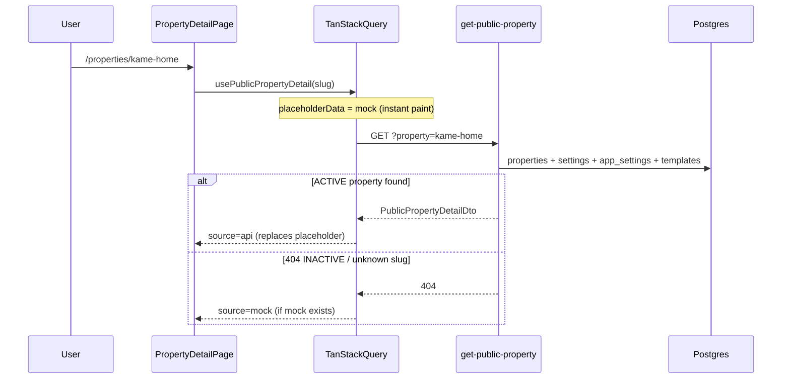

# Public property catalog — reference

Guest marketing property detail (`/properties/:propertySlug`) can load **live** data from the admin dashboard when the slug matches an **ACTIVE** row in `properties`. All other slugs continue to use **mock data** (Phase 1 catalog).

## Data flow

## API

| Function              | Method | Auth | Query                                       | Response                                     |
| --------------------- | ------ | ---- | ------------------------------------------- | -------------------------------------------- |
| `get-public-property` | GET    | anon | `?property=<slug>` or `?property_id=<uuid>` | `{ success, data: PublicPropertyDetailDto }` |

**404** when slug/id not found or `properties.status !== 'ACTIVE'`.

**Not exposed** (operator-only): contact email/phone, OAuth tokens, Telegram, Gmail, internal UUIDs beyond `id`/`slug`, payment account numbers.

### Server files

| Concern         | Path                                                                  |
| --------------- | --------------------------------------------------------------------- |
| Edge entry      | `supabase/functions/get-public-property/index.ts`                     |
| Serializer      | `supabase/functions/_shared/publicPropertyService.ts`                 |
| Amenity labels  | `supabase/functions/_shared/publicPropertyAmenities.ts`               |
| Slug resolution | `supabase/functions/_shared/propertyScope.ts#resolvePublicPropertyId` |

### UI files

| Concern          | Path                                                                          |
| ---------------- | ----------------------------------------------------------------------------- |
| Hook (cache)     | `ui/src/features/guest/marketing/properties/hooks/usePublicPropertyDetail.ts` |
| API → view model | `ui/src/features/guest/marketing/properties/lib/mapPublicPropertyDetail.ts`   |
| Types            | `ui/src/features/guest/marketing/properties/types/publicProperty.ts`          |
| Page             | `ui/src/features/guest/marketing/pages/PropertyDetailPage.tsx`                |

## Caching & performance

| Layer                      | Setting                             | Purpose                             |
| -------------------------- | ----------------------------------- | ----------------------------------- |
| TanStack Query `staleTime` | 5 min                               | Avoid refetch on revisit            |
| TanStack Query `gcTime`    | 30 min                              | Keep cache in memory                |
| `placeholderData`          | mock for slug                       | Instant first paint while API loads |
| Server pricing load        | single `app_settings` row           | Bundled in one edge round-trip      |
| Property media             | public `property-media` bucket URLs | No signed-URL hop                   |

Query key: `['public-property', slug]`.

## Dashboard → public field map

| Public UI section                     | Dashboard source                                                                                      | Notes                                                         |
| ------------------------------------- | ----------------------------------------------------------------------------------------------------- | ------------------------------------------------------------- |
| Gallery                               | Settings → Photos & Videos (`properties.settings.media`)                                              | Ordered; images only in carousel                              |
| Title / type                          | Basic → name, property type                                                                           | Type label normalized (e.g. `condo` → Condo)                  |
| Description                           | Basic → description                                                                                   |                                                               |
| Beds / baths / guests / floors        | Property details (`floors` for condo, apartment, Azure North)                                         | `maxGuests` from column or adults+children                    |
| Check-in / out                        | Property details times                                                                                | Formatted 12h for display                                     |
| Self check-in                         | Property details checkbox                                                                             | Shown when enabled                                            |
| Amenities                             | Amenities (+ custom)                                                                                  | IDs resolved to labels                                        |
| Location / map embed                  | Location & Access + `PropertyMapEmbed`                                                                | Google Embed API → legacy Google iframe → OSM Mapnik fallback |
| House rules (live)                    | Settings → House Rules (`enabledHouseRules`, `customHouseRules`)                                      | Pill grid on public page; defaults when unset                 |
| Host name                             | Org name → property contact fallback                                                                  |                                                               |
| Host avatar                           | Org settings **Organization logo** (`org_settings.email_logo_url`, fallback `organizations.logo_url`) | Same source as guest forms / emails                           |
| Nightly rate (booking card)           | Pricing → weekday rate                                                                                | Weekend/holiday overrides not on static card yet              |
| Security deposit / pet / parking fees | Pricing defaults (`app_settings`)                                                                     |                                                               |
| Status gate                           | Property status **ACTIVE**                                                                            | INACTIVE → 404 → mock fallback                                |

## UI content **not** in dashboard (gap list)

Use this when planning admin fields or deciding what to keep as marketing-only mock.

| Public UI element                                 | Current source                                  | Dashboard field?              | Recommendation                                             |
| ------------------------------------------------- | ----------------------------------------------- | ----------------------------- | ---------------------------------------------------------- |
| Star rating (header, booking card)                | Mock only                                       | No                            | Future: reviews integration or hide for live               |
| Review count                                      | Mock only                                       | No                            | Same                                                       |
| Review list + category breakdown                  | `PropertyReviews` mock data                     | No                            | Future guest review module                                 |
| Host card (owner avatar, unit, org)               | `PropertyOverview` host block                   | `host.*` from API             | Owner profile via auth metadata; unit = tower/unit or name |
| Superhost badge                                   | Mock only                                       | No                            | Org/host reputation flag                                   |
| "Joined 2024" host subtitle                       | Removed from live host card                     | —                             | Mock marketing bullets only                                |
| Contact host button                               | UI only (no action)                             | Partial (contact in settings) | Wire to email/phone or inbox                               |
| Square meters / sqm stat                          | Removed from public UI                          | —                             | Use floors for condo / Azure North instead                 |
| Cleaning fee                                      | Mock only                                       | No                            | Add fee field or derive from pricing                       |
| Tax / VAT rate                                    | Mock only                                       | No                            | Add if required for price breakdown                        |
| Nearby places (airport, mall, …)                  | Hardcoded in `PropertyLocation`                 | No                            | Google Places API or manual POI list                       |
| Interactive map embed                             | `PropertyMapEmbed` (shipped)                    | Location & Access pin         | Decorative placeholder only when no coords/address         |
| Default house-rule chips (no smoking, parties, …) | Settings → House Rules presets                  | `enabledHouseRules`           | Pill grid on public page; templates not used for listing   |
| Safety features list                              | Hardcoded (mock only)                           | Partial (amenity ids)         | Map from selected safety amenities                         |
| Cancellation policy block                         | `PropertyRules` + `CancellationPolicyDisplay`   | `settings.cancellationPolicy` | Resolved on API; presets + custom in property settings     |
| Free cancellation / marketing feature bullets     | `PropertyOverview`, `BookingCard`               | Same                          | `showListingHighlight` + `shortLabel` from resolved policy |
| Similar properties                                | `mockProperties`                                | No                            | Future public list API                                     |
| Parking registration CTA                          | `mockForms`                                     | Partial (building forms)      | Wire building forms when public forms ship                 |
| Development / residence link                      | Mock `developmentSlug`                          | Partial (`residence_name`)    | Public development catalog                                 |
| Save / wishlist heart on cards                    | `PropertySaveButton` + `guest_saved_properties` | Authenticated guest           | Auth modal when anonymous; shared cache across pages       |
| `isNew` badge on cards                            | Mock only                                       | No                            | `created_at` threshold                                     |
| List page entire catalog                          | `mockProperties`                                | No                            | `list-public-properties` (future)                          |

## Mock fallback rules

1. API **success** → always use live data (`source: 'api'`).
2. API **404** → `getPropertyDetail` → `mockProperties` basic card.
3. No API and no mock → redirect `/properties`.
4. **Mock catalog unchanged** for browse/list/similar — only detail page merges live data.

## Related

- Route guide: [[guides/routes/properties|Properties (guest marketing) — operator guide]]
- Admin settings: [[guides/routes/org/property/settings|Property Settings — operator guide]]
- Pricing: [[guides/routes/org/property/pricing|Pricing — legacy route]]
