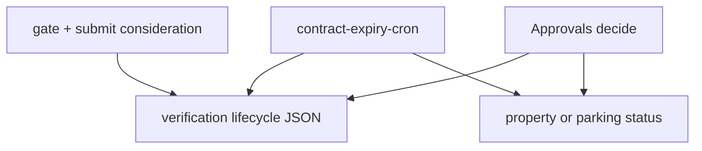

# Unit handoff — Phase B

> **For agentic workers:** Use superpowers:subagent-driven-development or executing-plans. Checkboxes track progress.  
> **Issue:** [#120](https://github.com/sprmke/kame-homes/issues/120)  
> **Depends on:** [`2026-08-02-unit-handoff-phase-a.md`](./2026-08-02-unit-handoff-phase-a.md) shipped  
> **Approved:** 2026-08-02

**Goal:** Sublessee / Auth Rep contract end → notices, T+0 offline + grace, Request consideration or full renew, T+5 listing lock; SA grant/deny with anti-abuse — without breaking Phase A uniqueness.

**Approach:** Lifecycle state in `settings.verification` JSON; listing-scoped access gate; one Manila `contract-expiry-cron` (no new claim tables).

**Tech:** Deno shared + cron + edge APIs, React host/SA UI, Resend, `pg_cron`/`pg_net`.

## Global constraints

- Owner-only consideration; 14-day cap; 1 self-serve per cycle; no stacking; SA must grant.
- Grant must not ACTIVE if Phase A peer conflict.
- Do not commit unless the user asks.

---

## Design

### Product locks

| Topic         | Decision                                                                                     |
| ------------- | -------------------------------------------------------------------------------------------- |
| Scope         | Property and parking legs independently when rights need contract end                        |
| Notices       | T−15, T−7, T−1 (Manila)                                                                      |
| T+0           | Listing `INACTIVE`; grace T+0…T+4                                                            |
| Grace         | Full renew **or** Request consideration (owner)                                              |
| Consideration | SA grant/deny; temp ACTIVE until `grantedUntil` ≤ 14d; proof + note + date + ack             |
| T+5           | Lock that listing for all members until full resubmit (SA override for second consideration) |
| Anti-abuse    | Evidence; audit; no auto-grant; conflict check on grant                                      |

### Host / Approvals

- Notice banner → grace (renew + consideration) → lock gate → granted banner.
- Approvals: Consideration flag; Grant / Changes / Deny; full renew clears consideration + Phase A activate/swap.

### Architecture

**Data (per leg):** `noticesSent`, `accessLockedAt`, `consideration{status, note, expectedDate, grantedUntil, proofPaths, audit, selfServeUsedThisCycle, allowConsiderationOverride}` plus existing contract end dates.

**Edge:** `_shared/contractLifecycle.ts` (+ orgVerification types); `contract-expiry-cron`; `submit-contract-consideration`; `decide-contract-consideration` (or SA equivalent); listing access helper for route gates.

**Cron:** T−15/T−7/T−1 notify; T+0 INACTIVE; T+3 reminder; T+5 lock; daily grant-expiry → INACTIVE + lock.

### Out of scope

Unlimited extensions; booking transfer; parking slot handoff beyond parking-leg dates; `unit_claims`.

---

## Implementation

### Task 1 — Lifecycle data helpers

**Files:** `_shared/orgVerification.ts`; create `_shared/contractLifecycle.ts`; optional UI types mirror.

- [ ] Types + parse/serialize defaults for property/parking lifecycle
- [ ] Manila date helpers; notice/grace/lock/consideration predicates; `CONSIDERATION_MAX_DAYS = 14`
- [ ] Verify fixtures for T−15 / grace / T+5 / 14d rules

### Task 2 — Cron + notices

**Files:** `contract-expiry-cron/index.ts`; `config.toml`; email template(s) + `static_files`; emailService helper.

- [ ] Idempotent milestones via `noticesSent`
- [ ] T+0 archive; T+5 lock; grant expiry revoke
- [ ] Owner emails; cron secret optional
- [ ] Re-run does not double-send

### Task 3 — Host gate + consideration submit

**Files:** `submit-contract-consideration`; host gate UI; property/parking route wiring; proof upload reuse.

- [ ] Owner-only submit; anti-abuse server-side
- [ ] Grace banners + consideration form; locked gate for all listing members
- [ ] Manual E2E at 375px

### Task 4 — Approvals consideration

**Files:** decide endpoint; `list-org-verifications` flag; Approvals table/dialog.

- [ ] Grant with conflict check + clear lock + `grantedUntil`
- [ ] Deny / request changes; history counts
- [ ] Full renew approve clears consideration

### Task 5 — Docs

**Files:** `PROJECT.md`; scheduled-jobs runbook; TODOS; approvals + host guides; `planned_modules` pointer only.

- [ ] Document cron, consideration, lock; no duplicate checklist outside this file + Phase A file

### Done when

- [ ] Cron milestones + consideration grant/deny/lock behave per design
- [ ] Docs + runbook updated
