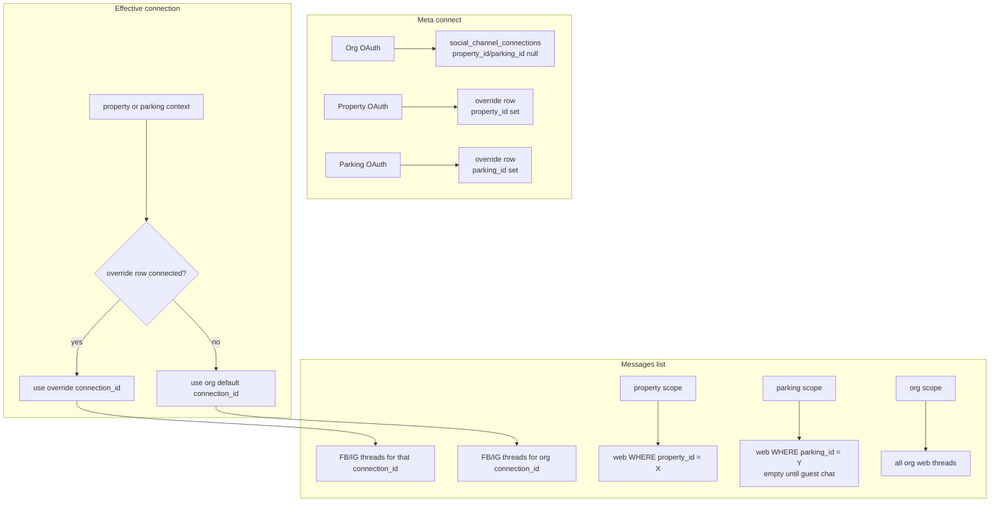

# Expand Inbox to org, property, and parking — Implementation Plan

## Goal

Ship Guest Inbox at **property** and **parking** scopes (nav + pages), while keeping the existing org Inbox as the all-properties web rollup and the **default Meta Page** for every property and parking. Property/parking can optionally connect a different Meta Page (override). Inherited Meta shows the full org Page thread list (decision **1A**); web chat stays scoped to the current property (or parking when that guest surface exists).

## Decisions (do not re-litigate)

1. **Inherited Meta threads (1A):** When a property/parking has no Meta override, Messages FB/IG tabs show **all threads on the org Meta connection**, with a clear **“Using org Meta”** badge. Web stays scope-filtered.
2. **Scope:** Property **and** parking Inbox routes/nav in this plan (not parking-later).
3. **Inheritance without duplicate org rows:** Org Meta connection rows stay `property_id`/`parking_id` null. Overrides are **extra** connection rows scoped to one property or one parking. UI “connected via org” is a **resolved effective connection**, not a copied row per unit.
4. **Quick replies + Automation stay org-only** in this plan. Property/parking Inbox = **Messages + Channels** only (link/copy pointing operators to org Inbox for templates/AI settings if needed — minimal, no new prose walls).
5. **Marketing publish** continues to use the **org** Meta connection only. Property/parking override Pages are for Inbox DMs, not Marketing Studio in this plan.
6. **Parking web chat:** Guest parking ↔ host web chat does **not** exist yet. Parking Inbox still ships; Web tab is empty with the same empty-state pattern until a later parking guest-chat plan adds `parking_id` threads. Schema still adds `parking_id` on conversations/connections so that work is not blocked.

## Scope

### In

- Property route `/org/:orgSlug/property/:propertySlug/inbox` + sidebar Inbox
- Parking route `/org/:orgSlug/parking/:parkingSlug/inbox` + sidebar Inbox
- Org Inbox: keep all-property web threads; fix **View property** → admin property dashboard (not public `/properties/:slug`)
- Meta: org default reused; per-property / per-parking override connect/disconnect
- Thread list API: optional `propertyId` / `parkingId` scope filters
- Property + parking team permissions: `inbox:view` | `inbox:reply` | `inbox:manage`
- Docs: route guides, `PROJECT.md`, `social-inbox` skill/rule

### Out

- Splitting one Meta Page’s DMs across properties by NLP/heuristics
- Per-property quick replies / automation settings
- Marketing publish against override Pages
- Building the full parking guest web-chat guest UI (schema only)
- TikTok / Airbnb channels

## Current state (verified)

- Org-only UI: [`OrgInboxPage.tsx`](../../../ui/src/features/dashboard/inbox/pages/OrgInboxPage.tsx), nav in [`adminSidebarNav.ts`](../../../ui/src/features/dashboard/bookings/lib/adminSidebarNav.ts) (`buildOrgNavSections` only).
- Web threads already have `social_conversations.property_id`; list API does **not** filter by it ([`social-inbox-threads`](../../../supabase/functions/social-inbox-threads/index.ts)).
- Meta is org-only on [`social_channel_connections`](../../../supabase/migrations/20260910120000_social_inbox.sql) — no `property_id`/`parking_id`; OAuth state is org-only; webhook resolves by `meta_page_id` + `.maybeSingle()`.
- Org reconnect (`prepareOrgMetaInboxConnect`) **wipes all org Meta data** — must not run that path for property/parking overrides.
- Property permissions ([`propertyPermissions.ts`](../../../ui/src/features/dashboard/team/lib/propertyPermissions.ts)) have **no** inbox keys; parking nav has no Inbox.
- Guide checklist still open: “Property-level channel overrides” in [`docs/guides/routes/org/inbox.md`](../../guides/routes/org/inbox.md).

## Architecture

### 1. Schema migration

New migration e.g. `supabase/migrations/<ts>_inbox_scope_overrides.sql`:

**`social_channel_connections`**

- Add nullable `property_id UUID REFERENCES properties(id) ON DELETE CASCADE`
- Add nullable `parking_id UUID REFERENCES parkings(id) ON DELETE CASCADE`
- CHECK: `NOT (property_id IS NOT NULL AND parking_id IS NOT NULL)`
- Partial unique indexes:
  - At most one **org-default** connected Facebook row per org: `(organization_id)` WHERE `platform = 'facebook' AND property_id IS NULL AND parking_id IS NULL AND status = 'connected'` (adjust if multiple platforms need the same rule for IG rows that share a Page)
  - At most one override per `(organization_id, property_id)` / `(organization_id, parking_id)` for Meta platforms as needed
- Keep global uniqueness of live `meta_page_id` among connected Facebook rows (reject connecting a Page already owned by another org/scope)

**`meta_inbox_oauth_state`**

- Add nullable `property_id`, `parking_id` (same mutual-exclusion CHECK) so callback/complete know whether to write org default vs override

**`social_conversations`**

- Add nullable `parking_id UUID REFERENCES parkings(id) ON DELETE SET NULL` (for future parking web chat; Meta rows remain null)
- Index `(parking_id)` WHERE `platform = 'web'` when used

Existing org Meta + web rows need no backfill beyond null scope columns.

### 2. Effective Meta resolution (shared)

New helper in `_shared/` e.g. `metaInboxScope.ts`:

- `resolveEffectiveMetaConnection(orgId, { propertyId?, parkingId? })` → `{ connection, source: 'org' | 'property' | 'parking' }`
- Webhook `getConnectionByMetaPageId`: still resolve by `meta_page_id` to the **owning connection row** (org or override). Threads always hang off that `connection_id` — no re-attribution by property.
- Status API returns `source` + badge fields for Channels UI.

### 3. Connect / disconnect lifecycle

| Action                      | Behavior                                                                                                                                                             |
| --------------------------- | -------------------------------------------------------------------------------------------------------------------------------------------------------------------- |
| Org connect/reconnect       | Existing wipe of **org-default** Meta connections + their threads only — **do not** delete property/parking override rows                                            |
| Org disconnect              | Disconnect org-default only; overrides remain                                                                                                                        |
| Property/parking connect    | OAuth with scope ids in state; `persistMetaPageConnection` writes override rows; **no** wipe of org default; wipe only prior override for that same property/parking |
| Property/parking disconnect | Delete/disconnect override connection + Meta threads for that `connection_id` only; fall back to org default in UI                                                   |

Update [`metaInboxConnect.ts`](../../../supabase/functions/_shared/metaInboxConnect.ts), oauth-start/callback/complete, disconnect, status.

### 4. Thread list / send / auth

- `social-inbox-threads`: accept optional `propertyId` / `parkingId` (validated against caller’s org + access).
  - **Web:** filter `platform=web` by that id (parking → `parking_id`).
  - **Meta:** filter `connection_id` = effective Meta connection(s) for that scope (1A → org connection when inherited).
  - **Org (no scope):** current behavior (all web + org Meta; overrides’ threads also visible at org if desired — include override connection threads in org All/FB/IG so nothing is orphaned).
- `social-inbox-send` / messages: verify conversation belongs to org; if caller is property/parking scoped, allow Meta when conversation’s `connection_id` is the effective one for that scope; allow web when `property_id`/`parking_id` matches.
- Auth: org routes keep `resolveOrgAccessContext` + `org:inbox:*`. Property/parking routes use `verifyPropertyAccess` / parking scope + new `inbox:*` permissions (org owner/admin still full access).

### 5. Permissions

Mirror org triad on property and parking team catalogs:

| Id             | Capability                           |
| -------------- | ------------------------------------ |
| `inbox:view`   | Open inbox, read threads             |
| `inbox:reply`  | Send / AI suggest                    |
| `inbox:manage` | Channels connect/disconnect override |

Wire: [`propertyTeamConstants.ts`](../../../ui/src/features/dashboard/team/lib/propertyTeamConstants.ts), parking team constants (same pattern), `_shared/propertyTeamPermissions.ts` / parking equivalents, nav gates in `PROPERTY_NAV_VIEW_PERMISSION` / parking nav, `PropertySection` + `ParkingSection` += `'inbox'`.

### 6. UI

- Refactor shared shell from `OrgInboxPage` → e.g. `InboxPage.tsx` driven by `scope: { kind: 'org' } | { kind: 'property', propertyId, propertySlug } | { kind: 'parking', parkingId, parkingSlug }`.
- Thin pages: `OrgInboxPage`, `PropertyInboxPage`, `ParkingInboxPage`.
- Paths: `propertyInboxPath` / `parkingInboxPath` in [`tenantPaths.ts`](../../../ui/src/features/dashboard/org/lib/tenantPaths.ts); register routes next to other property/parking sections.
- Nav: Inbox item in `buildPropertyNavSections` / `buildParkingNavSections` (near Marketing/Notifications).
- Channels: show effective Meta status + **Using org Meta** when `source === 'org'`; primary actions Connect override / Disconnect override (org manage of default stays on org Inbox).
- Org conversation header: **View property** → `propertyDashboardPath(orgSlug, propertySlug)` (admin), not public listing.
- Property/parking: omit Quick replies + Automation tabs (org-only).

### 7. Docs

- New guides: `docs/guides/routes/org/property/inbox.md`, `docs/guides/routes/org/parking/inbox.md`
- Update `docs/guides/routes/org/inbox.md` (inheritance, View property, checklist)
- `docs/guides/routes/README.md` index rows
- `docs/PROJECT.md` API/routes
- `.cursor/rules/social-inbox.mdc` + `.claude/skills/social-inbox/SKILL.md` (and `.cursor/skills` mirror): org + property + parking

## Implementation tasks

1. Migration: scope columns on connections, oauth state, conversations (`parking_id`); indexes + CHECKs.
2. `_shared/metaInboxScope.ts` + refactor connect/disconnect/status/webhook resolution; org wipe scoped to org-default only.
3. OAuth start/callback/complete: accept and persist property/parking scope.
4. `social-inbox-threads` (+ send/messages auth): scope filters + effective Meta `connection_id`.
5. Property + parking `inbox:*` permissions (UI constants + edge shared).
6. Path helpers, routes, sidebar nav.
7. Refactor inbox page into scoped shell; property/parking pages; Channels badge + override actions.
8. Org “View property” → admin dashboard.
9. Docs + skill/rule updates as above.

## Docs to update

| Doc                                                      | Change                                    |
| -------------------------------------------------------- | ----------------------------------------- |
| `docs/guides/routes/org/inbox.md`                        | Inheritance, org View property, checklist |
| `docs/guides/routes/org/property/inbox.md`               | New                                       |
| `docs/guides/routes/org/parking/inbox.md`                | New                                       |
| `docs/guides/routes/README.md`                           | Index                                     |
| `docs/PROJECT.md`                                        | Routes + API scope params                 |
| `.cursor/rules/social-inbox.mdc`                         | Multi-scope invariants                    |
| `.claude/skills/social-inbox/SKILL.md` (+ cursor mirror) | Routes + effective connection             |

## Open questions

None — decisions locked: **1A**, **property + parking**, org-only templates/automation, Marketing stays on org Meta, parking web chat guest UI deferred with schema readiness.
