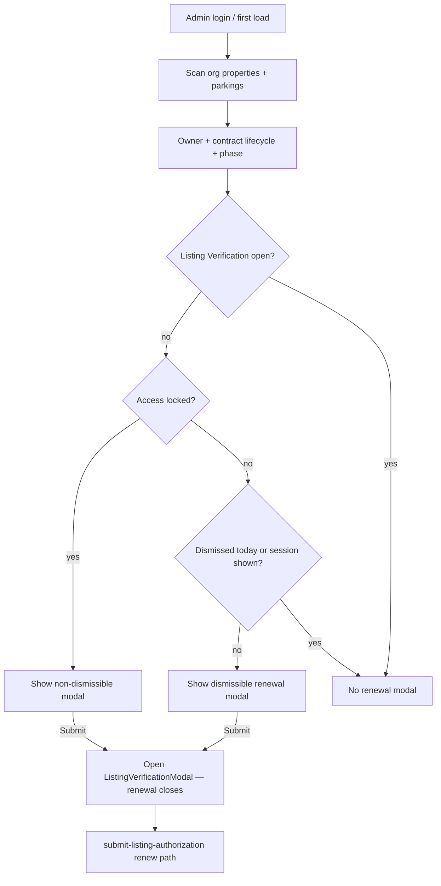

# Listing contract renewal modal — design

## Problem

After the host/listing verification scope split, contract end + lifecycle live on each property/parking `listingAuthorization` row. The old **amber strip** (grace) and **full lock screen** (T+5) interrupted every page on the listing. This design replaces them with a dismissible renewal reminder modal, org-wide on login, plus a working renew submit path in Listing Verification.

## Goals

- Replace strip + lock UI with a **listing-scoped** renewal reminder modal.
- Distinct copy for **pre-expiry** vs **grace** vs **locked**.
- Dismissible once per Manila day for **pre-expiry** and **granted**; **grace** stays closed only until a full page refresh (in-memory login gate); **non-dismissible when locked on that listing’s admin shell only** (org dashboard + sibling listings stay closeable).
- Show **once per login session** (browser session + Manila day), not on every route change.
- Show at **org dashboard** as well as property/parking — highest-urgency listing only.
- **Never** stack with `ListingVerificationModal`.
- Working renew submit while previously approved.
- Keep Request consideration as a secondary path in grace (and override when locked).

## Non-goals

- Org/host Get Verified changes.
- New Postgres renewal status columns.
- Changing cron email milestones (optional later copy sync).

## Decisions

| Topic        | Decision                                                                                                                               |
| ------------ | -------------------------------------------------------------------------------------------------------------------------------------- |
| Who          | Any listing with a contract-end lifecycle (sublessee, authorized rep, residual lifecycle after rights changes)                         |
| Strip / lock | Removed — modal only                                                                                                                   |
| Dismiss      | Daily Manila snooze for pre-expiry + granted; **grace re-opens on refresh**; locked non-dismissible **only on affected listing shell** |
| Scope        | Org-wide scan; one modal at a time (highest urgency listing)                                                                           |
| First show   | T−15 (same as first email); auto on admin login once per session/day                                                                   |
| Status enum  | UI labels only; map onto `baseStatus` + lifecycle                                                                                      |

## Modal phases and copy (approved)

### Pre-expiry (T−15 → day before end) — dismissible

- **Title:** Contract renewal reminder
- **Body:** Your hosting contract for **[Listing Name]** ends on **[January 1, 2026]** ([**N days**] left). End date and day count are **semibold** in UI. To keep this listing verified…
- **Primary:** Submit renewal contract → `ListingVerificationModal`
- **Secondary:** Dismiss

### Grace (T+0 → T+4, not locked) — dismissible until refresh

- **Title:** Contract expired — renewal required
- **Body:** Your hosting contract for **[Listing Name]** ended on **[January 1, 2026]** (bold). You have **[N] day(s)** (bold) to renew or request consideration before access is locked and this listing cannot be accessed.
- **Primary:** Submit renewal contract
- **Secondary:** Dismiss (hides until full page refresh; does **not** write the daily `localStorage` snooze) · Request consideration

### Locked — non-dismissible on affected listing shell only

- **Title:** Listing access locked
- **Body:** The grace period for **[Listing Name]** has ended. Submit a full renewal for review to restore access.
- **Primary:** Submit renewal contract
- **Optional:** Request consideration if `allowConsiderationOverride`
- **Dismiss:** Closeable on org dashboard and sibling listing routes; **not** closeable when admin is inside the locked listing’s property/parking shell.

### Active consideration grant

Dismissible once-per-day info: temporary access until `grantedUntil`.

## UX flow

## Technical shape

- **Dismiss key:** `listing-contract-renewal-dismiss:{listingKind}:{listingId}` → Manila YMD (`localStorage`) for **pre-expiry** and **granted** only (`persistsListingContractRenewalDailyDismiss`). Grace does not persist; refresh re-opens.
- **Session key:** in-memory per auth login (`userId + orgId + Manila YMD`); cleared on sign-out. Legacy `sessionStorage` keys are removed on load/sign-out.
- **Mount:** `ListingContractRenewalProvider` in `AdminLayoutOutlet` (org + property + parking routes).
- **Mutual exclusion:** sidebar / deep-link `ListingVerificationModal` registers open state; renewal hides while verification is open.
- **Locked dismiss scope:** `listingContractRenewalDismissScope.ts` — org + sibling shells closeable; affected listing shell hard lock.
- **Helpers:** `isInPreExpiryWindow`, phase resolver, `canSubmitListingRenewal`.
- **Server:** allow approved → pending when renew-eligible; reset lifecycle on new contract end.
- **UI status labels (optional):** Active / Renewal required / Renewal submitted / Restricted — display only.

## Success criteria

- One listing per session/day for dismissible phases; locked always surfaces on that listing’s shell until resolved.
- Multi-listing org: locked reminder closeable at org level; sibling listings fully usable.
- Soft phases: pre-expiry/granted snooze one Manila day; **grace re-opens on every full page refresh**; locked cannot dismiss on the affected listing shell.
- Renew submit works; SA sees pending listing verification.
- Consideration still available in grace.

## Implementation plan

See [`../in-progress/listing-contract-renewal-modal.md`](../in-progress/listing-contract-renewal-modal.md).
