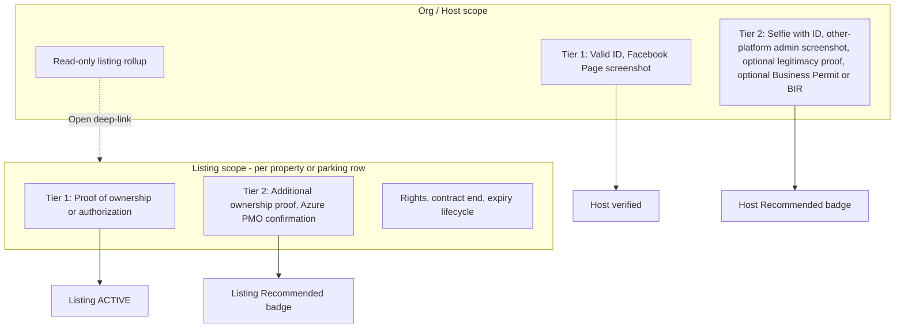

# Verification scope split — Host vs Listing

**Goal:** Split the single org-wide verification flow into two **independent** verification scopes — **Host/Org** (is this person or entity legitimate?) and **Listing** (is this property legitimate, and is the host authorized to list it?) — each with its own Tier 1 and Tier 2 status.

**Architecture:** Keep org identity docs in `organizations.settings.verification`. Add a new `listingAuthorization` JSON block to each `properties` / `parkings` row, owned by a new `_shared/listingAuthorization.ts`. Rights, contract end date, and the contract-expiry lifecycle move from the two org legs onto the listing row. The org modal keeps a **read-only** rollup of its listings.

**Onboarding UI does not change** — only its save path is re-routed.

---

## Decisions locked

| Question                                 | Decision                                                                                  |
| ---------------------------------------- | ----------------------------------------------------------------------------------------- |
| Rights + contract end + expiry lifecycle | **Move to each listing row**; `contract-expiry-cron` scans listings                       |
| Listing section in the org modal         | **Read-only rollup** — status per listing + `Open` deep-link to that listing's modal      |
| Host approval as listing prerequisite    | **Fully independent** — a listing may be approved and go `ACTIVE` while host Tier 1 pends |
| Onboarding                               | **UI identical**; save path routes listing docs to the new per-listing record             |
| Public badge                             | **Two badges** — host Recommended (org Tier 2) and listing Recommended (listing Tier 2)   |

---

## Current state (verified 2026-08-10)

There is no listing-level verification today. `organizations.settings.verification` holds host **and** listing-scoped documents:

| Scope today         | Fields                                                                                                                                                  |
| ------------------- | ------------------------------------------------------------------------------------------------------------------------------------------------------- |
| Tier 1 (`base`)     | `valid_id`, `social_proof` + `socialPlatform`, **`property_ownership_proof`**, **`parking_social_proof`**, property/parking rights + contract end dates |
| Tier 2 (`enhanced`) | `selfie_with_id`, **`ownership_proof`**, **`azure_pmo_confirmation`**                                                                                   |

- Contract expiry runs off org legs `propertyLifecycle` / `parkingLifecycle` (`_shared/contractExpiryCron.ts`).
- `approve-org-verification` (base tier) is what archives peer `ACTIVE` tower+unit listings and activates properties.
- Public badge is org-wide only: `verifiedBadge = enhancedStatus === 'approved'`.

Bolded fields above are listing-scoped and must move.

---

## Target model



**Four independent statuses:** org `baseStatus`, org `enhancedStatus`, listing `baseStatus`, listing `recommendedStatus`. No cascades in either direction. Each listing is independently verifiable.

`listingKind` (`property` | `parking`) drives labels only — the Property / Parking "categories" fall out naturally because each is its own row.

---

## Data model

### Org — identity only

Keep `validIdPath`. Reuse `socialProofPath` as the Tier 1 **Facebook Page screenshot** and drop the Tier 1 platform selector (pin to Facebook).

New Tier 2 fields:

| Field                                                                                           | Required |
| ----------------------------------------------------------------------------------------------- | -------- |
| `selfieWithIdPath`                                                                              | Yes      |
| `platformAdminProofPath` + `platformAdminPlatform` (uses existing `ORG_SOCIAL_PROOF_PLATFORMS`) | Yes      |
| `legitimacyCheckProofPath`                                                                      | Optional |
| `businessPermitOrBirPath`                                                                       | Optional |

Removed from org **submit gates** (parsers keep reading them as backfill fallback): `propertyOwnershipProofPath`, `parkingSocialProofPath`, `ownershipProofPath`, `azurePmoConfirmationPath`, property/parking rights, contract end dates, `propertyLifecycle`, `parkingLifecycle`.

### Listing — authority + property legitimacy

`properties.settings.listingAuthorization` / `parkings.settings.listingAuthorization`:

```ts
type ListingAuthorizationState = {
  relationship: OrgVerificationRights | null; // Owner / Auth Rep / Sublessee / Property Admin
  contractEndDate: string | null; // required for Auth Rep + Sublessee
  baseStatus: 'none' | 'pending' | 'approved' | 'rejected';
  recommendedStatus: 'none' | 'pending' | 'approved' | 'rejected';
  baseSubmittedAt: string | null;
  recommendedSubmittedAt: string | null;
  baseRejectionReason: string | null;
  baseRejectionKind: 'changes' | 'rejected' | null;
  recommendedRejectionReason: string | null;
  assets: {
    proofPath: string | null; // Tier 1 — Title / SPA / sublease contract / other
    additionalProofPath: string | null; // Tier 2
    azurePmoConfirmationPath: string | null; // Tier 2
  };
  lifecycle: ContractLegLifecycle; // moved from the org leg
};
```

No BIR / business permit at listing level — those are host-only.

---

## Phase 1 — Shared model + migration

- [x] `supabase/functions/_shared/listingAuthorization.ts` — state, parsers, `canSubmitBaseListingAuthorization`, `canSubmitRecommendedListingAuthorization`, `assetTypeToPathKey`, `mergeListingAuthorizationIntoSettings`, plus `resolveListingAuthorization` (org-leg fallback for un-backfilled rows)
- [x] `supabase/functions/_shared/listingAuthorization_test.ts` — 12 Deno tests for tier gates + legacy fallback (all passing)
- [x] UI mirror `ui/src/features/dashboard/org/lib/listingAuthorization.ts`
- [x] `supabase/migrations/20261011120000_listing_authorization.sql` — private bucket `listing-authorization-assets` (5 MB; JPEG/PNG/WebP/PDF, service-role only) + **non-destructive** backfill of `listingAuthorization` onto every property/parking from the matching org leg (rights, contract end, lifecycle, proof path). Backfill helper function is created and dropped inside the migration
- [x] `bun run db:migrate` locally — bucket private with the service-role policy, helper dropped, rows that already had a block skipped; noted in `docs/archive/operations/migration-runbook.md`

Also added `_shared/listingAuthorizationService.ts` — listing row + org resolution, owner / super-admin authorization, settings persistence, and the shared response serializer.

## Phase 2 — Listing edge APIs

- [x] `upload-listing-authorization-asset` — `proof` | `additional_proof` | `azure_pmo_confirmation`
- [x] `submit-listing-authorization` — Tier 1: rights + contract end + proof
- [x] `submit-listing-recommended` — Tier 2: additional proof + Azure PMO
- [x] `get-listing-authorization-assets` — owner or super admin, signed URLs
- [x] `approve-listing-authorization` / `approve-listing-recommended`
- [x] `reject-listing-authorization` — `{ tier, kind, reason }`
- [x] Move property activation + tower/unit peer handoff **out of** `approve-org-verification` into `approve-listing-authorization`, with **no** org-status precondition — `activateOrgPropertiesAfterBaseVerification` replaced by `activatePropertyAfterListingApproval`; parking activates its own row
- [x] `config.toml` entries (`verify_jwt = false`) for all seven functions plus `list-org-listing-verifications`

## Phase 3 — Rewire org-scoped machinery

- [x] Trim `canSubmitBaseVerification` / `canSubmitEnhancedVerification` to host-only docs; optional Tier 2 docs must not block submit
- [x] Add Tier 2 asset types: `platform_admin_proof`, `legitimacy_check_proof`, `business_permit_bir`
- [x] `contract-expiry-cron` scans listing rows instead of org legs (per-listing notices carry the listing name)
- [x] `submit-contract-consideration` / `decide-contract-consideration` rescope from `leg` to `listingKind` + `listingId`
- [x] `publicHostService.ts` / `publicPropertyService.ts` / `parkingScope.ts#loadPublicParkingBySlug` expose host `verifiedBadge` **and** per-listing `recommendedBadge`; guest UI renders the listing badge on property/parking detail headers and host page cards
- [x] `approve-org-verification` no longer resets the org-leg lifecycles (host scope only)
- [x] New `list-org-listing-verifications` → `{ listingKind, listingId, name, slug, baseStatus, recommendedStatus, missingDocs[] }`

## Phase 4 — Host UI

- [x] `ui/.../org/components/listing-authorization/ListingVerificationModal.tsx` — Tier 1 + Tier 2 panels, submitted-docs list with **View**, listing Recommended badge preview, renew path for grace/locked
- [x] Sidebar entry for property **and** parking listings
- [x] Slim `GetVerifiedModal.tsx` to host docs only — remove property/parking rights, ownership, and parking upload blocks plus their changes-requested branches
- [x] `OrgListingVerificationRollup.tsx` — read-only, rendered in **both** org tier panels: per-listing status badge, missing-doc count, `Open` deep-link
- [x] Contract lifecycle reads from listing row (`listingAuthorization.lifecycle`); renewal UX in `ListingContractRenewalProvider`
- [x] Listing copy in `ui/.../org/lib/listingVerificationCopy.ts`; tier builders in `listingVerificationTiers.ts`

## Phase 5 — Onboarding (UI unchanged)

- [x] Keep steps, fields, and validation identical in `OnboardingPage.tsx`
- [x] Host docs still go to `upload-org-verification-asset` + `submit-org-verification`
- [x] Per created listing: upload `proof`, then `submit-listing-authorization` with rights + contract end

## Phase 6 — Super Admin

- [x] Add `type: 'listing_verification'` rows to the approvals queue (org rows still come from `list-org-verifications`)
- [x] Per-listing review dialog — Approve / Request changes / Decline **per tier**
- [x] Trim the org review dialog to host docs and append the read-only listing rollup
- [x] Type filter gains **Listing verification**

## Phase 7 — Docs + quality gate

- [x] `docs/PROJECT.md`, `docs/architecture/edge-functions.md`, `docs/architecture/storage.md` (edge-functions + onboarding/approvals updated; PROJECT/storage light touch as needed)
- [x] `docs/guides/routes/onboarding.md`, `admin/approvals.md`
- [x] Reconcile `docs/workflow/for-testing/host-verification-tiers.md` (pointer to scope-split)
- [x] `bun run ci:quality`

---

## Verification checklist

- [ ] Multi-listing org: each listing carries its own rights, contract end, and both tier statuses
- [ ] Listing Tier 1 approval activates that listing **while host Tier 1 is still pending**
- [ ] Host Tier 1 approval does **not** change any listing status
- [ ] Listing Tier 2 approval grants a badge on that listing only — siblings unaffected
- [ ] Org modal listing rollup is read-only; `Open` lands on the right listing modal
- [ ] Org Tier 2 submits with both optional docs empty
- [ ] Onboarding produces identical UI and creates listing records with Tier 1 submitted
- [ ] Contract expiry, grace period, lock, and consideration all operate per listing
- [ ] Host page shows host Recommended; listing pages show listing Recommended
- [ ] Backfilled legacy orgs still load and preview their old documents

**Follow-up (in progress):** listing renewal reminder modal replacing strip/lock UI — [`listing-contract-renewal-modal.md`](./listing-contract-renewal-modal.md) · design [`../intake/listing-contract-renewal-modal-design.md`](../intake/listing-contract-renewal-modal-design.md).

---

## Constraints

- Do not commit unless the user asks.
- No production Supabase deploy without **`kamewave`** — verify with `bun run db:migrate` + `./dev.sh`.
- New migrations only — never edit a shipped migration.
- Minimal UI copy on new surfaces.
- Update matching docs in the same change.

---

## Key files

| Area                 | Path                                                                                         |
| -------------------- | -------------------------------------------------------------------------------------------- |
| Org shared           | `supabase/functions/_shared/orgVerification.ts`                                              |
| Listing shared (new) | `supabase/functions/_shared/listingAuthorization.ts`                                         |
| Contract lifecycle   | `supabase/functions/_shared/contractExpiryCron.ts`, `_shared/contractLifecycle.ts`           |
| Org approve/reject   | `supabase/functions/approve-org-verification/`, `reject-org-verification/`                   |
| SA queue             | `supabase/functions/list-super-admin-approvals/`, `list-org-verifications/`                  |
| Public badge         | `supabase/functions/_shared/publicHostService.ts`, `publicPropertyService.ts`                |
| Org modal            | `ui/src/features/dashboard/org/components/verification/GetVerifiedModal.tsx`                 |
| Org tiers/copy       | `ui/.../org/lib/orgVerificationTiers.ts`, `lib/verificationCopy.ts`                          |
| Renewal reminder     | `ui/.../listing-authorization/ListingContractRenewalProvider.tsx` (replaces strip/lock gate) |
| Onboarding           | `ui/.../org/pages/OnboardingPage.tsx`                                                        |
| Guest badge          | `ui/.../guest/marketing/shared/components/ListingRecommendedBadge.tsx`                       |

Back to [planned index](./README.md).
