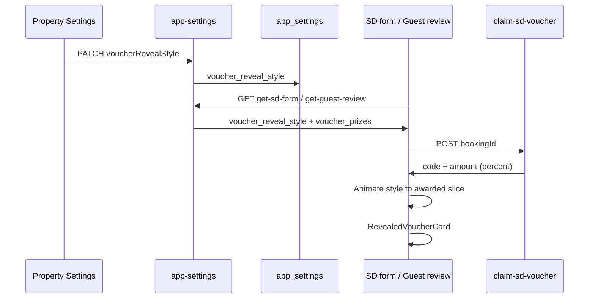

# Voucher reveal styles — host-selectable guest animation

**Shipped** — hosts choose reel / wheel / flip for the next-stay voucher award on `/sd-form` and `/properties/:slug/guest-review`.

**Related:**

- [`./property-guest-rewards-vouchers.md`](./property-guest-rewards-vouchers.md) — prize catalog + relative weights
- [`../in-progress/voucher-redemption.md`](../in-progress/voucher-redemption.md) — wallet + apply on rebook (orthogonal)
- Guest reveal: `ui/src/features/guest/sd-form/components/VoucherReveal.tsx` → `voucher-reveal/*`
- Roll is **server-authoritative** via `claim-sd-voucher` → `_shared/voucher.ts#rollVoucher` — animations are cosmetic only
- Manual QA: [`../qa/guest-flows/voucher-reveal-styles.md`](../qa/guest-flows/voucher-reveal-styles.md)

---

## TL;DR

| Item                    | Decision                                                                                                                      |
| ----------------------- | ----------------------------------------------------------------------------------------------------------------------------- |
| **What we're building** | Per-property **reveal style** setting + guest UI that renders reel, wheel, or flip animation before the shared “You won” card |
| **V1 styles**           | `reel` (current default), `wheel`, `flip`                                                                                     |
| **Deferred**            | Scratch card, confetti-only instant reveal, org-level default, live animation preview in Settings                             |
| **Storage**             | `app_settings.voucher_reveal_style TEXT` with CHECK + default `'reel'`                                                        |
| **API surface**         | `app-settings` GET/PATCH; `get-sd-form` + `get-guest-review` return `voucher_reveal_style`                                    |
| **Ship order**          | Phase 0 schema → Phase 1 refactor shell → Phase 2 host picker → Phase 3 wheel → Phase 4 flip → Phase 5 docs/QA                |
| **Effort**              | ~4–6 focused dev days                                                                                                         |

---

## 1. Goal and success criteria

### 1.1 Goal

Hosts configure **how** the voucher moment feels for guests (slot reel vs spin wheel vs flip card) without changing prize odds, claim idempotency, or refund flow. Guests still tap once to claim; the server roll happens first; the animation lands on the awarded prize.

### 1.2 Definition of done (program-level)

- [x] Host selects a reveal style in **Reviews & vouchers → Manage**; Save persists to `app_settings`.
- [x] Guest on `/sd-form` step 2 and guest-review voucher phase uses the property’s style.
- [x] Unknown / legacy rows default to **`reel`** (no guest-facing regression).
- [x] `prefers-reduced-motion: reduce` skips long animation and shows the won card quickly (≤300ms).
- [x] Returning guests with an existing voucher still skip animation (current behavior).
- [x] `claim-sd-voucher` unchanged — no style param from client; roll cannot be influenced by UI.
- [x] Route guides + `docs/PROJECT.md` / `docs/architecture/edge-functions.md` updated.
- [x] `bun run ci:quality` passes after each phase.

---

## 2. Competitive UX research

### 2.1 Frame

| Question         | Answer                                                                       |
| ---------------- | ---------------------------------------------------------------------------- |
| **Job**          | Make the post-review reward moment delightful and on-brand                   |
| **Role**         | Host (pick style) · Guest (claim + watch)                                    |
| **Surface**      | Property Settings Manage modal · SD form step 2 · Guest review voucher phase |
| **Commit point** | Guest taps **Claim it!** → server roll (irreversible award)                  |

### 2.2 Benchmarks

| Product                    | Pattern                                      | Takeaway                                                      |
| -------------------------- | -------------------------------------------- | ------------------------------------------------------------- |
| **Triggerbee**             | Weighted slices; one style per campaign      | Host picks campaign mechanics once; odds are relative weights |
| **SpinOfLuck**             | Visual weight bars + wheel                   | Show distribution visually; don’t make hosts do math          |
| **wowDevs / prize wheels** | Server picks winner; wheel animates to slice | **Never** let browser RNG decide the prize                    |

### 2.3 Adopt / adapt / skip

| Adopt                                        | Adapt                                                       | Skip (v1)                                           |
| -------------------------------------------- | ----------------------------------------------------------- | --------------------------------------------------- |
| Server-first roll, client animates to result | Property-scoped setting under existing voucher Manage modal | Scratch-card UX (needs different interaction model) |
| Relative-weight odds (already shipped)       | Three curated styles, not free-form CSS                     | Multiple styles A/B per property                    |
| Reduced-motion fast path                     | Flip = shorter duration than reel/wheel                     | Host-uploaded wheel artwork                         |
| Minimal copy (`minimal-ui-copy`)             | Style names: **Reel**, **Wheel**, **Flip**                  | Org-wide default override                           |

---

## 3. Locked product decisions

| Topic                       | Decision                                                                            |
| --------------------------- | ----------------------------------------------------------------------------------- |
| **Style keys**              | `'reel' \| 'wheel' \| 'flip'` — lowercase snake in DB/API                           |
| **Default**                 | `'reel'` for NULL, missing column, and invalid stored values                        |
| **When style applies**      | Only when `vouchers_enabled !== false` and guest has no pre-awarded voucher         |
| **Claim flow**              | Unchanged: intro → tap Claim → `claim-sd-voucher` → animate → revealed card         |
| **Prize pool in animation** | Use property `voucher_prizes` (resolved defaults) for decoy slices / wheel segments |
| **Wheel segments**          | One segment per **enabled** prize row (not fixed 7 if host disabled tiers)          |
| **Flip animation**          | Single card back → front flip revealing code (no strip)                             |
| **Host preview**            | Static icon/thumbnail per style in Manage (no live guest animation in settings v1)  |
| **RBAC**                    | Same as vouchers: `settings.socials:edit`                                           |
| **Embed preview**           | `SdFormEmbedPreview` / `GuestReviewEmbedPreview` respect style prop for Page Editor |

---

## 4. Architecture

### 4.1 Data flow



### 4.2 File layout (target)

```
ui/src/features/guest/sd-form/
├── components/
│   ├── VoucherReveal.tsx              # orchestrator (intro, claim, dispatch, revealed card)
│   ├── voucher-reveal/
│   │   ├── RevealedVoucherCard.tsx    # shared won state
│   │   ├── VoucherIntroCopy.tsx       # shared intro (style-aware headline optional)
│   │   ├── VoucherRevealReel.tsx      # extracted from current VoucherReveal
│   │   ├── VoucherRevealWheel.tsx     # new
│   │   └── VoucherRevealFlip.tsx      # new
│   └── ...
├── lib/
│   ├── voucher.ts                     # existing display helpers
│   └── voucherRevealStyle.ts          # style union + normalize + copy labels

supabase/functions/_shared/
├── voucher.ts                         # existing roll (unchanged)
└── voucherRevealStyle.ts              # server mirror of style enum + normalize
```

### 4.3 Shared contract

```ts
/** Canonical style keys — keep server + UI mirrors in sync. */
export type VoucherRevealStyle = 'reel' | 'wheel' | 'flip';

export const VOUCHER_REVEAL_STYLES: ReadonlyArray<VoucherRevealStyle> = ['reel', 'wheel', 'flip'];

export const DEFAULT_VOUCHER_REVEAL_STYLE: VoucherRevealStyle = 'reel';

export function normalizeVoucherRevealStyle(raw: unknown): VoucherRevealStyle;
```

---

## 5. Implementation phases

### Phase 0 — Schema + API plumbing (~0.5 day)

**Goal:** Persist and expose style everywhere settings/bootstrap payloads are built.

| #   | Task                                    | Files                                                                                                      |
| --- | --------------------------------------- | ---------------------------------------------------------------------------------------------------------- |
| 0.1 | Migration: add column + CHECK + comment | `supabase/migrations/YYYYMMDDHHMMSS_voucher_reveal_style.sql`                                              |
| 0.2 | Shared normalize + constants            | `supabase/functions/_shared/voucherRevealStyle.ts`                                                         |
| 0.3 | UI mirror                               | `ui/src/features/dashboard/org/lib/voucherRevealStyle.ts` (or under `propertyVoucherSettings.ts` if small) |
| 0.4 | `appSettings` row mapping + DTO         | `supabase/functions/_shared/appSettings.ts`                                                                |
| 0.5 | PATCH accept `voucherRevealStyle`       | `supabase/functions/app-settings/index.ts`                                                                 |
| 0.6 | Permission map                          | `supabase/functions/_shared/settingsPatchPermissions.ts`                                                   |
| 0.7 | Bootstrap fields                        | `supabase/functions/get-sd-form/index.ts`, `get-guest-review/index.ts`                                     |
| 0.8 | Local migrate                           | `bun run db:migrate`                                                                                       |

**Migration sketch:**

```sql
ALTER TABLE public.app_settings
  ADD COLUMN IF NOT EXISTS voucher_reveal_style TEXT NOT NULL DEFAULT 'reel';

ALTER TABLE public.app_settings
  ADD CONSTRAINT app_settings_voucher_reveal_style_check
  CHECK (voucher_reveal_style IN ('reel', 'wheel', 'flip'));

COMMENT ON COLUMN public.app_settings.voucher_reveal_style IS
  'Guest voucher award animation: reel (slot scroll), wheel (spin), flip (card).';
```

**Acceptance:**

- [x] `app-settings` GET returns `voucherRevealStyle: 'reel'` for existing properties
- [x] PATCH with invalid style → 400
- [x] `get-sd-form` JSON includes `voucher_reveal_style`

---

### Phase 1 — Guest UI refactor (~1 day)

**Goal:** Extract current reel; add style dispatcher without new animations yet.

| #   | Task                                              | Files                                                                                    |
| --- | ------------------------------------------------- | ---------------------------------------------------------------------------------------- |
| 1.1 | Extract `RevealedVoucherCard`, `VoucherIntroCopy` | `voucher-reveal/RevealedVoucherCard.tsx`, `VoucherIntroCopy.tsx`                         |
| 1.2 | Move reel + strip logic                           | `voucher-reveal/VoucherRevealReel.tsx`                                                   |
| 1.3 | Slim orchestrator: `style` prop, default `'reel'` | `VoucherReveal.tsx`                                                                      |
| 1.4 | Wire bootstrap type                               | `ui/src/features/guest/sd-form/lib/api.ts` (`SdFormBootstrap`, `GuestReviewBootstrap`)   |
| 1.5 | Pass style from pages                             | `SdFormPage.tsx`, `GuestReviewPage.tsx`                                                  |
| 1.6 | Reduced-motion helper                             | `ui/src/features/guest/sd-form/lib/voucherRevealMotion.ts` — `usePrefersReducedMotion()` |

**Orchestrator contract:**

```tsx
<VoucherReveal
  style={data.voucher_reveal_style ?? 'reel'}
  existingVoucher={...}
  prizePool={...}
  onClaim={...}
  ...
/>
```

**Acceptance:**

- [x] Zero visual regression when style is `reel`
- [x] Type-check clean; no duplicate `RevealedVoucherCard` in old file

---

### Phase 2 — Host settings picker (~1 day)

**Goal:** Host chooses style in the existing Manage modal.

| #   | Task                                                        | Files                                                                               |
| --- | ----------------------------------------------------------- | ----------------------------------------------------------------------------------- |
| 2.1 | Draft field `voucherRevealStyle`                            | `useAppSettings.ts` (`AppSettingsFormValues`, mappers)                              |
| 2.2 | Operational draft baseline/compare                          | `propertySettingsSave.ts` dirty detection + PATCH body                              |
| 2.3 | UI: segmented control or radio row **Style** with 3 options | `PropertyVoucherSettingsBlock.tsx`                                                  |
| 2.4 | Summary line optional: append style label when not reel     | same file or `formatVoucherPrizeSummary` extension                                  |
| 2.5 | Embed preview props                                         | `SdFormEmbedPreview.tsx`, `GuestReviewEmbedPreview.tsx` if they render voucher step |

**UX notes:**

- Place **Style** row below Enable toggle or above prize table — single row, three equal tap targets (≥44px).
- Labels only: **Reel** · **Wheel** · **Flip** — no paragraph helper text.
- Disabled when vouchers Off.

**Acceptance:**

- [x] Save round-trip persists style
- [x] Section dirty state includes style changes
- [x] RBAC unchanged (`settings.socials:edit`)

---

### Phase 3 — Spin the wheel (~1.5 days)

**Goal:** Circular wheel animation landing on server-awarded slice.

| #   | Task                                                                                   | Files                                     |
| --- | -------------------------------------------------------------------------------------- | ----------------------------------------- |
| 3.1 | `VoucherRevealWheel.tsx` — SVG or CSS conic-gradient segments from `prizePool`         | new component                             |
| 3.2 | Map winner code → segment index; compute final rotation (multiple full spins + offset) | colocated lib                             |
| 3.3 | WAAPI `rotate` with easing `cubic-bezier(0.2, 0.8, 0.2, 1)` ~6–8s (match reel drama)   | component                                 |
| 3.4 | Reduced motion: jump to final rotation in 1 frame                                      | use motion helper                         |
| 3.5 | Pointer / tick mark at top; segment labels `% off` / Free stay                         | a11y: `aria-label="Spinning prize wheel"` |
| 3.6 | Intro copy variant: “Spin the wheel for your next-stay reward!” when style=wheel       | `VoucherIntroCopy` optional `style` prop  |

**Wheel algorithm (deterministic landing):**

1. After `onClaim()` resolves, build segments from `prizePool` sorted by `percentOff`.
2. Find index `i` where `segment.code === winner.code`.
3. `segmentAngle = 360 / n`; target = `360 * spinRounds + (360 - i * segmentAngle - segmentAngle/2)`.
4. Animate `transform: rotate(targetDeg)`.

**Edge cases:**

- 1 segment → no spin, brief pulse then reveal
- 7+ segments → truncate label text, keep equal angles

**Acceptance:**

- [x] Wheel always stops on awarded prize (manual QA: run claim 5×)
- [x] Mobile 375px: wheel fits `max-w-sm`, no horizontal scroll
- [x] Works on guest-review and sd-form

---

### Phase 4 — Flip card (~0.5–1 day)

**Goal:** Alternative lightweight animation for hosts who want less “casino” chrome.

| #   | Task                                                                                         | Files               |
| --- | -------------------------------------------------------------------------------------------- | ------------------- |
| 4.1 | `VoucherRevealFlip.tsx` — card back with “?” → 3D flip (`rotateY`) → front shows code teaser | new                 |
| 4.2 | Duration ~2s; reduced motion skips flip                                                      | component           |
| 4.3 | Dispatch in orchestrator                                                                     | `VoucherReveal.tsx` |

**Acceptance:**

- [x] Flip reveals same `RevealedVoucherCard` content after animation
- [x] No layout shift on Continue button

---

### Phase 5 — Docs, QA, cleanup (~0.5 day)

| #   | Task                                            | Files                                                                                    |
| --- | ----------------------------------------------- | ---------------------------------------------------------------------------------------- |
| 5.1 | Route guide — settings + sd-form + guest-review | `docs/guides/routes/org/property/settings.md`, `sd-form.md` (guest-review covered there) |
| 5.2 | API inventory                                   | `docs/PROJECT.md`, `docs/architecture/edge-functions.md`                                 |
| 5.3 | Close parent follow-ups                         | `docs/workflow/done/property-guest-rewards-vouchers.md` § Follow-ups → link here         |
| 5.4 | Manual QA checklist (below)                     | `docs/workflow/qa/guest-flows/voucher-reveal-styles.md`                                  |
| 5.5 | Run quality                                     | `bun run ci:quality` ✓ (2026-08-31)                                                      |

**Acceptance:** all Phase 5 tasks complete; plan moved to `docs/workflow/done/`.

---

## 6. Manual QA checklist

Use local `./dev.sh` + a booking in `READY_FOR_CHECKOUT` with SD form available.

| #   | Case                                 | Expected                                 |
| --- | ------------------------------------ | ---------------------------------------- |
| 1   | Default property, claim voucher      | Reel animation (unchanged)               |
| 2   | Set style **Wheel**, save, new claim | Wheel lands on same code as API response |
| 3   | Set style **Flip**, save, new claim  | Flip then won card                       |
| 4   | Returning guest with existing code   | Instant won card, no animation           |
| 5   | `vouchers_enabled=false`             | No voucher step                          |
| 6   | OS “Reduce motion” on                | Fast path to won card                    |
| 7   | Guest-review Airbnb path             | Same style as property setting           |
| 8   | Only 2 prizes enabled in catalog     | Wheel shows 2 segments                   |

**Reset voucher for QA** (local only): SQL in `docs/architecture/edge-functions.md` § Reset next-stay voucher.

---

## 7. Docs to update (same change as code)

| Change                   | Doc                                                                                       |
| ------------------------ | ----------------------------------------------------------------------------------------- |
| New column + PATCH field | `docs/PROJECT.md` (app_settings / API)                                                    |
| Bootstrap fields         | `docs/architecture/edge-functions.md` (`get-sd-form`, `get-guest-review`, `app-settings`) |
| Host UX                  | `docs/guides/routes/org/property/settings.md`                                             |
| Guest UX                 | `docs/guides/routes/sd-form.md`, guest-review route guide                                 |
| Migration                | `docs/archive/operations/migration-runbook.md` one-line if needed                         |

---

## 8. Out of scope / follow-ups (v2)

- **Scratch card** — different gesture (drag/scratch canvas); revisit after v1 adoption
- **Live preview** in Manage modal (mini iframe or Lottie)
- **Org-level default** style for new properties
- **Per-style duration** host tuning
- **Sound effects** (off by default; likely never on web without explicit product ask)
- **Custom wheel colors** from brand color (could reuse `brand_color` later)

---

## 9. Risks and mitigations

| Risk                                                    | Mitigation                                                            |
| ------------------------------------------------------- | --------------------------------------------------------------------- |
| Wheel segment count changes between claim and animation | Build segments from **post-claim** `winner` + same pool used for roll |
| Animation desync if claim fails                         | Stay on intro; never enter rolling phase without `winner`             |
| Large bundle from three animations                      | Lazy-load wheel/flip components (`React.lazy`) inside orchestrator    |
| Invalid DB value                                        | `normalizeVoucherRevealStyle` → `'reel'`                              |

---

## 10. Task checklist (execution order)

Copy into PR / session tracking:

```
Phase 0
[x] Migration voucher_reveal_style
[x] _shared/voucherRevealStyle.ts + UI mirror
[x] appSettings + app-settings PATCH + permissions
[x] get-sd-form + get-guest-review payload
[x] db:migrate local

Phase 1
[x] Extract RevealedVoucherCard, VoucherIntroCopy, VoucherRevealReel
[x] VoucherReveal orchestrator + style prop
[x] api.ts types + SdFormPage + GuestReviewPage wiring

Phase 2
[x] useAppSettings + propertySettingsSave draft/save
[x] PropertyVoucherSettingsBlock style picker
[x] Embed previews (if applicable)

Phase 3
[x] VoucherRevealWheel component + tests/manual QA
[x] Intro copy per style

Phase 4
[x] VoucherRevealFlip component

Phase 5
[x] Route guides + PROJECT + edge-functions
[x] ci:quality
[x] /workflow-done voucher-reveal-styles
```

---

## 11. Open questions

_None — defaults locked in §3. Revisit scratch card only if hosts request it post-ship._
