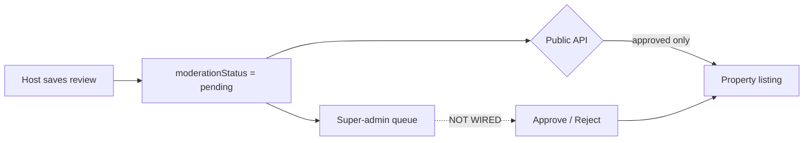

# Review approval workflow

**Goal:** Wire super-admin approve/reject for property external reviews into `/admin/approvals`, and add a **Type** filter (All / Property / Parking / Reviews).

**Architecture:** Keep the existing JSONB model (`app_settings.external_reviews[].moderationStatus`). Add a unified list endpoint returning a discriminated union of org-verification rows and external-review rows. Add a moderate endpoint that patches one review's status in-place. Extend the Approvals page with Type filter + a dedicated review dialog.

**Tech stack:** Deno edge functions, Postgres JSONB (no migration required), React 18 + TanStack Query, existing super-admin auth (`verifySuperAdminJwt`).

**Design spec:** [`docs/workflow/intake/review-approval-workflow-design.md`](../intake/review-approval-workflow-design.md)

**Start implementation:** `/workflow-start review-approval-workflow`

---

## Decisions locked

| Decision                         | Choice                                                                                                                           |
| -------------------------------- | -------------------------------------------------------------------------------------------------------------------------------- |
| Data model                       | No new table — keep `app_settings.external_reviews` JSONB                                                                        |
| List endpoint                    | New `list-super-admin-approvals` composes org verifications + flattened reviews; UI migrates off direct `list-org-verifications` |
| Review reject flow               | Simple approve/reject only (no request-changes panel)                                                                            |
| Type filter — Property / Parking | Filter org verification rows by `hostModes`; orgs with **both** modes appear in **both** filters                                 |
| Type filter — Reviews            | External review rows only                                                                                                        |
| Superhost moderation             | Out of scope — same pattern, separate follow-up                                                                                  |
| Notifications                    | None in v1 (email/Telegram deferred, matches org verification backlog)                                                           |

---

## Step 1 — Existing feature assessment (verified)

### What already works

| Claim                                           | Actual behavior                                                                                                                                                            |
| ----------------------------------------------- | -------------------------------------------------------------------------------------------------------------------------------------------------------------------------- |
| Hosts submit Airbnb/Facebook review screenshots | **Yes.** Property settings → Socials → External reviews. Sources: `airbnb` \| `facebook`. Screenshots via `upload-app-settings-asset` (`assetType=external_review_image`). |
| Reviews publish immediately without approval    | **No.** Public listing only shows **approved** reviews via `listApprovedPublicExternalReviews` in `get-public-property`.                                                   |

### What is incomplete (the real gap)

The moderation **pipeline** is half-built:



- **Schema + server save path exist:** migration `20260714210000_property_external_reviews.sql`; owner PATCH via `serializeExternalReviewsForOwnerPatch` forces `pending` on new/changed content (client cannot self-approve).
- **Host UI shows status:** pending / approved / rejected badges + aggregate copy ("X submitted · pending approval").
- **Missing:** super-admin list entry, approve/reject API, review dialog on `/admin/approvals`.

**Practical effect today:** submitted reviews stay **pending forever** and never appear on the public property page until manually approved in the DB.

---

## Step 2 — Database changes

**No migration required** for core workflow.

- Column: `app_settings.external_reviews` JSONB array
- Item shape: `{ id, source, reviewText, reviewerName, starRating, imageUrl, proofUrl, moderationStatus, createdAt }`
- `moderationStatus`: `pending` \| `approved` \| `rejected`

**Optional one-shot backfill** (local/staging first; prod only with `kamewave`):

- Audit rows where `moderationStatus` is missing → set `pending`
- Do **not** auto-approve legacy rows unless product explicitly wants grandfathering

---

## Step 3 — Backend / API changes

### 3a. Unified list endpoint

**New:** `list-super-admin-approvals` (GET, super-admin JWT)

Composes existing org verification list logic + flattened external review rows.

**Response shape:**

```typescript
type ApprovalQueueItem =
  | { type: 'org_verification' /* OrgApprovalSummary fields */ }
  | {
      type: 'external_review';
      propertyId: string;
      propertyName: string;
      propertySlug: string;
      organizationId: string;
      organizationName: string;
      reviewId: string;
      source: 'airbnb' | 'facebook';
      reviewText: string;
      reviewerName: string;
      starRating: number | null;
      moderationStatus: 'pending' | 'approved' | 'rejected';
      submittedAt: string | null;
      imagePath: string | null;
    };
```

**Review list logic:**

- Query `app_settings` joined to `properties` + `organizations`
- Flatten all `external_reviews` (status filter applied client-side for parity with org rows)
- Sort: pending first, then newest `createdAt` desc

**Type filter:** client-side — Property/Parking filter org rows by `hostModes`; Reviews filter `type === 'external_review'`.

### 3b. Moderate external review endpoint

**New:** `moderate-external-review` (POST, super-admin JWT)

```json
{ "propertyId": "uuid", "reviewId": "uuid", "decision": "approved" | "rejected" }
```

1. Load `app_settings.external_reviews` for `propertyId`
2. Find review by `reviewId`; require `moderationStatus === 'pending'`
3. Set status; write JSONB; invalidate app settings cache
4. Return updated review

**Shared helper:** `updateExternalReviewModerationStatus` in `supabase/functions/_shared/propertyExternalReviews.ts`

Host resubmit after reject: existing `serializeExternalReviewsForOwnerPatch` resets to `pending`.

### 3c. Signed preview URLs

**New or extended:** `get-external-review-assets?propertyId=&reviewId=` — sign storage path `external-review/{propertyId}/{reviewId}.*`

Register in `supabase/config.toml` with `verify_jwt = false` + `verifySuperAdminJwt` in handler.

---

## Step 4 — Frontend / UI changes

| Area    | Path                                                                    | Change                                                                     |
| ------- | ----------------------------------------------------------------------- | -------------------------------------------------------------------------- |
| Types   | `ui/.../super-admin/types/approval.ts`                                  | `ExternalReviewApprovalSummary`, `ApprovalQueueItem` union, `ApprovalType` |
| Hooks   | `ui/.../super-admin/hooks/useApprovals.ts`                              | Unified list + `useModerateExternalReview()`                               |
| Filters | `ui/.../super-admin/lib/superAdminApprovalsFilters.ts`                  | Add `type: 'all' \| 'property' \| 'parking' \| 'reviews'`                  |
| Page    | `ui/.../super-admin/pages/SuperAdminApprovalsPage.tsx`                  | Type filter Select; route to org vs review dialog                          |
| Table   | `ui/.../super-admin-approvals/SuperAdminApprovalsTable.tsx`             | Polymorphic rows                                                           |
| Dialog  | `ui/.../super-admin-approvals/SuperAdminExternalReviewDialog.tsx` (new) | Screenshot preview, approve/reject                                         |

**Host-side and public listing:** no changes required — existing behavior is correct once moderation UI ships.

---

## Step 5 — Approval workflow

| Stage    | Actor       | Action                                         | Result                                                |
| -------- | ----------- | ---------------------------------------------- | ----------------------------------------------------- |
| Submit   | Host        | Save property settings with new/changed review | `moderationStatus = pending`                          |
| Queue    | System      | Unified list includes pending review row       | Visible in `/admin/approvals` (Type = Reviews or All) |
| Review   | Super-admin | Open dialog                                    | —                                                     |
| Approve  | Super-admin | POST moderate → `approved`                     | Review on public property page                        |
| Reject   | Super-admin | POST moderate → `rejected`                     | Hidden from public; host sees Rejected badge          |
| Resubmit | Host        | Edit rejected review + save                    | Back to `pending`, re-queues                          |

---

## Step 6 — Reusable logic

| Existing                                         | Reuse                                         |
| ------------------------------------------------ | --------------------------------------------- |
| `_shared/propertyExternalReviews.ts` + UI mirror | Types, normalize, validate, moderation helper |
| `serializeExternalReviewsForOwnerPatch`          | Host resubmit → pending                       |
| `listApprovedPublicExternalReviews`              | Public gate (unchanged)                       |
| `verifySuperAdminJwt`                            | All new endpoints                             |
| `superAdminApprovalsFilters.ts`                  | Extend with type filter                       |
| `VerificationDocPreview` patterns                | Screenshot preview + lightbox                 |
| `externalReviewSourceLabel`                      | Source badges                                 |

**Do not reuse** org verification request-changes / hard-reject panels for reviews.

---

## Step 7 — Edge cases

| Case                                     | Handling                                                          |
| ---------------------------------------- | ----------------------------------------------------------------- |
| Reviews pending forever (current prod)   | Expected until moderation ships                                   |
| Host edits pending review                | Server re-sets `pending` if content changed                       |
| Host deletes review while in queue       | Row disappears on next fetch                                      |
| Multiple pending reviews per property    | One queue row per review                                          |
| Approve/reject race                      | Second call: "not pending" error + refresh                        |
| Concurrent host save during admin review | Re-read + verify still `pending` before write                     |
| Both-mode org                            | Appears in Property and Parking type filters                      |
| Search                                   | Include property name, review text, reviewer name for review rows |
| Superhost pending                        | Out of scope                                                      |

---

## Implementation tasks

### Task 1: Shared moderation helper

**Files:** `supabase/functions/_shared/propertyExternalReviews.ts`

- [x] Add `updateExternalReviewModerationStatus(reviews, reviewId, decision)`
- [x] Keep UI mirror in sync if helper is needed client-side

### Task 2: Moderate edge function

**Files:** `supabase/functions/moderate-external-review/index.ts`, `supabase/config.toml`

- [x] POST handler with `verifySuperAdminJwt`
- [ ] Manual curl test on local stack

### Task 3: Unified list endpoint

**Files:** `supabase/functions/list-super-admin-approvals/index.ts`, `supabase/config.toml`

- [x] Compose org verifications (reuse logic from `list-org-verifications`)
- [x] Flatten external review rows from `app_settings`

### Task 4: Review asset URLs

**Files:** `supabase/functions/get-external-review-assets/index.ts` (or fold into list), `supabase/config.toml`

- [x] Signed URL for review screenshot preview

### Task 5: UI types + hooks

**Files:** `ui/.../types/approval.ts`, `ui/.../hooks/useApprovals.ts`, `ui/.../lib/superAdminApprovalsFilters.ts`

- [x] `ApprovalQueueItem` union
- [x] Migrate `useApprovals` to unified list
- [x] `useModerateExternalReview()` mutation

### Task 6: Type filter

**Files:** `SuperAdminApprovalsPage.tsx`, `superAdminApprovalsFilters.ts`

- [x] Type Select: All Types / Property / Parking / Reviews
- [x] Filter logic per locked decisions

### Task 7: Review table + dialog

**Files:** `SuperAdminApprovalsTable.tsx`, `SuperAdminExternalReviewDialog.tsx` (new), `SuperAdminApprovalsPage.tsx`

- [x] Polymorphic table rows
- [x] Review dialog with approve/reject
- [x] Org verification dialog unchanged (regression)

### Task 8: Docs + QA

**Files:** `docs/guides/routes/admin/approvals.md`, `docs/guides/routes/org/property/settings.md`, `docs/architecture/edge-functions.md`

- [x] Update route guides and API inventory
- [ ] Run manual QA checklist below

---

## Manual QA checklist

- [ ] Host: submit Airbnb review → Pending; aggregate says "pending approval"
- [ ] Public property page: review **not** visible while pending
- [ ] Super-admin: `/admin/approvals` → Type Reviews → row appears
- [ ] Approve → public page shows review; host sees Approved badge
- [ ] Reject → hidden from public; host sees Rejected badge
- [ ] Host edits rejected review + saves → Pending; reappears in queue
- [ ] Type filter: property-only org in Property; parking-only in Parking; both-mode org in both
- [ ] Org verification rows unaffected
- [ ] Status filter "In review" shows pending org verifications + pending reviews

---

## Files touched (summary)

**New**

- `supabase/functions/list-super-admin-approvals/index.ts`
- `supabase/functions/moderate-external-review/index.ts`
- `supabase/functions/get-external-review-assets/index.ts`
- `ui/src/features/dashboard/super-admin/components/super-admin-approvals/SuperAdminExternalReviewDialog.tsx`

**Modified**

- `supabase/functions/_shared/propertyExternalReviews.ts`
- `supabase/config.toml`
- `ui/src/features/dashboard/super-admin/types/approval.ts`
- `ui/src/features/dashboard/super-admin/hooks/useApprovals.ts`
- `ui/src/features/dashboard/super-admin/lib/superAdminApprovalsFilters.ts`
- `ui/src/features/dashboard/super-admin/pages/SuperAdminApprovalsPage.tsx`
- `ui/src/features/dashboard/super-admin/components/super-admin-approvals/SuperAdminApprovalsTable.tsx`
- `docs/guides/routes/admin/approvals.md`
- `docs/guides/routes/org/property/settings.md`

**Unchanged (verify only)**

- `supabase/functions/_shared/publicPropertyService.ts`
- `supabase/functions/app-settings/index.ts`
- Host property settings UI
