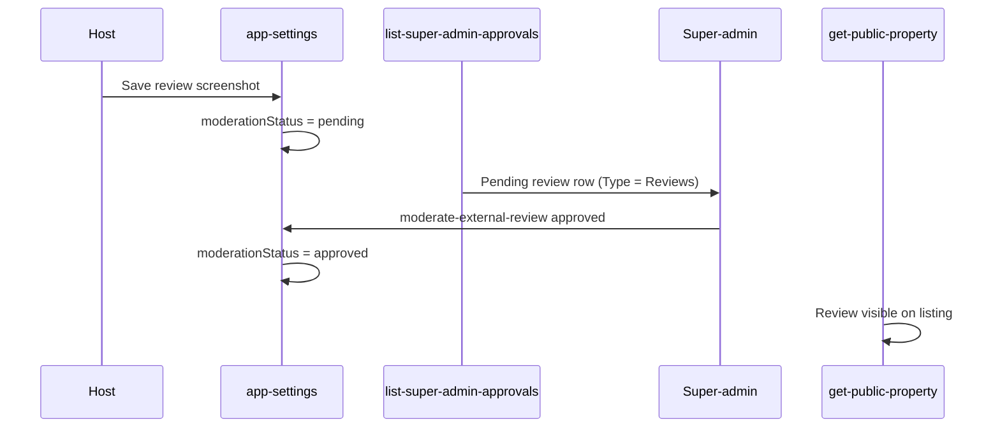

# Review approval workflow — design spec

**Approved:** 2026-08-04  
**Implementation plan:** [`docs/workflow/planned/review-approval-workflow.md`](../planned/review-approval-workflow.md)

---

## Problem

Hosts can submit external review screenshots (Airbnb or Facebook) from property settings, but there is no super-admin workflow to approve or reject them. Reviews save as `pending` and never reach the public property page because the moderation UI and API were never wired.

Separately, the `/admin/approvals` queue only lists org verification (Tier 1/2) submissions. Operators need a **Type** filter to narrow the queue to Property hosts, Parking hosts, or Review submissions.

---

## Current state (verified)

### Host submit flow — works

- **Where:** Org → Property → Settings → Socials → External reviews
- **Sources:** Airbnb or Facebook
- **Proof:** Screenshot upload (`external_review_image`) and/or proof URL
- **Save path:** `app-settings` PATCH → `serializeExternalReviewsForOwnerPatch` sets `moderationStatus = pending` on new or changed reviews (hosts cannot self-approve)
- **Host feedback:** Pending / Approved / Rejected badges; aggregate copy ("X submitted · pending approval")

### Public display — gated correctly

- `get-public-property` merges only **approved** external reviews via `listApprovedPublicExternalReviews`
- Pending and rejected reviews are **not** shown to guests

### Super-admin — missing

- No queue row for pending reviews
- No approve/reject action
- No Type filter on Approvals page

**Net effect:** Reviews submitted today stay pending indefinitely unless manually updated in the database.

---

## Desired flow



| Step | Actor           | Action                                        | Outcome                                                   |
| ---- | --------------- | --------------------------------------------- | --------------------------------------------------------- |
| 1    | Host            | Submit review (Airbnb/Facebook screenshot)    | Saved as **Pending**                                      |
| 2    | System          | Include in unified Approvals queue            | Row appears under Type **Reviews**                        |
| 3    | Super-admin     | Open review dialog; inspect screenshot + text | —                                                         |
| 4a   | Super-admin     | **Approve**                                   | `approved` → visible on public listing                    |
| 4b   | Super-admin     | **Reject**                                    | `rejected` → hidden from public; host sees Rejected badge |
| 5    | Host (optional) | Edit rejected review and save                 | Back to **Pending**; re-queues                            |

---

## Approvals page — Type filter

Add a **Type** filter beside the existing **Status** filter on `/admin/approvals`.

| Option    | Shows                                                       |
| --------- | ----------------------------------------------------------- |
| All Types | Org verification rows + external review rows                |
| Property  | Org verification rows where `hostModes` includes `property` |
| Parking   | Org verification rows where `hostModes` includes `parking`  |
| Reviews   | External review rows only                                   |

**Rule:** Orgs hosting both Property and Parking appear in **both** Property and Parking filters.

**Status filter** (unchanged): All / In review / Approved / Changes requested / Rejected — applies across the filtered type set. Review rows use pending / approved / rejected only (no changes-requested).

---

## Review approval dialog (super-admin)

Dedicated dialog — do not extend the org verification dialog (different actions and copy).

**Display (minimal copy):**

- Property name + organization name
- Source badge (Airbnb / Facebook)
- Reviewer name, star rating, review text
- Screenshot preview (signed URL) + optional proof URL link

**Actions (pending only):**

- **Reject** — hard reject; no reason dropdown in v1
- **Approve** — publishes to public listing

**After action:** Close dialog; refresh queue.

---

## Data model

No new table. Continue using `app_settings.external_reviews` JSONB:

```typescript
{
  id: string;
  source: 'airbnb' | 'facebook';
  reviewText: string;
  reviewerName: string;
  starRating: number | null;
  imageUrl: string | null;
  proofUrl: string | null;
  moderationStatus: 'pending' | 'approved' | 'rejected';
  createdAt: string | null;
}
```

Max 5 reviews per property (existing constraint).

---

## API surface (new)

| Function                     | Method | Auth        | Purpose                                                        |
| ---------------------------- | ------ | ----------- | -------------------------------------------------------------- |
| `list-super-admin-approvals` | GET    | super admin | Unified queue: org verifications + flattened external reviews  |
| `moderate-external-review`   | POST   | super admin | `{ propertyId, reviewId, decision: 'approved' \| 'rejected' }` |
| `get-external-review-assets` | GET    | super admin | Signed screenshot URL for review dialog                        |

Existing `list-org-verifications` remains for backward compatibility until UI fully migrates.

---

## Queue row shape (reviews)

One row **per pending review** (not per property batch), so admins can act on each submission independently.

| Column (table) | Value                         |
| -------------- | ----------------------------- |
| Primary label  | Property name                 |
| Secondary      | Organization name             |
| Source         | Airbnb / Facebook             |
| Submitted      | `createdAt`                   |
| Status         | Pending / Approved / Rejected |

---

## Reuse from existing approvals

| Pattern                      | Reuse for reviews                                |
| ---------------------------- | ------------------------------------------------ |
| Org verification list + sort | Compose into unified list                        |
| `verifySuperAdminJwt`        | All new endpoints                                |
| Status filter UX             | Same Select component                            |
| Doc preview / lightbox       | Screenshot preview                               |
| Host resubmit after reject   | Existing `serializeExternalReviewsForOwnerPatch` |

**Do not reuse:** Request-changes panel, hard-decline dropdown, succession confirm, consideration grant/deny — org-only flows.

---

## Out of scope (v1)

- Superhost badge moderation (same pending pattern; separate follow-up)
- Email/Telegram notify on approve/reject
- Rejection reason shown to host (badge only)
- Dedicated `approvals` DB table
- Auto-approve legacy pending reviews in production

---

## Edge cases

| Scenario                                 | Behavior                                                                |
| ---------------------------------------- | ----------------------------------------------------------------------- |
| Multiple pending reviews on one property | Multiple queue rows                                                     |
| Host deletes review while in queue       | Row disappears on refresh                                               |
| Two admins approve same review           | Second request fails ("not pending"); refresh list                      |
| Host edits pending review                | Stays pending (content change) or re-pending if was approved and edited |
| Search                                   | Match property name, org name, review text, reviewer name               |

---

## Success criteria

- Host submits review → stays off public page until approved
- Super-admin sees review in Approvals with Type = Reviews
- Approve → review appears on public property page; host sees Approved
- Reject → stays off public page; host sees Rejected; resubmit works
- Type filter correctly splits Property / Parking org rows; Reviews shows only review rows
- Org verification approvals unchanged (regression-free)

---

## Docs to update at implementation

- [`docs/guides/routes/admin/approvals.md`](../../guides/routes/admin/approvals.md)
- [`docs/guides/routes/org/property/settings.md`](../../guides/routes/org/property/settings.md)
- [`docs/architecture/edge-functions.md`](../../architecture/edge-functions.md)
