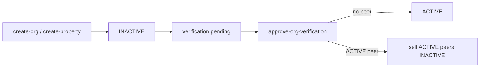

# Unit handoff — Phase A

> **For agentic workers:** Use superpowers:subagent-driven-development or executing-plans. Checkboxes track progress.  
> **Issue:** [#120](https://github.com/sprmke/kame-homes/issues/120)  
> **Sister plan:** [`../in-progress/unit-handoff-phase-b.md`](../in-progress/unit-handoff-phase-b.md) (execute after this file)  
> **Approved:** 2026-08-02

**Goal:** One public (`ACTIVE`) listing per Azure tower+unit; challengers as `INACTIVE`; SA approve / approve-swap; helpers via Team or guest booking link.

**Approach:** Soften uniqueness in place (partial ACTIVE unique index; no `unit_claims` table).

**Tech:** Postgres migrations, Deno edge functions, React admin/onboarding UI.

## Global constraints

- Create always `INACTIVE`; SA Approve turns listing `ACTIVE` (swap archives peer ACTIVE).
- Host republish → 409 if another ACTIVE peer.
- Future bookings on archive/swap: warn-and-allow; no transfer.
- Do not commit unless the user asks.
- Phase B is a separate file — do not implement it here.

---

## Design

### Product locks

| Topic            | Decision                                                             |
| ---------------- | -------------------------------------------------------------------- |
| Uniqueness       | At most one `ACTIVE` per `(lower(tower), unit_number)`               |
| Create           | Always `INACTIVE`                                                    |
| Go public        | Base SA approve → this property `ACTIVE`; archive other ACTIVE peers |
| Taken unit UX    | Non-blocking warning `{OrgName}`; continue allowed                   |
| Challengers      | Many `INACTIVE` OK                                                   |
| Reject / changes | No activate; incumbent unchanged                                     |
| Helpers          | Team `MANAGER`/`STAFF`/`VIEWER` or Copy guest link                   |
| Parking handoff  | Out of scope                                                         |

### Flows

- **Onboarding / Add property:** same steps; `check-tower-unit` returns `available: true` when format valid + `hasActiveListing`/`orgName` for warning; never hard-block on ACTIVE peer.
- **Approvals:** badge + peer list; confirm before swap; reject unchanged.
- **Settings:** unpublish OK; republish 409 if peer ACTIVE.

### Architecture

- Drop `properties_tower_unit_unique`; add `properties_tower_unit_active_unique` (`WHERE status = 'ACTIVE'`).
- Helpers in `propertyTowerUnit.ts`: ACTIVE conflict + peer list.
- Edge: `check-tower-unit`, `create-organization`, `create-property`, `update-property`, `list-org-verifications`, `approve-org-verification`.
- UI: onboarding / AddEntity / TowerUnitConflictAlert; Approvals table + review dialog.

### Out of scope (Phase A)

Booking transfer; join-listing wizard; `?ref=`; parking slot handoff; contract expiry (Phase B).

---

## Implementation

### Task 1 — Migration + helpers + create/check/restore

**Files:** new migration `20260802140000_properties_tower_unit_active_unique.sql`; `_shared/propertyTowerUnit.ts`; `check-tower-unit`; `create-property`; `create-organization`; `update-property`.

- [x] Drop global unique; add ACTIVE-only partial unique index
- [x] ACTIVE-only conflict lookup; `listPropertyTowerUnitPeers`
- [x] `check-tower-unit`: `hasActiveListing` + conflict orgName; do not set `available: false` for ACTIVE peers
- [x] Creates always `status: 'INACTIVE'`; remove peer 409 on create
- [x] `update-property` → ACTIVE: 409 if ACTIVE peer
- [x] Verify: two INACTIVE same unit OK; only one can go ACTIVE via host update

### Task 2 — Approvals API (unitConflicts + approve-swap)

**Files:** `list-org-verifications`; `approve-org-verification`; optional assets endpoint.

- [x] Attach `unitConflicts[]` / `hasActiveUnitConflict`
- [x] Base approve: archive peer ACTIVE first, then set this property ACTIVE; return archived peers
- [x] Enhanced tier: no property status change
- [x] Reject: no property activate
- [x] Verify: approve challenger swaps; reject leaves incumbent ACTIVE

### Task 3 — UI

**Files:** `useTowerUnitConflict`, `TowerUnitConflictAlert`, `OnboardingPage`, `AddEntityDialog`, `PropertySettingsCard`, Approvals page/table/dialog/types/hooks.

- [x] Warning not hard stop on onboarding / add property
- [x] Surface 409 on settings republish
- [x] Approvals badge, peers, confirm before swap
- [x] Manual E2E at 375px; no owner email in warning

### Task 4 — Docs

**Files:** `PROJECT.md`; onboarding + approvals + property settings guides; keep `planned_modules` as pointer only.

- [x] Document ACTIVE-only unique, create INACTIVE, approve-swap, Team vs link-forward
- [x] No second full checklist in planned_modules

### Done when

- [x] One ACTIVE per tower+unit enforced
- [x] Succession warning + Approvals swap work
- [x] Docs match behavior
